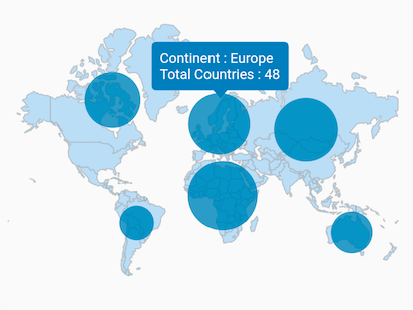
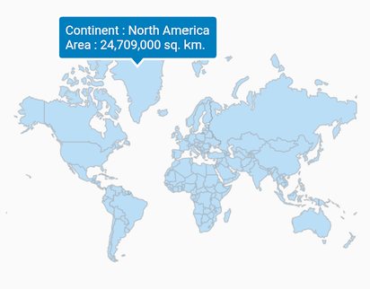

# Tooltips in maps

This section helps to learn about how to enable tooltips for the shapes and bubbles in the maps and customize them.

## Tooltip for the shapes

It is used to clearly indicate the shape information on the tap or click. By default, the shape tooltip text is based on [`shapeDataField`] values.

N> 
* Refer the [`shapeTooltipTextMapper`] for changing the default shape tooltip text.




@override
Widget build(BuildContext context) {
  return Scaffold(
    body: Padding(
      padding: EdgeInsets.only(left: 15, right: 15),
      child: SfMaps(
        layers: [
          MapShapeLayer(
            delegate: MapShapeLayerDelegate(
              shapeFile: "assets/world_map.json",
              shapeDataField: "continent",
            ),
            color: const Color.fromRGBO(86, 170, 235, 0.35),
            enableShapeTooltip: true,
          ),
        ],
      ),
    ),
  );
}




## Tooltip for the bubbles

It is used to clearly indicate the bubble information on the tap or click. By default, the bubble tooltip text is based on [`shapeDataField`] values.

N> 
* Refer the [`bubbleTooltipTextMapper`] for changing the default bubble tooltip text.




List<Model> data;

@override
void initState() {
  super.initState();

  data = <Model>[
    Model('Asia', 51, '44,579,000 sq. km.'),
    Model('Africa', 58, '30,370,000 sq. km.'),
    Model('Europe', 48, '10,180,000 sq. km.'),
    Model('North America', 41, '24,709,000 sq. km.'),
    Model('South America', 14, '17,840,000 sq. km.'),
    Model('Australia', 23, '8,600,000 sq. km.'),
  ];
}

@override
Widget build(BuildContext context) {
  return Scaffold(
    body: Padding(
      padding: EdgeInsets.only(left: 15, right: 15),
      child: SfMaps(
        layers: [
          MapShapeLayer(
            delegate: MapShapeLayerDelegate(
              shapeFile: "assets/world_map.json",
              shapeDataField: "continent",
              dataCount: data.length,
              primaryValueMapper: (int index) => data[index].continent,
              bubbleSizeMapper: (int index) => data[index].countriesCount,
            ),
            color: const Color.fromRGBO(86, 170, 235, 0.35),
            showBubbles: true,
            enableBubbleTooltip: true,
            bubbleSettings: const MapBubbleSettings(
              color: Color.fromRGBO(17, 124, 179, 0.5),
              maxRadius: 30,
              minRadius: 15,
            ),
          ),
        ],
      ),
    ),
  );
}

class Model {
  const Model(this.continent, this.countriesCount, this.area);

  final String continent;
  final double countriesCount;
  final String area;
}




## Customizing the tooltip text

You can customize the shape tooltip text with the [`shapeTooltipTextMapper`]. The [`shapeTooltipTextMapper`] will be called with the corresponding index every time when you tap or click on a shape. You can change the format or the entire text and return it from this callback.

You can customize the bubble tooltip text with the [`bubbleTooltipTextMapper`].




List<Model> data;

@override
void initState() {
  super.initState();

  data = <Model>[
    Model('Asia', 51, '44,579,000 sq. km.'),
    Model('Africa', 58, '30,370,000 sq. km.'),
    Model('Europe', 48, '10,180,000 sq. km.'),
    Model('North America', 41, '24,709,000 sq. km.'),
    Model('South America', 14, '17,840,000 sq. km.'),
    Model('Australia', 23, '8,600,000 sq. km.'),
  ];
}

@override
Widget build(BuildContext context) {
  return Scaffold(
    body: Padding(
      padding: EdgeInsets.only(left: 15, right: 15),
      child: SfMaps(
        layers: [
          MapShapeLayer(
            delegate: MapShapeLayerDelegate(
              shapeFile: "assets/world_map.json",
              shapeDataField: "continent",
              dataCount: data.length,
              primaryValueMapper: (int index) => data[index].continent,
              bubbleSizeMapper: (int index) => data[index].countriesCount,
              shapeTooltipTextMapper: (int index) =>
                  'Continent : ' +
                  data[index].continent +
                  '\nArea : ' +
                  data[index].area,
              bubbleTooltipTextMapper: (int index) =>
                  'Continent : ' +
                  data[index].continent +
                  '\nTotal Countries : ' +
                  data[index].countriesCount.toStringAsFixed(0),
            ),
            color: const Color.fromRGBO(86, 170, 235, 0.35),
            showBubbles: true,
            enableBubbleTooltip: true,
            enableShapeTooltip: true,
            bubbleSettings: const MapBubbleSettings(
              color: Color.fromRGBO(17, 124, 179, 0.5),
              maxRadius: 30,
              minRadius: 15,
            ),
          ),
        ],
      ),
    ),
  );
}

class Model {
  const Model(this.continent, this.countriesCount, this.area);

  final String continent;
  final double countriesCount;
  final String area;
}




## Background color

### Using tooltipSettings

You can change the background color of the tooltip in the maps using the [`MapTooltipSettings.color`].




List<Model> data;

@override
void initState() {
  super.initState();

  data = <Model>[
    Model('Asia', 51, '44,579,000 sq. km.'),
    Model('Africa', 58, '30,370,000 sq. km.'),
    Model('Europe', 48, '10,180,000 sq. km.'),
    Model('North America', 41, '24,709,000 sq. km.'),
    Model('South America', 14, '17,840,000 sq. km.'),
    Model('Australia', 23, '8,600,000 sq. km.'),
  ];
}

@override
Widget build(BuildContext context) {
  return Scaffold(
    body: Padding(
      padding: EdgeInsets.only(left: 15, right: 15),
      child: SfMaps(
        layers: [
          MapShapeLayer(
            delegate: MapShapeLayerDelegate(
              shapeFile: "assets/world_map.json",
              shapeDataField: "continent",
              dataCount: data.length,
              primaryValueMapper: (int index) => data[index].continent,
              bubbleSizeMapper: (int index) => data[index].countriesCount,
              shapeTooltipTextMapper: (int index) =>
                  'Continent : ' +
                  data[index].continent +
                  '\nArea : ' +
                  data[index].area,
              bubbleTooltipTextMapper: (int index) =>
                  'Continent : ' +
                  data[index].continent +
                  '\nTotal Countries : ' +
                  data[index].countriesCount.toStringAsFixed(0),
            ),
            color: const Color.fromRGBO(86, 170, 235, 0.35),
            showBubbles: true,
            enableBubbleTooltip: true,
            enableShapeTooltip: true,
            bubbleSettings: const MapBubbleSettings(
              color: Color.fromRGBO(17, 124, 179, 0.5),
              maxRadius: 30,
              minRadius: 15,
            ),
            tooltipSettings: const MapTooltipSettings(
              color: Color.fromRGBO(27, 129, 188, 1),
            ),
          ),
        ],
      ),
    ),
  );
}

class Model {
  const Model(this.continent, this.countriesCount, this.area);

  final String continent;
  final double countriesCount;
  final String area;
}




### Using SfMapsTheme

You can also change the background color of the tooltip in the maps using the [`tooltipColor`] property of [`SfMapsThemeData`].

N> You must import the `theme.dart` library from the [`Core`](https://pub.dev/packages/syncfusion_flutter_core) package to use [`SfMapsTheme`](https://pub.dev/documentation/syncfusion_flutter_core/latest/theme/SfMapsTheme-class.html).




List<Model> data;

@override
void initState() {
  super.initState();

  data = <Model>[
    Model('Asia', 51, '44,579,000 sq. km.'),
    Model('Africa', 58, '30,370,000 sq. km.'),
    Model('Europe', 48, '10,180,000 sq. km.'),
    Model('North America', 41, '24,709,000 sq. km.'),
    Model('South America', 14, '17,840,000 sq. km.'),
    Model('Australia', 23, '8,600,000 sq. km.'),
  ];
}

@override
Widget build(BuildContext context) {
  return Scaffold(
    body: Padding(
      padding: EdgeInsets.only(left: 15, right: 15),
      child: SfMapsTheme(
        data: SfMapsThemeData(
          tooltipColor: const Color.fromRGBO(27, 129, 188, 1),
        ),
        child: SfMaps(
          layers: [
            MapShapeLayer(
              delegate: MapShapeLayerDelegate(
                shapeFile: "assets/world_map.json",
                shapeDataField: "continent",
                dataCount: data.length,
                primaryValueMapper: (int index) => data[index].continent,
                bubbleSizeMapper: (int index) => data[index].countriesCount,
                shapeTooltipTextMapper: (int index) =>
                    'Continent : ' +
                    data[index].continent +
                    '\nArea : ' +
                    data[index].area,
                bubbleTooltipTextMapper: (int index) =>
                    'Continent : ' +
                  data[index].continent +
                    '\nTotal Countries : ' +
                    data[index].countriesCount.toStringAsFixed(0),
              ),
              color: const Color.fromRGBO(86, 170, 235, 0.35),
              showBubbles: true,
              enableBubbleTooltip: true,
              enableShapeTooltip: true,
              bubbleSettings: MapBubbleSettings(
                color: const Color.fromRGBO(17, 124, 179, 0.5),
                maxRadius: 30,
                minRadius: 15,
              ),
            ),
          ],
        ),
      ),
    ),
  );
}

class Model {
  const Model(this.continent, this.countriesCount, this.area);

  final String continent;
  final double countriesCount;
  final String area;
}




## Stroke color and stroke width

### Using tooltipSettings

You can change the border color of the tooltip in the maps using the [`MapTooltipSettings.strokeColor`] and [`MapTooltipSettings.strokeWidth`].




List<Model> data;

@override
void initState() {
  super.initState();

  data = <Model>[
    Model('Asia', 51, '44,579,000 sq. km.'),
    Model('Africa', 58, '30,370,000 sq. km.'),
    Model('Europe', 48, '10,180,000 sq. km.'),
    Model('North America', 41, '24,709,000 sq. km.'),
    Model('South America', 14, '17,840,000 sq. km.'),
    Model('Australia', 23, '8,600,000 sq. km.'),
  ];
}

@override
Widget build(BuildContext context) {
  return Scaffold(
    body: Padding(
      padding: EdgeInsets.only(left: 15, right: 15),
      child: SfMaps(
        layers: [
          MapShapeLayer(
            delegate: MapShapeLayerDelegate(
              shapeFile: "assets/world_map.json",
              shapeDataField: "continent",
              dataCount: data.length,
              primaryValueMapper: (int index) => data[index].continent,
              bubbleSizeMapper: (int index) => data[index].countriesCount,
              shapeTooltipTextMapper: (int index) =>
                  'Continent : ' +
                  data[index].continent +
                  '\nArea : ' +
                  data[index].area,
              bubbleTooltipTextMapper: (int index) =>
                  'Continent : ' +
                  data[index].continent +
                  '\nTotal Countries : ' +
                  data[index].countriesCount.toStringAsFixed(0),
            ),
            color: const Color.fromRGBO(86, 170, 235, 0.35),
            showBubbles: true,
            enableBubbleTooltip: true,
            enableShapeTooltip: true,
            bubbleSettings: const MapBubbleSettings(
              color: Color.fromRGBO(17, 124, 179, 0.5),
              maxRadius: 30,
              minRadius: 15,
            ),
            tooltipSettings: const MapTooltipSettings(
              color: Color.fromRGBO(27, 129, 188, 1),
              strokeColor: Colors.white,
              strokeWidth: 2,
            ),
          ),
        ],
      ),
    ),
  );
}

class Model {
  const Model(this.continent, this.countriesCount, this.area);

  final String continent;
  final double countriesCount;
  final String area;
}




### Using SfMapsTheme

You can also change the border color and width of the tooltip in the maps using the [`tooltipStrokeColor`] and [`tooltipStrokeWidth`] property of [`SfMapsThemeData`].

N> You must import the `theme.dart` library from the [`Core`](https://pub.dev/packages/syncfusion_flutter_core) package to use [`SfMapsTheme`](https://pub.dev/documentation/syncfusion_flutter_core/latest/theme/SfMapsTheme-class.html).




List<Model> data;

@override
void initState() {
  super.initState();

  data = <Model>[
    Model('Asia', 51, '44,579,000 sq. km.'),
    Model('Africa', 58, '30,370,000 sq. km.'),
    Model('Europe', 48, '10,180,000 sq. km.'),
    Model('North America', 41, '24,709,000 sq. km.'),
    Model('South America', 14, '17,840,000 sq. km.'),
    Model('Australia', 23, '8,600,000 sq. km.'),
  ];
}

@override
Widget build(BuildContext context) {
  return Scaffold(
    body: Padding(
      padding: EdgeInsets.only(left: 15, right: 15),
      child: SfMapsTheme(
        data: SfMapsThemeData(
          tooltipColor: const Color.fromRGBO(27, 129, 188, 1),
          tooltipStrokeColor: Colors.white,
          tooltipStrokeWidth: 2,
        ),
        child: SfMaps(
          layers: [
            MapShapeLayer(
              delegate: MapShapeLayerDelegate(
                shapeFile: "assets/world_map.json",
                shapeDataField: "continent",
                dataCount: data.length,
                primaryValueMapper: (int index) => data[index].continent,
                bubbleSizeMapper: (int index) => data[index].countriesCount,
                shapeTooltipTextMapper: (int index) =>
                    'Continent : ' +
                    data[index].continent +
                    '\nArea : ' +
                    data[index].area,
                bubbleTooltipTextMapper: (int index) =>
                    'Continent : ' +
                  data[index].continent +
                    '\nTotal Countries : ' +
                    data[index].countriesCount.toStringAsFixed(0),
              ),
              color: const Color.fromRGBO(86, 170, 235, 0.35),
              showBubbles: true,
              enableBubbleTooltip: true,
              enableShapeTooltip: true,
              bubbleSettings: MapBubbleSettings(
                color: const Color.fromRGBO(17, 124, 179, 0.5),
                maxRadius: 30,
                minRadius: 15,
              ),
            ),
          ],
        ),
      ),
    ),
  );
}

class Model {
  const Model(this.continent, this.countriesCount, this.area);

  final String continent;
  final double countriesCount;
  final String area;
}




## Text style

### Using tooltipSettings

You can change the appearance of the tooltip text in the maps using the [`MapTooltipSettings.textStyle`].




List<Model> data;

@override
void initState() {
  super.initState();

  data = <Model>[
    Model('Asia', 51, '44,579,000 sq. km.'),
    Model('Africa', 58, '30,370,000 sq. km.'),
    Model('Europe', 48, '10,180,000 sq. km.'),
    Model('North America', 41, '24,709,000 sq. km.'),
    Model('South America', 14, '17,840,000 sq. km.'),
    Model('Australia', 23, '8,600,000 sq. km.'),
  ];
}

@override
Widget build(BuildContext context) {
  return Scaffold(
    body: Padding(
      padding: EdgeInsets.only(left: 15, right: 15),
      child: SfMaps(
        layers: [
          MapShapeLayer(
            delegate: MapShapeLayerDelegate(
              shapeFile: "assets/world_map.json",
              shapeDataField: "continent",
              dataCount: data.length,
              primaryValueMapper: (int index) => data[index].continent,
              bubbleSizeMapper: (int index) => data[index].countriesCount,
              shapeTooltipTextMapper: (int index) =>
                  'Continent : ' +
                  data[index].continent +
                  '\nArea : ' +
                  data[index].area,
              bubbleTooltipTextMapper: (int index) =>
                  'Continent : ' +
                  data[index].continent +
                  '\nTotal Countries : ' +
                  data[index].countriesCount.toStringAsFixed(0),
            ),
            color: const Color.fromRGBO(86, 170, 235, 0.35),
            showBubbles: true,
            enableBubbleTooltip: true,
            enableShapeTooltip: true,
            bubbleSettings: const MapBubbleSettings(
              color: Color.fromRGBO(17, 124, 179, 0.5),
              maxRadius: 30,
              minRadius: 15,
            ),
            tooltipSettings: const MapTooltipSettings(
              color: Color.fromRGBO(27, 129, 188, 1),
              strokeColor: Colors.white,
              strokeWidth: 1,
              textStyle: TextStyle(
                color: Colors.white,
                fontSize: 14,
                fontStyle: FontStyle.italic,
              ),
            ),
          ),
        ],
      ),
    ),
  );
}

class Model {
  const Model(this.continent, this.countriesCount, this.area);

  final String continent;
  final double countriesCount;
  final String area;
}




### Using SfMapsTheme

You can also change the appearance of the tooltip text in the maps using the [`tooltipTextStyle`] property of [`SfMapsThemeData`].

N> You must import the `theme.dart` library from the [`Core`](https://pub.dev/packages/syncfusion_flutter_core) package to use [`SfMapsTheme`](https://pub.dev/documentation/syncfusion_flutter_core/latest/theme/SfMapsTheme-class.html).




List<Model> data;

@override
void initState() {
  super.initState();

  data = <Model>[
    Model('Asia', 51, '44,579,000 sq. km.'),
    Model('Africa', 58, '30,370,000 sq. km.'),
    Model('Europe', 48, '10,180,000 sq. km.'),
    Model('North America', 41, '24,709,000 sq. km.'),
    Model('South America', 14, '17,840,000 sq. km.'),
    Model('Australia', 23, '8,600,000 sq. km.'),
  ];
}

@override
Widget build(BuildContext context) {
  return Scaffold(
    body: Padding(
      padding: EdgeInsets.only(left: 15, right: 15),
      child: SfMapsTheme(
        data: SfMapsThemeData(
          tooltipColor: const Color.fromRGBO(27, 129, 188, 1),
          tooltipStrokeColor: Colors.white,
          tooltipStrokeWidth: 2,
          tooltipTextStyle: TextStyle(
            color: Colors.white,
            fontSize: 14,
            fontStyle: FontStyle.italic,
          ),
        ),
        child: SfMaps(
          layers: [
            MapShapeLayer(
              delegate: MapShapeLayerDelegate(
                shapeFile: "assets/world_map.json",
                shapeDataField: "continent",
                dataCount: data.length,
                primaryValueMapper: (int index) => data[index].continent,
                bubbleSizeMapper: (int index) => data[index].countriesCount,
                shapeTooltipTextMapper: (int index) =>
                    'Continent : ' +
                    data[index].continent +
                    '\nArea : ' +
                    data[index].area,
                bubbleTooltipTextMapper: (int index) =>
                    'Continent : ' +
                  data[index].continent +
                    '\nTotal Countries : ' +
                    data[index].countriesCount.toStringAsFixed(0),
              ),
              color: const Color.fromRGBO(86, 170, 235, 0.35),
              showBubbles: true,
              enableBubbleTooltip: true,
              enableShapeTooltip: true,
              bubbleSettings: MapBubbleSettings(
                color: const Color.fromRGBO(17, 124, 179, 0.5),
                maxRadius: 30,
                minRadius: 15,
              ),
            ),
          ],
        ),
      ),
    ),
  );
}

class Model {
  const Model(this.continent, this.countriesCount, this.area);

  final String continent;
  final double countriesCount;
  final String area;
}




