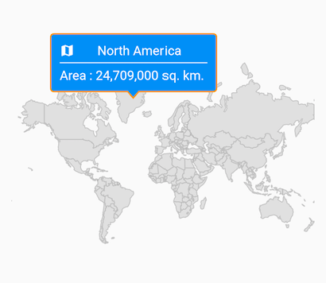
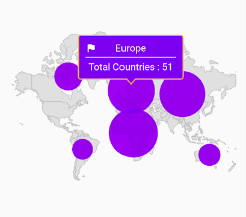
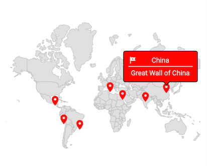
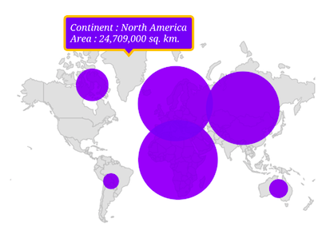

# Tooltip in Flutter Maps (SfMaps)

Tooltip is used to indicate shape, bubble, and marker information during tap or click interactions. This section helps you learn how to show tooltips for shapes, bubbles, and markers in maps and customize them.

## Tooltip for the shapes

Tooltips clearly indicate shape information on tap or click. To show a tooltip for a shape, return a widget in [`MapShapeLayer.shapeTooltipBuilder`](https://pub.dev/documentation/syncfusion_flutter_maps/latest/maps/MapShapeLayer/shapeTooltipBuilder.html). This widget will be wrapped in a built-in shape which comes with a nose at the bottom.

The [`MapShapeLayer.shapeTooltipBuilder`](https://pub.dev/documentation/syncfusion_flutter_maps/latest/maps/MapShapeLayer/shapeTooltipBuilder.html) will be called with the corresponding index every time you interact with the shapes i.e., while tapping in touch devices and hover enter in mouse-enabled devices.




late List<Model> _data;
late MapShapeSource _shapeSource;

@override
void initState() {
  super.initState();

  _data = <Model>[
    Model('Asia', 50, '44,579,000 sq. km.'),
    Model('Africa', 54, '30,370,000 sq. km.'),
    Model('Europe', 51, '10,180,000 sq. km.'),
    Model('North America', 23, '24,709,000 sq. km.'),
    Model('South America', 12, '17,840,000 sq. km.'),
    Model('Australia', 14, '8,600,000 sq. km.'),
  ];

  _shapeSource = MapShapeSource.asset(
    "assets/world_map.json",
    shapeDataField: "continent",
    dataCount: _data.length,
    primaryValueMapper: (int index) => _data[index].continent,
  );
}

@override
Widget build(BuildContext context) {
  return Scaffold(
    body: Padding(
      padding: const EdgeInsets.only(left: 15, right: 15),
      child: SfMaps(
        layers: [
          MapShapeLayer(
            source: _shapeSource,
            shapeTooltipBuilder: (BuildContext context, int index) {
              return Container(
                width: 180,
                padding: const EdgeInsets.all(10),
                child: Column(
                  mainAxisSize: MainAxisSize.min,
                  children: [
                    Stack(
                      children: [
                        Center(
                          child: Text(
                            _data[index].continent,
                            style: TextStyle(
                              color: Colors.white,
                              fontSize: Theme.of(context)
                                      .textTheme
                                      .bodyText2!
                                      .fontSize),
                          ),
                        ),
                        const Icon(
                          Icons.map,
                          color: Colors.white,
                          size: 16,
                        ),
                      ],
                    ),
                    const Divider(
                        color: Colors.white,
                        height: 10,
                        thickness: 1.2,
                    ),
                    Text(
                      'Area : ' + _data[index].area,
                      style: TextStyle(
                      color: Colors.white,
                      fontSize:
                        Theme.of(context).textTheme.bodyText2!.fontSize),
                    ),
                  ],
                ),
              );
            },
            tooltipSettings: const MapTooltipSettings(
              color: Colors.blue,
              strokeColor: Color.fromRGBO(252, 187, 15, 1),
              strokeWidth: 1.5),
          ),
        ],
      ),
    ),
  );
}

class Model {
  const Model(this.continent, this.countriesCount, this.area);

  final String continent;
  final double countriesCount;
  final String area;
}




N>
* Refer to the [`MapTooltipSettings`](https://pub.dev/documentation/syncfusion_flutter_maps/latest/maps/MapTooltipSettings-class.html) class for customizing the tooltip.

## Tooltip for the bubbles

Tooltips clearly indicate bubble information on tap or click. To show a tooltip for a bubble, return a widget in [`MapShapeLayer.bubbleTooltipBuilder`](https://pub.dev/documentation/syncfusion_flutter_maps/latest/maps/MapShapeLayer/bubbleTooltipBuilder.html). This widget will be wrapped in a built-in shape which comes with a nose at the bottom.

The [`MapShapeLayer.bubbleTooltipBuilder`](https://pub.dev/documentation/syncfusion_flutter_maps/latest/maps/MapShapeLayer/bubbleTooltipBuilder.html) will be called with the corresponding index every time you interact with the bubbles i.e., while tapping in touch devices and hover enter in mouse-enabled devices.




late List<Model> _data;
late MapShapeSource _shapeSource;

@override
void initState() {
  super.initState();

  _data = <Model>[
    Model('Asia', 50, '44,579,000 sq. km.'),
    Model('Africa', 54, '30,370,000 sq. km.'),
    Model('Europe', 51, '10,180,000 sq. km.'),
    Model('North America', 23, '24,709,000 sq. km.'),
    Model('South America', 12, '17,840,000 sq. km.'),
    Model('Australia', 14, '8,600,000 sq. km.'),
  ];

  _shapeSource = MapShapeSource.asset(
    "assets/world_map.json",
    shapeDataField: "continent",
    dataCount: _data.length,
    primaryValueMapper: (int index) => _data[index].continent,
    bubbleSizeMapper: (int index) => _data[index].countriesCount,
  );
}

@override
Widget build(BuildContext context) {
  return Scaffold(
    body: Padding(
      padding: const EdgeInsets.only(left: 15, right: 15),
      child: SfMaps(
        layers: [
          MapShapeLayer(
            source: _shapeSource,
            bubbleTooltipBuilder: (BuildContext context, int index) {
              return Container(
                width: 150,
                padding: const EdgeInsets.all(10),
                child: Column(
                  mainAxisSize: MainAxisSize.min,
                  children: [
                    Stack(
                      children: [
                        Center(
                          child: Text(
                            _data[index].continent,
                            style: TextStyle(
                              color: Colors.white,
                              fontSize: Theme.of(context)
                                      .textTheme
                                      .bodyText2!
                                      .fontSize),
                          ),
                        ),
                        const Icon(
                          Icons.flag,
                          color: Colors.white,
                          size: 16,
                        ),
                      ],
                    ),
                    const Divider(
                      color: Colors.white,
                      height: 10,
                      thickness: 1.2,
                    ),
                    Text(
                      'Total Countries : ' +
                        _data[index].countriesCount.toInt().toString(),
                      style: TextStyle(
                        color: Colors.white,
                        fontSize:
                          Theme.of(context).textTheme.bodyText2!.fontSize),
                    ),
                  ],
                ),
              );
            },
            bubbleSettings: const MapBubbleSettings(
                minRadius: 15,
                maxRadius: 35,
            ),
            tooltipSettings: const MapTooltipSettings(
              color: Color.fromRGBO(98, 0, 238, 1),
              strokeColor: Color.fromRGBO(252, 187, 15, 1),
              strokeWidth: 1.5),
          ),
        ],
      ),
    ),
  );
}

class Model {
  const Model(this.continent, this.countriesCount, this.area);

  final String continent;
  final double countriesCount;
  final String area;
}




N>
* Refer to the [`MapTooltipSettings`](https://pub.dev/documentation/syncfusion_flutter_maps/latest/maps/MapTooltipSettings-class.html) class for customizing the tooltip.

## Tooltip for the markers

Tooltips clearly indicate marker information on tap or click. To show a tooltip for a marker, return a widget in [`MapLayer.markerTooltipBuilder`](https://pub.dev/documentation/syncfusion_flutter_maps/latest/maps/MapLayer/markerTooltipBuilder.html). This widget will be wrapped in a built-in shape which comes with a nose at the bottom.

The [`MapLayer.markerTooltipBuilder`](https://pub.dev/documentation/syncfusion_flutter_maps/latest/maps/MapLayer/markerTooltipBuilder.html) will be called with the corresponding index every time you interact with the markers i.e., while tapping in touch devices and hover enter in mouse-enabled devices.




late List<WorldWonderModel> _data;
late MapShapeSource _shapeSource;

@override
void initState() {
  super.initState();

  _data = <WorldWonderModel>[
    WorldWonderModel(
          place: 'Chichen Itza',
          country: 'Mexico',
          latitude: 20.6843,
          longitude: -88.5678),
    WorldWonderModel(
          place: 'Machu Picchu',
          country: 'Peru',
          latitude: -13.1631,
          longitude: -72.5450),
    WorldWonderModel(
          place: 'Christ the Redeemer',
          country: 'Brazil',
          latitude: -22.9519,
          longitude: -43.2105),
    WorldWonderModel(
          place: 'Colosseum',
          country: 'Rome',
          latitude: 41.8902,
          longitude: 12.4922),
    WorldWonderModel(
          place: 'Petra',
          country: 'Jordan',
          latitude: 30.3285,
          longitude: 35.4444),
    WorldWonderModel(
          place: 'Taj Mahal',
          country: 'India',
          latitude: 27.1751,
          longitude: 78.0421),
    WorldWonderModel(
          place: 'Great Wall of China',
          country: 'China',
          latitude: 40.4319,
          longitude: 116.5704)
  ];

  _shapeSource = MapShapeSource.asset(
    "assets/world_map.json",
    shapeDataField: "country",
  );
}

@override
Widget build(BuildContext context) {
  return Scaffold(
    body: Padding(
      padding: EdgeInsets.only(left: 15, right: 15),
      child: SfMaps(
          layers: [
            MapShapeLayer(
              source: _shapeSource,
              initialMarkersCount: _data.length,
              markerBuilder: (BuildContext context, int index) {
                return MapMarker(
                  latitude: _data[index].latitude,
                  longitude: _data[index].longitude,
                  child: const Icon(
                    Icons.location_on,
                    color: Colors.red,
                  ),
                );
              },
              markerTooltipBuilder: (BuildContext context, int index) {
                return Container(
                  width: 150,
                  padding: const EdgeInsets.all(10),
                  child: Column(
                    mainAxisSize: MainAxisSize.min,
                    children: [
                      Stack(
                        children: [
                          Center(
                            child: Text(
                              _data[index].country,
                              style: TextStyle(
                                  color: Colors.white,
                                  fontSize: Theme.of(context)
                                      .textTheme
                                      .bodyText2!
                                      .fontSize),
                            ),
                          ),
                          const Icon(
                            Icons.tour,
                            color: Colors.white,
                            size: 16,
                          ),
                        ],
                      ),
                      const Divider(
                        color: Colors.white,
                        height: 10,
                        thickness: 1.2,
                      ),
                      Text(
                        _data[index].place,
                        style: TextStyle(
                            color: Colors.white,
                            fontSize:
                                Theme.of(context).textTheme.bodyText2!.fontSize),
                      ),
                    ],
                  ),
                );
              },
              tooltipSettings: const MapTooltipSettings(
                  color: Colors.red,
                  strokeColor: Colors.black,
                  strokeWidth: 1.5),
          ),
        ],
      ),
    ),
  );
}

class WorldWonderModel {
  const WorldWonderModel(
      {required this.place,
      required this.country,
      required this.latitude,
      required this.longitude});

  final String place;
  final String country;
  final double latitude;
  final double longitude;
}




N>
* Refer to the [`MapTooltipSettings`](https://pub.dev/documentation/syncfusion_flutter_maps/latest/maps/MapTooltipSettings-class.html) class for customizing the tooltip.

## Appearance customization

You can customize the following aspects of the tooltip:

* **Background color** - Change the background color of the tooltip using the [`MapTooltipSettings.color`](https://pub.dev/documentation/syncfusion_flutter_maps/latest/maps/MapTooltipSettings/color.html) property.
* **Stroke color** - Change the stroke color of the tooltip using the [`MapTooltipSettings.strokeColor`](https://pub.dev/documentation/syncfusion_flutter_maps/latest/maps/MapTooltipSettings/strokeColor.html) property.
* **Stroke width** - Change the stroke width of the tooltip using the [`MapTooltipSettings.strokeWidth`](https://pub.dev/documentation/syncfusion_flutter_maps/latest/maps/MapTooltipSettings/strokeWidth.html) property.
* **Visibility** - Change the duration of the tooltip visibility using the [`hideDelay`](https://pub.dev/documentation/syncfusion_flutter_maps/latest/maps/MapTooltipSettings/hideDelay.html) property. The default value of the [`hideDelay`](https://pub.dev/documentation/syncfusion_flutter_maps/latest/maps/MapTooltipSettings/hideDelay.html) property is 3. By default, tooltip will hide automatically after 3 seconds of inactivity for mobile platforms. You can increase or decrease the tooltip duration or show tooltip always by setting `double.infinity` to the [`hideDelay`](https://pub.dev/documentation/syncfusion_flutter_maps/latest/maps/MapTooltipSettings/hideDelay.html) property.

N> For mobile platforms, the [`hideDelay`](https://pub.dev/documentation/syncfusion_flutter_maps/latest/maps/MapTooltipSettings/hideDelay.html) option is supported. When you hover over the shape, bubble, or marker on the web or desktop, a tooltip will appear. When you remove hover from the shape, it will disappear.




late List<Model> _data;
late MapShapeSource _shapeSource;

@override
void initState() {
  super.initState();

  _data = <Model>[
    Model('Asia', 50, '44,579,000 sq. km.'),
    Model('Africa', 54, '30,370,000 sq. km.'),
    Model('Europe', 51, '10,180,000 sq. km.'),
    Model('North America', 23, '24,709,000 sq. km.'),
    Model('South America', 12, '17,840,000 sq. km.'),
    Model('Australia', 14, '8,600,000 sq. km.'),
  ];

  _shapeSource = MapShapeSource.asset(
    "assets/world_map.json",
    shapeDataField: "continent",
    dataCount: _data.length,
    primaryValueMapper: (int index) => _data[index].continent,
    bubbleSizeMapper: (int index) => _data[index].countriesCount,
  );
}

@override
Widget build(BuildContext context) {
  return Scaffold(
    body: Padding(
      padding: const EdgeInsets.only(left: 15, right: 15),
      child: SfMaps(
        layers: [
          MapShapeLayer(
            source: _shapeSource,
            shapeTooltipBuilder: (BuildContext context, int index) {
              return Padding(
                padding: const EdgeInsets.all(7),
                  child: Text(
                    'Continent : ' +
                        _data[index].continent +
                        '\nArea : ' +
                        _data[index].area,
                    style: const TextStyle(
                      color: Colors.white,
                      fontSize: 14,
                      fontStyle: FontStyle.italic,
                      fontFamily: 'Times',
                  ),
                ),
              );
            },
            bubbleTooltipBuilder: (BuildContext context, int index) {
              return Padding(
                padding: const EdgeInsets.all(7),
                child: Text(
                    'Continent : ' +
                        _data[index].continent +
                        '\nTotal Countries : ' +
                        _data[index].countriesCount.toStringAsFixed(0),
                    style: const TextStyle(
                      color: Colors.white,
                      fontSize: 14,
                      fontStyle: FontStyle.italic,
                      fontFamily: 'Times',
                    ),
                ),
              );
            },
            tooltipSettings: const MapTooltipSettings(
              color: const Color.fromRGBO(98, 0, 238, 1),
              strokeColor: const Color.fromRGBO(252, 187, 15, 1),
              strokeWidth: 3,
              hideDelay: 10,
            ),
          ),
        ],
      ),
    ),
  );
}

class Model {
  const Model(this.continent, this.countriesCount, this.area);

  final String continent;
  final double countriesCount;
  final String area;
}




<b>Using SfMapsTheme</b>

You can also customize the appearance of the tooltip using [`SfMapsTheme`](https://pub.dev/documentation/syncfusion_flutter_core/latest/theme/SfMapsTheme-class.html):

* **Background color** - Change the background color of the tooltip using the [`SfMapsThemeData.tooltipColor`](https://pub.dev/documentation/syncfusion_flutter_core/latest/theme/SfMapsThemeData/tooltipColor.html) property.
* **Stroke color** - Change the stroke color of the tooltip using the [`SfMapsThemeData.tooltipStrokeColor`](https://pub.dev/documentation/syncfusion_flutter_core/latest/theme/SfMapsThemeData/tooltipStrokeColor.html) property.
* **Stroke width** - Change the stroke width of the tooltip using the [`SfMapsThemeData.tooltipStrokeWidth`](https://pub.dev/documentation/syncfusion_flutter_core/latest/theme/SfMapsThemeData/tooltipStrokeWidth.html) property.
* **Border radius** - Change the appearance of the tooltip borders using the [`SfMapsThemeData.tooltipBorderRadius`](https://pub.dev/documentation/syncfusion_flutter_core/latest/theme/SfMapsThemeData/tooltipBorderRadius.html) property.

N> You must import the `theme.dart` library from the [`Core`](https://pub.dev/packages/syncfusion_flutter_core) package to use [`SfMapsTheme`](https://pub.dev/documentation/syncfusion_flutter_core/latest/theme/SfMapsTheme-class.html).




late List<Model> _data;
late MapShapeSource _shapeSource;

@override
void initState() {
  super.initState();

  _data = <Model>[
    Model('Asia', 50, '44,579,000 sq. km.'),
    Model('Africa', 54, '30,370,000 sq. km.'),
    Model('Europe', 51, '10,180,000 sq. km.'),
    Model('North America', 23, '24,709,000 sq. km.'),
    Model('South America', 12, '17,840,000 sq. km.'),
    Model('Australia', 14, '8,600,000 sq. km.'),
  ];

  _shapeSource = MapShapeSource.asset(
    "assets/world_map.json",
    shapeDataField: "continent",
    dataCount: _data.length,
    primaryValueMapper: (int index) => _data[index].continent,
    bubbleSizeMapper: (int index) => _data[index].countriesCount,
  );
}

@override
Widget build(BuildContext context) {
  return Scaffold(
    body: Padding(
      padding: EdgeInsets.only(left: 15, right: 15),
      child: SfMapsTheme(
        data: SfMapsThemeData(
          tooltipColor: const Color.fromRGBO(98, 0, 238, 1),
          tooltipStrokeColor: const Color.fromRGBO(252, 187, 15, 1),
          tooltipStrokeWidth: 3,
          tooltipBorderRadius: const BorderRadiusDirectional.only(
            topStart: Radius.circular(20),
            bottomEnd: Radius.circular(20),
          ),
        ),
        child: SfMaps(
          layers: [
            MapShapeLayer(
              source: _shapeSource,
              shapeTooltipBuilder: (BuildContext context, int index) {
                  return Padding(
                      padding: const EdgeInsets.all(7),
                        child: Text(
                          'Continent : ' +
                            _data[index].continent +
                          '\nArea : ' +
                            _data[index].area,
                          style: const TextStyle(
                            color: Colors.white,
                            fontSize: 14,
                            fontStyle: FontStyle.italic,
                            fontFamily: 'Times',
                      ),
                    ),
                );
              },
              bubbleTooltipBuilder: (BuildContext context, int index) {
                  return Padding(
                    padding: const EdgeInsets.all(7),
                    child: Text(
                        'Continent : ' +
                            _data[index].continent +
                        '\nTotal Countries : ' +
                            _data[index].countriesCount.toStringAsFixed(0),
                        style: const TextStyle(
                          color: Colors.white,
                          fontSize: 14,
                          fontStyle: FontStyle.italic,
                          fontFamily: 'Times',
                        ),
                      ),
                  );
              },
            ),
          ],
        ),
      ),
    ),
  );
}

class Model {
  const Model(this.continent, this.countriesCount, this.area);

  final String continent;
  final double countriesCount;
  final String area;
}




N>
* Refer to the [`MapShapeLayer.shapeTooltipBuilder`](https://pub.dev/documentation/syncfusion_flutter_maps/latest/maps/MapShapeLayer/shapeTooltipBuilder.html) property for enabling tooltip for shapes.
* Refer to the [`MapShapeLayer.bubbleTooltipBuilder`](https://pub.dev/documentation/syncfusion_flutter_maps/latest/maps/MapShapeLayer/bubbleTooltipBuilder.html) property for enabling tooltip for bubbles.
* Refer to the [`MapLayer.markerTooltipBuilder`](https://pub.dev/documentation/syncfusion_flutter_maps/latest/maps/MapLayer/markerTooltipBuilder.html) property for enabling tooltip for markers.

N> You can refer to our [Flutter Maps](https://www.syncfusion.com/flutter-widgets/flutter-maps) feature tour page for its groundbreaking feature representations. You can also explore our [Flutter Maps Tooltip example](https://flutter.syncfusion.com/#/maps/shape-layer/tooltip) that shows how to configure a Maps in Flutter.