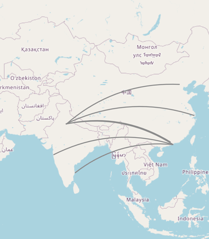
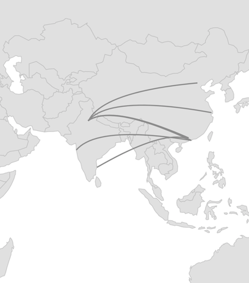
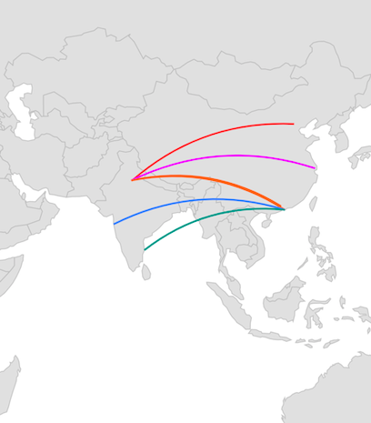
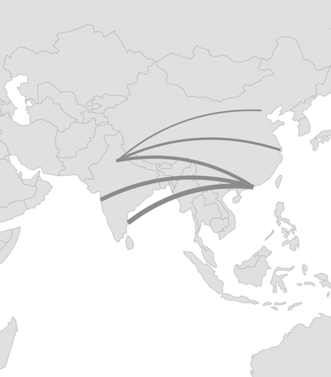
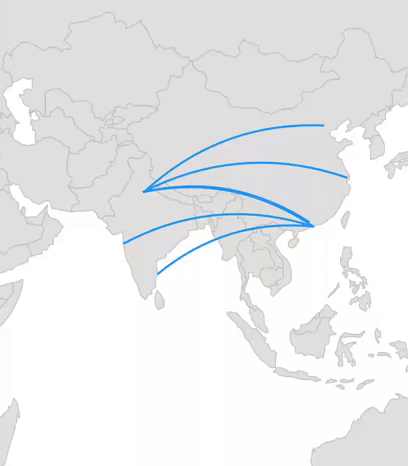
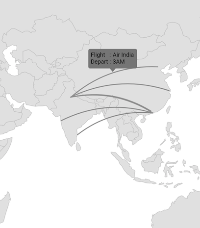
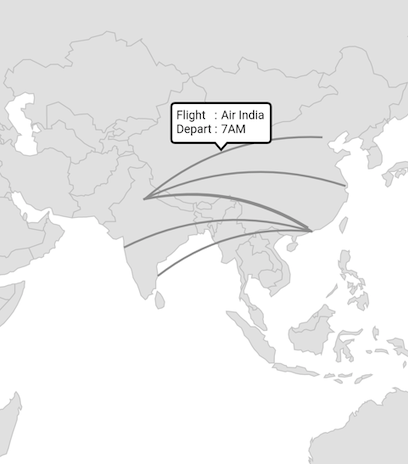

# Arc Layer in Flutter Maps (SfMaps)

Arc layer is a sublayer that renders a group of [`MapArc`](https://pub.dev/documentation/syncfusion_flutter_maps/latest/maps/MapArc-class.html) on [`MapShapeLayer`](https://pub.dev/documentation/syncfusion_flutter_maps/latest/maps/MapShapeLayer-class.html) and [`MapTileLayer`](https://pub.dev/documentation/syncfusion_flutter_maps/latest/maps/MapTileLayer-class.html). This section helps you learn how to add arcs and customize them.

## Adding arcs

The [`arcs`](https://pub.dev/documentation/syncfusion_flutter_maps/latest/maps/MapArcLayer/arcs.html) is a collection of [`MapArc`](https://pub.dev/documentation/syncfusion_flutter_maps/latest/maps/MapArc-class.html). Every single [`MapArc`](https://pub.dev/documentation/syncfusion_flutter_maps/latest/maps/MapArc-class.html) connects two location coordinates through a curved line. The start coordinate is set to the [`MapArc.from`](https://pub.dev/documentation/syncfusion_flutter_maps/latest/maps/MapArc/from.html) property and the end coordinate is set to the [`MapArc.to`](https://pub.dev/documentation/syncfusion_flutter_maps/latest/maps/MapArc/to.html) property.

N> It is applicable for both the tile layer and shape layer.

<b>In the shape layer</b>




late MapZoomPanBehavior zoomPanBehavior;
late MapShapeSource dataSource;
late List<DataModel> data;

@override
void initState() {
  data = <DataModel>[
    DataModel(MapLatLng(28.6139, 77.2090), MapLatLng(39.9042, 116.4074)),
    DataModel(MapLatLng(28.7041, 77.1025), MapLatLng(31.2304, 121.4737)),
    DataModel(MapLatLng(28.7041, 77.1025), MapLatLng(23.1291, 113.2644)),
    DataModel(MapLatLng(28.7041, 77.1025), MapLatLng(22.3193, 114.1694)),
    DataModel(MapLatLng(19.0760, 72.8777), MapLatLng(22.3193, 114.1694)),
    DataModel(MapLatLng(22.3193, 114.1694), MapLatLng(13.0827, 80.2707)),
  ];

  dataSource = MapShapeSource.asset(
    'assets/world_map.json',
    shapeDataField: 'continent',
  );
  zoomPanBehavior = MapZoomPanBehavior(
    zoomLevel: 4,
    focalLatLng: MapLatLng(22.9734, 90.6569),
  );
  super.initState();
}

@override
Widget build(BuildContext context) {
  return Scaffold(
    body: SfMaps(
      layers: [
        MapShapeLayer(
          source: dataSource,
          sublayers: [
            MapArcLayer(
              arcs: List<MapArc>.generate(
                data.length,
                    (int index) {
                  return MapArc(
                    from: data[index].from,
                    to: data[index].to,
                  );
                },
              ).toSet(),
            ),
          ],
          zoomPanBehavior: zoomPanBehavior,
        ),
      ],
    ),
  );
}

class DataModel {
  DataModel(this.from, this.to);

  final MapLatLng from;
  final MapLatLng to;
}




<b>In the tile layer</b>




late MapZoomPanBehavior zoomPanBehavior;
late List<DataModel> data;

@override
void initState() {
  data = <DataModel>[
    DataModel(MapLatLng(28.6139, 77.2090), MapLatLng(39.9042, 116.4074)),
    DataModel(MapLatLng(28.7041, 77.1025), MapLatLng(31.2304, 121.4737)),
    DataModel(MapLatLng(28.7041, 77.1025), MapLatLng(23.1291, 113.2644)),
    DataModel(MapLatLng(28.7041, 77.1025), MapLatLng(22.3193, 114.1694)),
    DataModel(MapLatLng(19.0760, 72.8777), MapLatLng(22.3193, 114.1694)),
    DataModel(MapLatLng(22.3193, 114.1694), MapLatLng(13.0827, 80.2707)),
  ];

  zoomPanBehavior = MapZoomPanBehavior(
    zoomLevel: 3,
    focalLatLng: MapLatLng(22.9734, 90.6569),
  );
  super.initState();
}

@override
Widget build(BuildContext context) {
  return Scaffold(
    body: SfMaps(
      layers: [
        MapTileLayer(
          urlTemplate: 'https://tile.openstreetmap.org/{z}/{x}/{y}.png',
          sublayers: [
            MapArcLayer(
              arcs: List<MapArc>.generate(
                data.length,
                    (int index) {
                  return MapArc(
                    from: data[index].from,
                    to: data[index].to,
                  );
                },
              ).toSet(),
            ),
          ],
          zoomPanBehavior: zoomPanBehavior,
        ),
      ],
    ),
  );
}

class DataModel {
  DataModel(this.from, this.to);

  final MapLatLng from;
  final MapLatLng to;
}




## Height factor

The [`heightFactor`](https://pub.dev/documentation/syncfusion_flutter_maps/latest/maps/MapArc/heightFactor.html) is the distance from the line connecting two points to the arc bend point. The default value of the [`heightFactor`](https://pub.dev/documentation/syncfusion_flutter_maps/latest/maps/MapArc/heightFactor.html) property is `0.2` and the value ranges from -1 to 1.

By default, the arc will always render above the [`MapArc.from`](https://pub.dev/documentation/syncfusion_flutter_maps/latest/maps/MapArc/from.html) and [`MapArc.to`](https://pub.dev/documentation/syncfusion_flutter_maps/latest/maps/MapArc/to.html) points. To render the arc below the points, set the value between -1 and 0.




late MapZoomPanBehavior zoomPanBehavior;
late MapShapeSource dataSource;
late List<DataModel> data;

@override
void initState() {
  data = <DataModel>[
    DataModel(MapLatLng(28.6139, 77.2090), MapLatLng(39.9042, 116.4074)),
    DataModel(MapLatLng(28.7041, 77.1025), MapLatLng(31.2304, 121.4737)),
    DataModel(MapLatLng(28.7041, 77.1025), MapLatLng(22.3193, 114.1694)),
    DataModel(MapLatLng(19.0760, 72.8777), MapLatLng(22.3193, 114.1694)),
    DataModel(MapLatLng(22.3193, 114.1694), MapLatLng(13.0827, 80.2707)),
  ];

  dataSource = MapShapeSource.asset(
    'assets/world_map.json',
    shapeDataField: 'continent',
  );
  zoomPanBehavior = MapZoomPanBehavior(
    zoomLevel: 4,
    focalLatLng: MapLatLng(22.9734, 90.6569),
  );
  super.initState();
}

@override
Widget build(BuildContext context) {
  return Scaffold(
    body: SfMaps(
      layers: [
        MapShapeLayer(
          source: dataSource,
          sublayers: [
            MapArcLayer(
              arcs: List<MapArc>.generate(
                data.length,
                    (int index) {
                  return MapArc(
                    from: data[index].from,
                    to: data[index].to,
                    heightFactor: -0.2,
                  );
                },
              ).toSet(),
            ),
          ],
          zoomPanBehavior: zoomPanBehavior,
        ),
      ],
    ),
  );
}

class DataModel {
  DataModel(this.from, this.to);

  final MapLatLng from;
  final MapLatLng to;
}




## Control point factor

The [`MapArc.controlPointFactor`](https://pub.dev/documentation/syncfusion_flutter_maps/latest/maps/MapArc/controlPointFactor.html) is the arc bending position. The default value of the [`MapArc.controlPointFactor`](https://pub.dev/documentation/syncfusion_flutter_maps/latest/maps/MapArc/controlPointFactor.html) property is `0.5` and the value ranges from 0 to 1.

By default, the arc will bend at the center between the [`MapArc.from`](https://pub.dev/documentation/syncfusion_flutter_maps/latest/maps/MapArc/from.html) and [`MapArc.to`](https://pub.dev/documentation/syncfusion_flutter_maps/latest/maps/MapArc/to.html) points.




late MapZoomPanBehavior zoomPanBehavior;
late MapShapeSource dataSource;
late List<DataModel> data;

@override
void initState() {
  data = <DataModel>[
    DataModel(MapLatLng(28.6139, 77.2090), MapLatLng(39.9042, 116.4074)),
    DataModel(MapLatLng(28.7041, 77.1025), MapLatLng(31.2304, 121.4737)),
    DataModel(MapLatLng(28.7041, 77.1025), MapLatLng(22.3193, 114.1694)),
    DataModel(MapLatLng(19.0760, 72.8777), MapLatLng(22.3193, 114.1694)),
    DataModel(MapLatLng(13.0827, 80.2707), MapLatLng(22.3193, 114.1694)),
  ];

  dataSource = MapShapeSource.asset(
    'assets/world_map.json',
    shapeDataField: 'continent',
  );
  zoomPanBehavior = MapZoomPanBehavior(
    zoomLevel: 4,
    focalLatLng: MapLatLng(22.9734, 90.6569),
  );
  super.initState();
}

@override
Widget build(BuildContext context) {
  return Scaffold(
    body: SfMaps(
      layers: [
        MapShapeLayer(
          source: dataSource,
          sublayers: [
            MapArcLayer(
              arcs: List<MapArc>.generate(
                data.length,
                    (int index) {
                  return MapArc(
                    from: data[index].from,
                    to: data[index].to,
                    controlPointFactor: 0.2,
                  );
                },
              ).toSet(),
            ),
          ],
          zoomPanBehavior: zoomPanBehavior,
        ),
      ],
    ),
  );
}

class DataModel {
  DataModel(this.from, this.to);

  final MapLatLng from;
  final MapLatLng to;
}




## Color

You can apply the same color for all [`MapArc`](https://pub.dev/documentation/syncfusion_flutter_maps/latest/maps/MapArc-class.html) in the [`arcs`](https://pub.dev/documentation/syncfusion_flutter_maps/latest/maps/MapArcLayer/arcs.html) collection using the [`MapArcLayer.color`](https://pub.dev/documentation/syncfusion_flutter_maps/latest/maps/MapArcLayer/color.html) property. Alternatively, you can apply different colors to each [`MapArc`](https://pub.dev/documentation/syncfusion_flutter_maps/latest/maps/MapArc-class.html) in the [`arcs`](https://pub.dev/documentation/syncfusion_flutter_maps/latest/maps/MapArcLayer/arcs.html) collection using the individual [`MapArc.color`](https://pub.dev/documentation/syncfusion_flutter_maps/latest/maps/MapArc/color.html) property.




late MapZoomPanBehavior zoomPanBehavior;
late MapShapeSource dataSource;
late List<DataModel> data;

@override
void initState() {
 data = <DataModel>[
   DataModel(MapLatLng(28.6139, 77.2090), MapLatLng(39.9042, 116.4074), Colors.redAccent),
   DataModel(MapLatLng(28.7041, 77.1025), MapLatLng(31.2304, 121.4737), Colors.purpleAccent),
   DataModel(MapLatLng(28.7041, 77.1025), MapLatLng(22.3193, 114.1694), Colors.deepPurple),
   DataModel(MapLatLng(19.0760, 72.8777), MapLatLng(22.3193, 114.1694), Colors.blueAccent),
   DataModel(MapLatLng(22.3193, 114.1694), MapLatLng(13.0827, 80.2707), Colors.teal),
 ];

  dataSource = MapShapeSource.asset(
    'assets/world_map.json',
    shapeDataField: 'continent',
  );
  zoomPanBehavior = MapZoomPanBehavior(
    zoomLevel: 4,
    focalLatLng: MapLatLng(22.9734, 90.6569),
  );
  super.initState();
}

@override
Widget build(BuildContext context) {
  return Scaffold(
    body: SfMaps(
      layers: [
        MapShapeLayer(
          source: dataSource,
          sublayers: [
            MapArcLayer(
              arcs: List<MapArc>.generate(
                data.length,
                    (int index) {
                  return MapArc(
                    from: data[index].from,
                    to: data[index].to,
                    color: data[index].color,
                  );
                },
              ).toSet(),
            ),
          ],
          zoomPanBehavior: zoomPanBehavior,
        ),
      ],
    ),
  );
}

class DataModel {
  DataModel(this.from, this.to, this.color);

  final MapLatLng from;
  final MapLatLng to;
  final Color color;
}




## Width

You can apply the same width for all [`MapArc`](https://pub.dev/documentation/syncfusion_flutter_maps/latest/maps/MapArc-class.html) in the [`arcs`](https://pub.dev/documentation/syncfusion_flutter_maps/latest/maps/MapArcLayer/arcs.html) collection using the [`MapArcLayer.width`](https://pub.dev/documentation/syncfusion_flutter_maps/latest/maps/MapArcLayer/width.html) property. Alternatively, you can apply different widths to each [`MapArc`](https://pub.dev/documentation/syncfusion_flutter_maps/latest/maps/MapArc-class.html) in the [`arcs`](https://pub.dev/documentation/syncfusion_flutter_maps/latest/maps/MapArcLayer/arcs.html) collection using the individual [`MapArc.width`](https://pub.dev/documentation/syncfusion_flutter_maps/latest/maps/MapArc/width.html) property. The default value of the [`MapArcLayer.width`](https://pub.dev/documentation/syncfusion_flutter_maps/latest/maps/MapArcLayer/width.html) property is `2`.




late MapZoomPanBehavior zoomPanBehavior;
late MapShapeSource dataSource;
late List<DataModel> data;

@override
void initState() {
  data = <DataModel>[
    DataModel(MapLatLng(28.6139, 77.2090), MapLatLng(39.9042, 116.4074), 2),
    DataModel(MapLatLng(28.7041, 77.1025), MapLatLng(31.2304, 121.4737), 3),
    DataModel(MapLatLng(28.7041, 77.1025), MapLatLng(23.1291, 113.2644), 2),
    DataModel(MapLatLng(28.7041, 77.1025), MapLatLng(22.3193, 114.1694), 4),
    DataModel(MapLatLng(19.0760, 72.8777), MapLatLng(22.3193, 114.1694), 5),
    DataModel(MapLatLng(22.3193, 114.1694), MapLatLng(13.0827, 80.2707), 6),
  ];

  dataSource = MapShapeSource.asset(
    'assets/world_map.json',
    shapeDataField: 'continent',
  );
  zoomPanBehavior = MapZoomPanBehavior(
    zoomLevel: 4,
    focalLatLng: MapLatLng(22.9734, 90.6569),
  );
  super.initState();
}

@override
Widget build(BuildContext context) {
  return Scaffold(
    body: SfMaps(
      layers: [
        MapShapeLayer(
          source: dataSource,
          sublayers: [
            MapArcLayer(
              arcs: List<MapArc>.generate(
                data.length,
                    (int index) {
                  return MapArc(
                    from: data[index].from,
                    to: data[index].to,
                    width: data[index].width,
                  );
                },
              ).toSet(),
            ),
          ],
          zoomPanBehavior: zoomPanBehavior,
        ),
      ],
    ),
  );
}

class DataModel {
  DataModel(this.from, this.to, this.width);

  final MapLatLng from;
  final MapLatLng to;
  final double width;
}




## Dash array

You can apply dash support for the arc using the [`MapArc.dashArray`](https://pub.dev/documentation/syncfusion_flutter_maps/latest/maps/MapArc/dashArray.html) property.

A sequence of dash and gap will be rendered based on the values in this list. Once all values of the list are rendered, they will be repeated again until the end of the arc.




late MapZoomPanBehavior zoomPanBehavior;
late MapShapeSource dataSource;
late List<DataModel> data;

@override
void initState() {
  data = <DataModel>[
    DataModel(MapLatLng(28.6139, 77.2090), MapLatLng(39.9042, 116.4074)),
    DataModel(MapLatLng(28.7041, 77.1025), MapLatLng(31.2304, 121.4737)),
    DataModel(MapLatLng(28.7041, 77.1025), MapLatLng(22.3193, 114.1694)),
    DataModel(MapLatLng(19.0760, 72.8777), MapLatLng(22.3193, 114.1694)),
    DataModel(MapLatLng(22.3193, 114.1694), MapLatLng(13.0827, 80.2707)),
  ];

  dataSource = MapShapeSource.asset(
    'assets/world_map.json',
    shapeDataField: 'continent',
  );
  zoomPanBehavior = MapZoomPanBehavior(
    zoomLevel: 4,
    focalLatLng: MapLatLng(22.9734, 90.6569),
  );
  super.initState();
}

@override
Widget build(BuildContext context) {
  return Scaffold(
    body: SfMaps(
      layers: [
        MapShapeLayer(
          source: dataSource,
          sublayers: [
            MapArcLayer(
              arcs: List<MapArc>.generate(
                data.length,
                    (int index) {
                  return MapArc(
                    from: data[index].from,
                    to: data[index].to,
                    dashArray: [8, 4, 2, 4],
                  );
                },
              ).toSet(),
              color: Colors.blue,
            ),
          ],
          zoomPanBehavior: zoomPanBehavior,
        ),
      ],
    ),
  );
}

class DataModel {
  DataModel(this.from, this.to);

  final MapLatLng from;
  final MapLatLng to;
}




## Animation

You can apply animation for the [`MapArc`](https://pub.dev/documentation/syncfusion_flutter_maps/latest/maps/MapArc-class.html) using the [`MapArcLayer.animation`](https://pub.dev/documentation/syncfusion_flutter_maps/latest/maps/MapArcLayer/animation.html) property and customize the animation flow, curve, and duration.

By default, there will not be any animation.




class AnimationSample extends StatefulWidget {
  const AnimationSample({Key? key}) : super(key: key);
  @override
  State<AnimationSample> createState() => _AnimationSampleState();
}

class _AnimationSampleState extends State<AnimationSample> with TickerProviderStateMixin {
  late MapZoomPanBehavior zoomPanBehavior;
  late MapShapeSource dataSource;
  late List<DataModel> data;
  late AnimationController animationController;
  late Animation<double> animation;

  @override
  void initState() {
    data = <DataModel>[
      DataModel(MapLatLng(28.6139, 77.2090), MapLatLng(39.9042, 116.4074)),
      DataModel(MapLatLng(28.7041, 77.1025), MapLatLng(31.2304, 121.4737)),
      DataModel(MapLatLng(28.7041, 77.1025), MapLatLng(23.1291, 113.2644)),
      DataModel(MapLatLng(28.7041, 77.1025), MapLatLng(22.3193, 114.1694)),
      DataModel(MapLatLng(19.0760, 72.8777), MapLatLng(22.3193, 114.1694)),
      DataModel(MapLatLng(22.3193, 114.1694), MapLatLng(13.0827, 80.2707)),
    ];

    dataSource = MapShapeSource.asset(
      'assets/world_map.json',
      shapeDataField: 'continent',
    );
    zoomPanBehavior = MapZoomPanBehavior(
      zoomLevel: 4,
      focalLatLng: MapLatLng(22.9734, 90.6569),
    );

    animationController = AnimationController(
      duration: Duration(seconds: 3),
      vsync: this,
    );
    animation = CurvedAnimation(
      parent: animationController,
      curve: Curves.easeInOut,
    );
    animationController.forward(from: 0);
    super.initState();
  }

  @override
  void dispose() {
    animationController.dispose();
    super.dispose();
  }

  @override
  Widget build(BuildContext context) {
    return Scaffold(
      body: SfMaps(
        layers: [
          MapShapeLayer(
            source: dataSource,
            sublayers: [
              MapArcLayer(
                arcs: List<MapArc>.generate(
                  data.length,
                  (int index) {
                    return MapArc(
                      from: data[index].from,
                      to: data[index].to,
                    );
                  },
                ).toSet(),
                color: Colors.blue,
                animation: animation,
              ),
            ],
            zoomPanBehavior: zoomPanBehavior,
          ),
        ],
      ),
    );
  }
}

class DataModel {
  DataModel(this.from, this.to);

  final MapLatLng from;
  final MapLatLng to;
}




## Tap

You can use the [`onTap`](https://pub.dev/documentation/syncfusion_flutter_maps/latest/maps/MapArc/onTap.html) callback to get a notification when a particular [`MapArc`](https://pub.dev/documentation/syncfusion_flutter_maps/latest/maps/MapArc-class.html) is tapped. You can also customize the tapped [`MapArc`](https://pub.dev/documentation/syncfusion_flutter_maps/latest/maps/MapArc-class.html) based on the index passed in the callback as shown in the code snippet below.




late MapZoomPanBehavior zoomPanBehavior;
late MapShapeSource dataSource;
late List<DataModel> data;
late int selectedIndex;

@override
void initState() {
  data = <DataModel>[
    DataModel(MapLatLng(28.6139, 77.2090), MapLatLng(39.9042, 116.4074)),
    DataModel(MapLatLng(28.7041, 77.1025), MapLatLng(31.2304, 121.4737)),
    DataModel(MapLatLng(28.7041, 77.1025), MapLatLng(23.1291, 113.2644)),
    DataModel(MapLatLng(28.7041, 77.1025), MapLatLng(22.3193, 114.1694)),
    DataModel(MapLatLng(19.0760, 72.8777), MapLatLng(22.3193, 114.1694)),
    DataModel(MapLatLng(22.3193, 114.1694), MapLatLng(13.0827, 80.2707)),
  ];

  dataSource = MapShapeSource.asset(
    'assets/world_map.json',
    shapeDataField: 'continent',
  );
  zoomPanBehavior = MapZoomPanBehavior(
    zoomLevel: 4,
    focalLatLng: MapLatLng(22.9734, 90.6569),
  );

  selectedIndex = -1;
  super.initState();
}

@override
Widget build(BuildContext context) {
  return Scaffold(
    body: SfMaps(
      layers: [
        MapShapeLayer(
          source: dataSource,
          sublayers: [
            MapArcLayer(
              arcs: List<MapArc>.generate(
                data.length,
                    (int index) {
                  return MapArc(
                    from: data[index].from,
                    to: data[index].to,
                    color: selectedIndex == index ? Colors.pink : Colors.blue,
                    onTap: () {
                       setState(() {
                         selectedIndex = index;
                       });
                    }
                  );
                },
              ).toSet(),
            ),
          ],
          zoomPanBehavior: zoomPanBehavior,
        ),
      ],
    ),
  );
}

class DataModel {
  DataModel(this.from, this.to);

  final MapLatLng from;
  final MapLatLng to;
}




## Tooltip

You can show additional information about an arc using the [`tooltipBuilder`](https://pub.dev/documentation/syncfusion_flutter_maps/latest/maps/MapSublayer/tooltipBuilder.html) property.




late MapZoomPanBehavior zoomPanBehavior;
late MapShapeSource dataSource;
late List<DataModel> data;
late Random random;

@override
void initState() {
  data = <DataModel>[
     DataModel(MapLatLng(28.6139, 77.2090), MapLatLng(39.9042, 116.4074)),
     DataModel(MapLatLng(28.7041, 77.1025), MapLatLng(31.2304, 121.4737)),
     DataModel(MapLatLng(28.7041, 77.1025), MapLatLng(22.3193, 114.1694)),
     DataModel(MapLatLng(19.0760, 72.8777), MapLatLng(22.3193, 114.1694)),
     DataModel(MapLatLng(22.3193, 114.1694), MapLatLng(13.0827, 80.2707)),
  ];

  dataSource = MapShapeSource.asset(
    'assets/world_map.json',
    shapeDataField: 'continent',
  );
  zoomPanBehavior = MapZoomPanBehavior(
    zoomLevel: 4,
    focalLatLng: MapLatLng(22.9734, 90.6569),
  );

  random = Random();
  super.initState();
}

@override
Widget build(BuildContext context) {
 final ThemeData themeData = Theme.of(context);
    final TextStyle textStyle = themeData.textTheme.caption!
        .copyWith(color: themeData.colorScheme.surface);
  return Scaffold(
    body: SfMaps(
      layers: [
        MapShapeLayer(
          source: dataSource,
          sublayers: [
            MapArcLayer(
              arcs: List<MapArc>.generate(
                data.length,
                    (int index) {
                  return MapArc(
                    from: data[index].from,
                    to: data[index].to,
                  );
                },
              ).toSet(),
              tooltipBuilder: (BuildContext context, int index) {
                 return Container(
                    padding: EdgeInsets.only(left: 5, top: 5),
                    height: 40,
                    width: 100,
                    child: Column(
                       children: [
                          Row(
                            children: [
                               Text('Flight   : ', style: textStyle),
                               Text('Air India', style: textStyle),
                            ],
                          ),
                          Row(
                             children: [
                                Text('Depart : ', style: textStyle),
                                Text(random.nextInt(12).toString() + 'AM', style: textStyle),
                             ],
                          ),
                       ],
                    ),
                );
              },
            ),
          ],
          zoomPanBehavior: zoomPanBehavior,
        ),
      ],
    ),
  );
}

class DataModel {
  DataModel(this.from, this.to);

  final MapLatLng from;
  final MapLatLng to;
}




## Tooltip customization

You can customize the appearance of the tooltip:

* **Background color** - Change the background color of the tooltip using the [`MapTooltipSettings.color`](https://pub.dev/documentation/syncfusion_flutter_maps/latest/maps/MapTooltipSettings/color.html) property.
* **Stroke color** - Change the stroke color of the tooltip using the [`MapTooltipSettings.strokeColor`](https://pub.dev/documentation/syncfusion_flutter_maps/latest/maps/MapTooltipSettings/strokeColor.html) property.
* **Stroke width** - Change the stroke width of the tooltip using the [`MapTooltipSettings.strokeWidth`](https://pub.dev/documentation/syncfusion_flutter_maps/latest/maps/MapTooltipSettings/strokeWidth.html) property.




late MapZoomPanBehavior zoomPanBehavior;
late MapShapeSource dataSource;
late List<DataModel> data;
late Random random;

@override
void initState() {
  data = <DataModel>[
    DataModel(MapLatLng(28.6139, 77.2090), MapLatLng(39.9042, 116.4074)),
    DataModel(MapLatLng(28.7041, 77.1025), MapLatLng(31.2304, 121.4737)),
    DataModel(MapLatLng(28.7041, 77.1025), MapLatLng(22.3193, 114.1694)),
    DataModel(MapLatLng(19.0760, 72.8777), MapLatLng(22.3193, 114.1694)),
    DataModel(MapLatLng(22.3193, 114.1694), MapLatLng(13.0827, 80.2707)),
  ];

  dataSource = MapShapeSource.asset(
    'assets/world_map.json',
    shapeDataField: 'continent',
  );
  zoomPanBehavior = MapZoomPanBehavior(
    zoomLevel: 4,
    focalLatLng: MapLatLng(22.9734, 90.6569),
  );

  random = Random();
  super.initState();
}

@override
Widget build(BuildContext context) {
  return Scaffold(
    body: SfMaps(
      layers: [
        MapShapeLayer(
          source: dataSource,
          tooltipSettings: MapTooltipSettings(
             color: Colors.white,
             strokeColor: Colors.black,
             strokeWidth: 2,
          ),
          sublayers: [
            MapArcLayer(
              arcs: List<MapArc>.generate(
                data.length,
                    (int index) {
                  return MapArc(
                    from: data[index].from,
                    to: data[index].to,
                  );
                },
              ).toSet(),
              tooltipBuilder: (BuildContext context, int index) {
                 return Padding(
                    padding: EdgeInsets.all(5),
                    child: Column(
                      mainAxisSize: MainAxisSize.min,
                      crossAxisAlignment: CrossAxisAlignment.start,
                      children: [
                        Row(
                          mainAxisSize: MainAxisSize.min,
                          children: [
                            Text('Flight   : '),
                            Text('Air India'),
                          ],
                        ),
                        Row(
                          mainAxisSize: MainAxisSize.min,
                          children: [
                            Text('Depart : '),
                            Text(random.nextInt(12).toString() + 'AM'),
                          ],
                        ),
                      ],
                    ),
                );
              },
            ),
          ],
          zoomPanBehavior: zoomPanBehavior,
        ),
      ],
    ),
  );
}

class DataModel {
  DataModel(this.from, this.to);

  final MapLatLng from;
  final MapLatLng to;
}




