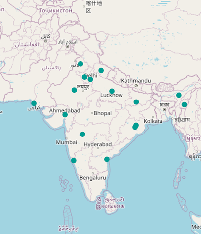
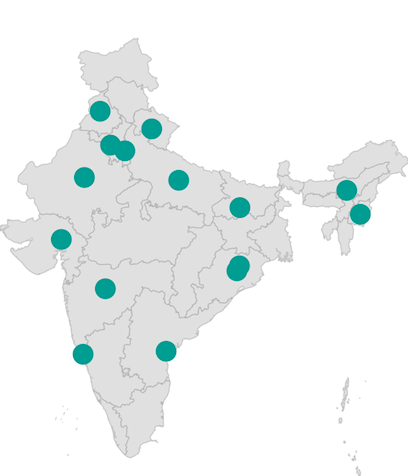
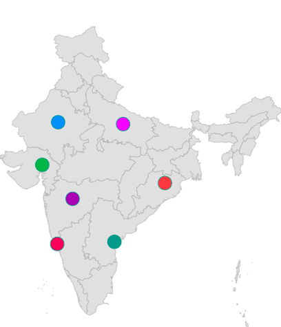
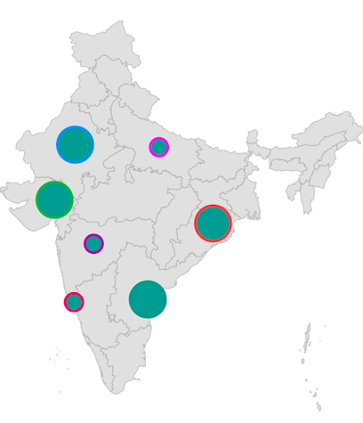
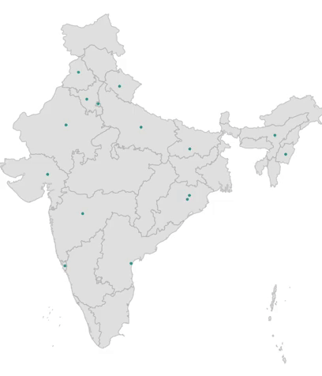
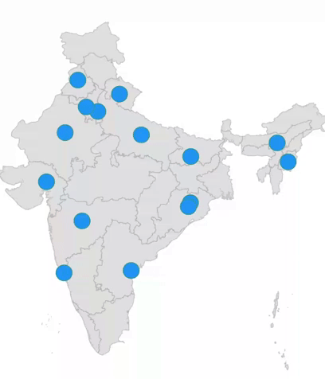
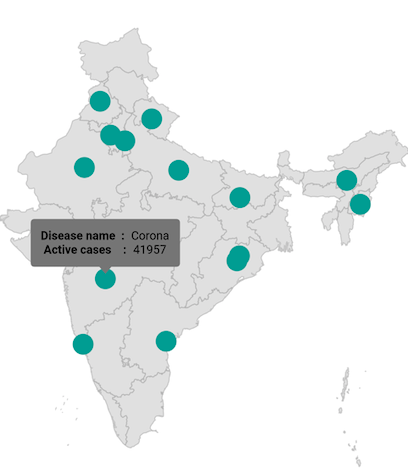
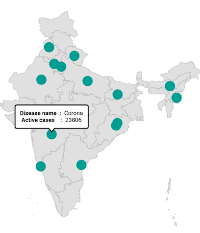

# Circle Layer in Flutter Maps (SfMaps)

Circle layer is a sublayer that renders a group of [`MapCircle`](https://pub.dev/documentation/syncfusion_flutter_maps/latest/maps/MapCircle-class.html) on [`MapShapeLayer`](https://pub.dev/documentation/syncfusion_flutter_maps/latest/maps/MapShapeLayer-class.html) and [`MapTileLayer`](https://pub.dev/documentation/syncfusion_flutter_maps/latest/maps/MapTileLayer-class.html). This section helps to learn about how to add circles and customize them.

## Adding circles

The [`circles`](https://pub.dev/documentation/syncfusion_flutter_maps/latest/maps/MapCircleLayer/circles.html) is a collection of [`MapCircle`](https://pub.dev/documentation/syncfusion_flutter_maps/latest/maps/MapCircle-class.html). Every single [`MapCircle`](https://pub.dev/documentation/syncfusion_flutter_maps/latest/maps/MapCircle-class.html) renders a circle using the [`MapCircle.center`](https://pub.dev/documentation/syncfusion_flutter_maps/latest/maps/MapCircle/center.html) and [`MapCircle.radius`](https://pub.dev/documentation/syncfusion_flutter_maps/latest/maps/MapCircle/radius.html) properties.

N> It is applicable for both the tile layer and shape layer.

<b>In the shape layer</b>




late List<MapLatLng> circles;
late MapShapeSource dataSource;

@override
void initState() {
    circles = <MapLatLng>[
      MapLatLng(15.2993, 74.1240),
      MapLatLng(15.5057, 80.0499),
      MapLatLng(19.7515, 75.7139),
      MapLatLng(23.0225, 72.5714),
      MapLatLng(24.8607, 67.0011),
      MapLatLng(27.0238, 74.2179),
      MapLatLng(26.8467, 80.9462),
      MapLatLng(21.2787, 85.2799),
      MapLatLng(20.9517, 85.0985),
      MapLatLng(25.0961, 85.3131),
      MapLatLng(24.6637, 93.9063),
      MapLatLng(26.2006, 92.9376),
      MapLatLng(28.7041, 77.1025),
      MapLatLng(29.0588, 76.0856),
      MapLatLng(30.0668, 79.0193),
      MapLatLng(31.1471, 75.3412),
    ];

    dataSource = MapShapeSource.asset(
      'assets/india.json',
      shapeDataField: 'name',
    );
    super.initState();
}

@override
Widget build(BuildContext context) {
   return Scaffold(
      body: SfMaps(
        layers: [
          MapShapeLayer(
            source: dataSource,
            sublayers: [
              MapCircleLayer(
                circles: List<MapCircle>.generate(
                  circles.length,
                  (int index) {
                    return MapCircle(
                      center: circles[index],
                    );
                  },
                ).toSet(),
              ),
            ],
          ),
        ],
      ),
   );
}




<b>In the tile layer</b>




late List<MapLatLng> circles;

@override
void initState() {
    circles = <MapLatLng>[
      MapLatLng(15.2993, 74.1240),
      MapLatLng(15.5057, 80.0499),
      MapLatLng(19.7515, 75.7139),
      MapLatLng(23.0225, 72.5714),
      MapLatLng(24.8607, 67.0011),
      MapLatLng(27.0238, 74.2179),
      MapLatLng(26.8467, 80.9462),
      MapLatLng(21.2787, 85.2799),
      MapLatLng(20.9517, 85.0985),
      MapLatLng(25.0961, 85.3131),
      MapLatLng(24.6637, 93.9063),
      MapLatLng(26.2006, 92.9376),
      MapLatLng(28.7041, 77.1025),
      MapLatLng(29.0588, 76.0856),
      MapLatLng(30.0668, 79.0193),
      MapLatLng(31.1471, 75.3412),
    ];
    super.initState();
}

@override
Widget build(BuildContext context) {
   return Scaffold(
      body: SfMaps(
        layers: [
          MapTileLayer(
            urlTemplate: 'https://tile.openstreetmap.org/{z}/{x}/{y}.png',
            initialFocalLatLng: MapLatLng(20.5937, 78.9629),
            initialZoomLevel: 4,
            sublayers: [
              MapCircleLayer(
                circles: List<MapCircle>.generate(
                  circles.length,
                  (int index) {
                    return MapCircle(
                      center: circles[index],
                    );
                  },
                ).toSet(),
              ),
            ],
          ),
        ],
      ),
   );
}




## Radius

You can change the size of the circles using the [`MapCircle.radius`](https://pub.dev/documentation/syncfusion_flutter_maps/latest/maps/MapCircle/radius.html) property. The default value of the [`MapCircle.radius`](https://pub.dev/documentation/syncfusion_flutter_maps/latest/maps/MapCircle/radius.html) property is 5.




late List<MapLatLng> circles;
late MapShapeSource dataSource;

@override
void initState() {
    circles = <MapLatLng>[
      MapLatLng(15.2993, 74.1240),
      MapLatLng(15.5057, 80.0499),
      MapLatLng(19.7515, 75.7139),
      MapLatLng(23.0225, 72.5714),
      MapLatLng(24.8607, 67.0011),
      MapLatLng(27.0238, 74.2179),
      MapLatLng(26.8467, 80.9462),
      MapLatLng(21.2787, 85.2799),
      MapLatLng(20.9517, 85.0985),
      MapLatLng(25.0961, 85.3131),
      MapLatLng(24.6637, 93.9063),
      MapLatLng(26.2006, 92.9376),
      MapLatLng(28.7041, 77.1025),
      MapLatLng(29.0588, 76.0856),
      MapLatLng(30.0668, 79.0193),
      MapLatLng(31.1471, 75.3412),
    ];

    dataSource = MapShapeSource.asset(
      'assets/india.json',
      shapeDataField: 'name',
    );
    super.initState();
}

@override
Widget build(BuildContext context) {
   return Scaffold(
      body: SfMaps(
        layers: [
          MapShapeLayer(
            source: dataSource,
            sublayers: [
              MapCircleLayer(
                circles: List<MapCircle>.generate(
                  circles.length,
                  (int index) {
                    return MapCircle(
                      center: circles[index],
                      radius: 10,
                    );
                  },
                ).toSet(),
              ),
            ],
          ),
        ],
      ),
   );
}




## Fill color

You can apply the same color for all [`MapCircle`](https://pub.dev/documentation/syncfusion_flutter_maps/latest/maps/MapCircle-class.html) in the [`circles`](https://pub.dev/documentation/syncfusion_flutter_maps/latest/maps/MapCircleLayer/circles.html) collection using the [`MapCircleLayer.color`](https://pub.dev/documentation/syncfusion_flutter_maps/latest/maps/MapCircleLayer/color.html) property. Alternatively, you can apply different colors to each [`MapCircle`](https://pub.dev/documentation/syncfusion_flutter_maps/latest/maps/MapCircle-class.html) in the [`circles`](https://pub.dev/documentation/syncfusion_flutter_maps/latest/maps/MapCircleLayer/circles.html) collection using the individual [`MapCircle.color`](https://pub.dev/documentation/syncfusion_flutter_maps/latest/maps/MapCircle/color.html) property.




late List<MapCircleModel> circles;
late MapShapeSource dataSource;

@override
void initState() {
    circles = <MapCircleModel>[
      MapCircleModel(MapLatLng(15.2993, 74.1240), Colors.pink),
      MapCircleModel(MapLatLng(15.5057, 80.0499), Colors.teal),
      MapCircleModel(MapLatLng(19.7515, 75.7139), Colors.purple),
      MapCircleModel(MapLatLng(23.0225, 72.5714), Colors.green),
      MapCircleModel(MapLatLng(24.8607, 67.0011), Colors.orange),
      MapCircleModel(MapLatLng(27.0238, 74.2179), Colors.blue),
      MapCircleModel(MapLatLng(26.8467, 80.9462), Colors.purpleAccent),
      MapCircleModel(MapLatLng(21.2787, 85.2799), Colors.redAccent),
    ];

    dataSource = MapShapeSource.asset(
      'assets/india.json',
      shapeDataField: 'name',
    );
    super.initState();
}

@override
Widget build(BuildContext context) {
   return Scaffold(
      body: SfMaps(
        layers: [
          MapShapeLayer(
            source: dataSource,
            sublayers: [
              MapCircleLayer(
                circles: List<MapCircle>.generate(
                  circles.length,
                  (int index) {
                    return MapCircle(
                      center: circles[index].center,
                      radius: 10,
                      color: circles[index].color,
                    );
                  },
                ).toSet(),
              ),
            ],
          ),
        ],
      ),
   );
}

class MapCircleModel {
  MapCircleModel(this.center, this.color);

  final MapLatLng center;
  final Color color;
}




## Stroke width and color

You can apply the same stroke width for all [`MapCircle`](https://pub.dev/documentation/syncfusion_flutter_maps/latest/maps/MapCircle-class.html) in the [`circles`](https://pub.dev/documentation/syncfusion_flutter_maps/latest/maps/MapCircleLayer/circles.html) collection using the [`MapCircleLayer.strokeWidth`](https://pub.dev/documentation/syncfusion_flutter_maps/latest/maps/MapCircleLayer/strokeWidth.html) property. Alternatively, you can apply different stroke width to each [`MapCircle`](https://pub.dev/documentation/syncfusion_flutter_maps/latest/maps/MapCircle-class.html) in the [`circles`](https://pub.dev/documentation/syncfusion_flutter_maps/latest/maps/MapCircleLayer/circles.html) collection using the individual [`MapCircle.strokeWidth`](https://pub.dev/documentation/syncfusion_flutter_maps/latest/maps/MapCircle/strokeWidth.html) property. The default value of the [`MapCircleLayer.strokeWidth`](https://pub.dev/documentation/syncfusion_flutter_maps/latest/maps/MapCircleLayer/strokeWidth.html) property is `2`.

You can apply the same stroke color for all [`MapCircle`](https://pub.dev/documentation/syncfusion_flutter_maps/latest/maps/MapCircle-class.html) in the [`circles`](https://pub.dev/documentation/syncfusion_flutter_maps/latest/maps/MapCircleLayer/circles.html) collection using the [`MapCircleLayer.strokeColor`](https://pub.dev/documentation/syncfusion_flutter_maps/latest/maps/MapCircleLayer/strokeColor.html) property. Alternatively, you can apply different stroke color to each [`MapCircle`](https://pub.dev/documentation/syncfusion_flutter_maps/latest/maps/MapCircle-class.html) in the [`circles`](https://pub.dev/documentation/syncfusion_flutter_maps/latest/maps/MapCircleLayer/circles.html) collection using the individual [`MapCircle.strokeColor`](https://pub.dev/documentation/syncfusion_flutter_maps/latest/maps/MapCircle/strokeColor.html) property.




late List<MapCircleModel> circles;
late MapShapeSource dataSource;

@override
void initState() {
    circles = <MapCircleModel>[
      MapCircleModel(MapLatLng(15.2993, 74.1240), Colors.pink),
      MapCircleModel(MapLatLng(15.5057, 80.0499), Colors.teal),
      MapCircleModel(MapLatLng(19.7515, 75.7139), Colors.purple),
      MapCircleModel(MapLatLng(23.0225, 72.5714), Colors.green),
      MapCircleModel(MapLatLng(24.8607, 67.0011), Colors.orange),
      MapCircleModel(MapLatLng(27.0238, 74.2179), Colors.blue),
      MapCircleModel(MapLatLng(26.8467, 80.9462), Colors.purpleAccent),
      MapCircleModel(MapLatLng(21.2787, 85.2799), Colors.redAccent),
    ];

    dataSource = MapShapeSource.asset(
      'assets/india.json',
      shapeDataField: 'name',
    );
    super.initState();
}

@override
Widget build(BuildContext context) {
   return Scaffold(
      body: SfMaps(
        layers: [
          MapShapeLayer(
            source: dataSource,
            sublayers: [
              MapCircleLayer(
                circles: List<MapCircle>.generate(
                  circles.length,
                  (int index) {
                    return MapCircle(
                      center: circles[index].center,
                      radius: index % 2 == 0 ? 10 : 20,
                      strokeWidth: 3,
                      strokeColor: circles[index].color,
                    );
                  },
                ).toSet(),
              ),
            ],
          ),
        ],
      ),
   );
}

class MapCircleModel {
  MapCircleModel(this.center, this.color);

  final MapLatLng center;
  final Color color;
}




## Animation

You can apply animation for the [`MapCircle`](https://pub.dev/documentation/syncfusion_flutter_maps/latest/maps/MapCircle-class.html) using the [`MapCircleLayer.animation`](https://pub.dev/documentation/syncfusion_flutter_maps/latest/maps/MapCircleLayer/animation.html) property and able to customize the animation flow, curve and duration.

By default, there will not be any animation.




late List<MapLatLng> circles;
late MapShapeSource dataSource;
late AnimationController animationController;
late Animation animation;

@override
void initState() {
    circles = <MapLatLng>[
      MapLatLng(15.2993, 74.1240),
      MapLatLng(15.5057, 80.0499),
      MapLatLng(19.7515, 75.7139),
      MapLatLng(23.0225, 72.5714),
      MapLatLng(24.8607, 67.0011),
      MapLatLng(27.0238, 74.2179),
      MapLatLng(26.8467, 80.9462),
      MapLatLng(21.2787, 85.2799),
      MapLatLng(20.9517, 85.0985),
      MapLatLng(25.0961, 85.3131),
      MapLatLng(24.6637, 93.9063),
      MapLatLng(26.2006, 92.9376),
      MapLatLng(28.7041, 77.1025),
      MapLatLng(29.0588, 76.0856),
      MapLatLng(30.0668, 79.0193),
      MapLatLng(31.1471, 75.3412),
    ];

    dataSource = MapShapeSource.asset(
      'assets/india.json',
      shapeDataField: 'name',
    );

    animationController = AnimationController(
      duration: Duration(seconds: 3),
      vsync: this,
    );
    animation = CurvedAnimation(
      parent: animationController,
      curve: Curves.easeInOut,
    );
    animationController.forward(from: 0);
    super.initState();
}

@override
void dispose() {
  animationController.dispose();
  super.dispose();
}

@override
Widget build(BuildContext context) {
   return Scaffold(
      body: SfMaps(
        layers: [
          MapShapeLayer(
            source: dataSource,
            sublayers: [
              MapCircleLayer(
                circles: List<MapCircle>.generate(
                  circles.length,
                  (int index) {
                    return MapCircle(
                      center: circles[index],
                      radius: 10,
                    );
                  },
                ).toSet(),
                animation: animation,
              ),
            ],
          ),
        ],
      ),
   );
}




## Tap

You can use the [`onTap`](https://pub.dev/documentation/syncfusion_flutter_maps/latest/maps/MapCircle/onTap.html) callback to get a notification if the particular [`MapCircle`](https://pub.dev/documentation/syncfusion_flutter_maps/latest/maps/MapCircle-class.html) is tapped. You can also customize the tapped [`MapCircle`](https://pub.dev/documentation/syncfusion_flutter_maps/latest/maps/MapCircle-class.html) based on the index passed in the callback as shown in the below code snippet.




late List<MapLatLng> circles;
late MapShapeSource dataSource;
late int selectedIndex;

@override
void initState() {
    circles = <MapLatLng>[
      MapLatLng(15.2993, 74.1240),
      MapLatLng(15.5057, 80.0499),
      MapLatLng(19.7515, 75.7139),
      MapLatLng(23.0225, 72.5714),
      MapLatLng(24.8607, 67.0011),
      MapLatLng(27.0238, 74.2179),
      MapLatLng(26.8467, 80.9462),
      MapLatLng(21.2787, 85.2799),
      MapLatLng(20.9517, 85.0985),
      MapLatLng(25.0961, 85.3131),
      MapLatLng(24.6637, 93.9063),
      MapLatLng(26.2006, 92.9376),
      MapLatLng(28.7041, 77.1025),
      MapLatLng(29.0588, 76.0856),
      MapLatLng(30.0668, 79.0193),
      MapLatLng(31.1471, 75.3412),
    ];

    dataSource = MapShapeSource.asset(
      'assets/india.json',
      shapeDataField: 'name',
    );

    selectedIndex = -1;
    super.initState();
}

@override
Widget build(BuildContext context) {
   return Scaffold(
      body: SfMaps(
        layers: [
          MapShapeLayer(
            source: dataSource,
            sublayers: [
              MapCircleLayer(
                circles: List<MapCircle>.generate(
                  circles.length,
                  (int index) {
                    return MapCircle(
                      center: circles[index],
                      radius: 10,
                      color: selectedIndex == index ? Colors.pink : Colors.blue,
                      onTap: () {
                         setState(() {
                            selectedIndex = index;
                         });
                      },
                    );
                  },
                ).toSet(),
              ),
            ],
          ),
        ],
      ),
   );
}




## Tooltip

You can show additional information about the circles drawn using the [`tooltipBuilder`](https://pub.dev/documentation/syncfusion_flutter_maps/latest/maps/MapSublayer/tooltipBuilder.html) property.




late List<MapLatLng> circles;
late MapShapeSource dataSource;
late Random random;

@override
void initState() {
    circles = <MapLatLng>[
      MapLatLng(15.2993, 74.1240),
      MapLatLng(15.5057, 80.0499),
      MapLatLng(19.7515, 75.7139),
      MapLatLng(23.0225, 72.5714),
      MapLatLng(24.8607, 67.0011),
      MapLatLng(27.0238, 74.2179),
      MapLatLng(26.8467, 80.9462),
      MapLatLng(21.2787, 85.2799),
      MapLatLng(20.9517, 85.0985),
      MapLatLng(25.0961, 85.3131),
      MapLatLng(24.6637, 93.9063),
      MapLatLng(26.2006, 92.9376),
      MapLatLng(28.7041, 77.1025),
      MapLatLng(29.0588, 76.0856),
      MapLatLng(30.0668, 79.0193),
      MapLatLng(31.1471, 75.3412),
    ];

    dataSource = MapShapeSource.asset(
      'assets/india.json',
      shapeDataField: 'name',
    );

    random = Random();
    super.initState();
}

@override
Widget build(BuildContext context) {
   final ThemeData themeData = Theme.of(context);
   final TextStyle textStyle = themeData.textTheme.caption!
        .copyWith(color: themeData.colorScheme.surface);
   return Scaffold(
      body: SfMaps(
        layers: [
          MapShapeLayer(
            source: dataSource,
            sublayers: [
              MapCircleLayer(
                circles: List<MapCircle>.generate(
                  circles.length,
                  (int index) {
                    return MapCircle(
                      center: circles[index],
                      radius: 10,
                    );
                  },
                ).toSet(),
                tooltipBuilder: (BuildContext context, int index) {
                   return Container(
                      padding: EdgeInsets.all(10),
                         child: Column(
                             mainAxisSize: MainAxisSize.min,
                             children: [
                                Row(
                                  mainAxisSize: MainAxisSize.min,
                                  children: [
                                     Text('Disease name  :', style: textStyle),
                                     Text('  ' + 'Corona', style: textStyle),
                                  ],
                                ),
                                Row(
                                  mainAxisSize: MainAxisSize.min,
                                  children: [
                                    Text('Active cases    :', style: textStyle),
                                    Text('  ' + random.nextInt(62342).toString(),
                                         style: textStyle),
                                  ],
                               ),
                         ],
                      ),
                   );
                 }
              ),
            ],
          ),
        ],
      ),
   );
}




## Tooltip customization

You can customize the appearance of the tooltip.

* **Background color** - Change the background color of the tooltip in the maps using the [`MapTooltipSettings.color`](https://pub.dev/documentation/syncfusion_flutter_maps/latest/maps/MapTooltipSettings/color.html) property.
* **Stroke color** - Change the stroke color of the tooltip in the maps using the [`MapTooltipSettings.strokeColor`](https://pub.dev/documentation/syncfusion_flutter_maps/latest/maps/MapTooltipSettings/strokeColor.html) property.
* **Stroke width** - Change the stroke width of the tooltip in the maps using the [`MapTooltipSettings.strokeWidth`](https://pub.dev/documentation/syncfusion_flutter_maps/latest/maps/MapTooltipSettings/strokeWidth.html) property.




late List<MapLatLng> circles;
late MapShapeSource dataSource;
late Random random;

@override
void initState() {
    circles = <MapLatLng>[
      MapLatLng(15.2993, 74.1240),
      MapLatLng(15.5057, 80.0499),
      MapLatLng(19.7515, 75.7139),
      MapLatLng(23.0225, 72.5714),
      MapLatLng(24.8607, 67.0011),
      MapLatLng(27.0238, 74.2179),
      MapLatLng(26.8467, 80.9462),
      MapLatLng(21.2787, 85.2799),
      MapLatLng(20.9517, 85.0985),
      MapLatLng(25.0961, 85.3131),
      MapLatLng(24.6637, 93.9063),
      MapLatLng(26.2006, 92.9376),
      MapLatLng(28.7041, 77.1025),
      MapLatLng(29.0588, 76.0856),
      MapLatLng(30.0668, 79.0193),
      MapLatLng(31.1471, 75.3412),
    ];

    dataSource = MapShapeSource.asset(
      'assets/india.json',
      shapeDataField: 'name',
    );

    random = Random();
    super.initState();
}

@override
Widget build(BuildContext context) {
   return Scaffold(
      body: SfMaps(
        layers: [
          MapShapeLayer(
            source: dataSource,
            tooltipSettings: const MapTooltipSettings(
               color: Colors.white,
               strokeWidth: 2,
               strokeColor: Colors.black,
            ),
            sublayers: [
              MapCircleLayer(
                circles: List<MapCircle>.generate(
                  circles.length,
                  (int index) {
                    return MapCircle(
                      center: circles[index],
                      radius: 10,
                    );
                  },
                ).toSet(),
                tooltipBuilder: (BuildContext context, int index) {
                   return Container(
                      padding: EdgeInsets.all(10),
                         child: Column(
                             mainAxisSize: MainAxisSize.min,
                             children: [
                               Row(
                                 mainAxisSize: MainAxisSize.min,
                                 children: [
                                   Text('Disease name  :',
                                      style: TextStyle(
                                       color: Colors.black,
                                        fontWeight: FontWeight.bold)),
                                   Text('  ' + 'Corona',
                                        style: TextStyle(color: Colors.black)),
                                 ],
                               ),
                               Row(
                                  mainAxisSize: MainAxisSize.min,
                                  children: [
                                     Text('Active cases    :',
                                          style: TextStyle(
                                          color: Colors.black,
                                          fontWeight: FontWeight.bold)),
                                     Text('  ' + random.nextInt(62342).toString(),
                                          style: TextStyle(color: Colors.black)),
                                  ],
                               ),
                         ],
                      ),
                   );
                 }
              ),
            ],
          ),
        ],
      ),
   );
}




## Inverted circle

You can apply color to the inverted circle by initializing the [`MapCircleLayer.inverted`](https://pub.dev/documentation/syncfusion_flutter_maps/latest/maps/MapCircleLayer/MapCircleLayer.inverted.html) constructor. The inner circle remains transparent while the outer portion of the circle is covered by an overlay color.

You can customize the inverted circle using the following properties:

* **Stroke color** - Change the stroke color of the circle using the [`strokeColor`](https://pub.dev/documentation/syncfusion_flutter_maps/latest/maps/MapCircleLayer/strokeColor.html) property.
* **Stroke width** - Change the stroke width of the circle using the [`strokeWidth`](https://pub.dev/documentation/syncfusion_flutter_maps/latest/maps/MapCircleLayer/strokeWidth.html) property. The default value of the `strokeWidth` property is `1`.
* **Overlay color** - Change the outer portion color of the circle using the [`color`](https://pub.dev/documentation/syncfusion_flutter_maps/latest/maps/MapCircleLayer/color.html) property.
* **Tooltip** - Enable tooltip for the inverted circle using the [`tooltipBuilder`](https://pub.dev/documentation/syncfusion_flutter_maps/latest/maps/MapSublayer/tooltipBuilder.html) property.
* **Animation** - Apply animation to the inverted circle using the [`animation`](https://pub.dev/documentation/syncfusion_flutter_maps/latest/maps/MapCircleLayer/animation.html) property and customize the animation curve and duration.

N> It is applicable for both the tile layer and shape layer.

I> The individual circle customization like [`MapCircle.color`](https://pub.dev/documentation/syncfusion_flutter_maps/latest/maps/MapCircle/color.html), [`MapCircle.strokeColor`](https://pub.dev/documentation/syncfusion_flutter_maps/latest/maps/MapCircle/strokeColor.html) and [`MapCircle.strokeWidth`](https://pub.dev/documentation/syncfusion_flutter_maps/latest/maps/MapCircle/strokeWidth.html) are not supported for the inverted circle.




late MapZoomPanBehavior zoomPanBehavior;

@override
void initState() {
  zoomPanBehavior = MapZoomPanBehavior(zoomLevel: 4, maxZoomLevel: 15);
  super.initState();
}

@override
Widget build(BuildContext context) {
  return Scaffold(
     body: SfMaps(
        layers: [
          MapTileLayer(
            urlTemplate: 'https://tile.openstreetmap.org/{z}/{x}/{y}.png',
            initialFocalLatLng: MapLatLng(-14.2350, -51.9253),
            sublayers: [
              MapCircleLayer.inverted(
                circles: List<MapCircle>.generate(
                  1,
                      (int index) {
                    return MapCircle(
                      center: MapLatLng(-14.2350, -51.9253),
                      radius: 50,
                    );
                  },
                ).toSet(),
                color: Colors.black.withOpacity(0.3),
                strokeColor: Colors.red,
                strokeWidth: 1,
              ),
            ],
            zoomPanBehavior: zoomPanBehavior,
          ),
        ],
      ),
   );
}




N>
* Refer to the [`tooltip`](https://pub.dev/documentation/syncfusion_flutter_maps/latest/maps/MapSublayer/tooltipBuilder.html) section for adding and customizing tooltips to the inverted circle.
* Refer to the [`animation`](https://pub.dev/documentation/syncfusion_flutter_maps/latest/maps/MapCircleLayer/animation.html) section for applying animation to the inverted circle.
