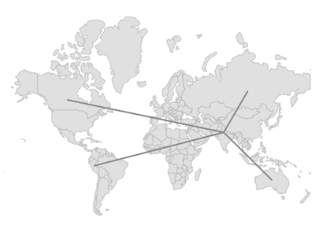
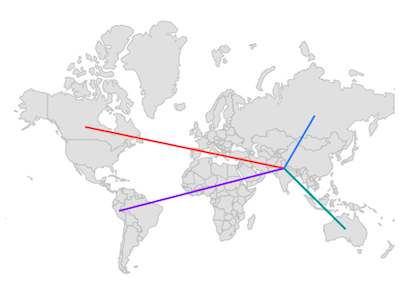
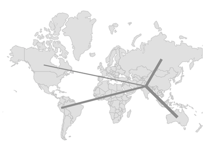
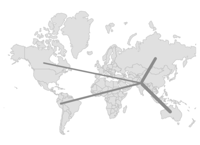
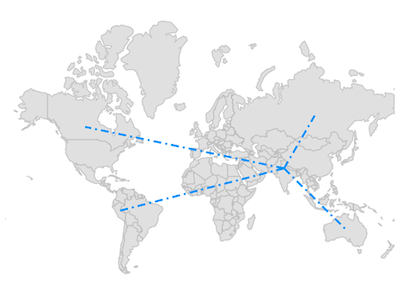
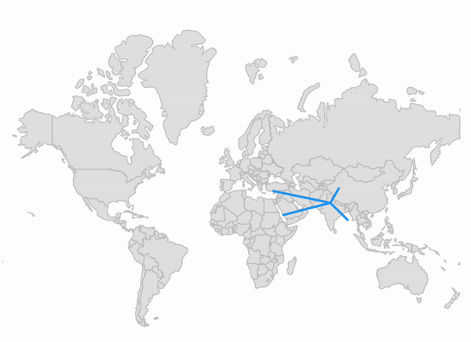
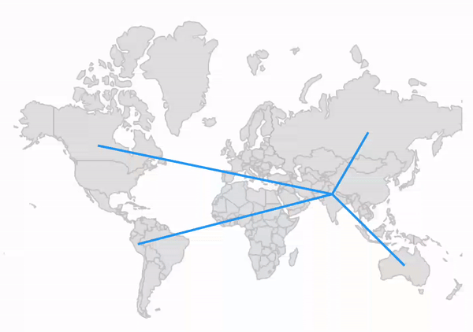
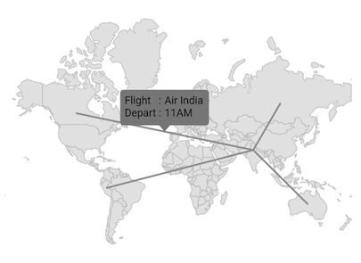
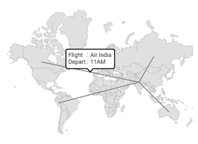

# Lines in Flutter Maps (SfMaps)

Line layer is a sublayer that renders a group of [`MapLine`](https://pub.dev/documentation/syncfusion_flutter_maps/latest/maps/MapLine-class.html) on [`MapShapeLayer`](https://pub.dev/documentation/syncfusion_flutter_maps/latest/maps/MapShapeLayer-class.html) and [`MapTileLayer`](https://pub.dev/documentation/syncfusion_flutter_maps/latest/maps/MapTileLayer-class.html). This section helps you learn how to add lines and customize them.

## Adding lines

The [`lines`](https://pub.dev/documentation/syncfusion_flutter_maps/latest/maps/MapLineLayer/lines.html) is a collection of [`MapLine`](https://pub.dev/documentation/syncfusion_flutter_maps/latest/maps/MapLine-class.html). Every single [`MapLine`](https://pub.dev/documentation/syncfusion_flutter_maps/latest/maps/MapLine-class.html) connects two location coordinates through a straight line. The start coordinate is set to [`MapLine.from`](https://pub.dev/documentation/syncfusion_flutter_maps/latest/maps/MapLine/from.html) property and the end coordinate is set to [`MapLine.to`](https://pub.dev/documentation/syncfusion_flutter_maps/latest/maps/MapLine/to.html) property.

N> It is applicable for both the tile layer and shape layer.

<b>In the shape layer</b>




late MapShapeSource dataSource;
late List<DataModel> data;

@override
void initState() {
  data = <DataModel>[
    DataModel(MapLatLng(28.7041, 77.1025), MapLatLng(56.1304, -106.3468)),
    DataModel(MapLatLng(28.7041, 77.1025), MapLatLng(-9.1900, -75.0152)),
    DataModel(MapLatLng(28.7041, 77.1025), MapLatLng(61.5240, 105.3188)),
    DataModel(MapLatLng(28.7041, 77.1025), MapLatLng(-25.2744, 133.7751)),
  ];

  dataSource = MapShapeSource.asset(
    'assets/world_map.json',
    shapeDataField: 'continent',
  );
  super.initState();
}

@override
Widget build(BuildContext context) {
  return Scaffold(
    body: Padding(
      padding: EdgeInsets.all(10),
      child: SfMaps(layers: [
        MapShapeLayer(
          source: dataSource,
          sublayers: [
            MapLineLayer(
              lines: List<MapLine>.generate(data.length, (int index) {
                return MapLine(
                  from: data[index].from,
                  to: data[index].to,
                );
              }).toSet(),
            ),
          ],
        ),
      ]),
    ),
  );
}

class DataModel {
  DataModel(this.from, this.to);

  final MapLatLng from;
  final MapLatLng to;
}




<b>In the tile layer</b>




late List<DataModel> data;

@override
void initState() {
  data = <DataModel>[
    DataModel(MapLatLng(28.7041, 77.1025), MapLatLng(56.1304, -106.3468)),
    DataModel(MapLatLng(28.7041, 77.1025), MapLatLng(-9.1900, -75.0152)),
    DataModel(MapLatLng(28.7041, 77.1025), MapLatLng(61.5240, 105.3188)),
    DataModel(MapLatLng(28.7041, 77.1025), MapLatLng(-25.2744, 133.7751)),
  ];
  super.initState();
}

@override
Widget build(BuildContext context) {
  return Scaffold(
    body: Padding(
      padding: EdgeInsets.all(10),
      child: SfMaps(layers: [
        MapTileLayer(
          urlTemplate: 'https://tile.openstreetmap.org/{z}/{x}/{y}.png',
          sublayers: [
            MapLineLayer(
              lines: List<MapLine>.generate(data.length, (int index) {
                return MapLine(
                  from: data[index].from,
                  to: data[index].to,
                );
              }).toSet(),
            ),
          ],
        ),
      ]),
    ),
  );
}

class DataModel {
  DataModel(this.from, this.to);

  final MapLatLng from;
  final MapLatLng to;
}




## Color

You can apply the same color for all [`MapLine`](https://pub.dev/documentation/syncfusion_flutter_maps/latest/maps/MapLine-class.html) in the [`lines`](https://pub.dev/documentation/syncfusion_flutter_maps/latest/maps/MapLineLayer/lines.html) collection using the [`MapLineLayer.color`](https://pub.dev/documentation/syncfusion_flutter_maps/latest/maps/MapLineLayer/color.html) property. Alternatively, you can apply different colors to each [`MapLine`](https://pub.dev/documentation/syncfusion_flutter_maps/latest/maps/MapLine-class.html) in the [`lines`](https://pub.dev/documentation/syncfusion_flutter_maps/latest/maps/MapLineLayer/lines.html) collection using the individual [`MapLine.color`](https://pub.dev/documentation/syncfusion_flutter_maps/latest/maps/MapLine/color.html) property.




late MapShapeSource dataSource;
late List<DataModel> data;

@override
void initState() {
  data = <DataModel>[
     DataModel(MapLatLng(28.7041, 77.1025), MapLatLng(56.1304, -106.3468), Colors.redAccent),
     DataModel(MapLatLng(28.7041, 77.1025), MapLatLng(-9.1900, -75.0152), Colors.deepPurpleAccent),
     DataModel(MapLatLng(28.7041, 77.1025), MapLatLng(61.5240, 105.3188), Colors.blueAccent),
     DataModel(MapLatLng(28.7041, 77.1025), MapLatLng(-25.2744, 133.7751), Colors.teal),
  ];

  dataSource = MapShapeSource.asset(
    'assets/world_map.json',
    shapeDataField: 'continent',
  );
  super.initState();
}

@override
Widget build(BuildContext context) {
  return Scaffold(
    body: Padding(
      padding: EdgeInsets.all(10),
      child: SfMaps(layers: [
        MapShapeLayer(
          source: dataSource,
          sublayers: [
            MapLineLayer(
              lines: List<MapLine>.generate(data.length, (int index) {
                return MapLine(
                  from: data[index].from,
                  to: data[index].to,
                  color: data[index].color,
                );
              }).toSet(),
            ),
          ],
        ),
      ]),
    ),
  );
}

class DataModel {
  DataModel(this.from, this.to, this.color);

  final MapLatLng from;
  final MapLatLng to;
  final Color color;
}




## Width

You can apply the same width for all [`MapLine`](https://pub.dev/documentation/syncfusion_flutter_maps/latest/maps/MapLine-class.html) in the [`lines`](https://pub.dev/documentation/syncfusion_flutter_maps/latest/maps/MapLineLayer/lines.html) collection using the [`MapLineLayer.width`](https://pub.dev/documentation/syncfusion_flutter_maps/latest/maps/MapLineLayer/width.html) property. Alternatively, you can apply different width to each [`MapLine`](https://pub.dev/documentation/syncfusion_flutter_maps/latest/maps/MapLine-class.html) in the [`lines`](https://pub.dev/documentation/syncfusion_flutter_maps/latest/maps/MapLineLayer/lines.html) collection using the individual [`MapLine.width`](https://pub.dev/documentation/syncfusion_flutter_maps/latest/maps/MapLine/width.html) property. The default value of the [`MapLineLayer.width`](https://pub.dev/documentation/syncfusion_flutter_maps/latest/maps/MapLineLayer/width.html) property is `2`.




late MapShapeSource dataSource;
late List<DataModel> data;

@override
void initState() {
  data = <DataModel>[
    DataModel(MapLatLng(28.7041, 77.1025), MapLatLng(56.1304, -106.3468), 2),
    DataModel(MapLatLng(28.7041, 77.1025), MapLatLng(-9.1900, -75.0152), 4),
    DataModel(MapLatLng(28.7041, 77.1025), MapLatLng(61.5240, 105.3188), 5),
    DataModel(MapLatLng(28.7041, 77.1025), MapLatLng(-25.2744, 133.7751), 6),
  ];

  dataSource = MapShapeSource.asset(
    'assets/world_map.json',
    shapeDataField: 'continent',
  );
  super.initState();
}

@override
Widget build(BuildContext context) {
  return Scaffold(
    body: Padding(
      padding: EdgeInsets.all(10),
      child: SfMaps(layers: [
        MapShapeLayer(
          source: dataSource,
          sublayers: [
            MapLineLayer(
              lines: List<MapLine>.generate(data.length, (int index) {
                return MapLine(
                  from: data[index].from,
                  to: data[index].to,
                  width: data[index].width,
                );
              }).toSet(),
            ),
          ],
        ),
      ]),
    ),
  );
}

class DataModel {
  DataModel(this.from, this.to, this.width);

  final MapLatLng from;
  final MapLatLng to;
  final double width;
}




## Stroke cap

You can apply the same stroke cap for all [`MapLine`](https://pub.dev/documentation/syncfusion_flutter_maps/latest/maps/MapLine-class.html) in the [`lines`](https://pub.dev/documentation/syncfusion_flutter_maps/latest/maps/MapLineLayer/lines.html) collection using the [`MapLineLayer.strokeCap`](https://pub.dev/documentation/syncfusion_flutter_maps/latest/maps/MapLineLayer/strokeCap.html) property. Alternatively, you can apply different stroke cap to each [`MapLine`](https://pub.dev/documentation/syncfusion_flutter_maps/latest/maps/MapLine-class.html) in the [`lines`](https://pub.dev/documentation/syncfusion_flutter_maps/latest/maps/MapLineLayer/lines.html) collection using the individual [`MapLine.strokeCap`](https://pub.dev/documentation/syncfusion_flutter_maps/latest/maps/MapLine/strokeCap.html) property. The default value of the [`MapLineLayer.strokeCap`](https://pub.dev/documentation/syncfusion_flutter_maps/latest/maps/MapLineLayer/strokeCap.html) property is [`StrokeCap.butt`](https://api.flutter.dev/flutter/dart-ui/StrokeCap.html#butt). The available values are [`butt`](https://api.flutter.dev/flutter/dart-ui/StrokeCap.html#butt), [`round`](https://api.flutter.dev/flutter/dart-ui/StrokeCap.html#round), and [`square`](https://api.flutter.dev/flutter/dart-ui/StrokeCap.html#square).




late MapShapeSource dataSource;
late List<DataModel> data;

@override
void initState() {
  data = <DataModel>[
    DataModel(MapLatLng(28.7041, 77.1025), MapLatLng(56.1304, -106.3468), 3),
    DataModel(MapLatLng(28.7041, 77.1025), MapLatLng(-9.1900, -75.0152), 4),
    DataModel(MapLatLng(28.7041, 77.1025), MapLatLng(61.5240, 105.3188), 6),
    DataModel(MapLatLng(28.7041, 77.1025), MapLatLng(-25.2744, 133.7751), 7),
  ];

  dataSource = MapShapeSource.asset(
    'assets/world_map.json',
    shapeDataField: 'continent',
  );
  super.initState();
}

@override
Widget build(BuildContext context) {
  return Scaffold(
    body: SfMaps(
      layers: [
        MapShapeLayer(
          source: dataSource,
          sublayers: [
            MapLineLayer(
              lines: List<MapLine>.generate(data.length, (int index) {
                return MapLine(
                  from: data[index].from,
                  to: data[index].to,
                  width: data[index].width,
                  strokeCap: StrokeCap.round,
                );
              }).toSet(),
            ),
          ],
        ),
      ],
    ),
  );
}

class DataModel {
  DataModel(this.from, this.to, this.width);

  final MapLatLng from;
  final MapLatLng to;
  final double width;
}




## Dash array

You can apply dash support for the line using the [`MapLine.dashArray`](https://pub.dev/documentation/syncfusion_flutter_maps/latest/maps/MapLine/dashArray.html) property.

A sequence of dash and gap will be rendered based on the values in this list. Once all values of the list are rendered, it will be repeated again till the end of the line.




late MapShapeSource dataSource;
late List<DataModel> data;

@override
void initState() {
  data = <DataModel>[
     DataModel(MapLatLng(28.7041, 77.1025), MapLatLng(56.1304, -106.3468)),
     DataModel(MapLatLng(28.7041, 77.1025), MapLatLng(-9.1900, -75.0152)),
     DataModel(MapLatLng(28.7041, 77.1025), MapLatLng(61.5240, 105.3188)),
     DataModel(MapLatLng(28.7041, 77.1025), MapLatLng(-25.2744, 133.7751)),
  ];

  dataSource = MapShapeSource.asset(
    'assets/world_map.json',
    shapeDataField: 'continent',
  );
  super.initState();
}

@override
Widget build(BuildContext context) {
  return Scaffold(
    body: Padding(
      padding: EdgeInsets.all(10),
      child: SfMaps(layers: [
        MapShapeLayer(
          source: dataSource,
          sublayers: [
            MapLineLayer(
              lines: List<MapLine>.generate(data.length, (int index) {
                return MapLine(
                  from: data[index].from,
                  to: data[index].to,
                  dashArray: [8, 4, 2, 4],
                );
              }).toSet(),
              color: Colors.blue,
            ),
          ],
        ),
      ]),
    ),
  );
}

class DataModel {
  DataModel(this.from, this.to);

  final MapLatLng from;
  final MapLatLng to;
}




## Animation

You can apply animation for the [`MapLine`](https://pub.dev/documentation/syncfusion_flutter_maps/latest/maps/MapLine-class.html) using the [`MapLineLayer.animation`](https://pub.dev/documentation/syncfusion_flutter_maps/latest/maps/MapLineLayer/animation.html) property and able to customize the animation flow, curve and duration.

By default, there will not be any animation.




late MapShapeSource dataSource;
late List<DataModel> data;
late AnimationController animationController;
late Animation animation;

@override
void initState() {
  data = <DataModel>[
    DataModel(MapLatLng(28.7041, 77.1025), MapLatLng(56.1304, -106.3468)),
    DataModel(MapLatLng(28.7041, 77.1025), MapLatLng(-9.1900, -75.0152)),
    DataModel(MapLatLng(28.7041, 77.1025), MapLatLng(61.5240, 105.3188)),
    DataModel(MapLatLng(28.7041, 77.1025), MapLatLng(-25.2744, 133.7751)),
  ];

  dataSource = MapShapeSource.asset(
    'assets/world_map.json',
    shapeDataField: 'continent',
  );

  animationController = AnimationController(
    duration: Duration(seconds: 3),
    vsync: this,
  );
  animation = CurvedAnimation(
    parent: animationController,
    curve: Curves.easeInOut,
  );
  animationController.forward(from: 0);
  super.initState();
}

@override
void dispose() {
  animationController?.dispose();
  super.dispose();
}

@override
Widget build(BuildContext context) {
  return Scaffold(
    body: Padding(
      padding: EdgeInsets.all(10),
      child: SfMaps(layers: [
        MapShapeLayer(
          source: dataSource,
          sublayers: [
            MapLineLayer(
              lines: List<MapLine>.generate(data.length, (int index) {
                return MapLine(
                  from: data[index].from,
                  to: data[index].to,
                );
              }).toSet(),
              color: Colors.blue,
              animation: animation,
            ),
          ],
        ),
      ]),
    ),
  );
}

class DataModel {
  DataModel(this.from, this.to);

  final MapLatLng from;
  final MapLatLng to;
}




## Tap

You can use the [`onTap`](https://pub.dev/documentation/syncfusion_flutter_maps/latest/maps/MapLine/onTap.html) callback to get a notification if the particular [`MapLine`](https://pub.dev/documentation/syncfusion_flutter_maps/latest/maps/MapLine-class.html) is tapped. You can also customize the tapped [`MapLine`](https://pub.dev/documentation/syncfusion_flutter_maps/latest/maps/MapLine-class.html) based on the index passed in the callback as shown in the below code snippet.




late MapShapeSource dataSource;
late List<DataModel> data;
late int selectedIndex;

@override
void initState() {
  data = <DataModel>[
    DataModel(MapLatLng(28.7041, 77.1025), MapLatLng(56.1304, -106.3468)),
    DataModel(MapLatLng(28.7041, 77.1025), MapLatLng(-9.1900, -75.0152)),
    DataModel(MapLatLng(28.7041, 77.1025), MapLatLng(61.5240, 105.3188)),
    DataModel(MapLatLng(28.7041, 77.1025), MapLatLng(-25.2744, 133.7751)),
  ];

  dataSource = MapShapeSource.asset(
    'assets/world_map.json',
    shapeDataField: 'continent',
  );

  selectedIndex = -1;
  super.initState();
}

@override
Widget build(BuildContext context) {
  return Scaffold(
    body: Padding(
      padding: EdgeInsets.all(10),
      child: SfMaps(layers: [
        MapShapeLayer(
          source: dataSource,
          sublayers: [
            MapLineLayer(
              lines: List<MapLine>.generate(data.length, (int index) {
                return MapLine(
                    from: data[index].from,
                    to: data[index].to,
                    color: selectedIndex == index ? Colors.pink : Colors.blue,
                    onTap: () {
                      setState(() {
                        selectedIndex = index;
                      });
                    });
              }).toSet(),
            ),
          ],
        ),
      ]),
    ),
  );
}

class DataModel {
  DataModel(this.from, this.to);

  final MapLatLng from;
  final MapLatLng to;
}




## Tooltip

You can show additional information about the line drawn using the [`tooltipBuilder`](https://pub.dev/documentation/syncfusion_flutter_maps/latest/maps/MapSublayer/tooltipBuilder.html) property.




late MapShapeSource dataSource;
late List<DataModel> data;
late Random random;

@override
void initState() {
  data = <DataModel>[
    DataModel(MapLatLng(28.7041, 77.1025), MapLatLng(56.1304, -106.3468)),
    DataModel(MapLatLng(28.7041, 77.1025), MapLatLng(-9.1900, -75.0152)),
    DataModel(MapLatLng(28.7041, 77.1025), MapLatLng(61.5240, 105.3188)),
    DataModel(MapLatLng(28.7041, 77.1025), MapLatLng(-25.2744, 133.7751)),
  ];

  dataSource = MapShapeSource.asset(
    'assets/world_map.json',
    shapeDataField: 'continent',
  );

  random = Random();
  super.initState();
}

@override
Widget build(BuildContext context) {
 final ThemeData themeData = Theme.of(context);
    final TextStyle textStyle = themeData.textTheme.caption!
        .copyWith(color: themeData.colorScheme.surface);
  return Scaffold(
    body: Padding(
      padding: EdgeInsets.all(10),
      child: SfMaps(layers: [
        MapShapeLayer(
          source: dataSource,
          sublayers: [
            MapLineLayer(
              lines: List<MapLine>.generate(data.length, (int index) {
                return MapLine(
                  from: data[index].from,
                  to: data[index].to,
                );
              }).toSet(),
              tooltipBuilder: (BuildContext context, int index) {
                return Container(
                  padding: EdgeInsets.only(left: 5, top: 5),
                  height: 40,
                  width: 100,
                  child: Column(
                    children: [
                      Row(
                        children: [
                          Text('Flight   : ', style: textStyle),
                          Text('Air India', style: textStyle),
                        ],
                      ),
                      Row(
                        children: [
                          Text('Depart : ', style: textStyle),
                          Text(random.nextInt(12).toString() + 'AM', style: textStyle),
                        ],
                      ),
                    ],
                  ),
                );
              },
            ),
          ],
        ),
      ]),
    ),
  );
}

class DataModel {
  DataModel(this.from, this.to);

  final MapLatLng from;
  final MapLatLng to;
}




## Tooltip customization

You can customize the appearance of the tooltip:

* Background color - Change the background color of the tooltip in the maps using the [`MapTooltipSettings.color`](https://pub.dev/documentation/syncfusion_flutter_maps/latest/maps/MapTooltipSettings/color.html) property.
* Stroke color - Change the stroke color of the tooltip in the maps using the [`MapTooltipSettings.strokeColor`](https://pub.dev/documentation/syncfusion_flutter_maps/latest/maps/MapTooltipSettings/strokeColor.html) property.
* Stroke width - Change the stroke width of the tooltip in the maps using the [`MapTooltipSettings.strokeWidth`](https://pub.dev/documentation/syncfusion_flutter_maps/latest/maps/MapTooltipSettings/strokeWidth.html) property.




late MapShapeSource dataSource;
late List<DataModel> data;
late Random random;

@override
void initState() {
  data = <DataModel>[
    DataModel(MapLatLng(28.7041, 77.1025), MapLatLng(56.1304, -106.3468)),
    DataModel(MapLatLng(28.7041, 77.1025), MapLatLng(-9.1900, -75.0152)),
    DataModel(MapLatLng(28.7041, 77.1025), MapLatLng(61.5240, 105.3188)),
    DataModel(MapLatLng(28.7041, 77.1025), MapLatLng(-25.2744, 133.7751)),
  ];

  dataSource = MapShapeSource.asset(
    'assets/world_map.json',
    shapeDataField: 'continent',
  );

  random = Random();
  super.initState();
}

@override
Widget build(BuildContext context) {
  return Scaffold(
    body: Padding(
      padding: EdgeInsets.all(10),
      child: SfMaps(layers: [
        MapShapeLayer(
          source: dataSource,
          tooltipSettings: const MapTooltipSettings(
            color: Colors.white,
            strokeWidth: 2,
            strokeColor: Colors.black,
          ),
          sublayers: [
            MapLineLayer(
              lines: List<MapLine>.generate(data.length, (int index) {
                return MapLine(
                  from: data[index].from,
                  to: data[index].to,
                );
              }).toSet(),
              tooltipBuilder: (BuildContext context, int index) {
                return Container(
                  padding: EdgeInsets.only(left: 5, top: 5),
                  height: 40,
                  width: 100,
                  child: Column(
                    children: [
                      Row(
                        children: [
                          Text('Flight   : '),
                          Text('Air India'),
                        ],
                      ),
                      Row(
                        children: [
                          Text('Depart : '),
                          Text(random.nextInt(12).toString() + 'AM'),
                        ],
                      ),
                    ],
                  ),
                );
              },
            ),
          ],
        ),
      ]),
    ),
  );
}

class DataModel {
  DataModel(this.from, this.to);

  final MapLatLng from;
  final MapLatLng to;
}




