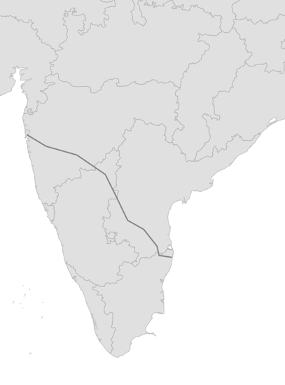
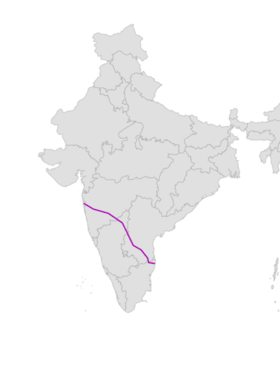
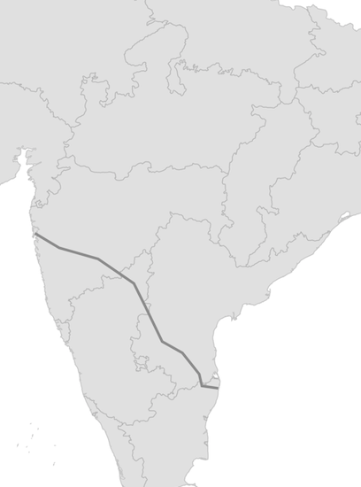
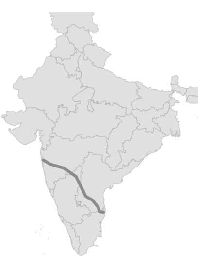
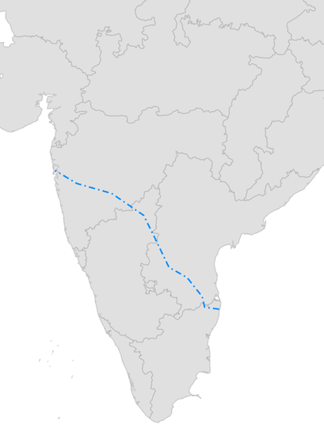
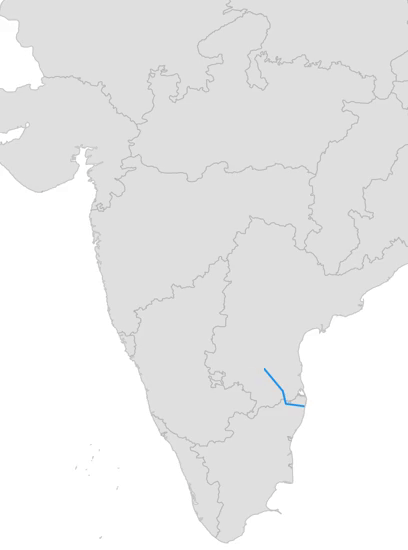
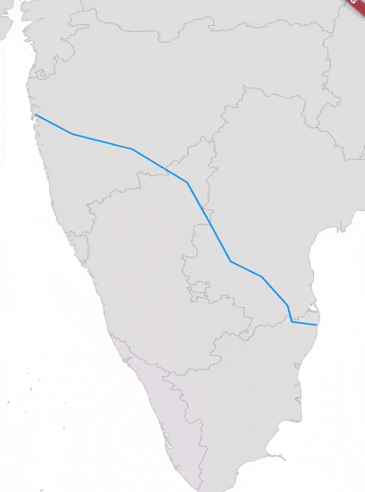
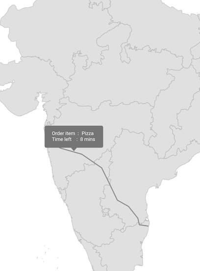
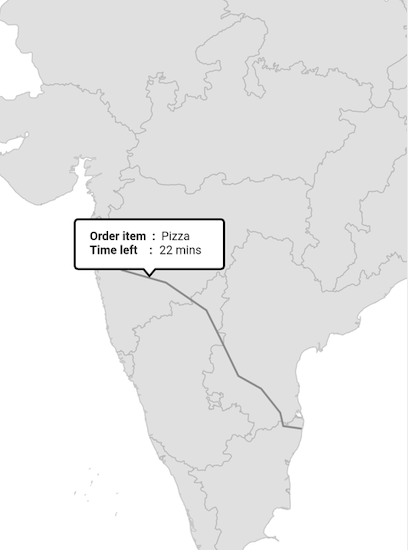

# Polylines in Flutter Maps (SfMaps)

Polyline layer is a sublayer that renders a group of [`MapPolyline`](https://pub.dev/documentation/syncfusion_flutter_maps/latest/maps/MapPolyline-class.html) on [`MapShapeLayer`](https://pub.dev/documentation/syncfusion_flutter_maps/latest/maps/MapShapeLayer-class.html) and [`MapTileLayer`](https://pub.dev/documentation/syncfusion_flutter_maps/latest/maps/MapTileLayer-class.html). This section helps to learn about how to add the polylines and customize them.

## Adding polylines

The [`polylines`](https://pub.dev/documentation/syncfusion_flutter_maps/latest/maps/MapPolylineLayer/polylines.html) is a collection of [`MapPolyline`](https://pub.dev/documentation/syncfusion_flutter_maps/latest/maps/MapPolyline-class.html). Every single [`MapPolyline`](https://pub.dev/documentation/syncfusion_flutter_maps/latest/maps/MapPolyline-class.html) connects multiple coordinates through a [`points`](https://pub.dev/documentation/syncfusion_flutter_maps/latest/maps/MapPolyline/points.html) property.

N> It is applicable for both the tile layer and shape layer.

<b>In the shape layer</b>




late List<MapLatLng> polyline;
late List<List<MapLatLng>> polylines;
late MapShapeSource dataSource;
late MapZoomPanBehavior zoomPanBehavior;

@override
void initState() {
  polyline = <MapLatLng>[
    MapLatLng(13.0827, 80.2707),
    MapLatLng(13.1746, 79.6117),
    MapLatLng(13.6373, 79.5037),
    MapLatLng(14.4673, 78.8242),
    MapLatLng(14.9091, 78.0092),
    MapLatLng(16.2160, 77.3566),
    MapLatLng(17.1557, 76.8697),
    MapLatLng(18.0975, 75.4249),
    MapLatLng(18.5204, 73.8567),
    MapLatLng(19.0760, 72.8777),
  ];

  polylines = <List<MapLatLng>>[polyline];
  dataSource = MapShapeSource.asset(
    'assets/india.json',
     shapeDataField: 'name',
  );

  zoomPanBehavior = MapZoomPanBehavior(
     zoomLevel: 2,
     focalLatLng: MapLatLng(20.3173, 78.7139),
  );
  super.initState();
}

@override
Widget build(BuildContext context) {
  return Scaffold(
    body: SfMaps(
      layers: [
        MapShapeLayer(
          source: dataSource,
          sublayers: [
            MapPolylineLayer(
              polylines: List<MapPolyline>.generate(
                polylines.length,
                (int index) {
                  return MapPolyline(
                    points: polylines[index],
                  );
                },
              ).toSet(),
            ),
          ],
          zoomPanBehavior: zoomPanBehavior,
        ),
      ],
    ),
  );
}

class PolylineModel {
  PolylineModel(this.points);
  final List<MapLatLng> points;
}




<b>In the tile layer</b>




late List<MapLatLng> polyline;
late List<List<MapLatLng>> polylines;
late MapZoomPanBehavior zoomPanBehavior;

@override
void initState() {
  polyline = <MapLatLng>[
    MapLatLng(13.0827, 80.2707),
    MapLatLng(13.1746, 79.6117),
    MapLatLng(13.6373, 79.5037),
    MapLatLng(14.4673, 78.8242),
    MapLatLng(14.9091, 78.0092),
    MapLatLng(16.2160, 77.3566),
    MapLatLng(17.1557, 76.8697),
    MapLatLng(18.0975, 75.4249),
    MapLatLng(18.5204, 73.8567),
    MapLatLng(19.0760, 72.8777),
  ];

  polylines = <List<MapLatLng>>[polyline];
  zoomPanBehavior = MapZoomPanBehavior(
    zoomLevel: 5,
    focalLatLng: MapLatLng(20.3173, 78.7139),
  );
  super.initState();
}

@override
Widget build(BuildContext context) {
  return Scaffold(
    body: SfMaps(
      layers: [
        MapTileLayer(
          urlTemplate: 'https://tile.openstreetmap.org/{z}/{x}/{y}.png',
          sublayers: [
            MapPolylineLayer(
              polylines: List<MapPolyline>.generate(
                polylines.length,
                (int index) {
                  return MapPolyline(
                    points: polylines[index],
                  );
                },
              ).toSet(),
            ),
          ],
          zoomPanBehavior: zoomPanBehavior,
        ),
      ],
    ),
  );
}

class PolylineModel {
  PolylineModel(this.points);
  final List<MapLatLng> points;
}




## Color

You can apply the same color for all [`MapPolyline`](https://pub.dev/documentation/syncfusion_flutter_maps/latest/maps/MapPolyline-class.html) in the [`polylines`](https://pub.dev/documentation/syncfusion_flutter_maps/latest/maps/MapPolylineLayer/polylines.html) collection using the [`MapPolylineLayer.color`](https://pub.dev/documentation/syncfusion_flutter_maps/latest/maps/MapPolylineLayer/color.html) property. Alternatively, you can apply different colors to each [`MapPolyline`](https://pub.dev/documentation/syncfusion_flutter_maps/latest/maps/MapPolyline-class.html) in the [`polylines`](https://pub.dev/documentation/syncfusion_flutter_maps/latest/maps/MapPolylineLayer/polylines.html) collection using the individual [`MapPolyline.color`](https://pub.dev/documentation/syncfusion_flutter_maps/latest/maps/MapPolyline/color.html) property.




late List<MapLatLng> polyline;
late List<PolylineModel> polylines;
late MapShapeSource dataSource;
late MapZoomPanBehavior zoomPanBehavior;

@override
void initState() {
  polyline = <MapLatLng>[
    MapLatLng(13.0827, 80.2707),
    MapLatLng(13.1746, 79.6117),
    MapLatLng(13.6373, 79.5037),
    MapLatLng(14.4673, 78.8242),
    MapLatLng(14.9091, 78.0092),
    MapLatLng(16.2160, 77.3566),
    MapLatLng(17.1557, 76.8697),
    MapLatLng(18.0975, 75.4249),
    MapLatLng(18.5204, 73.8567),
    MapLatLng(19.0760, 72.8777),
  ];

  polylines = <PolylineModel>[
    PolylineModel(polyline, Colors.purple),
  ];
  dataSource = MapShapeSource.asset(
    'assets/india.json',
    shapeDataField: 'name',
  );

  zoomPanBehavior = MapZoomPanBehavior(
    zoomLevel: 1,
    focalLatLng: MapLatLng(20.3173, 78.7139),
  );
  super.initState();
}

@override
Widget build(BuildContext context) {
  return Scaffold(
    body: SfMaps(
      layers: [
        MapShapeLayer(
          source: dataSource,
          sublayers: [
            MapPolylineLayer(
              polylines: List<MapPolyline>.generate(
                polylines.length,
                (int index) {
                  return MapPolyline(
                    points: polylines[index].points,
                    color: polylines[index].color,
                  );
                },
              ).toSet(),
            ),
          ],
          zoomPanBehavior: zoomPanBehavior,
        ),
      ],
    ),
  );
}

class PolylineModel {
  PolylineModel(this.points, this.color);
  final List<MapLatLng> points;
  final Color color;
}




## Width

You can apply the same width for all [`MapPolyline`](https://pub.dev/documentation/syncfusion_flutter_maps/latest/maps/MapPolyline-class.html) in the [`polylines`](https://pub.dev/documentation/syncfusion_flutter_maps/latest/maps/MapPolylineLayer/polylines.html) collection using the [`MapPolylineLayer.width`](https://pub.dev/documentation/syncfusion_flutter_maps/latest/maps/MapPolylineLayer/width.html) property. Alternatively, you can apply different width to each [`MapPolyline`](https://pub.dev/documentation/syncfusion_flutter_maps/latest/maps/MapPolyline-class.html) in the [`polylines`](https://pub.dev/documentation/syncfusion_flutter_maps/latest/maps/MapPolylineLayer/polylines.html) collection using the individual [`MapPolyline.width`](https://pub.dev/documentation/syncfusion_flutter_maps/latest/maps/MapPolyline/width.html) property. The default value of the [`MapPolylineLayer.width`](https://pub.dev/documentation/syncfusion_flutter_maps/latest/maps/MapPolylineLayer/width.html) property is `2`.




late List<MapLatLng> polyline;
late List<PolylineModel> polylines;
late MapShapeSource dataSource;
late MapZoomPanBehavior zoomPanBehavior;

@override
void initState() {
  polyline = <MapLatLng>[
    MapLatLng(13.0827, 80.2707),
    MapLatLng(13.1746, 79.6117),
    MapLatLng(13.6373, 79.5037),
    MapLatLng(14.4673, 78.8242),
    MapLatLng(14.9091, 78.0092),
    MapLatLng(16.2160, 77.3566),
    MapLatLng(17.1557, 76.8697),
    MapLatLng(18.0975, 75.4249),
    MapLatLng(18.5204, 73.8567),
    MapLatLng(19.0760, 72.8777),
  ];

  polylines = <PolylineModel>[
    PolylineModel(polyline, 3),
  ];
  dataSource = MapShapeSource.asset(
    'assets/india.json',
    shapeDataField: 'name',
  );

  zoomPanBehavior = MapZoomPanBehavior(
    zoomLevel: 2,
    focalLatLng: MapLatLng(20.3173, 78.7139),
  );
  super.initState();
}

@override
Widget build(BuildContext context) {
  return Scaffold(
    body: SfMaps(
      layers: [
        MapShapeLayer(
          source: dataSource,
          sublayers: [
            MapPolylineLayer(
              polylines: List<MapPolyline>.generate(
                polylines.length,
                (int index) {
                  return MapPolyline(
                    points: polylines[index].points,
                    width: polylines[index].width,
                  );
                },
              ).toSet(),
            ),
          ],
          zoomPanBehavior: zoomPanBehavior,
        ),
      ],
    ),
  );
}

class PolylineModel {
  PolylineModel(this.points, this.width);
  final List<MapLatLng> points;
  final double width;
}




## Stroke cap

You can apply the same stroke cap for all [`MapPolyline`](https://pub.dev/documentation/syncfusion_flutter_maps/latest/maps/MapPolyline-class.html) in the [`polylines`](https://pub.dev/documentation/syncfusion_flutter_maps/latest/maps/MapPolylineLayer/polylines.html) collection using the `MapPolylineLayer.strokeCap` property. Alternatively, you can apply different stroke cap to each [`MapPolyline`](https://pub.dev/documentation/syncfusion_flutter_maps/latest/maps/MapPolyline-class.html) in the [`polylines`](https://pub.dev/documentation/syncfusion_flutter_maps/latest/maps/MapPolylineLayer/polylines.html) collection using the individual `MapPolyline.strokeCap` property. The default value of the `MapPolylineLayer.strokeCap` property is `StrokeCap.butt`. The available values are `butt`, `round`, and `square`.




late List<MapLatLng> polyline;
late List<PolylineModel> polylines;
late MapShapeSource dataSource;
late MapZoomPanBehavior zoomPanBehavior;

@override
void initState() {
  polyline = <MapLatLng>[
    MapLatLng(13.0827, 80.2707),
    MapLatLng(13.1746, 79.6117),
    MapLatLng(13.6373, 79.5037),
    MapLatLng(14.4673, 78.8242),
    MapLatLng(14.9091, 78.0092),
    MapLatLng(16.2160, 77.3566),
    MapLatLng(17.1557, 76.8697),
    MapLatLng(18.0975, 75.4249),
    MapLatLng(18.5204, 73.8567),
    MapLatLng(19.0760, 72.8777),
  ];

  polylines = <PolylineModel>[
    PolylineModel(polyline, 5),
  ];
  dataSource = MapShapeSource.asset(
    'assets/india.json',
    shapeDataField: 'name',
  );

  zoomPanBehavior = MapZoomPanBehavior(
    focalLatLng: MapLatLng(20.3173, 78.7139),
  );
  super.initState();
}

@override
Widget build(BuildContext context) {
  return Scaffold(
    body: SfMaps(
      layers: [
        MapShapeLayer(
          source: dataSource,
          sublayers: [
            MapPolylineLayer(
              polylines: List<MapPolyline>.generate(
                polylines.length,
                    (int index) {
                  return MapPolyline(
                    points: polylines[index].points,
                    width: polylines[index].width,
                    strokeCap: StrokeCap.round,
                  );
                },
              ).toSet(),
            ),
          ],
          zoomPanBehavior: zoomPanBehavior,
        ),
      ],
    ),
  );
}

class PolylineModel {
  PolylineModel(this.points, this.width);

  final List<MapLatLng> points;
  final double width;
}




## Dash array

You can apply dash support for the polyline using the [`MapPolyline.dashArray`](https://pub.dev/documentation/syncfusion_flutter_maps/latest/maps/MapPolyline/dashArray.html) property.

A sequence of dash and gap will be rendered based on the values in this list. Once all values of the list is rendered, it will be repeated again till the end of the polyline.




late List<MapLatLng> polyline;
late List<PolylineModel> polylines;
late MapShapeSource dataSource;
late MapZoomPanBehavior zoomPanBehavior;

@override
void initState() {
  polyline = <MapLatLng>[
    MapLatLng(13.0827, 80.2707),
    MapLatLng(13.1746, 79.6117),
    MapLatLng(13.6373, 79.5037),
    MapLatLng(14.4673, 78.8242),
    MapLatLng(14.9091, 78.0092),
    MapLatLng(16.2160, 77.3566),
    MapLatLng(17.1557, 76.8697),
    MapLatLng(18.0975, 75.4249),
    MapLatLng(18.5204, 73.8567),
    MapLatLng(19.0760, 72.8777),
  ];

  polylines = <PolylineModel>[
    PolylineModel(polyline),
  ];
  dataSource = MapShapeSource.asset(
    'assets/india.json',
    shapeDataField: 'name',
  );

  zoomPanBehavior = MapZoomPanBehavior(
    zoomLevel: 2,
    focalLatLng: MapLatLng(18.3173, 77.7139),
  );
  super.initState();
}

@override
Widget build(BuildContext context) {
  return Scaffold(
    body: SfMaps(
      layers: [
        MapShapeLayer(
          source: dataSource,
          sublayers: [
            MapPolylineLayer(
              polylines: List<MapPolyline>.generate(
                polylines.length,
                (int index) {
                  return MapPolyline(
                    points: polylines[index].points,
                    dashArray: [8, 4, 2, 4],
                  );
                },
              ).toSet(),
              color: Colors.blue,
            ),
          ],
          zoomPanBehavior: zoomPanBehavior,
        ),
      ],
    ),
  );
}

class PolylineModel {
  PolylineModel(this.points);
  final List<MapLatLng> points;
}




## Animation

You can apply animation for the [`MapPolyline`](https://pub.dev/documentation/syncfusion_flutter_maps/latest/maps/MapPolyline-class.html) using the [`MapPolylineLayer.animation`](https://pub.dev/documentation/syncfusion_flutter_maps/latest/maps/MapPolylineLayer/animation.html) property and able to customize the animation flow, curve and duration.

By default, there will not be any animation.




late List<MapLatLng> polyline;
late List<PolylineModel> polylines;
late MapShapeSource dataSource;
late MapZoomPanBehavior zoomPanBehavior;
late AnimationController animationController;
late Animation animation;

@override
void initState() {
  polyline = <MapLatLng>[
    MapLatLng(13.0827, 80.2707),
    MapLatLng(13.1746, 79.6117),
    MapLatLng(13.6373, 79.5037),
    MapLatLng(14.4673, 78.8242),
    MapLatLng(14.9091, 78.0092),
    MapLatLng(16.2160, 77.3566),
    MapLatLng(17.1557, 76.8697),
    MapLatLng(18.0975, 75.4249),
    MapLatLng(18.5204, 73.8567),
    MapLatLng(19.0760, 72.8777),
  ];

  polylines = <PolylineModel>[
    PolylineModel(polyline),
  ];
  dataSource = MapShapeSource.asset(
    'assets/india.json',
    shapeDataField: 'name',
  );

  zoomPanBehavior = MapZoomPanBehavior(
     zoomLevel: 2,
     focalLatLng: MapLatLng(19.3173, 76.7139),
  );

  animationController = AnimationController(
     duration: Duration(seconds: 3),
      vsync: this,
  );
  animation = CurvedAnimation(
     parent: animationController,
     curve: Curves.easeInOut,
  );
  animationController.forward(from: 0);
  super.initState();
}

@override
void dispose() {
  animationController.dispose();
  super.dispose();
}

@override
Widget build(BuildContext context) {
  return Scaffold(
    body: SfMaps(
      layers: [
        MapShapeLayer(
          source: dataSource,
          sublayers: [
            MapPolylineLayer(
              polylines: List<MapPolyline>.generate(
                polylines.length,
                (int index) {
                  return MapPolyline(
                    points: polylines[index].points,
                  );
                },
              ).toSet(),
              color: Colors.blue,
              animation: animation,
            ),
          ],
          zoomPanBehavior: zoomPanBehavior,
        ),
      ],
    ),
  );
}

class PolylineModel {
  PolylineModel(this.points);
  final List<MapLatLng> points;
}




## Tap

You can use the [`onTap`](https://pub.dev/documentation/syncfusion_flutter_maps/latest/maps/MapPolyline/onTap.html) callback to get a notification if the particular [`MapPolyline`](https://pub.dev/documentation/syncfusion_flutter_maps/latest/maps/MapPolyline-class.html) is tapped. You can also customize the tapped [`MapPolyline`](https://pub.dev/documentation/syncfusion_flutter_maps/latest/maps/MapPolyline-class.html) based on the index passed in the callback as shown in the below code snippet.




late List<MapLatLng> polyline;
late List<PolylineModel> polylines;
late MapShapeSource dataSource;
late MapZoomPanBehavior zoomPanBehavior;
late int selectedIndex;

@override
void initState() {
  polyline = <MapLatLng>[
    MapLatLng(13.0827, 80.2707),
    MapLatLng(13.1746, 79.6117),
    MapLatLng(13.6373, 79.5037),
    MapLatLng(14.4673, 78.8242),
    MapLatLng(14.9091, 78.0092),
    MapLatLng(16.2160, 77.3566),
    MapLatLng(17.1557, 76.8697),
    MapLatLng(18.0975, 75.4249),
    MapLatLng(18.5204, 73.8567),
    MapLatLng(19.0760, 72.8777),
  ];

  polylines = <PolylineModel>[
    PolylineModel(polyline),
  ];
  dataSource = MapShapeSource.asset(
    'assets/india.json',
    shapeDataField: 'name',
  );

  zoomPanBehavior = MapZoomPanBehavior(
    zoomLevel: 2,
    focalLatLng: MapLatLng(19.3173, 76.7139),
  );

  selectedIndex = -1;
  super.initState();
}

@override
Widget build(BuildContext context) {
  return Scaffold(
    body: SfMaps(
      layers: [
        MapShapeLayer(
          source: dataSource,
          sublayers: [
            MapPolylineLayer(
              polylines: List<MapPolyline>.generate(
                polylines.length,
                (int index) {
                  return MapPolyline(
                    points: polylines[index].points,
                    color: selectedIndex == index ? Colors.pink: Colors.blue,
                    onTap: () {
                      setState(() {
                        selectedIndex = index;
                      });
                    }
                  );
                },
              ).toSet(),
            ),
          ],
          zoomPanBehavior: zoomPanBehavior,
        ),
      ],
    ),
  );
}

class PolylineModel {
  PolylineModel(this.points);
  final List<MapLatLng> points;
}




## Tooltip

You can show additional information about the polyline drawn using the [`tooltipBuilder`](https://pub.dev/documentation/syncfusion_flutter_maps/latest/maps/MapSublayer/tooltipBuilder.html) property.




late List<MapLatLng> polyline;
late List<PolylineModel> polylines;
late MapShapeSource dataSource;
late MapZoomPanBehavior zoomPanBehavior;
late Random random;

@override
void initState() {
  polyline = <MapLatLng>[
    MapLatLng(13.0827, 80.2707),
    MapLatLng(13.1746, 79.6117),
    MapLatLng(13.6373, 79.5037),
    MapLatLng(14.4673, 78.8242),
    MapLatLng(14.9091, 78.0092),
    MapLatLng(16.2160, 77.3566),
    MapLatLng(17.1557, 76.8697),
    MapLatLng(18.0975, 75.4249),
    MapLatLng(18.5204, 73.8567),
    MapLatLng(19.0760, 72.8777),
  ];

  polylines = <PolylineModel>[
    PolylineModel(polyline),
  ];
  dataSource = MapShapeSource.asset(
    'assets/india.json',
    shapeDataField: 'name',
  );

  zoomPanBehavior = MapZoomPanBehavior(
    zoomLevel: 2,
    focalLatLng: MapLatLng(19.3173, 76.7139),
  );

  random = Random();
  super.initState();
}

@override
Widget build(BuildContext context) {
  final ThemeData themeData = Theme.of(context);
  final TextStyle textStyle = themeData.textTheme.caption!
        .copyWith(color: themeData.colorScheme.surface);
  return Scaffold(
    body: SfMaps(
      layers: [
        MapShapeLayer(
          source: dataSource,
          sublayers: [
            MapPolylineLayer(
              polylines: List<MapPolyline>.generate(
                polylines.length,
                (int index) {
                  return MapPolyline(
                    points: polylines[index].points,
                  );
                },
              ).toSet(),
              tooltipBuilder: (BuildContext context, int index) {
                 return Container(
                    padding: EdgeInsets.only(left: 15, top: 10),
                       width: 150,
                       height: 50,
                       child: Column(
                          children: [
                              Row(
                                children: [
                                   Text('Order item  :  ', style: textStyle),
                                   Text('Pizza', style: textStyle),
                                ],
                              ),
                              Row(
                                children: [
                                   Text('Time left    :  ', style: textStyle),
                                   Text(random.nextInt(30).toString() + ' mins',
                                       style: textStyle),
                                ],
                             ),
                          ],
                       ),
                    );
                 },
            ),
          ],
          zoomPanBehavior: zoomPanBehavior,
        ),
      ],
    ),
  );
}

class PolylineModel {
  PolylineModel(this.points);
  final List<MapLatLng> points;
}




## Tooltip customization

You can customize the appearance of the tooltip.

* **Background color** - Change the background color of the tooltip in the maps using the [`MapTooltipSettings.color`](https://pub.dev/documentation/syncfusion_flutter_maps/latest/maps/MapTooltipSettings/color.html) property.
* **Stroke color** - Change the stroke color of the tooltip in the maps using the [`MapTooltipSettings.strokeColor`](https://pub.dev/documentation/syncfusion_flutter_maps/latest/maps/MapTooltipSettings/strokeColor.html) property.
* **Stroke width** - Change the stroke width of the tooltip in the maps using the [`MapTooltipSettings.strokeWidth`](https://pub.dev/documentation/syncfusion_flutter_maps/latest/maps/MapTooltipSettings/strokeWidth.html) property.




late List<MapLatLng> polyline;
late List<PolylineModel> polylines;
late MapShapeSource dataSource;
late MapZoomPanBehavior zoomPanBehavior;
late Random random;

@override
void initState() {
  polyline = <MapLatLng>[
    MapLatLng(13.0827, 80.2707),
    MapLatLng(13.1746, 79.6117),
    MapLatLng(13.6373, 79.5037),
    MapLatLng(14.4673, 78.8242),
    MapLatLng(14.9091, 78.0092),
    MapLatLng(16.2160, 77.3566),
    MapLatLng(17.1557, 76.8697),
    MapLatLng(18.0975, 75.4249),
    MapLatLng(18.5204, 73.8567),
    MapLatLng(19.0760, 72.8777),
  ];

  polylines = <PolylineModel>[
    PolylineModel(polyline),
  ];
  dataSource = MapShapeSource.asset(
    'assets/india.json',
    shapeDataField: 'name',
  );

  zoomPanBehavior = MapZoomPanBehavior(
    zoomLevel: 3,
    focalLatLng: MapLatLng(15.3173, 76.7139),
  );

  random = Random();
  super.initState();
}

@override
Widget build(BuildContext context) {
  return Scaffold(
    body: SfMaps(
      layers: [
        MapShapeLayer(
          source: dataSource,
          tooltipSettings: MapTooltipSettings(
            color: Colors.white,
            strokeWidth: 2,
            strokeColor: Colors.black,
          ),
          sublayers: [
            MapPolylineLayer(
              polylines: List<MapPolyline>.generate(
                polylines.length,
                (int index) {
                  return MapPolyline(
                    points: polylines[index].points,
                  );
                },
              ).toSet(),
              tooltipBuilder: (BuildContext context, int index) {
                 return Container(
                    padding: EdgeInsets.only(left: 15, top: 10),
                       width: 150,
                       height: 50,
                       child: Column(
                          children: [
                            Row(
                              children: [
                                Text('Order item :  ',
                                   style: TextStyle(fontWeight: FontWeight.bold)),
                                Text('Pizza'),
                              ],
                            ),
                            Row(
                               children: [
                                  Text('Time left    :  ',
                                      style: TextStyle(fontWeight: FontWeight.bold)),
                                  Text(random.nextInt(30).toString() + ' mins'),
                               ],
                            ),
                          ],
                       ),
                    );
                 },
            ),
          ],
          zoomPanBehavior: zoomPanBehavior,
        ),
      ],
    ),
  );
}

class PolylineModel {
  PolylineModel(this.points);
  final List<MapLatLng> points;
}




