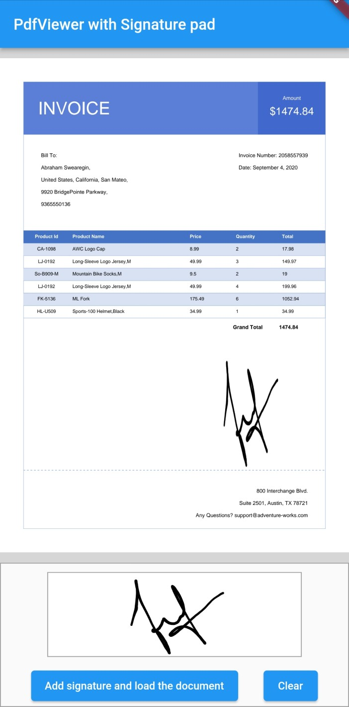

# How to add a digital signature in SfPdfViewer using SfSignaturePad?

In this example, we have added the signature drawn on [SfSignaturePad](https://pub.dev/documentation/syncfusion_flutter_signaturepad/latest/signaturepad/SfSignaturePad-class.html) to the document in [SfPdfViewer](https://pub.dev/documentation/syncfusion_flutter_pdfviewer/latest/pdfviewer/SfPdfViewer-class.html) with the help of [Syncfusion PDF Library](https://pub.dev/documentation/syncfusion_flutter_pdf/latest/pdf/pdf-library.html#classes). 

In the `_handleSigningProcess()` method, the signature in SfSignaturePad is saved as image using the [toImage()](https://pub.dev/documentation/syncfusion_flutter_signaturepad/latest/signaturepad/SfSignaturePadState/toImage.html) method. Created a [PdfSignatureField()](https://pub.dev/documentation/syncfusion_flutter_pdf/latest/pdf/PdfSignatureField-class.html) and added the signature image as digital signature in the PDF document using the [drawImage()](https://pub.dev/documentation/syncfusion_flutter_pdf/latest/pdf/PdfGraphics/drawImage.html) method in `Syncfusion PDF Library` and then save the document as bytes. Loaded the saved document bytes using the [SfPdfViewer.memory()](https://pub.dev/documentation/syncfusion_flutter_pdfviewer/latest/pdfviewer/SfPdfViewer/SfPdfViewer.memory.html). The following code example explains the same.




import 'dart:ui' as ui;
import 'package:flutter/material.dart';
import 'package:flutter/services.dart';
import 'package:syncfusion_flutter_pdf/pdf.dart';
import 'package:syncfusion_flutter_pdfviewer/pdfviewer.dart';
import 'package:syncfusion_flutter_signaturepad/signaturepad.dart';

void main() {
  return runApp(const SignaturePadApp());
}

class SignaturePadApp extends StatelessWidget {
  const SignaturePadApp({super.key});
  @override
  Widget build(BuildContext context) {
    return const MaterialApp(
      home: _MyHomePage(),
    );
  }
}

@immutable
class _MyHomePage extends StatefulWidget {
  const _MyHomePage({super.key});

  @override
  _MyHomePageState createState() => _MyHomePageState();
}

class _MyHomePageState extends State<_MyHomePage> {
  final GlobalKey<SfSignaturePadState> _signaturePadGlobalKey = GlobalKey();
  Uint8List? _documentBytes;

  @override
  void initState() {
    super.initState();
    _loadDocument();
  }

  Future<void> _loadDocument() async {
    final ByteData docBytes = await rootBundle.load("assets/sample.pdf");
    _documentBytes = docBytes.buffer.asUint8List();
    setState(() {});
  }

  //Add the signature in the PDF document.
  void _handleSigningProcess() async {
    //Save the signature as PNG image.
    final data =
        await _signaturePadGlobalKey.currentState!.toImage(pixelRatio: 3.0);
    final bytes = await data.toByteData(format: ui.ImageByteFormat.png);
    final ByteData docBytes = await rootBundle.load("assets/sample.pdf");
    final Uint8List documentBytes = docBytes.buffer.asUint8List();
    ByteData certBytes = await rootBundle.load("assets/certificate.pfx");
    final Uint8List certificateBytes = certBytes.buffer.asUint8List();

    //Load the document
    PdfDocument document = PdfDocument(inputBytes: documentBytes);

    //Get the first page of the document. The page in which signature need to be added.
    PdfPage page = document.pages[0];

    //Create a digital signature and set the signature information.
    PdfSignatureField signatureField = PdfSignatureField(page, 'signature',
        bounds: const Rect.fromLTRB(300, 500, 550, 700),
        signature: PdfSignature(
            //Create a certificate instance from the PFX file with a private key.
            certificate: PdfCertificate(certificateBytes, 'password123'),
            contactInfo: 'johndoe@owned.us',
            locationInfo: 'Honolulu, Hawaii',
            reason: 'I am author of this document.',
            digestAlgorithm: DigestAlgorithm.sha256,
            cryptographicStandard: CryptographicStandard.cms));

    //Get the signature field appearance graphics.
    PdfGraphics? graphics = signatureField.appearance.normal.graphics;

    //Draw the signature image in the PDF page.
    graphics?.drawImage(PdfBitmap(bytes!.buffer.asUint8List()),
        const Rect.fromLTWH(0, 0, 250, 200));

    //Add a signature field to the form.
    document.form.fields.add(signatureField);

    _documentBytes = Uint8List.fromList(document.saveSync());
    document.dispose();
    setState(() {});
  }

  //Clear the signature in the SfSignaturePad.
  void _handleClearButtonPressed() {
    _signaturePadGlobalKey.currentState!.clear();
  }

  @override
  Widget build(BuildContext context) {
    return Scaffold(
        appBar: AppBar(
          title: const Text('PdfViewer with Signature pad'),
        ),
        body: Column(
          children: [
            Expanded(
              child: _documentBytes != null
                  ? SfPdfViewer.memory(
                      _documentBytes!,
                    )
                  : const Center(child: CircularProgressIndicator()),
            ),
            Container(
              height: 170,
              decoration: BoxDecoration(border: Border.all(color: Colors.grey)),
              child: Column(
                mainAxisAlignment: MainAxisAlignment.spaceBetween,
                children: [
                  Padding(
                    padding: const EdgeInsets.all(10.0),
                    child: Container(
                      height: 100,
                      width: 300,
                      decoration:
                          BoxDecoration(border: Border.all(color: Colors.grey)),
                      child: SfSignaturePad(
                          key: _signaturePadGlobalKey,
                          backgroundColor: Colors.white,
                          strokeColor: Colors.black,
                          minimumStrokeWidth: 1.0,
                          maximumStrokeWidth: 4.0),
                    ),
                  ),
                  Row(
                    mainAxisAlignment: MainAxisAlignment.center,
                    children: <Widget>[
                      Padding(
                        padding: const EdgeInsets.fromLTRB(0, 0, 30, 0),
                        child: ElevatedButton(
                          onPressed: _handleSigningProcess,
                          child:
                              const Text('Add signature and load the document'),
                        ),
                      ),
                      ElevatedButton(
                        onPressed: _handleClearButtonPressed,
                        child: const Text('Clear'),
                      ),
                    ],
                  )
                ],
              ),
            )
          ],
        ));
  }
}




To know more about adding a digital signature to a PDF document, please refer [here](https://help.syncfusion.com/flutter/pdf/working-with-digital-signature).
