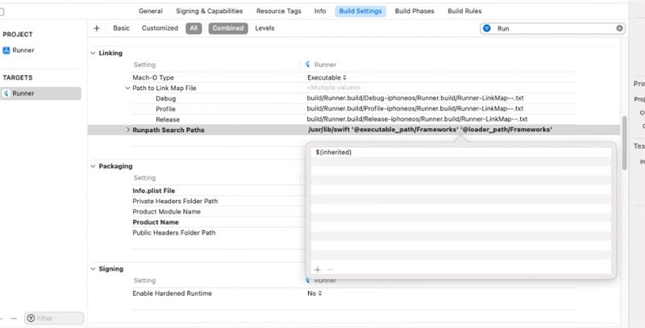

# How to resolve the issue "Library not loaded: @rpath/libswiftCore.dylib" faced when using Syncfusion Flutter PdfViewer?

The Syncfusion Flutter PDF Viewer is a [ffi plugin](https://docs.flutter.dev/development/packages-and-plugins/developing-packages#types) that uses native code to render the PDF pages. **Java** code is used for **Android**, and **Swift** code is used for **iOS and macOS**. To run the Swift code, the runtime requires the essential Swift standard libraries present in the runpath **“usr/lib/swift.”** If this path is missing from the **Runpath Search Paths** of the project build settings, you will face the error **"Library not loaded: @rpath/libswiftCore.dylib."** 
 
Usually, the **"usr/lib/swift"** path will be added automatically to the **Runpath Search Paths** when you add the Syncfusion Flutter PDF Viewer (SfPdfViewer) package and build the application. But in some cases, due to the machine-specific environment, this path doesn't get added, and so this issue occurs. 
 
To overcome this issue, you are suggested to add the **"usr/lib/swift"** path to the **Runpath Search Paths** manually in the project build settings. Find and edit the **Runpath Search Paths** option by opening the project in the **XCode** and then going to **Build Settings -> Linking -> Runpath Search Paths**. Please find the Runpath search path option screenshot in the following project build settings.

