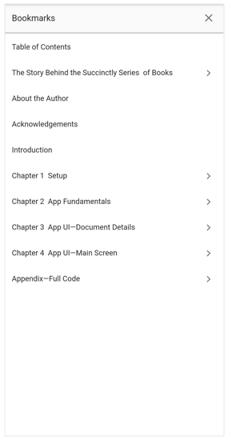

# Bookmark navigation in Flutter PDF Viewer (SfPdfViewer)

Navigate to the desired bookmark topics using the default bookmark view or the controller method programmatically.  

## Open and close the built-in bookmark view programmatically

The built-in bookmark view in the `SfPdfViewer` can be opened using the [openBookmarkView](https://pub.dev/documentation/syncfusion_flutter_pdfviewer/latest/pdfviewer/SfPdfViewerState/openBookmarkView.html) method and it can be closed either by tapping the close icon or device's back button. Also, we can close the bookmark programmatically by using the Navigator’s pop method. 

* You can use [isBookmarkViewOpen](https://pub.dev/documentation/syncfusion_flutter_pdfviewer/latest/pdfviewer/SfPdfViewerState/isBookmarkViewOpen.html) property of the `SfPdfViewerState` class, to know whether the built-in bookmark view is open or not.

The following code example explains the opening of built-in bookmark view programmatically.




final GlobalKey<SfPdfViewerState> _pdfViewerKey = GlobalKey();

@override
Widget build(BuildContext context) {
  return Scaffold(
    appBar: AppBar(
      title: Text('Syncfusion Flutter PdfViewer'),
      actions: <Widget>[
        IconButton(
          onPressed: () {
            if (_pdfViewerKey.currentState?.isBookmarkViewOpen ?? false) {
              print('Bookmark view is opened');
            } else {
              print('Bookmark view is closed');
            }
          },
          icon: const Icon(Icons.help_outline),
        ),
        IconButton(
          icon: Icon(
            Icons. bookmark,
            color: Colors.white,
          ),
          onPressed: () {
            _pdfViewerKey.currentState?.openBookmarkView();
          },
        ), 
      ],
    ),
    body: SfPdfViewer.network(
      'https://cdn.syncfusion.com/content/PDFViewer/flutter-succinctly.pdf',
      key: _pdfViewerKey,
    ),
  );
}




## Navigate to the desired bookmark topic programmatically

You can navigate to the desired bookmark topic programmatically using the [jumpToBookmark](https://pub.dev/documentation/syncfusion_flutter_pdfviewer/latest/pdfviewer/PdfViewerController/jumpToBookmark.html) controller method. The following code example explains the same.

N> Import **'package:syncfusion_flutter_pdf/pdf.dart'** in the Dart code if you use the [PdfBookmark](https://pub.dev/documentation/syncfusion_flutter_pdf/latest/pdf/PdfBookmark-class.html) parameter.




late PdfViewerController _pdfViewerController;
late PdfBookmark _pdfBookmark;

@override
void initState() {
  _pdfViewerController = PdfViewerController();
  super.initState();
}

@override
Widget build(BuildContext context) {
  return MaterialApp(
    home: Scaffold(
      appBar: AppBar(
        title: Text('Syncfusion Flutter PdfViewer'),
        actions: <Widget>[
          IconButton(
            icon: Icon(
              Icons.arrow_drop_down_circle,
              color: Colors.white,
            ),
            onPressed: () {
              _pdfViewerController.jumpToBookmark(_pdfBookmark);
            },
          ),
        ],
      ),
      body: SfPdfViewer.network(
        'https://cdn.syncfusion.com/content/PDFViewer/flutter-succinctly.pdf',
        controller: _pdfViewerController,
        onDocumentLoaded: (PdfDocumentLoadedDetails details) {
          _pdfBookmark = details.document.bookmarks[0];
        },
      ),
    ),
  );
}


