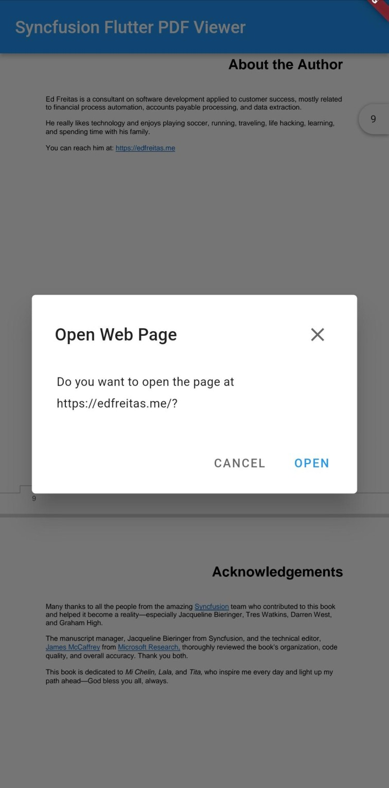

# Hyperlink navigation in Flutter PDF Viewer (SfPdfViewer)

The SfPdfViewer supports the hyperlink navigation that enables the hyperlinks in the PDF document and tapping on the hyperlink it will open in the browser.

## Enable or disable the hyperlink navigation

You can enable or disable the navigation of hyperlinks using the enableHyperlinkNavigation property. The following code example explains the same.




  @override
  Widget build(BuildContext context) {
    return Scaffold(
      appBar: AppBar(
        title: const Text('Syncfusion Flutter PDF Viewer'),
      ),
      body: SfPdfViewer.network(
        'https://cdn.syncfusion.com/content/PDFViewer/flutter-succinctly.pdf',
        enableHyperlinkNavigation: false,
      ),
    );
  }




## Customize the visibility of hyperlink navigation dialog

By default, the hyperlink navigation dialog will be displayed when the hyperlink is clicked. You can customize the visibility of the hyperlink navigation dialog using the canShowHyperlinkDialog property. The following code example explains the same.




  @override
  Widget build(BuildContext context) {
    return Scaffold(
      appBar: AppBar(
        title: const Text('Syncfusion Flutter PDF Viewer'),
      ),
      body: SfPdfViewer.network(
        'https://cdn.syncfusion.com/content/PDFViewer/flutter-succinctly.pdf',
        canShowHyperlinkDialog: false,
      ),
    );
  }




## Callbacks

The `SfPdfViewer` hyperlink navigation supports the PdfHyperlinkClickedCallback, which holds the information of `uri`clicked in the PDF document.

### Hyperlink clicked callback

The onHyperlinkClicked callback triggers when a hyperlink in the `SfPdfViewer` is tapped. The PdfHyperlinkClickedDetails will return the `uri` clicked in the PDF document. The following code example explains the same.




  @override
  Widget build(BuildContext context) {
    return Scaffold(
      appBar: AppBar(
        title: const Text('Syncfusion Flutter PDF Viewer'),
      ),
      body: SfPdfViewer.network(
        'https://cdn.syncfusion.com/content/PDFViewer/flutter-succinctly.pdf',
        onHyperlinkClicked: (PdfHyperlinkClickedDetails details) {
          print(details.uri);
        },
      ),
    );
  }


