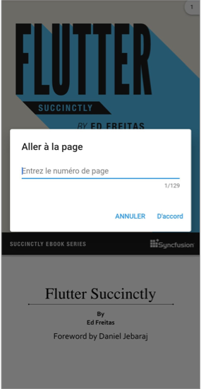

# Localization in Flutter PDF Viewer (SfPdfViewer)

By default, the `SfPdfViewer` widget supports US English localization. You can change the other languages by specifying the `MaterialApp` properties and adding the `flutter_localizations` and `syncfusion_localizations` package to your application. 

To use `flutter_localizations` and `syncfusion_localizations`, add the packages as a dependency to the `pubspec.yaml` file.



dependencies:
flutter_localizations:
  sdk: flutter
syncfusion_localizations: ^XX.X.XX



Next, import the `flutter_localizations` and `syncfusion_localizations` library and specify the `localizationsDelegates` and `supportedLocales` for `MaterialApp` to localize the contents in the `SfPdfViewer` (page navigation dialog and bookmark view).




  @override
  Widget build(BuildContext context) {
      return MaterialApp(
        localizationsDelegates:[
          GlobalMaterialLocalizations.delegate,
          GlobalWidgetsLocalizations.delegate,
          SfGlobalLocalizations.delegate,
        ],
        supportedLocales:const [
          Locale('fr'),
          Locale('ru'),
          Locale('ta'),
        ],
        locale: const Locale('fr'),
        title: 'PDF Viewer Localization',
        home: Scaffold(
          appBar: AppBar(
            title: const Text('Syncfusion Flutter PdfViewer'),
          ),
          body: SfPdfViewer.network(
              'https://cdn.syncfusion.com/content/PDFViewer/flutter-succinctly.pdf'),
        ),
      );
    }




