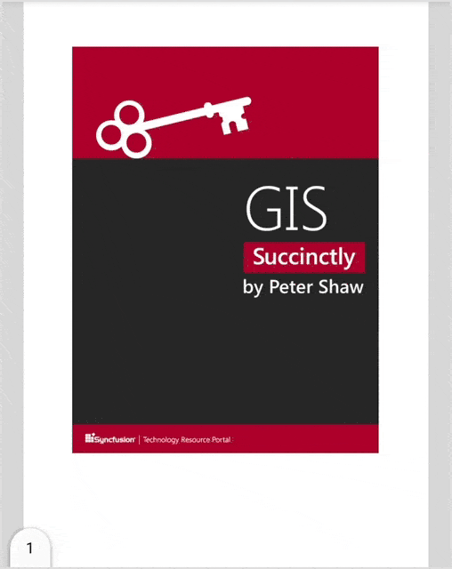

# Page Layout and Scrolling options in Flutter PDF Viewer (SfPdfViewer)

Page layout modes describe how the PDF page is displayed and, scrolling options describe the direction in which the PDF pages can be scrolled in [SfPdfViewer](https://pub.dev/documentation/syncfusion_flutter_pdfviewer/latest/pdfviewer/SfPdfViewer-class.html).

## Page layout modes

The [SfPdfViewer](https://pub.dev/documentation/syncfusion_flutter_pdfviewer/latest/pdfviewer/SfPdfViewer-class.html) supports the following page layout modes:

* Continuous page layout mode
* Single page layout mode

N> For now, only `Horizontal` scrolling is supported in `Single page layout mode`.

### Continuous page layout mode

By default, the `continuous` page layout mode is enabled, which scrolls the PDF pages vertically and horizontally. To enable the `continuous` page layout mode in `SfPdfViewer`, use the following code sample.




@override
Widget build(BuildContext context) {
  return Scaffold(
      body: Container(
          child: SfPdfViewer.network(
              'https://cdn.syncfusion.com/content/PDFViewer/flutter-succinctly.pdf',
              pageLayoutMode: PdfPageLayoutMode.continuous)));
}




### Single page layout mode

In `Single` page layout mode, PDFs will be displayed page by page horizontally. To enable the `Single` page layout mode in `SfPdfViewer`, use the following code sample.




@override
Widget build(BuildContext context) {
  return Scaffold(
      body: Container(
          child: SfPdfViewer.network(
              'https://cdn.syncfusion.com/content/PDFViewer/flutter-succinctly.pdf', 
             pageLayoutMode: PdfPageLayoutMode.single)));
}




## Scrolling options

The [SfPdfViewer](https://pub.dev/documentation/syncfusion_flutter_pdfviewer/latest/pdfviewer/SfPdfViewer-class.html) supports the following scrolling options:

* Vertical scrolling
* Horizontal scrolling

### Vertical scrolling

By default, `Vertical` scrolling is enabled, which moves the PDF pages from up to down. To enable the `Vertical` scrolling in `SfPdfViewer`, use the following code sample.




@override
Widget build(BuildContext context) {
  return Scaffold(
      body: Container(
          child: SfPdfViewer.network(
              'https://cdn.syncfusion.com/content/PDFViewer/flutter-succinctly.pdf', 
             scrollDirection: PdfScrollDirection.vertical)));
}




### Horizontal scrolling

In `Horizontal` scrolling, PDF pages can be scrolled from left to right. To enable the `Horizontal` scrolling in `SfPdfViewer`, use the following code sample.




@override
Widget build(BuildContext context) {
  return Scaffold(
      body: Container(
          child: SfPdfViewer.network(
              'https://cdn.syncfusion.com/content/PDFViewer/flutter-succinctly.pdf', 
             scrollDirection: PdfScrollDirection.horizontal)));
}


