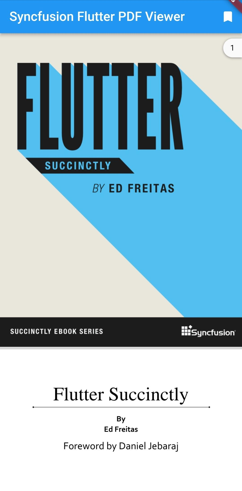
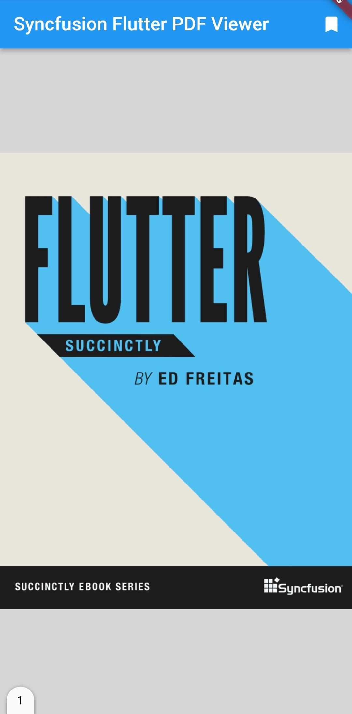

# Page Layout modes in Flutter PDF Viewer (SfPdfViewer)

The [SfPdfViewer](https://pub.dev/documentation/syncfusion_flutter_pdfviewer/latest/pdfviewer/SfPdfViewer-class.html) supports the following PageLayout modes,

* continuous
* single

## Continuous page mode

By default, the `continuous` pagelayoutmode will be enabled and it allows to scroll the page continuously. Refer to the following code to enable the `continuous` pagelayoutmode in `SfPdfViewer`.




@override
Widget build(BuildContext context) {
  return Scaffold(
      body: Container(
          child: SfPdfViewer.network(
              'https://cdn.syncfusion.com/content/PDFViewer/flutter-succinctly.pdf', 
              pageLayoutMode: PdfPageLayoutMode.continuous)));
}




## Single page mode

In `single` pagelayoutmode,user can scroll the page from one page to another page. Refer to the following code to enable the `single` pagelayoutmode in `SfPdfViewer`.




@override
Widget build(BuildContext context) {
  return Scaffold(
      body: Container(
          child: SfPdfViewer.network(
              'https://cdn.syncfusion.com/content/PDFViewer/flutter-succinctly.pdf', 
             pageLayoutMode: PdfPageLayoutMode.single)));
}


