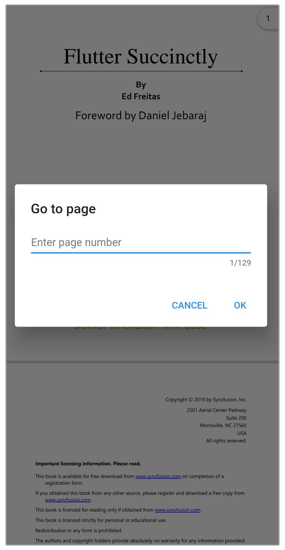

# Page navigation in Flutter PDF Viewer (SfPdfViewer)

Navigate to the desired pages instantly either by using the page navigation dialog or the controller methods programmatically. If the desired page doesn’t exist, then the navigation will not happen, and the older page will be retained.

## Navigate to the desired page programmatically

The [jumpToPage](https://pub.dev/documentation/syncfusion_flutter_pdfviewer/latest/pdfviewer/PdfViewerController/jumpToPage.html) controller method helps you to navigate to the specified page number in a PDF document. The following code example explains the same




late PdfViewerController _pdfViewerController;

@override
void initState() {
  _pdfViewerController = PdfViewerController();
  super.initState();
}

@override
Widget build(BuildContext context) {
  return Scaffold(
    appBar: AppBar(
      title: Text('Syncfusion Flutter PdfViewer'),
      actions: <Widget>[
        IconButton(
          icon: Icon(
            Icons.arrow_drop_down_circle,
            color: Colors.white,
          ),
          onPressed: () {
            _pdfViewerController.jumpToPage(5);
          },
        ),
      ],
    ),
    body: SfPdfViewer.network(
      'https://cdn.syncfusion.com/content/PDFViewer/flutter-succinctly.pdf',
      controller: _pdfViewerController,
    ),
  );
}




## Navigate to the next and previous page programmatically

The [nextPage](https://pub.dev/documentation/syncfusion_flutter_pdfviewer/latest/pdfviewer/PdfViewerController/nextPage.html) and [previousPage](https://pub.dev/documentation/syncfusion_flutter_pdfviewer/latest/pdfviewer/PdfViewerController/previousPage.html) controller methods help you to navigate to the next and previous page of a PDF document. The following code example explains the same.




late PdfViewerController _pdfViewerController;

@override
void initState() {
  _pdfViewerController = PdfViewerController();
  super.initState();
}

@override
Widget build(BuildContext context) {
  return Scaffold(
    appBar: AppBar(
      title: Text('Syncfusion Flutter PdfViewer'),
      actions: <Widget>[
        IconButton(
          icon: Icon(
            Icons.keyboard_arrow_up,
            color: Colors.white,
          ),
          onPressed: () {
            _pdfViewerController.previousPage();
          },
        ),
        IconButton(
          icon: Icon(
            Icons.keyboard_arrow_down,
            color: Colors.white,
          ),
          onPressed: () {
            _pdfViewerController.nextPage();
          },
        ),
      ],
    ),
    body: SfPdfViewer.network(
      'https://cdn.syncfusion.com/content/PDFViewer/flutter-succinctly.pdf',
      controller: _pdfViewerController,
    ),
  );
}




## Navigate to the first and last page programmatically

The [firstPage](https://pub.dev/documentation/syncfusion_flutter_pdfviewer/latest/pdfviewer/PdfViewerController/firstPage.html) and [lastPage](https://pub.dev/documentation/syncfusion_flutter_pdfviewer/latest/pdfviewer/PdfViewerController/lastPage.html) controller methods help you to navigate to the first and last page of a PDF document. The following code example explains the same.




late PdfViewerController _pdfViewerController;

@override
void initState() {
  _pdfViewerController = PdfViewerController();
  super.initState();
}

@override
Widget build(BuildContext context) {
  return Scaffold(
    appBar: AppBar(
      title: Text('Syncfusion Flutter PdfViewer'),
      actions: <Widget>[
        IconButton(
          icon: Icon(
            Icons.first_page,
            color: Colors.white,
          ),
          onPressed: () {
            _pdfViewerController.firstPage();
          },
        ),
        IconButton(
          icon: Icon(
            Icons.last_page,
            color: Colors.white,
          ),
          onPressed: () {
            _pdfViewerController.lastPage();
          },
        ),
      ],
    ),
    body: SfPdfViewer.network(
      'https://cdn.syncfusion.com/content/PDFViewer/flutter-succinctly.pdf',
      controller: _pdfViewerController,
    ),
  );
}




## Navigate to the desired offset programmatically

The [jumpTo](https://pub.dev/documentation/syncfusion_flutter_pdfviewer/latest/pdfviewer/PdfViewerController/jumpTo.html) controller method moves the scroll position of the `SfPdfViewer` to the specified horizontal and vertical offset. If the specified offset value is wrong, then the scroll will not happen, and the older position will be retained. 

N> Both the `xOffset` and `yOffset` are optional parameters and if the offset values are not provided, then the `SfPdfViewer` will be scrolled or moved to the default position (0, 0).




late PdfViewerController _pdfViewerController;

@override
void initState() {
  _pdfViewerController = PdfViewerController();
  super.initState();
}

@override
Widget build(BuildContext context) {
  return Scaffold(
    appBar: AppBar(
      title: Text('Syncfusion Flutter PdfViewer'),
      actions: <Widget>[
        IconButton(
          icon: Icon(
            Icons.arrow_drop_down_circle,
            color: Colors.white,
          ),
          onPressed: () {
            _pdfViewerController.jumpTo(yOffset:1500);
          },
        ),
      ],
    ),
    body: SfPdfViewer.network(
      'https://cdn.syncfusion.com/content/PDFViewer/flutter-succinctly.pdf',
      controller: _pdfViewerController,
    ),
  );
}




## Callbacks

The `SfPdfViewer` page navigation supports the [PdfPageChangedCallback](https://pub.dev/documentation/syncfusion_flutter_pdfviewer/latest/pdfviewer/PdfPageChangedCallback.html) to notify the page changes.

### Page changed callback

The [onPageChanged](https://pub.dev/documentation/syncfusion_flutter_pdfviewer/latest/pdfviewer/SfPdfViewer/onPageChanged.html) callback triggers when the page is changed in the `SfPdfViewer`. That is,

* When moved using the touch scroll or scroll head.
* When the page navigation is performed programmatically using the [jumpToPage](https://pub.dev/documentation/syncfusion_flutter_pdfviewer/latest/pdfviewer/PdfViewerController/jumpToPage.html) controller method.
* When scrolling is performed programmatically using the [jumpTo](https://pub.dev/documentation/syncfusion_flutter_pdfviewer/latest/pdfviewer/PdfViewerController/jumpTo.html) controller method.
* When bookmark navigation is performed programmatically using the [jumpToBookmark](https://pub.dev/documentation/syncfusion_flutter_pdfviewer/latest/pdfviewer/PdfViewerController/jumpToBookmark.html) controller method.

The [PdfPageChangedDetails](https://pub.dev/documentation/syncfusion_flutter_pdfviewer/latest/pdfviewer/PdfPageChangedDetails-class.html) will return the `oldPageNumber`, `newPageNumber`, `isFirstPage` and `isLastPage` values. The following code example explains the same.




@override
Widget build(BuildContext context) {
  return Scaffold(
      body: SfPdfViewer.network(
    'https://cdn.syncfusion.com/content/PDFViewer/flutter-succinctly.pdf',
    onPageChanged: (PdfPageChangedDetails details) {
      print(details.newPageNumber);
      print(details.isFirstPage);
    },
  ));
}


