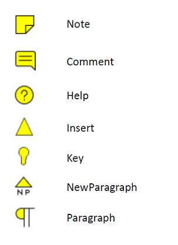
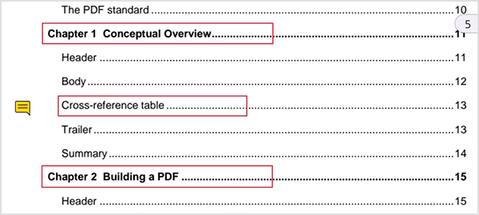

# Sticky Note Annotations in Flutter PDF Viewer Widget (SfPdfViewer)

The sticky note annotation feature of `SfPdfViewer` allows you to add, remove, and modify sticky notes in a PDF document. This feature will help add comments or notes to specific parts of a document to clarify complex concepts, terms, or ideas. This section will cover the various functions available in `SfPdfViewer` for working with sticky note annotations.

## Types of sticky notes

The following sticky note icon types are currently available in `SfPdfViewer`. The icon types can be selected from the [PdfStickyNoteIcon](https://pub.dev/documentation/syncfusion_flutter_pdfviewer/latest/pdfviewer/PdfStickyNoteIcon.html) enumeration.

## Add sticky notes

This section will go through how to add sticky note annotations to a PDF document interactively and programmatically.

### Add sticky notes from annotation mode

You can add sticky note annotations to a PDF document by tapping with a touch (or mouse down) on a PDF page. The following steps explain how to add sticky note annotations to a PDF:

1. Set the [annotationMode](https://pub.dev/documentation/syncfusion_flutter_pdfviewer/latest/pdfviewer/PdfViewerController/annotationMode.html) property of the PdfViewerController to `stickyNote`. This activates the sticky note mode on the control.
2. Tap (or mouse down) on a PDF page, where you want to add the sticky note annotation. This will add a sticky note with a default style and a popup will be displayed to write and submit the text.
4. You can later select and edit the annotations, if required.
5. If you need to disable the [annotationMode](https://pub.dev/documentation/syncfusion_flutter_pdfviewer/latest/pdfviewer/PdfViewerController/annotationMode.html) of `stickyNote`, you need to change the [annotationMode](https://pub.dev/documentation/syncfusion_flutter_pdfviewer/latest/pdfviewer/PdfViewerController/annotationMode.html) to `none`.

The following code explains how to enable the sticky note annotation mode.




void enableStickyNoteAnnotationMode() {
  // Enable the sticky note annotation mode.
  _pdfViewerController.annotationMode = PdfAnnotationMode.stickyNote;
}




Similarly, refer to following code to disable the stickyNote annotation mode.




void disableAnnotationMode() {
  // Disable or deactivate the annotation mode.
  _pdfViewerController.annotationMode = PdfAnnotationMode.none;
}




### Add sticky note annotation programmatically 

You can create and add a sticky note annotation to a PDF document programmatically using the [addAnnotation](https://pub.dev/documentation/syncfusion_flutter_pdfviewer/latest/pdfviewer/PdfViewerController/addAnnotation.html) method of the [PdfViewerController](https://pub.dev/documentation/syncfusion_flutter_pdfviewer/latest/pdfviewer/PdfViewerController-class.html). The following example explains how to create a sticky note with a comment icon and add it to the first page of a PDF document.




void addStickyNoteAnnotation() {
  // Create a sticky note annotation
  final StickyNoteAnnotation stickyNote = StickyNoteAnnotation(
    // Set the page number for the sticky note annotation
    pageNumber: 1,
    // Set the text for the sticky note annotation
    text: 'This is a sticky note annotation',
    // Set the icon for the sticky note annotation
    icon: PdfStickyNoteIcon.comment,
    // Set the position for the sticky note annotation
    position: const Offset(100, 100),
  );

  // Set the color for the sticky note annotation
  stickyNote.color = Colors.yellow;

  // Add the sticky note annotation to the PDF viewer
  _pdfViewerController.addAnnotation(stickyNote);
}




## Sticky note annotation settings 

In the sticky note annotation mode, the annotation will be added with a default appearance. You can modify the annotation after it has been added to the pages. However, if you need to define the appearance before adding sticky note annotations to the document, you can change its default settings using the [PdfViewerController.annotationSettings.stickyNote](https://pub.dev/documentation/syncfusion_flutter_pdfviewer/latest/pdfviewer/PdfAnnotationSettings/stickyNote.html). For that, you need to obtain the default sticky note annotation settings.

The following example explains how to obtain the default sticky note annotation settings and modify some of their properties. Similarly, you can modify all the other properties.




void customizeDefaultStickyNoteSettings() {
  // Obtain the default sticky note annotation settings from the PdfViewerController instance.
  PdfStickyNoteAnnotationSettings stickyNoteSettings =
      _pdfViewerController.annotationSettings.stickyNote;

  // Modify the default properties.
  stickyNoteSettings.icon =
      PdfStickyNoteIcon.comment; // Set the default icon to Comment.
  stickyNoteSettings.color = Colors.yellow; //Stroke color
  stickyNoteSettings.opacity = 0.75; // 75% Opacity
}




## Edit the selected sticky note annotation

### Edit the text using UI interaction

When you double-tap the selected sticky note, the text editor opens. Edit the text and click "Save" to modify the text.

### Edit sticky note properties programmatically

Edit the properties of the selected sticky note annotation programmatically by accessing the selected annotation instance. The selected annotation instance may be obtained from the [onAnnotationSelected](https://pub.dev/documentation/syncfusion_flutter_pdfviewer/latest/pdfviewer/SfPdfViewer/onAnnotationSelected.html) callback. The following example shows how to edit the text and icon of the selected sticky note annotation. Similarly, you can modify the other properties.




void editSelectedStickyNoteAnnotation(Annotation selectedAnnotation) {
  if (selectedAnnotation is StickyNoteAnnotation) {
    // Change the icon of the selected sticky note annotation to Note.
    selectedAnnotation.icon = PdfStickyNoteIcon.note;

    // Change the text of the selected sticky note annotation.
    selectedAnnotation.text = "Changed the comment to note.";
  }
}


