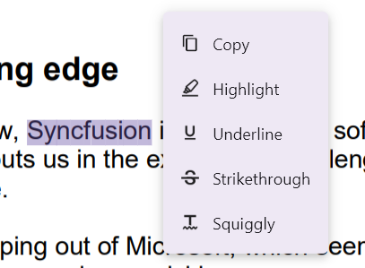

# Text Markup Annotations in Flutter PDF Viewer Widget (SfPdfViewer)

The text markup annotations feature of `SfPdfViewer` allows you to add, remove, and modify text markups in the PDF document. This is useful for making corrections or emphasizing important texts in the document. This section will go through the various types and functions available in the PDF Viewer for working with text markup annotations.

## Types of Text Markups

The following text markup annotation types are now available in the PDF Viewer:
1. Highlight
2. Squiggly
3. Strikethrough
4. Underline

## Add Text Markups

This section will go through how to add text markup annotations to a PDF document interactively and programmatically.

### Add Text Markups from Annotation Mode

You can add text markup annotations to a PDF document by touching (or mouse down) and dragging using the [annotationMode](https://pub.dev/documentation/syncfusion_flutter_pdfviewer/latest/pdfviewer/PdfViewerController/annotationMode.html) property of the PdfViewerController. The following steps explain how to add a text markup annotation on a text in a PDF:

1. Set the [annotationMode](https://pub.dev/documentation/syncfusion_flutter_pdfviewer/latest/pdfviewer/PdfViewerController/annotationMode.html) property of the SfPdfViewer to any text markups (e.g., `highlight`). It activates the highlight annotation mode on the control.
2. Place your finger (or mouse) on the text in the PDF document where you want to start adding the text markup.
3. Drag the finger (or cursor) across the text to select it.
4. Complete adding the text markup to the selected text by releasing the finger (or cursor).
5. Repeat steps 2-4 to add multiple text markups in other areas during the annotation mode.
6. Once you have done this, set the [annotationMode](https://pub.dev/documentation/syncfusion_flutter_pdfviewer/latest/pdfviewer/PdfViewerController/annotationMode.html) to `none`. It will disable annotation mode.
7. You can later select and edit the annotations if required.

The following code explains how to enable the strikethrough annotation mode. Similarly, you can change the annotation mode to add other text markups.




void enableStrikethroughAnnotationMode() {
  // Enable the strikeout annotation mode.
  _pdfViewerController.annotationMode = PdfAnnotationMode.strikethrough;
}




Similarly, refer to the following code to disable the strikethrough annotation mode.




void disableAnnotationMode() {
  // Disable or deactivate the annotation mode.
  _pdfViewerController.annotationMode = PdfAnnotationMode.none;
}




### Add Text Markups from Text Selection

Text markups can be added to a PDF document using text selection without enabling the [annotationMode](https://pub.dev/documentation/syncfusion_flutter_pdfviewer/latest/pdfviewer/PdfViewerController/annotationMode.html). Select the text you want in a PDF document, and a context menu with the text markup options will appear after you complete your selection. You can select any text markup options to add an annotation to a text in the PDF document.

## Text Markup Annotation Settings

Text markup annotations will be added with a default appearance specified in the [PdfViewerController.annotationSettings](https://pub.dev/documentation/syncfusion_flutter_pdfviewer/latest/pdfviewer/PdfViewerController/annotationSettings.html). You can modify the annotation after it has been added to the pages. However, if you want to define the appearance before adding text markup annotations to the document, you can update the default settings using the corresponding annotation settings in [PdfViewerController.annotationSettings](https://pub.dev/documentation/syncfusion_flutter_pdfviewer/latest/pdfviewer/PdfViewerController/annotationSettings.html). 

The following example demonstrates how to customize the default appearance of all text markup annotations.




void customizeDefaultTextMarkupSettings() {
  // Obtain the default annotation settings from the PdfViewerController instance.
  PdfAnnotationSettings annotationSettings =
      _pdfViewerController.annotationSettings;

  // Customize the default settings of Highlight annotations
  annotationSettings.highlight = PdfTextMarkupAnnotationSettings()
    ..color = Colors.green
    ..opacity = 0.5;

  // Customize the default settings of Underline annotations
  annotationSettings.underline = PdfTextMarkupAnnotationSettings()
    ..color = Colors.black
    ..opacity = 0.6;

  // Customize the default settings of Strikethrough annotations
  annotationSettings.strikethrough = PdfTextMarkupAnnotationSettings()
    ..color = Colors.red
    ..opacity = 0.9;

  // Customize the default settings of Squiggly annotations
  annotationSettings.squiggly = PdfTextMarkupAnnotationSettings()
    ..color = Colors.black
    ..opacity = 0.4;
}



