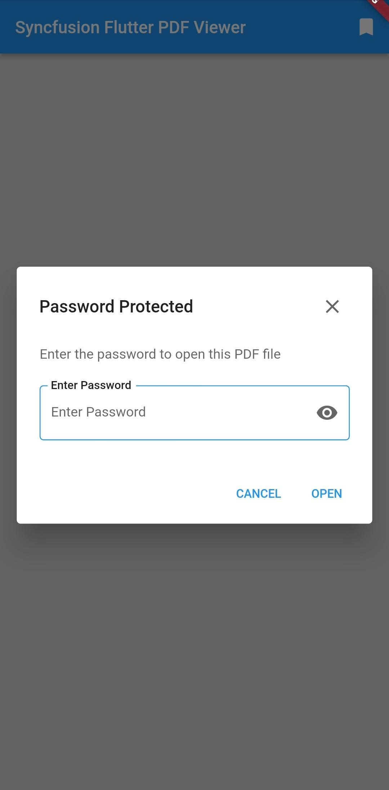
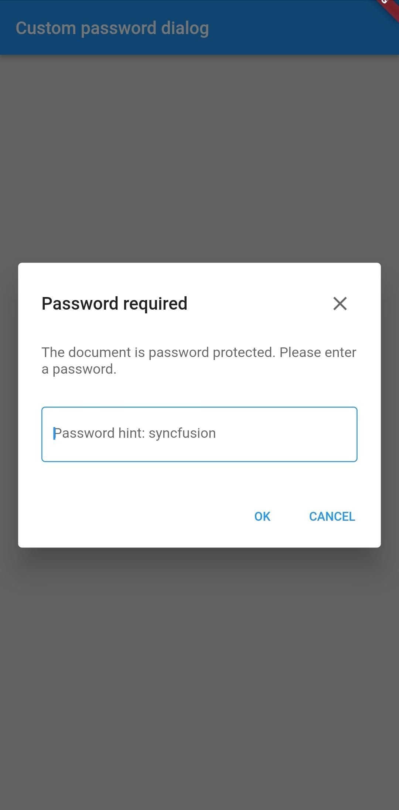

# Viewing password-protected PDF's in Flutter PDF Viewer (SfPdfViewer)

When loading a password-protected document without a password or with an invalid password in [SfPdfViewer](https://pub.dev/documentation/syncfusion_flutter_pdfviewer/latest/pdfviewer/SfPdfViewer-class.html) using the [password](https://pub.dev/documentation/syncfusion_flutter_pdfviewer/latest/pdfviewer/SfPdfViewer/password.html) property. The default password dialogue will be displayed.

## Customize the visibility of password dialogue

The password-protected document can be loaded by providing the password in the [password](https://pub.dev/documentation/syncfusion_flutter_pdfviewer/latest/pdfviewer/SfPdfViewer/password.html) property of SfPdfViewer. The [canShowPasswordDialog](https://pub.dev/documentation/syncfusion_flutter_pdfviewer/latest/pdfviewer/SfPdfViewer/canShowPasswordDialog.html) property allows the user to customize the password dialogue visibility. The following code example explains the same.




@override
Widget build(BuildContext context) {
  return Scaffold(
      body: Container(
          child: SfPdfViewer.asset(
              'assets/encrypted_document.pdf',
            password:'syncfusion',
            canShowPasswordDialog: false,)));
}




## How to create and display a customized password dialog?

The `SfPdfViewer` library, allows you can create and display a customized password dialog.The following code example explains the same.
In this example, We have disabled the built-in password dialog by setting the false to the [canShowPasswordDialog](https://pub.dev/documentation/syncfusion_flutter_pdfviewer/latest/pdfviewer/SfPdfViewer/canShowPasswordDialog.html) property and using the [AlertDialog](https://api.flutter.dev/flutter/material/AlertDialog-class.html) widget to create the customized password dialog. Whenever the `password` is empty or incorrect, the [onDocumentLoadFailed](https://pub.dev/documentation/syncfusion_flutter_pdfviewer/latest/pdfviewer/SfPdfViewer/onDocumentLoadFailed.html) callback is triggered, we have used this callback to display the customized password dialog.




import 'package:flutter/foundation.dart';
import 'package:flutter/material.dart';
import 'package:syncfusion_flutter_pdfviewer/pdfviewer.dart';

void main() {
  runApp(MaterialApp(
    home: CustomPasswordDialog(),
  ));
}

class CustomPasswordDialog extends StatefulWidget {
  @override
  _CustomPasswordDialogState createState() => _CustomPasswordDialogState();
}

class _CustomPasswordDialogState extends State<CustomPasswordDialog> {
  final GlobalKey<SfPdfViewerState> _pdfViewerKey = GlobalKey();
  final TextEditingController _textFieldController = TextEditingController();
  final GlobalKey<FormState> _formKey = GlobalKey<FormState>();
  final FocusNode _passwordDialogFocusNode = FocusNode();
  String? password;
  bool _hasPasswordDialog = false;
  String _errorText = '';

  @override
  Widget build(BuildContext context) {
    return Scaffold(
      appBar: AppBar(
        title: const Text('Custom Password Dialog'),
      ),
      body: SfPdfViewer.network(
        'https://cdn.syncfusion.com/content/PDFViewer/encrypted.pdf',
        key: _pdfViewerKey,
        canShowPasswordDialog: false,
        password: password,
        onDocumentLoaded: (PdfDocumentLoadedDetails details) {
          if (_hasPasswordDialog) {
            Navigator.pop(context);
            _hasPasswordDialog = false;
            _passwordDialogFocusNode.unfocus();
            _textFieldController.clear();
          }
        },
        onDocumentLoadFailed: (PdfDocumentLoadFailedDetails details) {
          if (details.description.contains('password')) {
            if (details.description.contains('password') &&
                _hasPasswordDialog) {
              _errorText = 'Invalid password !!';
              _formKey.currentState?.validate();
              _textFieldController.clear();
              _passwordDialogFocusNode.requestFocus();
            } else {
              _errorText = '';
              _showPasswordDialog();
              _passwordDialogFocusNode.requestFocus();
              _hasPasswordDialog = true;
            }
          }
        },
      ),
    );
  }

  /// Show the customized password dialog box
  Future<void> _showPasswordDialog() async {
    return showDialog<void>(
      context: context,
      builder: (BuildContext context) {
        final Orientation orientation =
            kIsWeb ? Orientation.portrait : MediaQuery.of(context).orientation;
        return AlertDialog(
          scrollable: true,
          insetPadding: EdgeInsets.zero,
          contentPadding: orientation == Orientation.portrait
              ? const EdgeInsets.all(24)
              : const EdgeInsets.only(top: 0, right: 24, left: 24, bottom: 0),
          buttonPadding: orientation == Orientation.portrait
              ? const EdgeInsets.all(8)
              : const EdgeInsets.all(4),
          backgroundColor: Colors.white,
          title: Row(
            mainAxisAlignment: MainAxisAlignment.spaceBetween,
            children: <Widget>[
              Text(
                'Password required',
                style: TextStyle(
                  fontFamily: 'Roboto',
                  fontSize: 20,
                  fontWeight: FontWeight.w500,
                  color:
                      Theme.of(context).colorScheme.onSurface.withOpacity(0.87),
                ),
              ),
              SizedBox(
                height: 36,
                width: 36,
                child: RawMaterialButton(
                  onPressed: () {
                    _closePasswordDialog();
                  },
                  child: Icon(
                    Icons.clear,
                    color: Theme.of(context)
                        .colorScheme
                        .onSurface
                        .withOpacity(0.6),
                    size: 24,
                  ),
                ),
              ),
            ],
          ),
          shape: const RoundedRectangleBorder(
              borderRadius: BorderRadius.all(Radius.circular(4.0))),
          content: StatefulBuilder(
              builder: (BuildContext context, StateSetter setState) {
            return SingleChildScrollView(
              child: SizedBox(
                width: 328,
                child: Column(
                  children: <Widget>[
                    Align(
                      alignment: Alignment.centerLeft,
                      child: Padding(
                        padding: const EdgeInsets.fromLTRB(0, 0, 0, 30),
                        child: Text(
                          'The document is password protected.Please enter a password',
                          style: TextStyle(
                            fontFamily: 'Roboto',
                            fontSize: 16,
                            fontWeight: FontWeight.w400,
                            color: Theme.of(context)
                                .colorScheme
                                .onSurface
                                .withOpacity(0.6),
                          ),
                        ),
                      ),
                    ),
                    Form(
                      key: _formKey,
                      child: TextFormField(
                        obscuringCharacter: '#',
                        obscureText: true,
                        decoration: InputDecoration(
                          border: OutlineInputBorder(
                              borderSide: BorderSide(
                            color: Theme.of(context)
                                .colorScheme
                                .onSurface
                                .withOpacity(0.12),
                          )),
                          hintText: 'Password: syncfusion',
                          hintStyle: TextStyle(
                            fontFamily: 'Roboto',
                            fontSize: 16,
                            fontWeight: FontWeight.w400,
                            color: Theme.of(context)
                                .colorScheme
                                .onSurface
                                .withOpacity(0.6),
                          ),
                          errorStyle: TextStyle(
                            fontFamily: 'Roboto',
                            fontSize: 14,
                            fontWeight: FontWeight.w500,
                            color: Theme.of(context).colorScheme.error,
                          ),
                        ),
                        enableInteractiveSelection: false,
                        controller: _textFieldController,
                        autofocus: true,
                        focusNode: _passwordDialogFocusNode,
                        onFieldSubmitted: (String value) {
                          _handlePasswordValidation(value);
                        },
                        validator: (String? value) {
                          if (_errorText.isNotEmpty) {
                            return _errorText;
                          }
                          return null;
                        },
                        onChanged: (String value) {
                          _formKey.currentState?.validate();
                          _errorText = '';
                        },
                      ),
                    ),
                  ],
                ),
              ),
            );
          }),
          actions: <Widget>[
            TextButton(
              onPressed: () {
                _closePasswordDialog();
              },
              child: Text(
                'CANCEL',
                style: TextStyle(
                  fontFamily: 'Roboto',
                  fontSize: 14,
                  fontWeight: FontWeight.w500,
                  color: Theme.of(context).colorScheme.primary,
                ),
              ),
            ),
            Padding(
              padding: const EdgeInsets.fromLTRB(0, 0, 8, 0),
              child: TextButton(
                onPressed: () {
                  _handlePasswordValidation(_textFieldController.text);
                },
                child: Text(
                  'OPEN',
                  style: TextStyle(
                    fontFamily: 'Roboto',
                    fontSize: 14,
                    fontWeight: FontWeight.w500,
                    color: Theme.of(context).colorScheme.primary,
                  ),
                ),
              ),
            )
          ],
        );
      },
    );
  }

  ///Close the password dialog
  void _closePasswordDialog() {
    Navigator.pop(context, 'Cancel');
    _hasPasswordDialog = false;
    _passwordDialogFocusNode.unfocus();
    _textFieldController.clear();
  }

  /// Validates the password entered in text field.
  void _handlePasswordValidation(String value) {
    setState(() {
      password = value;
      _passwordDialogFocusNode.requestFocus();
    });
  }
}




