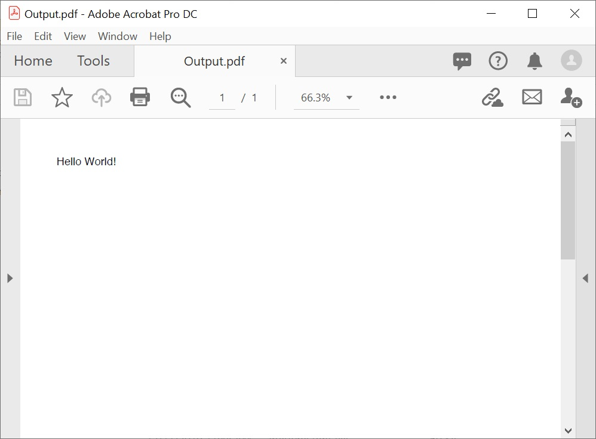
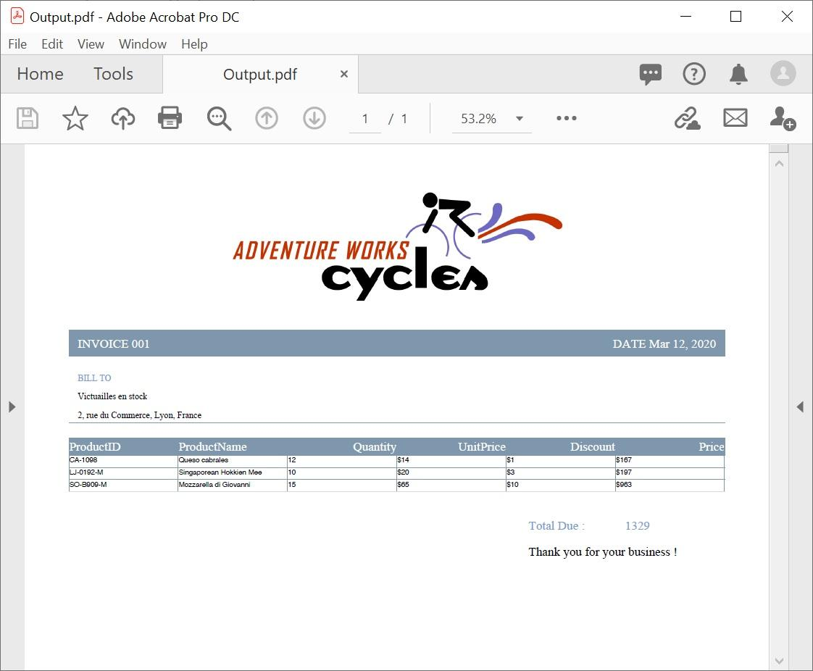

# Getting started with Flutter PDF

This section explains the steps required to create a [Flutter PDF library](https://www.syncfusion.com/document-processing/pdf-framework/flutter/pdf-library) document by a single button click. This section covers only the minimal features needed to learn to get started with the PDF.

Check the following video to quickly get started with creating a Flutter PDF document using the PDF Library.


## Steps to create PDF document in Flutter application

Create a simple project using the instructions given in the [`Getting Started with your first Flutter app'](https://docs.flutter.dev/get-started/test-drive?tab=vscode#create-app) documentation.

**Add dependency**

Add the Syncfusion&reg;
  Flutter PDF dependency to your pub spec file.



dependencies:
  syncfusion_flutter_pdf: ^xx.x.xx



N> Here **xx.x.xx** denotes the current version of [`Syncfusion Flutter PDF`](https://pub.dev/packages/syncfusion_flutter_pdf/versions) package.

**Get packages**

Run the following command to get the required packages.



$ flutter pub get



**Import package**

Import the following package in your Dart code.



import 'package:syncfusion_flutter_pdf/pdf.dart';



Add a new button widget as a child of your container widget.



@override
Widget build(BuildContext context) {
  return Scaffold(
	body: Center(
	  child: TextButton(
		onPressed: _createPDF,
		  child: Text('Create PDF')
		)
	 )
  );
}



Include the following code snippet in the button click event to create a PDF file.



Future<void> _createPDF() async {
  //Create a new PDF document
  PdfDocument document = PdfDocument();

  //Add a new page and draw text
  document.pages.add().graphics.drawString(
      'Hello World!', PdfStandardFont(PdfFontFamily.helvetica, 20),
      brush: PdfSolidBrush(PdfColor(0, 0, 0)),
      bounds: Rect.fromLTWH(0, 0, 500, 50));

  //Save the document
  List<int> bytes = await document.save();

  //Dispose the document
  document.dispose();
}



## Save and open a PDF document in mobile

You can save and open a PDF document in mobile by using the following steps:

**Add dependency**

Add the following packages to your pub spec file.



path_provider: ^2.0.7
open_file: ^3.2.1



**Import package**



import 'dart:io';
import 'package:open_file/open_file.dart';
import 'package:path_provider/path_provider.dart';



Include the following code snippet in _createPDF method to open the PDF document in mobile after saving it.



//Get external storage directory
final directory = await getApplicationSupportDirectory();

//Get directory path
final path = directory.path;

//Create an empty file to write PDF data
File file = File('$path/Output.pdf');

//Write PDF data
await file.writeAsBytes(bytes, flush: true);

//Open the PDF document in mobile
OpenFile.open('$path/Output.pdf');



## Save and download a PDF document in web

You can save and download a PDF document in web by using the following steps.

**Import package**



import 'dart:async';
import 'dart:convert';
import 'dart:js' as js;



Include the following code snippet in _createPDF method to open the document in web after saving it.



js.context['pdfData'] = base64.encode(bytes);
js.context['filename'] = 'Output.pdf';
Timer.run(() {
  js.context.callMethod('download');
});



Add the following code in the header section of index.html file under the web folder.





## Save and download a PDF document in WASM

step 1:	Add the [web](https://pub.dev/packages/web) package as a dependency in your **pubspec.yaml** file.

step 2:	Create a new Dart file called **save_file_wasm.dart**.

step 3:	Add the following code:

**Import package**



import 'dart:convert';
import 'package:web/web.dart' as web;



To enable file saving and launching for download in a web environment, include the following code snippet within the **saveAndLaunchFile** method.



// Function to save and launch a file for download in a web environment
Future<void> saveAndLaunchFile(List<int> bytes, String fileName) async {
  final web.HTMLAnchorElement anchor =
      web.document.createElement('a') as web.HTMLAnchorElement
        ..href = "data:application/octet-stream;base64,${base64Encode(bytes)}"
        ..style.display = 'none'
        ..download = fileName;

// Insert the new element into the DOM
web.document.body!.appendChild(anchor);

// Initiate the download
anchor.click();
// Clean up the DOM by removing the anchor element
web.document.body!.removeChild(anchor);
}



By executing the above code sample, you will get the PDF document as follows.

## Creating a PDF document with image

The following code example shows how to create a PDF document with an image.



//Creates a new PDF document
PdfDocument document = PdfDocument();

//Draw the image
document.pages.add().graphics.drawImage(
    PdfBitmap(File('image.jpg').readAsBytesSync()),
   Rect.fromLTWH(0, 0, 100, 100));

//Saves the document
File('Output.pdf').writeAsBytes(await document.save());

//Dispose the document
document.dispose();



## Creating a PDF document with table



//Creates a new PDF document
PdfDocument document = PdfDocument();

//Create a PdfGrid
PdfGrid grid = PdfGrid();

//Add the columns to the grid
grid.columns.add(count: 3);

//Add header to the grid
grid.headers.add(1);

//Add the rows to the grid
PdfGridRow header = grid.headers[0];
header.cells[0].value = 'RollNo';
header.cells[1].value = 'Name';
header.cells[2].value = 'Class';

//Add rows to grid
PdfGridRow row = grid.rows.add();
row.cells[0].value = '1';
row.cells[1].value = 'Arya';
row.cells[2].value = '6';
row = grid.rows.add();
row.cells[0].value = '12';
row.cells[1].value = 'John';
row.cells[2].value = '9';
row = grid.rows.add();
row.cells[0].value = '42';
row.cells[1].value = 'Tony';
row.cells[2].value = '8';

//Draw grid to the page of the PDF document
grid.draw(
    page: document.pages.add(), bounds: Rect.fromLTWH(0, 0, 0, 0));

//Saves the document
File('Output.pdf').writeAsBytes(await document.save());

//Dispose the document
document.dispose();



## Creating a simple PDF document with basic elements

The [`PdfDocument`](https://pub.dev/documentation/syncfusion_flutter_pdf/latest/pdf/PdfDocument-class.html) object represents an entire PDF document that is being created. The following code example shows how to create a PDF document and add a [`PdfPage`](https://pub.dev/documentation/syncfusion_flutter_pdf/latest/pdf/PdfPage-class.html) to it along with the [`PdfPageSettings`](https://pub.dev/documentation/syncfusion_flutter_pdf/latest/pdf/PdfPageSettings-class.html).



//Creates a new PDF document
PdfDocument document = PdfDocument();

//Adds page settings
document.pageSettings.orientation = PdfPageOrientation.landscape;
document.pageSettings.margins.all = 50;

//Adds a page to the document
PdfPage page = document.pages.add();
PdfGraphics graphics = page.graphics;



* All the units are measured in point instead of pixel.
* In PDF, all the elements are placed in absolute positions and has the possibility for content overlapping if misplaced.
* Syncfusion&reg;
  PDF provides the rendered bounds for each and every element added through [`PdfLayoutResult`](https://pub.dev/documentation/syncfusion_flutter_pdf/latest/pdf/PdfLayoutResult-class.html) objects. This can be used to add successive elements and prevent content overlap.

The following code example explains how to add an image from base64 string to a PDF document, by providing the rectangle coordinates.



//Loads the image from base64 string
PdfImage image = PdfBitmap.fromBase64String(
    '/9j/4AAQSkZJRgABAQAAAQABAAD/4gIoSUNDX1BST0ZJTEUAAQEAAAIYAAAAAAQwAABtbnRyUkdCIFhZWiAAAAAAAAAAAAAAAABhY3NwAAAAAAAAAAAAAAAAAAAAAAAAAAAAAAAAAAAAAQAA9tYAAQAAAADTLQAAAAAAAAAAAAAAAAAAAAAAAAAAAAAAAAAAAAAAAAAAAAAAAAAAAAAAAAAAAAAAAAAAAAlkZXNjAAAA8AAAAHRyWFlaAAABZAAAABRnWFlaAAABeAAAABRiWFlaAAABjAAAABRyVFJDAAABoAAAAChnVFJDAAABoAAAAChiVFJDAAABoAAAACh3dHB0AAAByAAAABRjcHJ0AAAB3AAAADxtbHVjAAAAAAAAAAEAAAAMZW5VUwAAAFgAAAAcAHMAUgBHAEIAAAAAAAAAAAAAAAAAAAAAAAAAAAAAAAAAAAAAAAAAAAAAAAAAAAAAAAAAAAAAAAAAAAAAAAAAAAAAAAAAAAAAAAAAAAAAAAAAAAAAAAAAAFhZWiAAAAAAAABvogAAOPUAAAOQWFlaIAAAAAAAAGKZAAC3hQAAGNpYWVogAAAAAAAAJKAAAA+EAAC2z3BhcmEAAAAAAAQAAAACZmYAAPKnAAANWQAAE9AAAApbAAAAAAAAAABYWVogAAAAAAAA9tYAAQAAAADTLW1sdWMAAAAAAAAAAQAAAAxlblVTAAAAIAAAABwARwBvAG8AZwBsAGUAIABJAG4AYwAuACAAMgAwADEANv/bAEMA///////////////////////////////////////////////////////////////////////////////////////bAEMB///////////////////////////////////////////////////////////////////////////////////////AABEIASkDmQMBIgACEQEDEQH/xAAYAAEBAQEBAAAAAAAAAAAAAAAAAgEDBP/EACoQAQEAAgEEAwACAwACAwEAAAABAhExEiFBUWFxkTKBE6GxIuFCwdHw/8QAFgEBAQEAAAAAAAAAAAAAAAAAAAEC/8QAGhEBAQEBAQEBAAAAAAAAAAAAABEBQTEhUf/aAAwDAQACEQMRAD8A6AAAAAAAAAAAAAAAAAAAAAAAAAAAAAAAAAAAAAAAAAAAAAAAAAAAAAAAAAAAAAAAAAAAm5SfYKHLrvqNmfufgOgyWXhoAAAAAAAAAAAAAAAAAAAAAAAAAAAAAAAAAAAAAAAAAAAAAAAAAAAAAAAAAAAAAAAAAAAAAAAAAAAAAAAAAAAAAAAAAAAAAAAAAAAAAAAAAAAAAAJyup8uK8+Z9IAABWN1f+uzzususNgsc/8AJ8f7b1z1QWI658t68fYKE9WPtu57gNGbntoAAAAAAAAAAAAAAAAAAAAAAAAAAAAAAAAAAAAAAAAAAAAAAAAAAAAAAAAAAAAAAAAAAAAAAAAAAAAAAAAAAAAAAAAAAAAAAAAAAAAAAOec4rm72bmnGyzkGAAOtmsPz/rMcfNVn/G/1/0HEAAAAAAAG7vu/rZlZ5/UgO8u5tqMOFgAAAAAAM3EW7Fg6CJe60AAAAAAAAAAAAAAAAAAAAAAAAAAAAAAAAAAAAAAAAAAAAAAAAAAAAAAAAAAAAAAAAAAAAAAAAAAAAAAAAAAAAAAAAAAE9OPo1jj3U5Z3d14gL68TLvj2+HF1w4/sEdOXo6cvTsA49OXo6MvTsy2TkHLpy//AKxKssrfpIANkt4Bjpjh5v4qYyfftQAAAAAADLxWsvAIAUHRznLoaACAAAAAAAAAAAAAAAAAAAAAAAAAAAAAAAAAAAAAAAAAAAAAAAAAAAAAAAAAAAAAAAAAAAAAAAAAAAAAAAAAAAAAAAACcrqf8cVZXd+IkB3k1NIwnn8dAAAHHK7t+HZzzx8z+wcwAdJh7/HThGOW+15/6230DbZGdV8Ex9qBGrW9PyoBPT8mqoAAATlwpFu6DAFFY+1E7CAAAMtkRcqLF70zqiBKRXVWbvtgLDd903QA3fdbu+2AK6q3qiAI6bla5NlsKkdBMyn0pUAAAAAAAAAAAAAAAAAAAAAAAAAAAAAAAAAAAAAAAAAAAAAAAAAAAAAAAAAAAAAAAAAAAAAT1QFJyup806nK3dBjZN3TF4aneg6SammgAAAADnlj5n45vQ554zmcg5umNnnn25gPQOeOXi/roAAAAACbfQFvhIKCpPLJPawBlykRbaixdsiLlaxsxqL8xguYxRErn01vTVhCo6flvTFCpWdMOmNAT0xnT8rBa56sY6sslSFcxtxv2wUbLYwB0l21zxvd0VnQAAAAAAAAAAAAAAAAAAAAAAAAAAAAAAAAAAAAAAAAAAAAAAAAAAAAAAAAAAAAAAABNy9M3aqTQJ1byrUaAjO6mvbkrP8AkkGybunbpicJqb9rBGrOGzL2plmwaIl12qwAAEc1V4ZiDMsd95y5PQnLHf2DivHLXa8f8TZrlgPQOOOWvp2l3wAy2QvCAbbthq1XT7UTrapPZ1ScJttSrFXKRNtrJLVzH2h8xCpj7WEKySRrNxPUqLHPdFg6DmEHQRutmXtBQAAAAADLJWgOdljHVmp6SLU4zvtYKgAAAAAAAAAAAAAAAAAAAAAAAAAAAAAAAAAAAAAAAAAAAAAAAAAAAAAAAAAAAAAAi3d0q8MxgNk00AAATcZWTCebtYAAAADLNpl12q05TyChku40E5cNnEZl4bOIDQAZcZXGyzl3ZZLyDgvC99e2XC/a8cdd7yCr3NSF7Rz3sq5i7l6Rba2Y2rkkQ+YiS1Uxn2pm5FhWibl6SRFXL0ndo3pqjBeo0o56vpvTVhRGqx0CjmKs9JAl06cubcQWAgAAAAAAAAAAAAAAA529wdBmPDQBGV7s7/KLHQc92OkUgIyvdU4EaIyvhWPANEZVnf5RY6CJvflaoDnu7dABz3bXQAc+/wAs7/KVY6iJvflWXCo0RirLgGiMeVXgGjn3+Tv8pVjoIx3tdVAc+/yd/lKsdBmPHdqoAjK8AsTjwm3uLHQZxETdvIjoDnu0WOg59/klu53SkdAc7btUdBz/APL5N32lWOgOdt2qOgy3URN280WOgOe7RI6Dn3+Sb2lWOgCoAAAAAAAAAAidrpaLysE5NnELwzEFAAAAAAyzcJJGgM3GdTNU6aobrFdMVoEaremKEAAAAAAAABNm1AI1VSaaAAAAAAAAAAAAAAAAAzK6jm296ZevhGsXOI1k4n0Xiqyi966OePK7wmLqL3ro5zl0MNc8uVztP6RlzVZXtIH4md66Jxnlt4U1F710covq+ENUzLhqMvCpiXTfb+nNVv8A4xGtZjy6JxUuJqcuGY+TLlWPCdONRktzvJpiseGZeFThF5DPVY8GXDZwnLkOmLcuCWSfabdh1uPluXDZwnI4dMVol0qXYa0BUEZcrc8uU1cVxihV8Rk5FVlfBjPKb3roJxOXDMTJuPB043LhOPJl4bjwdONvCJyrLhmPbdDPFXhGPLbdxuIcVeHOcqy4QGNt3VyajMZ5UGsy4Tjyqzcc+KGeLy4ZjFS7aoAzLi/VENz3P03Pc/XAB33Pc/TcvmfrgrD+X6DsAAAAACcvDZwzLw2cQGo4q05QFDJWgAAAAAAAAAAAAAAAAAAAAAAAAAAAAAAAAAAAAAAMt1GoyvfQYYzyzLk1WI06py4UjLlUz0x8ty4bOE5cpw6Y+Vsx4aqa53n+y96y81WM8o0tOXCkZcqmGM2rpjMeFBo55cujnO9TTG5TtEry4QLjpOI0ZeFZRe9dHPHl0TF0rnO9VlwzEM8W5zvVZcMx5DPFud71d4ROTTDLx9KkmmZeG48HTinO96u8InJpiumNkkaKgAA53n+3RyTVxU73afK52iBVYzutkmo2qmud710jnO9dEw1zy5XOETvXQw1GXJ/8Z9sveqy4D8ZjJVox5WuGoy5T6be9blxEX8bjwpGPlas6JynlM71d4RfES6ro5zl0MNGZcX6rWZcX6qo4AAKw/l+pVh/L9B2AAAAABGXK0TvVgAAizXeKl21Nmu8BQmZe1AAAAAAAAAAAAAAAAAAAAAAAAAAAAAAAAAAAAAVzku+7oAOervjy6ADnd74roA59/lsxvlYkWgCo56vpc7NBaOd3viugI59/lWO/O1AtZeE4zusEZeE4zusCicuFAJxigBOW+ye/y6Atc+/yrGaigKnLgxigRORj5UAnLhPf5dAWuff5dAEAAK5yV0Bay8VEnd0AozLhoI59/k7/AC6CRajGeVXhoqOcndd4rQKjHe10Ac5LteXDQWox3tV4aCOff5O/y6CRanGeVAqDMuL9VrMuL9UHAABWH8v1KsP5foOwAAAAAAAAAAAMslTqxYDJvy0AAAAAAAAAAAAAAAAAAAAAAAAAAAAAAAAAAAAAAAAAAAAAAAAAAAAAAAAAAAAAAAAAAABFzk471Fyt8/gOzNz3P1wAegedUys8g7DnM/a974BojrnqnXPVBYjrnqnXPVBYyZStAAAGW6m09c9UFiOueqqXfcGjLZOXO53x2B1Zue442281gO+57jXnbuzyDuOUzvnuuZSgpmXF+q1mXF+qDgAArD+X6lWH8v0HYAAZbJyi5+v0HRm57jjbbzWA77nufrXnN2A9A5TOz5XM5fgFAAAADjllu9uIY5WfMB2GS74aAAAAAAAAAAAAAAAAAAAAAAAAAAAAAAAAAAAAAAAAAAAAAAAAAAAAAAAAAAAAAAA55ZeJ/a8rqWuAAADZLeIrHHfe8OoOHTfVY9DLJeYDg2WzhVw9fiscdd7z/wABmUut+fLm9DjlNX/gJABsurt3nfu868MtdrwDqCM8tdvYIyu78RIA2Td07WzGMxmp81Gd3degTbb3rAACTd07TGT79g5dN9U1ZzHcB5x2uEvwjou9f7BuFv8AS8uL9Uk12hlxfqg4AAKw/l+pVh/L9B2Zbqba553voEW21gAA6Y9PNs3/AMBGrfFNWeK7gPOO1xlc7hd//YNwt3rw6sk1NNATldT5qnDK7oMABstjtLK4EuuAegTjlv7UAAAAAAAAAAAAAAAAAAAAAAAAAAAAAAAAAAAAAAAAAAAAAAAAAAAAAAAAAAAACM+P7cnbObn13cQAAd5xPpqcbufSgAAAZLLwDU5Tc/4oB5x0znn9cwAAdZl278z/AG5W7uwAXhN9/SZN3TtJqaBrheb913ccpq39BIALw5/p1ccbquwAAAMuUgNZlxfqtZlxfqg4AAKw/l+pVh/L9B2ccv5V2cs53+wQAAC5hvvsEN3fddOie63oxBEyu538urOmTwWycg0C9u4Izupr25Nt3dsAFTG2b/0kAAB1xy32vLk2XV2DuAAAAAAAAAAAAAAAAAAAAAAAAAAAAAAAAAAAAAAAAAAAAAAAAAAAAAAAAAAAA4ZTVd2WSwHAbcbP/wBYDZbOFzP3HMB268ff+qy5zw5ANuVvJLq7YuYe/wAB0l3NtOABwymq7pym58+AcQAAXhN3fiArGam/NWACM5ub9LAecdMsPM/HMBUzs+YkB1659N68XEBdzvjsgbMbeAXhl4v9Ly4v1WY4yfbbxfqg4DdX1fymr6v5QYrD+X6zV9X8qsZd8X8B1TlNz5igHnHXLHfecuXACplZ9JAdeufTevFxAdLn6cxslvALwy8X+jO+P1upjN3vXLkBuM3dMdsJqfNBScsZftTLdTYONmu1Y23d2wAFYzd+PIOs4n00AAAAAAAAAAAAAAAAAAAAAAAAAAAAAAAAAAAAAAAAAAAAAAAAAAAAAAAAAAAAAE3CX4+lAOf+P5Z0X3HUBz6Plswn2sBkknEaAAAAJyup80HPLW7pIA2Td07Samk4TU35qwAAAAGWS8xoCLhPFZ0X26AOXRfcb/j+XQBMxk/9qAAAAAAAAABlkvLQEXCeOzP8fy6AOXRfcb/j+XQBMwk+ftQAnLHq86T/AI/n/X/t0Ac5h35/06AAyzc00Bz6L7Z0X3HUBzmHurkk4aAAAAAAAAAAAAAAAAAAAAAAAAAAAAAAAAAAAAAAAAAAAAAAAAAAAAAAAAAAAAAAAAAAAAAAAAAcOFu7ted8frmArGbvxEybd5NTQNAAAAAAAAAAAAAAAAAAAAAAAAAAAAAAAAAAAAAAAAAAAAAAAAAAAAAAAAAAAAAAAAAAAAAAAAAAAAAAAAAAAAAAAAAAAAAAAAAAAAAAAAAAAAAAAAAAAAAAAAAAAAAAAAAAAAAAAAAAAAAAAAAAAAAAAAAAAAAAAAAAAAAAAAAAAAAAAAAAAAAAAB//2Q==');
	
//Draws the image to the PDF page
page.graphics.drawImage(image, Rect.fromLTWH(176, 0, 390, 130));



The following methods can be used to add text to a PDF document.

* [`drawString`](https://pub.dev/documentation/syncfusion_flutter_pdf/latest/pdf/PdfGraphics/drawString.html) method of the [`PdfGraphics`](https://pub.dev/documentation/syncfusion_flutter_pdf/latest/pdf/PdfGraphics-class.html)
* [`PdfTextElement`](https://pub.dev/documentation/syncfusion_flutter_pdf/latest/pdf/PdfTextElement-class.html) class.

The [`PdfTextElement`](https://pub.dev/documentation/syncfusion_flutter_pdf/latest/pdf/PdfTextElement-class.html) provides the layout result of the added text by using the location of the next element that decides to prevent content overlapping. This is not available in the [`drawString`](https://pub.dev/documentation/syncfusion_flutter_pdf/latest/pdf/PdfGraphics/drawString.html) method.

The following code example adds the necessary text such as address, invoice number and date to create a basic invoice application.



PdfBrush solidBrush = PdfSolidBrush(PdfColor(126, 151, 173));
Rect bounds = Rect.fromLTWH(0, 160, graphics.clientSize.width, 30);

//Draws a rectangle to place the heading in that region
graphics.drawRectangle(brush: solidBrush, bounds: bounds);

//Creates a font for adding the heading in the page
PdfFont subHeadingFont = PdfStandardFont(PdfFontFamily.timesRoman, 14);

//Creates a text element to add the invoice number
PdfTextElement element =
    PdfTextElement(text: 'INVOICE 001', font: subHeadingFont);
element.brush = PdfBrushes.white;

//Draws the heading on the page
PdfLayoutResult result = element.draw(
    page: page, bounds: Rect.fromLTWH(10, bounds.top + 8, 0, 0))!;

//Use 'intl' package for date format.
String currentDate = 'DATE ' + DateFormat.yMMMd().format(DateTime.now());

//Measures the width of the text to place it in the correct location
Size textSize = subHeadingFont.measureString(currentDate);
Offset textPosition = Offset(
    graphics.clientSize.width - textSize.width - 10, result.bounds.top);

//Draws the date by using drawString method
graphics.drawString(currentDate, subHeadingFont,
    brush: element.brush,
    bounds: Offset(graphics.clientSize.width - textSize.width - 10,
            result.bounds.top) &
        Size(textSize.width + 2, 20));

//Creates text elements to add the address and draw it to the page
element = PdfTextElement(
    text: 'BILL TO ',
    font: PdfStandardFont(PdfFontFamily.timesRoman, 10,
        style: PdfFontStyle.bold));
element.brush = PdfSolidBrush(PdfColor(126, 155, 203));
result = element.draw(
    page: page, bounds: Rect.fromLTWH(10, result.bounds.bottom + 25, 0, 0))!;

PdfFont timesRoman = PdfStandardFont(PdfFontFamily.timesRoman, 10);

element = PdfTextElement(text: 'Victuailles en stock ', font: timesRoman);
element.brush = PdfBrushes.black;
result = element.draw(
    page: page, bounds: Rect.fromLTWH(10, result.bounds.bottom + 10, 0, 0))!;

element = PdfTextElement(
    text: '2, rue du Commerce, Lyon, France ', font: timesRoman);
element.brush = PdfBrushes.black;
result = element.draw(
    page: page, bounds: Rect.fromLTWH(10, result.bounds.bottom + 10, 0, 0))!;

//Draws a line at the bottom of the address
graphics.drawLine(
    PdfPen(PdfColor(126, 151, 173), width: 0.7),
    Offset(0, result.bounds.bottom + 3),
    Offset(graphics.clientSize.width, result.bounds.bottom + 3));



Since the invoice document requires only simple cell customizations, the given code example explains how to create a simple invoice table by using [`PdfGrid`](https://pub.dev/documentation/syncfusion_flutter_pdf/latest/pdf/PdfGrid-class.html).



//Creates a PDF grid
PdfGrid grid = PdfGrid();

//Add the columns to the grid
grid.columns.add(count: 5);

//Add header to the grid
grid.headers.add(1);

//Set values to the header cells
PdfGridRow header = grid.headers[0];
header.cells[0].value = 'Product Id';
header.cells[1].value = 'Product Name';
header.cells[2].value = 'Price';
header.cells[3].value = 'Quantity';
header.cells[4].value = 'Total';

//Creates the header style
PdfGridCellStyle headerStyle = PdfGridCellStyle();
headerStyle.borders.all = PdfPen(PdfColor(126, 151, 173));
headerStyle.backgroundBrush = PdfSolidBrush(PdfColor(126, 151, 173));
headerStyle.textBrush = PdfBrushes.white;
headerStyle.font = PdfStandardFont(PdfFontFamily.timesRoman, 14,
    style: PdfFontStyle.regular);

//Adds cell customizations
for (int i = 0; i < header.cells.count; i++) {
  if (i == 0 || i == 1) {
    header.cells[i].stringFormat = PdfStringFormat(
        alignment: PdfTextAlignment.left,
        lineAlignment: PdfVerticalAlignment.middle);
  } else {
    header.cells[i].stringFormat = PdfStringFormat(
        alignment: PdfTextAlignment.right,
        lineAlignment: PdfVerticalAlignment.middle);
  }
  header.cells[i].style = headerStyle;
}

//Add rows to grid
PdfGridRow row = grid.rows.add();
row.cells[0].value = 'CA-1098';
row.cells[1].value = 'AWC Logo Cap';
row.cells[2].value = '\$8.99';
row.cells[3].value = '2';
row.cells[4].value = '\$17.98';
row = grid.rows.add();
row.cells[0].value = 'LJ-0192';
row.cells[1].value = 'Long-Sleeve Logo Jersey,M';
row.cells[2].value = '\$49.99';
row.cells[3].value = '3';
row.cells[4].value = '\$149.97';
row = grid.rows.add();
row.cells[0].value = 'So-B909-M';
row.cells[1].value = 'Mountain Bike Socks,M';
row.cells[2].value = '\$9.5';
row.cells[3].value = '2';
row.cells[4].value = '\$19';
row = grid.rows.add();
row.cells[0].value = 'LJ-0192';
row.cells[1].value = 'Long-Sleeve Logo Jersey,M';
row.cells[2].value = '\$49.99';
row.cells[3].value = '4';
row.cells[4].value = '\$199.96';

//Set padding for grid cells
grid.style.cellPadding = PdfPaddings(left: 2, right: 2, top: 2, bottom: 2);

//Creates the grid cell styles
PdfGridCellStyle cellStyle = PdfGridCellStyle();
cellStyle.borders.all = PdfPens.white;
cellStyle.borders.bottom = PdfPen(PdfColor(217, 217, 217), width: 0.70);
cellStyle.font = PdfStandardFont(PdfFontFamily.timesRoman, 12);
cellStyle.textBrush = PdfSolidBrush(PdfColor(131, 130, 136));
//Adds cell customizations
for (int i = 0; i < grid.rows.count; i++) {
  PdfGridRow row = grid.rows[i];
  for (int j = 0; j < row.cells.count; j++) {
    row.cells[j].style = cellStyle;
    if (j == 0 || j == 1) {
      row.cells[j].stringFormat = PdfStringFormat(
          alignment: PdfTextAlignment.left,
          lineAlignment: PdfVerticalAlignment.middle);
    } else {
      row.cells[j].stringFormat = PdfStringFormat(
          alignment: PdfTextAlignment.right,
          lineAlignment: PdfVerticalAlignment.middle);
    }
  }
}

//Creates layout format settings to allow the table pagination
PdfLayoutFormat layoutFormat =
    PdfLayoutFormat(layoutType: PdfLayoutType.paginate);

//Draws the grid to the PDF page
PdfLayoutResult gridResult = grid.draw(
    page: page,
    bounds: Rect.fromLTWH(0, result.bounds.bottom + 20,
        graphics.clientSize.width, graphics.clientSize.height - 100),
    format: layoutFormat)!;

gridResult.page.graphics.drawString(
    'Grand Total :                             \$386.91', subHeadingFont,
    brush: PdfSolidBrush(PdfColor(126, 155, 203)),
    bounds: Rect.fromLTWH(520, gridResult.bounds.bottom + 30, 0, 0));

gridResult.page.graphics.drawString(
    'Thank you for your business !', subHeadingFont,
    brush: PdfBrushes.black,
    bounds: Rect.fromLTWH(520, gridResult.bounds.bottom + 60, 0, 0));



The following code example shows how to save the invoice document and dispose the [`PdfDocument`](https://pub.dev/documentation/syncfusion_flutter_pdf/latest/pdf/PdfDocument-class.html) object.



//Saves the document
File('Output.pdf').writeAsBytes(await document.save());

//Dispose the document
document.dispose();



The following screenshot shows the invoice PDF document created by the Syncfusion&reg;
  Flutter PDF.

N> You can also explore our [Flutter PDF library](https://github.com/syncfusion/flutter-examples/tree/master/lib/samples/pdf) demo that shows how to create and modify PDF files from C# with just five lines of code.