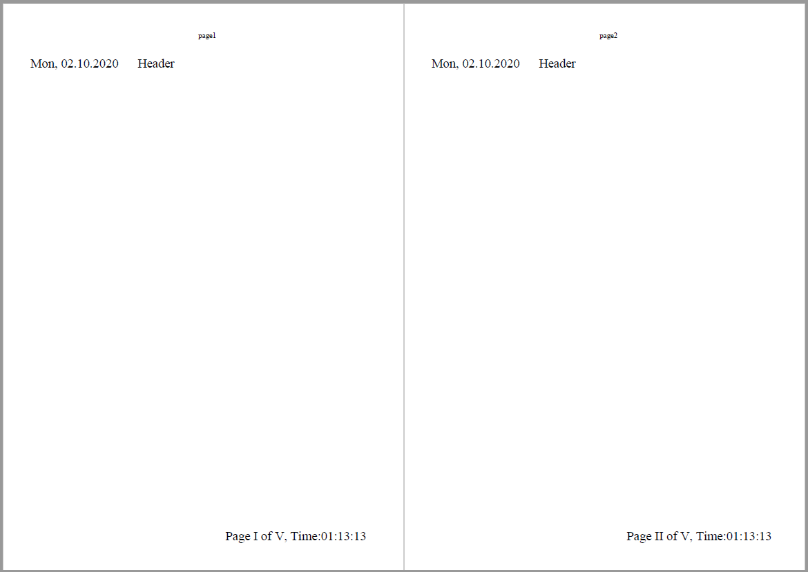

# Headers and Footers in Flutter PDF

The Flutter PDF supports drawing the header and footer in PDF document using [`PdfPageTemplateElement`](https://pub.dev/documentation/syncfusion_flutter_pdf/latest/pdf/PdfPageTemplateElement-class.html) class. The header and footer contain the graphics support and automatic field support to perform their operations.

## Adding graphics and automatic fields to header and footer

This package supports to add page count, page numbers, date and time using automatic fields such as [`PdfPageCountField`](https://pub.dev/documentation/syncfusion_flutter_pdf/latest/pdf/PdfPageCountField-class.html), [`PdfPageNumberField`](https://pub.dev/documentation/syncfusion_flutter_pdf/latest/pdf/PdfPageNumberField-class.html) and [`PdfDateTimeField`](https://pub.dev/documentation/syncfusion_flutter_pdf/latest/pdf/PdfDateTimeField-class.html), and more.

The following code snippet explains how to use the graphics and automatic fields in header and footer.



//Create a new pdf document
PdfDocument document = PdfDocument();

//Create the header with specific bounds
PdfPageTemplateElement header = PdfPageTemplateElement(
    Rect.fromLTWH(0, 0, document.pageSettings.size.width, 100));

//Create the date and time field
PdfDateTimeField dateAndTimeField = PdfDateTimeField(
    font: PdfStandardFont(PdfFontFamily.timesRoman, 19),
    brush: PdfSolidBrush(PdfColor(0, 0, 0)));
dateAndTimeField.date = DateTime(2020, 2, 10, 13, 13, 13, 13, 13);
dateAndTimeField.dateFormatString = 'E, MM.dd.yyyy';

//Create the composite field with date field
PdfCompositeField compositefields = PdfCompositeField(
    font: PdfStandardFont(PdfFontFamily.timesRoman, 19),
    brush: PdfSolidBrush(PdfColor(0, 0, 0)),
    text: '{0}      Header',
    fields: <PdfAutomaticField>[dateAndTimeField]);

//Add composite field in header
compositefields.draw(header.graphics,
    Offset(0, 50 - PdfStandardFont(PdfFontFamily.timesRoman, 11).height));

//Add the header at top of the document
document.template.top = header;

//Create the footer with specific bounds
PdfPageTemplateElement footer = PdfPageTemplateElement(
    Rect.fromLTWH(0, 0, document.pageSettings.size.width, 50));

//Create the page number field
PdfPageNumberField pageNumber = PdfPageNumberField(
    font: PdfStandardFont(PdfFontFamily.timesRoman, 19),
    brush: PdfSolidBrush(PdfColor(0, 0, 0)));

//Sets the number style for page number
pageNumber.numberStyle = PdfNumberStyle.upperRoman;

//Create the page count field
PdfPageCountField count = PdfPageCountField(
    font: PdfStandardFont(PdfFontFamily.timesRoman, 19),
    brush: PdfSolidBrush(PdfColor(0, 0, 0)));

//set the number style for page count
count.numberStyle = PdfNumberStyle.upperRoman;

//Create the date and time field
PdfDateTimeField dateTimeField = PdfDateTimeField(
    font: PdfStandardFont(PdfFontFamily.timesRoman, 19),
    brush: PdfSolidBrush(PdfColor(0, 0, 0)));

//Sets the date and time
dateTimeField.date = DateTime(2020, 2, 10, 13, 13, 13, 13, 13);

//Sets the date and time format
dateTimeField.dateFormatString = 'hh\':\'mm\':\'ss';

//Create the composite field with page number page count
PdfCompositeField compositeField = PdfCompositeField(
    font: PdfStandardFont(PdfFontFamily.timesRoman, 19),
    brush: PdfSolidBrush(PdfColor(0, 0, 0)),
    text: 'Page {0} of {1}, Time:{2}',
    fields: <PdfAutomaticField>[pageNumber, count, dateTimeField]);
compositeField.bounds = footer.bounds;

//Add the composite field in footer
compositeField.draw(footer.graphics,
    Offset(290, 50 - PdfStandardFont(PdfFontFamily.timesRoman, 19).height));

//Add the footer at the bottom of the document
document.template.bottom = footer;

//Add the pages to the document
for (int i = 1; i <= 5; i++) {
  document.pages.add().graphics.drawString(
      'Page $i', PdfStandardFont(PdfFontFamily.timesRoman, 11),
      bounds: Rect.fromLTWH(250, 0, 615, 100));
}

//Save the PDF document
File('HeaderAndFooter.pdf').writeAsBytes(document.save());

//Dispose document
document.dispose();



By executing the above code sample, you will get the PDF document as follows.

