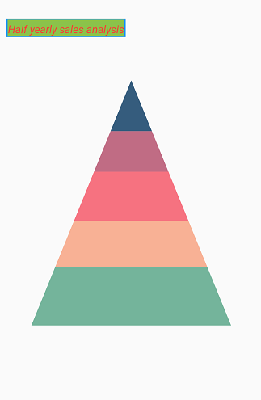

# Chart title in Flutter Pyramid Chart

You can define and customize the chart title using the [`title`](https://pub.dev/documentation/syncfusion_flutter_charts/latest/charts/SfPyramidChart/title.html) property of [`SfPyramidChart`](https://pub.dev/documentation/syncfusion_flutter_charts/latest/charts/SfPyramidChart-class.html). The [`text`](https://pub.dev/documentation/syncfusion_flutter_charts/latest/charts/ChartTitle/text.html) property of [`ChartTitle`](https://pub.dev/documentation/syncfusion_flutter_charts/latest/charts/ChartTitle-class.html) is used to set the title text.

The following properties can be used to customize its appearance.

* [`backgroundColor`](https://pub.dev/documentation/syncfusion_flutter_charts/latest/charts/ChartTitle/backgroundColor.html) - used to change the background color.
* [`borderColor`](https://pub.dev/documentation/syncfusion_flutter_charts/latest/charts/ChartTitle/borderColor.html) - used to change the border color.
* [`borderWidth`](https://pub.dev/documentation/syncfusion_flutter_charts/latest/charts/ChartTitle/borderWidth.html) - used to change the border width.
* [`textStyle`](https://pub.dev/documentation/syncfusion_flutter_charts/latest/charts/ChartTitle/textStyle.html) - used to change the text color, size, font family, fontStyle, and font weight.
* [`color`](https://api.flutter.dev/flutter/painting/TextStyle/color.html) - used to change the color of the text.
* [`fontFamily`](https://api.flutter.dev/flutter/painting/TextStyle/fontFamily.html) - used to change the font family for chart title. 
* [`fontStyle`](https://api.flutter.dev/flutter/painting/TextStyle/fontStyle.html) - used to change the font style for the chart title.
* [`fontSize`](https://api.flutter.dev/flutter/painting/TextStyle/fontSize.html) - used to change the font size for the chart title.

### Title alignment

You can align the title text horizontally to the near, center, or far positions of the chart using the [`alignment`](https://pub.dev/documentation/syncfusion_flutter_charts/latest/charts/ChartTitle/alignment.html) property of the [`title`](https://pub.dev/documentation/syncfusion_flutter_charts/latest/charts/SfPyramidChart/title.html).


 

    @override
    Widget build(BuildContext context) {
      return Scaffold(
        body: Center(
          child: Container(
            child: SfPyramidChart(
              title: ChartTitle(
                text: 'Half yearly sales analysis',
                backgroundColor: Colors.lightGreen,
                borderColor: Colors.blue,
                borderWidth: 2,
                // Aligns the chart title to the left
                alignment: ChartAlignment.near,
                textStyle: TextStyle(
                  color: Colors.red,
                  fontFamily: 'Roboto',
                  fontStyle: FontStyle.italic,
                  fontSize: 14,
                )
              ),
              series: PyramidSeries<ChartData, String>(
                  dataSource: [
                    ChartData('Jan', 35),
                    ChartData('Feb', 28),
                    ChartData('Mar', 34),
                    ChartData('Apr', 32),
                    ChartData('May', 40)
                  ],
                  xValueMapper: (ChartData data, _) => data.x,
                  yValueMapper: (ChartData data, _) => data.y
                )
            )
          )
        )
      );
    }




