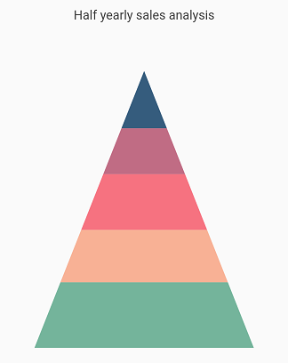
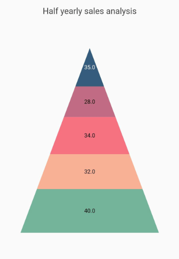
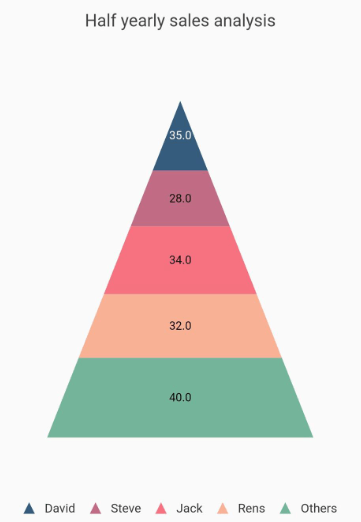
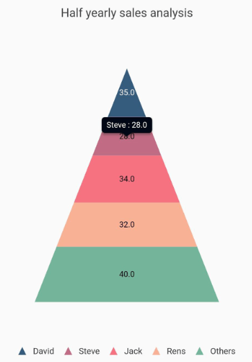

# Getting started with Flutter Pyramid Chart (SfPyramidChart)

This section explains the steps required to populate the chart with data, title, data labels, legend, and tooltips. This section covers only the minimal features needed to know to get started with the chart.

To get start quickly with our Flutter chart widget, you can check on this video.

<iframe id='flutterChartVideoTutorial' src='https://www.youtube.com/embed/t3Dczqj8-10'></iframe>

## Add Flutter Charts to an application

Create a simple project using the instructions given in the [Getting Started with your first Flutter app](https://flutter.dev/docs/get-started/test-drive?tab=vscode#create-app) documentation.

**Add dependency**

Add the Syncfusion [`Flutter Chart`](https://www.syncfusion.com/flutter-widgets/flutter-charts) dependency to your pub spec file.

 

    dependencies:

    syncfusion_flutter_charts: ^xx.x.xx



>**Note**: Here **xx.x.xx** denotes the current version of [`Syncfusion Flutter Charts`](https://pub.dev/packages/syncfusion_flutter_charts/versions) package.

**Get packages**

Run the following command to get the required packages.

 

    $ flutter pub get



**Import package**

Import the following package in your Dart code.

 

    import 'package:syncfusion_flutter_charts/charts.dart';



## Initialize chart

Once the package has been imported, initialize the chart as a child of any widget. SfPyramidChart can be used to render pyramid charts. Here, as we are rendering pyramid chart, initialize SfPyramidChart widget as a child of Container widget.

 

    @override
    Widget build(BuildContext context) {
        return Scaffold(
            body: Center(
                child: Container(
                    //Initialize chart
                    child: SfPyramidChart()
                )
            )
        );
    }



_note_ : An empty chart will be displayed.This is charts default behavior. 

## Bind data source

Based on your data, initialize the series type. In the series, you need to map the data source and the fields for x and y data points. Here, pyramid series is rendered that is demonstrated in the following code snippet.

 

    @override
    Widget build(BuildContext context) {
        final List<ChartData> chartData = [
            ChartData('David', 25),
            ChartData('Steve', 38),
            ChartData('Jack', 34),
            ChartData('Others', 52)
        ];
        return Scaffold(
            body: Center(
                child: Container(
                    child: SfPyramidChart(
                      series:PyramidSeries<ChartData, String>(
                            dataSource: chartData,
                            xValueMapper: (ChartData data, _) => data.x,
                            yValueMapper: (ChartData data, _) => data.y
                        )
                    )
                )
            )
        );
    }

    class ChartData {
      ChartData(this.x, this.y, [this.color]);
        final String x;
        final double y;
        final Color color;
    }



## Add title

You can add a [`title`](https://pub.dev/documentation/syncfusion_flutter_charts/latest/charts/SfPyramidChart/title.html) to the chart to provide quick information to users about the data plotted in the chart. The title to chart can be set as demonstrated in the following code snippet.

 

    @override
    Widget build(BuildContext context) {
        return Scaffold(
            body: Center(
                child: Container(
                    child: SfPyramidChart(
                      // Chart title text
                      title: ChartTitle(text: 'Half yearly sales analysis'),
                      series:PyramidSeries<ChartData, String>(
                            dataSource: chartData,
                            xValueMapper: (ChartData data, _) => data.x,
                            yValueMapper: (ChartData data, _) => data.y
                        )
                    )
                )
            )
        );
    }



## Enable data labels

You can add data labels to improve the readability of the chart using the [`dataLabelSettings`](https://pub.dev/documentation/syncfusion_flutter_charts/latest/charts/PyramidSeries/dataLabelSettings.html) property.

 

    @override
    Widget build(BuildContext context) {
        return Scaffold(
            body: Center(
                child: Container(
                    child: SfPyramidChart(
                      series:PyramidSeries<ChartData, String>(
                            dataSource: chartData,
                            xValueMapper: (ChartData data, _) => data.x,
                            yValueMapper: (ChartData data, _) => data.y,
                            // Render the data label
                            dataLabelSettings:DataLabelSettings(isVisible : true)
                        )
                    )
                )
            )
        );
    }



## Enable legend

The legend provides information about the series rendered in the chart.

You can use legend in chart by setting the [`isVisible`](https://pub.dev/documentation/syncfusion_flutter_charts/latest/charts/Legend/isVisible.html) property to true in [`legend`](https://pub.dev/documentation/syncfusion_flutter_charts/latest/charts/Legend-class.html).

 

    @override
    Widget build(BuildContext context) {
        return Scaffold(
            body: Center(
                child: Container(
                    child: SfPyramidChart(
                      // Enables the legend
                      legend: Legend(isVisible: true), 
                      series:PyramidSeries<ChartData, String>(
                            dataSource: chartData,
                            xValueMapper: (ChartData data, _) => data.x,
                            yValueMapper: (ChartData data, _) => data.y,
                        )
                    )
                )      
            )
        );
    }



## Enable tooltip

The tooltip is used when you cannot display information using the data labels due to space constraints.

The [`tooltipBehavior`](https://pub.dev/documentation/syncfusion_flutter_charts/latest/charts/SfPyramidChart/tooltipBehavior.html) property in chart is used to enable and customize the tooltip for the pyramid series. The tooltip is enabled as demonstrated in the following code snippet.

 
    
    late TooltipBehavior _tooltipBehavior;

    @override
    void initState(){
        _tooltipBehavior = TooltipBehavior(enable: true);
        super.initState();
    }

    @override
    Widget build(BuildContext context) {
        return Scaffold(
            appBar: AppBar(
                title: Text(widget.title),
            ),
            body: Center(
                child: Container(
                    child: SfPyramidChart(
                      // Enables the tooltip for all the series in chart
                        tooltipBehavior: _tooltipBehavior,
                        series:PyramidSeries<ChartData, String>(
                            dataSource: chartData,
                            xValueMapper: (ChartData data, _) => data.x,
                            yValueMapper: (ChartData data, _) => data.y,
                        )
                    )
                )
            )
        );
    }



You can find the complete getting started example from this [`link`](https://www.syncfusion.com/downloads/support/directtrac/general/ze/pyramid_chart_example-1124328856).

>**Note**: You can also explore our [Flutter Charts example](https://flutter.syncfusion.com/#/cartesian-charts/chart-types/line/default-line-chart) that shows how to render various chart types as well as how to easily configure with built-in support for creating stunning visual effects.