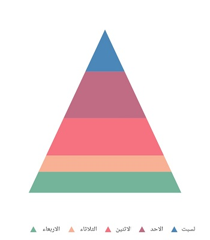
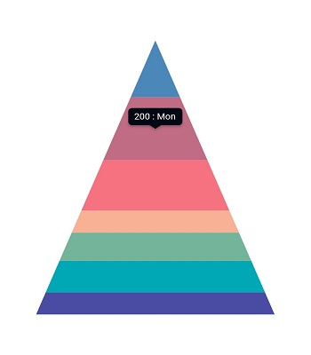

# Right To Left (RTL) in Flutter Pyramid Chart (SfPyramidChart)

Pyramid chart supports right to left rendering. But series and other chart elements rendering will be the same for both LTR and RTL except legend and tooltip.

## RTL rendering ways

Right to left rendering can be switched in the following ways:

### Wrapping the SfPyramidChart with Directionality widget

To change the rendering direction from right to left, you can wrap the [`SfPyramidChart`](https://pub.dev/documentation/syncfusion_flutter_charts/latest/charts/SfPyramidChart-class.html) widget inside the [`Directionality`](https://api.flutter.dev/flutter/widgets/Directionality-class.html) widget and set the [`textDirection`](https://api.flutter.dev/flutter/widgets/Directionality/textDirection.html) property as [`TextDirection.rtl`](https://api.flutter.dev/flutter/dart-ui/TextDirection.html).



    @override
    Widget build(BuildContext context) {
      return Scaffold(
        body: Directionality(
          textDirection: TextDirection.rtl,
          child: SfPyramidChart(
              //...
          ),
        ),
      );
    }



### Changing the locale to RTL languages

To change the chart rendering direction from right to left, you can change the [`locale`](https://api.flutter.dev/flutter/material/MaterialApp/locale.html) to any of the RTL languages such as Arabic, Persian, Hebrew, Pashto, and Urdu.



    /// Package import
    import 'package:flutter_localizations/flutter_localizations.dart';
    import 'package:syncfusion_localizations/syncfusion_localizations.dart';

    // ...

    @override
    Widget build(BuildContext context) {
      return MaterialApp(
        localizationsDelegates: [
          GlobalMaterialLocalizations.delegate,
          GlobalWidgetsLocalizations.delegate,
        ],
        supportedLocales: <Locale>[
          Locale('en'),
          Locale('ar'),
          // ... other locales the app supports
        ],
        locale: Locale('ar'),
        home: Scaffold(
          body: SfPyramidChart(
            //...
          ),
        )
      );
    }



## RTL supported chart elements

### Legend

Right to left rendering is effective for the legend in the chart. Legend items will be rendered from right to left direction. i.e. the legend text will appear on the left first, followed by the legend icon on the right.



    @override
    Widget build(BuildContext context) {
      final List<ChartData> chartData = <ChartData>[
        ChartData('Jan', 24),
        ChartData('Feb', 20),
        ChartData('Mar', 35),
        ChartData('Apr', 27),
        ChartData('May', 30),
      ];
      return Scaffold(
        body: Directionality(
          textDirection: TextDirection.rtl,
          child: SfPyramidChart(
            legend: Legend(isVisible: true),
            series: PyramidSeries<ChartData, String>(
                dataSource: chartData,
                xValueMapper: (ChartData data, _) => data.x,
                yValueMapper: (ChartData data, _) => data.y,
            )
          )
        )
      );
    }  

    class ChartData {
      ChartData(this.x, this.y);
        final String x;
        final int y;
    }



### Tooltip

Right-to-left rendering is applicable for [`tooltip`](https://pub.dev/documentation/syncfusion_flutter_charts/latest/charts/TooltipBehavior-class.html) elements.By default, the tooltip content will be `point.x : point.y`, in RTL rendering the tooltip content will be `point.y : point.x`. If you wish the format to be applied as it is despite RTL rendering in this case, you can make use of [`onTooltipRender`](https://pub.dev/documentation/syncfusion_flutter_charts/latest/charts/SfPyramidChart/onTooltipRender.html) callback.



    late TooltipBehavior _tooltipBehavior;

    @override
    void initState(){
      _tooltipBehavior = TooltipBehavior(enable: true);
      super.initState(); 
    }

    @override
    Widget build(BuildContext context) {
      final List<ChartData> chartData = <ChartData>[
        ChartData('Jan', 24),
        ChartData('Feb', 20),
        ChartData('Mar', 35),
        ChartData('Apr', 27),
        ChartData('May', 30),
      ];
      return Scaffold(
        body: Directionality(
          textDirection: TextDirection.rtl,
          child: SfPyramidChart(
            tooltipBehavior = _tooltipBehavior;
            series: PyramidSeries<ChartData, String>(
                dataSource: chartData,
                xValueMapper: (ChartData data, _) => data.x,
                yValueMapper: (ChartData data, _) => data.y,
            )
          )
        )
      );
    }  

    class ChartData {
      ChartData(this.x, this.y);
        final String x;
        final int y;
    }



