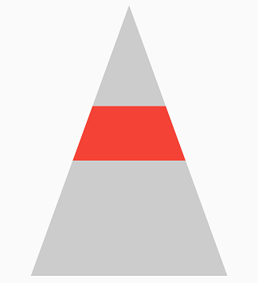
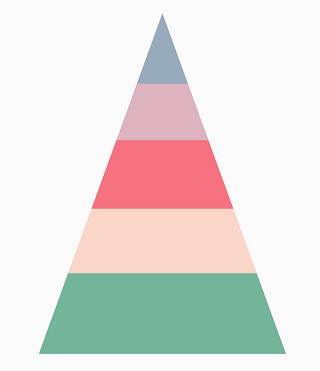
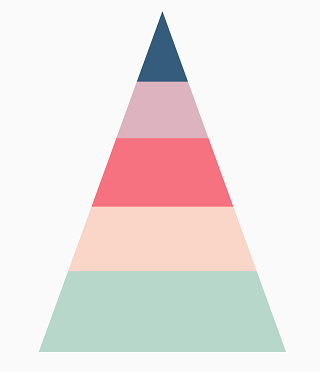

# Selection in Flutter Pyramid Chart (SfPyramidChart)

The selection feature in chart let you to select a segment in a series or the series itself. This features allows you to select either individual or cluster of segments in the chart series.

 
    
    late SelectionBehavior _selectionBehavior;

    @override
    void initState(){
      _selectionBehavior = SelectionBehavior(
                    // Enables the selection
                    enable: true);
      super.initState();
    }

    final List<ChartData> chartData = [
    ChartData('Jan', 35),
    ChartData('Feb', 28),
    ChartData('Mar', 34),
    ChartData('Apr', 32),
    ChartData('May', 40)
    ];

    @override
    Widget build(BuildContext context) {
      return Scaffold(
        body: Center(
          child: Container(
            child: SfPyramidChart(
              series: PyramidSeries<ChartData, String>(
                  dataSource: chartData,
                  xValueMapper: (ChartData sales, _) =>   sales.x,
                  yValueMapper: (ChartData sales, _) => sales.y,
                  selectionBehavior: _selectionBehavior
                )
              )
            )
          )
        );
      }
    }

    class ChartData {
    ChartData(this.x, this.y);
    final String x;
    final double y;
    }



## Customizing the segments

You can customize the segments using the below properties.

* [`selectedColor`](https://pub.dev/documentation/syncfusion_flutter_charts/latest/charts/SelectionBehavior/selectedColor.html) - used to change the background color of selected segment.
* [`unselectedColor`](https://pub.dev/documentation/syncfusion_flutter_charts/latest/charts/SelectionBehavior/unselectedColor.html) - used to change the background color of unselected segment.
* [`selectedBorderColor`](https://pub.dev/documentation/syncfusion_flutter_charts/latest/charts/SelectionBehavior/selectedBorderColor.html) - used to change the stroke color of the selected segment.
* [`selectedBorderWidth`](https://pub.dev/documentation/syncfusion_flutter_charts/latest/charts/SelectionBehavior/selectedBorderWidth.html) - used to change the stroke width of the selected segment.
* [`unselectedBorderColor`](https://pub.dev/documentation/syncfusion_flutter_charts/latest/charts/SelectionBehavior/unselectedBorderColor.html) - used to change the stroke color of the unselected segment.
* [`unselectedBorderWidth`](https://pub.dev/documentation/syncfusion_flutter_charts/latest/charts/SelectionBehavior/unselectedBorderWidth.html) - used to change the stroke width of the unselected segment.
* [`selectedOpacity`](https://pub.dev/documentation/syncfusion_flutter_charts/latest/charts/SelectionBehavior/selectedOpacity.html) - used to control the transparency of the selected segment.
* [`unselectedOpacity`](https://pub.dev/documentation/syncfusion_flutter_charts/latest/charts/SelectionBehavior/unselectedOpacity.html) - used to control the transparency of the unselected segment.

 
    
    late SelectionBehavior _selectionBehavior;

    @override
    void initState() {
    _selectionBehavior = SelectionBehavior(
        // Enables the selection
        enable: true,
        selectedColor: Colors.red,
        unselectedColor: Colors.grey);
    super.initState();
    }

    final List<ChartData> chartData = [
    ChartData('Jan', 35),
    ChartData('Feb', 28),
    ChartData('Mar', 34),
    ChartData('Apr', 32),
    ChartData('May', 40)
    ];

    @override
    Widget build(BuildContext context) {
    return Scaffold(
        body: Center(
            child: Container(
                child: SfPyramidChart(
                    series: PyramidSeries<ChartData, String>(
                        dataSource: chartData,
                        xValueMapper: (ChartData sales, _) => sales.x,
                        yValueMapper: (ChartData sales, _) => sales.y,
                        selectionBehavior: _selectionBehavior)))));
        }
      }

      class ChartData {
      ChartData(this.x, this.y);
      final String x;
      final double? y;
      }



## Multi-selection

Multiple selection can be enabled using the [`enableMultiSelection`](https://pub.dev/documentation/syncfusion_flutter_charts/latest/charts/SfPyramidChart/enableMultiSelection.html) property of chart.

 

    final List<ChartData> chartData = [
    ChartData('Jan', 35),
    ChartData('Feb', 28),
    ChartData('Mar', 34),
    ChartData('Apr', 32),
    ChartData('May', 40)
    ];

    @override
    Widget build(BuildContext context) {
    return Scaffold(
        body: Center(
            child: Container(
                child: SfPyramidChart(
                  enableMultiSelection: true,
                    series: PyramidSeries<ChartData, String>(
                        dataSource: chartData,
                        xValueMapper: (ChartData sales, _) => sales.x,
                        yValueMapper: (ChartData sales, _) => sales.y,
                        selectionBehavior: _selectionBehavior)))));
      }
    }

    class ChartData {
    ChartData(this.x, this.y);
    final String x;
    final double? y;
    }



## Toggle selection

You can decide, whether to deselect the selected data point/series or remain selected when interacted with it again by setting the [`toggleSelection`](https://pub.dev/documentation/syncfusion_flutter_charts/latest/charts/SelectionBehavior/toggleSelection.html) property `true` or `false`. If set to true, deselection will be performed else the point will not get deselected.
This works even while calling public methods, in various selection modes, with multi-selection, and also on dynamic changes.
Defaults to `true`.

 
    
    late SelectionBehavior _selectionBehavior;

    @override
    void initState() {
    _selectionBehavior =
        SelectionBehavior(enable: true, toggleSelection: false);
    super.initState();
    }

    final List<ChartData> chartData = [
    ChartData('Jan', 35),
    ChartData('Feb', 28),
    ChartData('Mar', 34),
    ChartData('Apr', 32),
    ChartData('May', 40)
    ];

    @override
    Widget build(BuildContext context) {
    return Scaffold(
        body: Center(
            child: Container(
                child: SfPyramidChart(
                    series: PyramidSeries<ChartData, String>(
                        dataSource: chartData,
                        xValueMapper: (ChartData sales, _) => sales.x,
                        yValueMapper: (ChartData sales, _) => sales.y,
                        selectionBehavior: _selectionBehavior)))));
      }
    }

    class ChartData {
    ChartData(this.x, this.y);
    final String x;
    final double? y;
    }



## Selection on initial rendering

You can select a point or series programmatically on a chart using [`initialSelectedDataIndexes`](https://pub.dev/documentation/syncfusion_flutter_charts/latest/charts/PyramidSeries/initialSelectedDataIndexes.html) property of chart.

 

    late SelectionBehavior _selectionBehavior;

    @override
    void initState() {
    _selectionBehavior =
        SelectionBehavior(enable: true, toggleSelection: false);
    super.initState();
    }

    final List<ChartData> chartData = [
    ChartData('Jan', 35),
    ChartData('Feb', 28),
    ChartData('Mar', 34),
    ChartData('Apr', 32),
    ChartData('May', 40)
    ];

    @override
    Widget build(BuildContext context) {
    return Scaffold(
        body: Center(
            child: Container(
                child: SfPyramidChart(
                    series: PyramidSeries<ChartData, String>(
                  initialSelectedDataIndexes: [2, 0],
                        dataSource: chartData,
                        xValueMapper: (ChartData sales, _) => sales.x,
                        yValueMapper: (ChartData sales, _) => sales.y,
                        selectionBehavior: _selectionBehavior)))));
      }
    }

    class ChartData {
    ChartData(this.x, this.y);
    final String x;
    final double? y;
    }



Also refer [`selection event`](https://help.syncfusion.com/flutter/pyramid-chart/callbacks#onselectionchanged) for customizing the selection further.

## Methods in SelectionBehavior

### SelectDataPoints method in SelectionBehavior

The [`selectDataPoints`](https://pub.dev/documentation/syncfusion_flutter_charts/latest/charts/SelectionBehavior/selectDataPoints.html) method is used to select the data point programmatically. The required arguments are listed below.

* `pointIndex` - specifies the point index value.
* `seriesIndex` - specifies the series index value and this is an optional parameter. By default it will be considered as 0.

N> The [`enableMultiSelection`](https://pub.dev/documentation/syncfusion_flutter_charts/latest/charts/SfCartesianChart/enableMultiSelection.html) is also applicable for this but, it is based on the API values specified in the chart.



    late SfPyramidChart chart;
    late SelectionBehavior _selectionBehavior;

    @override
    void initState() {
    _selectionBehavior = SelectionBehavior(enable: true);
    super.initState();
    }

    @override
    Widget build(BuildContext context) {
    final List<ChartData> chartData = [
      ChartData(10, 17),
      ChartData(20, 34)
      // Add the required data
      ];

    chart = SfPyramidChart(
        series: PyramidSeries<ChartData, double>(
            dataSource: chartData,
            xValueMapper: (ChartData data, _) => data.x,
            yValueMapper: (ChartData data, _) => data.y,
            selectionBehavior: _selectionBehavior));

    return Scaffold(
      body: Center(
          child: Column(children: <Widget>[
          Container(child: chart),
          ElevatedButton(child: Text('Select'), onPressed: select),
      ])),
    );
    }

    void select() {
    _selectionBehavior.selectDataPoints(1, 0);
      }
    }

    class ChartData {
    ChartData(this.x, this.y);
    final double? x;
    final double? y;
    }

