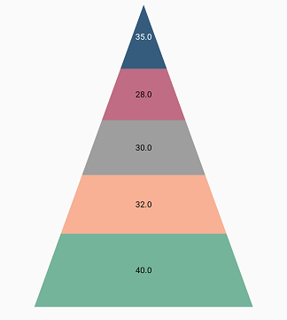
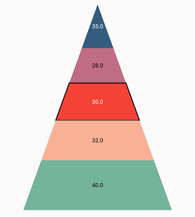
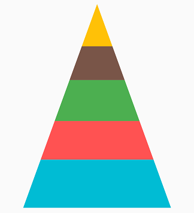

# Series customization in Flutter Pyramid Chart (SfPyramidChart)

## Animation

[`SfPyramidChart`](https://pub.dev/documentation/syncfusion_flutter_charts/latest/charts/SfPyramidChart-class.html) provides animation support for the series. Series will be animated while rendering. Animation is enabled by default, and you can also control the duration of the animation using [`animationDuration`](https://pub.dev/documentation/syncfusion_flutter_charts/latest/charts/PyramidSeries/animationDuration.html) property. You can disable the animation by setting 0 value to that property.


 

    @override
    Widget build(BuildContext context) {
        return Scaffold(
            body: Center(
                child: Container(
                    child: SfPyramidChart(
                        series:PyramidSeries<ChartData, String>(
                            dataSource: chartData,
                            xValueMapper: (ChartData data, _) => data.x,
                            yValueMapper: (ChartData data, _) => data.y,
                            animationDuration: 1000,
                        )
                    )
                )
            )
        );
    }




### Animation delay

The [`animationDelay`](https://pub.dev/documentation/syncfusion_flutter_charts/latest/charts/PyramidSeries/animationDelay.html) property is used to specify the delay duration of the series animation. This takes milliseconds value as input. By default, the series will get animated for the specified duration. If [`animationDelay`](https://pub.dev/documentation/syncfusion_flutter_charts/latest/charts/PyramidSeries/animationDelay.html) is specified, then the series will begin to animate after the specified duration. Defaults to `0`.



    
    @override
    Widget build(BuildContext context) {
        final List<ChartData> data = [
            ChartData('Jan', 35),
            ChartData('Feb', 28),
            ChartData('Mar', 38),
            ChartData('Apr', 32),
            ChartData('May', 40)
        ];

        return Center(
            child: SfPyramidChart(
                series: PyramidSeries<ChartData, String>(
                    dataSource: data,
                    animationDuration: 4500,
                    animationDelay: 2000,
                    xValueMapper: (ChartData data, _) => data.x,
                    yValueMapper: (ChartData data, _) => data.y,
                )
            ),
        );
    }

    class ChartData {
      ChartData(this.x, this.y);
      final String x;
      final double y;
    }




## Empty points

The data points that has null values are considered as empty points. Empty data points are ignored and not plotted in the chart. By using [`emptyPointSettings`](https://pub.dev/documentation/syncfusion_flutter_charts/latest/charts/PyramidSeries/emptyPointSettings.html) property in series, you can decide the action taken for empty points. Available [`modes`](https://pub.dev/documentation/syncfusion_flutter_charts/latest/charts/EmptyPointSettings/mode.html) are [`EmptyPointMode.gap`](https://pub.dev/documentation/syncfusion_flutter_charts/latest/charts/EmptyPointMode.html), [`EmptyPointMode.zero`](https://pub.dev/documentation/syncfusion_flutter_charts/latest/charts/EmptyPointMode.html), [`EmptyPointMode.drop`](https://pub.dev/documentation/syncfusion_flutter_charts/latest/charts/EmptyPointMode.html) and [`EmptyPointMode.average`](https://pub.dev/documentation/syncfusion_flutter_charts/latest/charts/EmptyPointMode.html). Default mode of the empty point is [`EmptyPointMode.gap`](https://pub.dev/documentation/syncfusion_flutter_charts/latest/charts/EmptyPointMode.html).


 

    @override
    Widget build(BuildContext context) {
        
         final List<ChartData> chartData = [
            ChartData('Jan', 35),
            ChartData('Feb', 28),
            ChartData('Mar', null),
            ChartData('Apr', 32),
            ChartData('May', 40)
        ];
        return Scaffold(
            body: Center(
                child: SfPyramidChart(
                    series:PyramidSeries<ChartData, String>(
                        dataSource: chartData,
                        dataLabelSettings: DataLabelSettings(isVisible:true),
                        emptyPointSettings: EmptyPointSettings(mode: EmptyPointMode.average),
                        xValueMapper: (ChartData data, _) => data.x,
                        yValueMapper: (ChartData data, _) => data.y
                    )
                )
            )
        );
    }




### Empty point customization

Specific color for empty points can be set by [`color`](https://pub.dev/documentation/syncfusion_flutter_charts/latest/charts/EmptyPointSettings/color.html) property in [`emptyPointSettings`](https://pub.dev/documentation/syncfusion_flutter_charts/latest/charts/PyramidSeries/emptyPointSettings.html). The [`borderWidth`](https://pub.dev/documentation/syncfusion_flutter_charts/latest/charts/EmptyPointSettings/borderWidth.html) property is used to change the stroke width of the empty point and [`borderColor`](https://pub.dev/documentation/syncfusion_flutter_charts/latest/charts/EmptyPointSettings/borderColor.html) is used to change the stroke color of the empty point.


 

    @override
    Widget build(BuildContext context) {
        final List<ChartData> chartData = [
            ChartData('Jan', 35),
            ChartData('Feb', 28),
            ChartData('Mar', null),
            ChartData('Apr', 32),
            ChartData('May', 40)
        ];
        return Scaffold(
            body: Center(
                child: Container(
                    child: SfPyramidChart(
                        series:PyramidSeries<ChartData, String>(
                            dataSource: chartData,
                            dataLabelSettings: DataLabelSettings(isVisible:true),
                            emptyPointSettings: EmptyPointSettings(mode: EmptyPointMode.average,
                            color: Colors.red,
                            borderColor: Colors.black,
                            borderWidth: 2),
                            xValueMapper: (ChartData data, _) => data.x,
                            yValueMapper: (ChartData data, _) => data.y
                        )
                    )
                )
            )
        );
    }




## Color mapping for data points   

The [`pointColorMapper`](https://pub.dev/documentation/syncfusion_flutter_charts/latest/charts/PyramidSeries/pointColorMapper.html) property is used to map the color field from the data source. 


 

    @override
    Widget build(BuildContext context) {
            List<ChartData> chartData = <ChartData>[
                ChartData('Rent', 1000,Colors.teal),
                ChartData('Food', 2500,Colors.lightBlue),
                ChartData('Savings', 760,Colors.brown),
                ChartData('Tax', 1897,Colors.grey),
                ChartData('Others', 2987,Colors.blueGrey)
            ];
            return Scaffold(
                body: Center(
                    child: Container(
                        child: SfPyramidChart(
                        series:PyramidSeries<ChartData, String>(
                            dataSource: chartData,
                            xValueMapper: (ChartData data, _) => data.x,
                            yValueMapper: (ChartData data, _) => data.y,
                            //Map Color for each dataPoint datasource.
                            pointColorMapper: (ChartData data,_) => data.color,
                        )
                    )
                )
            )
        );
    }




