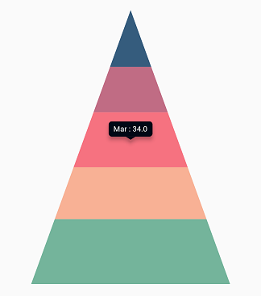
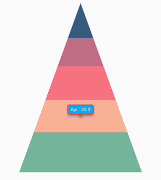
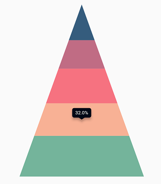
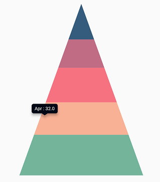
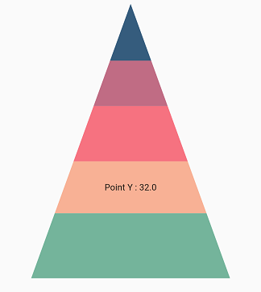

# Tooltip in Flutter Pyramid Chart

The chart provides tooltip support for all series types. It is used to show information about a segment when you tap on it. To enable the tooltip, set the [`enableTooltip`](https://pub.dev/documentation/syncfusion_flutter_charts/latest/charts/ChartSeries/enableTooltip.html) property to `true`.

The tooltip state is preserved during device orientation changes and browser resize. For example, if the tooltip's [`duration`](https://pub.dev/documentation/syncfusion_flutter_charts/latest/charts/TooltipBehavior/duration.html) is set to 10,000 ms, and you change the device orientation from portrait to landscape after 5,000 ms of display, the tooltip will remain visible for the next 5,000 ms in landscape mode before disappearing.


 
    
    late TooltipBehavior _tooltipBehavior;

    @override
    void initState(){
        _tooltipBehavior = TooltipBehavior(enable: true);
        super.initState();
    }

    @override
    Widget build(BuildContext context) {
      final List<ChartData> chartData = [
        ChartData('Jan', 35),
        ChartData('Feb', 28),
        ChartData('Mar', 38),
        ChartData('Apr', 32),
        ChartData('May', 40)
      ];
      return Scaffold(
        body: Center(
          child: Container(
            child: SfPyramidChart(
              tooltipBehavior: _tooltipBehavior,
              series: PyramidSeries<ChartData, String>(
                  dataSource: chartData,
                  xValueMapper: (ChartData data, _) =>   data.x,
                  yValueMapper: (ChartData data, _) => data.y
                )
            )
          )
        )
      );
    }
    class ChartData {
      ChartData(this.x, this.y);
      final String x;
      final double? y;
    }




## Customizing the appearance

You can use the following properties to customize the tooltip appearance.

* [`color`](https://pub.dev/documentation/syncfusion_flutter_charts/latest/charts/TooltipBehavior/color.html) - used to change the background color of the tooltip.
* [`borderWidth`](https://pub.dev/documentation/syncfusion_flutter_charts/latest/charts/TooltipBehavior/borderWidth.html) - used to change the stroke width of the tooltip.
* [`borderColor`](https://pub.dev/documentation/syncfusion_flutter_charts/latest/charts/TooltipBehavior/borderColor.html) - used to change the stroke color of the tooltip.
* [`opacity`](https://pub.dev/documentation/syncfusion_flutter_charts/latest/charts/TooltipBehavior/opacity.html) - used to control the transparency of the tooltip.
* [`duration`](https://pub.dev/documentation/syncfusion_flutter_charts/latest/charts/TooltipBehavior/duration.html) - specifies the duration for displaying the tooltip and defaults to `3000`.
* [`animationDuration`](https://pub.dev/documentation/syncfusion_flutter_charts/latest/charts/TooltipBehavior/animationDuration.html) - specifies the duration for animating the tooltip and defaults to `350`.
* [`elevation`](https://pub.dev/documentation/syncfusion_flutter_charts/latest/charts/TooltipBehavior/elevation.html) - specifies the elevation of the tooltip.
* [`canShowMarker`](https://pub.dev/documentation/syncfusion_flutter_charts/latest/charts/TooltipBehavior/canShowMarker.html) - toggles the visibility of the marker in the tooltip.
* [`header`](https://pub.dev/documentation/syncfusion_flutter_charts/latest/charts/TooltipBehavior/header.html) - specifies the header for the tooltip. By default, the series name is displayed in the header.
* [`format`](https://pub.dev/documentation/syncfusion_flutter_charts/latest/charts/TooltipBehavior/format.html) - formats the tooltip text. By default, the tooltip is rendered with x and y values. You can add a prefix or suffix to x, y, and series name values in the tooltip by formatting them.
* [`shadowColor`](https://pub.dev/documentation/syncfusion_flutter_charts/latest/charts/TooltipBehavior/shadowColor.html) - specifies the color of the tooltip shadow.
* [`shouldAlwaysShow`](https://pub.dev/documentation/syncfusion_flutter_charts/latest/charts/TooltipBehavior/shouldAlwaysShow.html) - used to show or hide the tooltip.
* [`textAlignment`](https://pub.dev/documentation/syncfusion_flutter_charts/latest/charts/TooltipBehavior/textAlignment.html) - aligns the text in the tooltip.
* [`decimalPlaces`](https://pub.dev/documentation/syncfusion_flutter_charts/latest/charts/TooltipBehavior/decimalPlaces.html) - used to specify the number of decimals displayed in tooltip text.
* [`shared`](https://pub.dev/documentation/syncfusion_flutter_charts/latest/charts/TooltipBehavior/shared.html) - used to share the tooltip with same index points.


 
    
    late TooltipBehavior _tooltipBehavior;

    @override
    void initState(){
        _tooltipBehavior = TooltipBehavior(
                enable: true,
                borderColor: Colors.red,
                borderWidth: 2,
                color: Colors.lightBlue
              );
        super.initState();
    }

    @override
    Widget build(BuildContext context) {
      return Scaffold(
        body: Center(
          child: Container(
            height: 350,
            width: 350,
            child: SfPyramidChart(
              tooltipBehavior: _tooltipBehavior,
              series: PyramidSeries<ChartData, String>(
                dataSource: chartData,
                xValueMapper: (ChartData data, _) => data.x,
                yValueMapper: (ChartData data, _) => data.y)
            )
          )
        )
      );
    }




## Label format

By default, x and y values are displayed in the tooltip, and they can be customized using the [`format`](https://pub.dev/documentation/syncfusion_flutter_charts/latest/charts/TooltipBehavior/format.html) property as shown in the code snippet below. You can show the following values in the tooltip and add a prefix or suffix to them.

* X value - `point.x`
* Y value - `point.y`
* Name of the series - `series.name`


 
    
    late TooltipBehavior _tooltipBehavior;

    @override
    void initState(){
        _tooltipBehavior =  TooltipBehavior(
                enable: true, 
                // Formatting the tooltip text
                format: 'point.y%'
              );
        super.initState();
    }

    @override
    Widget build(BuildContext context) {
      return Scaffold(
        body: Center(
          child: Container(
            child: SfPyramidChart(
              tooltipBehavior: _tooltipBehavior,
              series: PyramidSeries<ChartData, String>(
                dataSource: chartData,
                xValueMapper: (ChartData data, _) => data.x,
                yValueMapper: (ChartData data, _) => data.y)
            )
          )
        )
      );
    }




## Tooltip positioning

The tooltip can be displayed in a fixed location or at the pointer location itself using the [`tooltipPosition`](https://pub.dev/documentation/syncfusion_flutter_charts/latest/charts/TooltipBehavior/tooltipPosition.html) property. This defaults to [`TooltipPosition.auto`](https://pub.dev/documentation/syncfusion_flutter_charts/latest/charts/TooltipPosition.html#auto).


 
    
    late TooltipBehavior _tooltipBehavior;

    @override
    void initState(){
        _tooltipBehavior = TooltipBehavior(
                enable: true, 
                tooltipPosition: TooltipPosition.pointer
              );
        super.initState();
    }

    @override
    Widget build(BuildContext context) {
      return Scaffold(
        body: Center(
          child: Container(
            child: SfPyramidChart(
              tooltipBehavior: _tooltipBehavior,
              series: PyramidSeries<ChartData, String>(
                dataSource: chartData,
                xValueMapper: (ChartData data, _) => data.x,
                yValueMapper: (ChartData data, _) => data.y)
            )
          )
        )
      );
    }




## Tooltip template

You can customize the tooltip appearance with your own widget by using the [`builder`](https://pub.dev/documentation/syncfusion_flutter_charts/latest/charts/TooltipBehavior/builder.html) property of [`tooltipBehavior`](https://pub.dev/documentation/syncfusion_flutter_charts/latest/charts/SfPyramidChart/tooltipBehavior.html).


 
    
    late TooltipBehavior _tooltipBehavior;

    @override
    void initState(){
        _tooltipBehavior = TooltipBehavior(
                enable: true,
                // Templating the tooltip
                builder: (dynamic data, dynamic point, dynamic series,
                int pointIndex, int seriesIndex) {
                  return Container(
                    child: Text(
                      'Point Y : ${point.y.toString()}'
                    )
                  );
                }
              );
        super.initState();
    }

    @override
    Widget build(BuildContext context) {
      return Scaffold(
        body: Center(
          child: Container(
            child: SfPyramidChart(
              tooltipBehavior: _tooltipBehavior,
              series: PyramidSeries<ChartData, String>(
                dataSource: chartData,
                xValueMapper: (ChartData data, _) => data.x,
                yValueMapper: (ChartData data, _) => data.y)
            )
          )
        )
      );
    }




##	Activation mode

The [`activationMode`](https://pub.dev/documentation/syncfusion_flutter_charts/latest/charts/TooltipBehavior/activationMode.html) property is used to restrict the tooltip visibility based on touch actions. The default value of this property is [`ActivationMode.singleTap`](https://pub.dev/documentation/syncfusion_flutter_charts/latest/charts/ActivationMode.html#singleTap).

The ActivationMode enum includes the following values:

* [`ActivationMode.longPress`](https://pub.dev/documentation/syncfusion_flutter_charts/latest/charts/ActivationMode.html#longPress) - activates tooltip only when performing the long press action.
* [`ActivationMode.singleTap`](https://pub.dev/documentation/syncfusion_flutter_charts/latest/charts/ActivationMode.html#singleTap) - activates tooltip only when performing single tap action.
* [`ActivationMode.doubleTap`](https://pub.dev/documentation/syncfusion_flutter_charts/latest/charts/ActivationMode.html#doubleTap) - activates tooltip only when performing double tap action.
* [`ActivationMode.none`](https://pub.dev/documentation/syncfusion_flutter_charts/latest/charts/ActivationMode.html#none) - hides the visibility of tooltip when setting activation mode to none.


 
    
    late TooltipBehavior _tooltipBehavior;
    
    @override
    void initState(){
        _tooltipBehavior = TooltipBehavior(
                enable: true,
                // Tooltip will be displayed on long press
                activationMode: ActivationMode.longPress
              );
        super.initState();
    }

    @override
    Widget build(BuildContext context) {
      return Scaffold(
        body: Center(
          child: Container(
            child: SfPyramidChart(
              tooltipBehavior: _tooltipBehavior,
              series: PyramidSeries<ChartData, String>(
                dataSource: chartData,
                xValueMapper: (ChartData data, _) => data.x,
                yValueMapper: (ChartData data, _) => data.y)
            )
          )
        )
      );
    }




Also refer [`tooltip event`](./callbacks#ontooltiprender) for customizing the tooltip further.