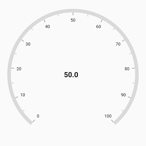
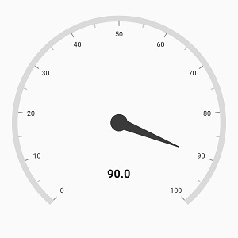
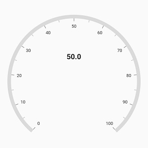
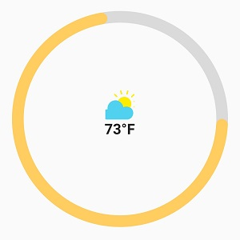
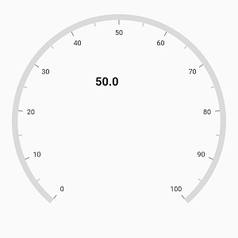
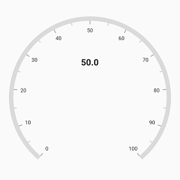

# Annotation in Flutter Radial Gauge (SfRadialGauge)

[`Radial axis`](https://pub.dev/documentation/syncfusion_flutter_gauges/latest/gauges/RadialAxis-class.html) allows you to add multiple widgets such as text and image as annotations to specific points of interest in the radial gauge.

The following properties are available in [`annotation`](https://pub.dev/documentation/syncfusion_flutter_gauges/latest/gauges/GaugeAnnotation-class.html) to customizes the position and alignment of [`annotation widget`](https://pub.dev/documentation/syncfusion_flutter_gauges/latest/gauges/GaugeAnnotation/widget.html)

* [`angle`](https://pub.dev/documentation/syncfusion_flutter_gauges/latest/gauges/GaugeAnnotation/angle.html) – Allows you to position the annotation using the angle.

* [`axisValue`](https://pub.dev/documentation/syncfusion_flutter_gauges/latest/gauges/GaugeAnnotation/axisValue.html) – Allows you to position the annotation using the axis value.

* [`positionFactor`](https://pub.dev/documentation/syncfusion_flutter_gauges/latest/gauges/GaugeAnnotation/positionFactor.html) – Specifies the factor value to position the annotation based on the provided [`axis value`](https://pub.dev/documentation/syncfusion_flutter_gauges/latest/gauges/GaugeAnnotation/axisValue.html) or [`angle`](https://pub.dev/documentation/syncfusion_flutter_gauges/latest/gauges/GaugeAnnotation/angle.html)
* [`horizontalAlignment`](https://pub.dev/documentation/syncfusion_flutter_gauges/latest/gauges/GaugeAnnotation/horizontalAlignment.html) – Specifies the horizontal alignment for positioning the annotation widget.
* [`verticalAlignment`](https://pub.dev/documentation/syncfusion_flutter_gauges/latest/gauges/GaugeAnnotation/verticalAlignment.html) – Specifies the vertical alignment for positioning the annotation.



  @override
  Widget build(BuildContext context) {
    return Scaffold(
      body: Center(
        child: SfRadialGauge(
          axes: <RadialAxis>[
            RadialAxis(
              annotations: <GaugeAnnotation>[
                GaugeAnnotation(
                  axisValue: 50, 
                  positionFactor: 0.4,
                  widget: Text(
                    '50.0', 
                    style: TextStyle(fontWeight: FontWeight.bold, fontSize: 20),
                  )
                )
              ]
            )
          ],
        )
      )
    );
  }



**Positioning annotation**

The annotation can be positioned either using the [`angle`](https://pub.dev/documentation/syncfusion_flutter_gauges/latest/gauges/GaugeAnnotation/angle.html) or [`axis value`](https://pub.dev/documentation/syncfusion_flutter_gauges/latest/gauges/GaugeAnnotation/axisValue.html). When providing both the [`angle`](https://pub.dev/documentation/syncfusion_flutter_gauges/latest/gauges/GaugeAnnotation/angle.html) and the [`axis value`](https://pub.dev/documentation/syncfusion_flutter_gauges/latest/gauges/GaugeAnnotation/axisValue.html), priority will be given to the angle value. The following example shows how to position the annotation widget using angle.



  @override
  Widget build(BuildContext context) {
    return Scaffold(
      body: Center(
        child: SfRadialGauge(
          axes: <RadialAxis>[
            RadialAxis(
              pointers: <GaugePointer>[NeedlePointer(value: 90)],
              annotations: <GaugeAnnotation>[
                GaugeAnnotation(
                  angle: 90, 
                  positionFactor: 0.5,
                  widget: Text(
                    '90.0', 
                    style: TextStyle(fontWeight: FontWeight.bold, fontSize: 20),
                  )
                )
              ]
            )
          ],
        )
      ),
    );
  }



The following code example shows how to position the annotation using [`axis value`](https://pub.dev/documentation/syncfusion_flutter_gauges/latest/gauges/GaugeAnnotation/axisValue.html)



  @override
  Widget build(BuildContext context) {
    return Scaffold(
      body: Center(
        child: SfRadialGauge(
          axes: <RadialAxis>[
            RadialAxis(
              annotations: <GaugeAnnotation>[
                GaugeAnnotation(
                  axisValue: 50, 
                  positionFactor: 0.4,
                  widget: Text(
                    '50.0', 
                    style: TextStyle(fontWeight: FontWeight.bold, fontSize: 20),
                  )
                )
              ]
            )
          ],
        )
      )
    );
  }



The [`positionFactor`](https://pub.dev/documentation/syncfusion_flutter_gauges/latest/gauges/GaugeAnnotation/positionFactor.html) is used to move the annotation widget from the center of axis to the edge of the axis. For example, when you specify the [`positionFactor`](https://pub.dev/documentation/syncfusion_flutter_gauges/latest/gauges/GaugeAnnotation/positionFactor.html) as 0.5, the annotation widget will be moved from the center towards the corresponding direction with the distance of half of the radius value of the axis.

By default, the value of [`positionFactor`](https://pub.dev/documentation/syncfusion_flutter_gauges/latest/gauges/GaugeAnnotation/positionFactor.html) is 0. 

## Setting image for annotation

Annotations provide options to add any image over the gauge control with respect to its offset position. You can add multiple images in a single control.



  @override
  Widget build(BuildContext context) {
    return Scaffold(
      body: Center(
        child: SfRadialGauge(
          axes: <RadialAxis>[
            RadialAxis(
              interval: 10,
              startAngle: 0, 
              endAngle: 360, 
              showTicks: false,
              showLabels: false,
              axisLineStyle: AxisLineStyle(thickness: 20),
              pointers: <GaugePointer>[
                RangePointer(
                  value: 73,
                  width: 20, 
                  color: Color(0xFFFFCD60),
                  enableAnimation: true,
                  cornerStyle: CornerStyle.bothCurve
                )
              ],
              annotations: <GaugeAnnotation>[
                GaugeAnnotation(
                  widget: Column(
                    children: <Widget>[
                      Container(
                        width: 50.00,
                        height: 50.00,
                        decoration: new BoxDecoration(
                          image: new DecorationImage(
                            image: ExactAssetImage('images/sun.png'),
                            fit: BoxFit.fitHeight,
                          ),
                        )
                      ),
                      Padding(
                        padding: EdgeInsets.fromLTRB(0, 2, 0, 0),
                        child: Container(
                          child: Text(
                            '73°F',
                            style: TextStyle(fontWeight: FontWeight.bold, fontSize: 25)
                          ),
                        ),
                      )
                    ],
                  ), 
                  angle: 270, 
                  positionFactor: 0.1
                )
              ]
            )
          ]
        )
      )
    );
  }



## Alignment of annotation

[Annotation](https://pub.dev/documentation/syncfusion_flutter_gauges/latest/gauges/GaugeAnnotation-class.html) can be aligned to center, near and far using the [`horizontalAlignment`](https://pub.dev/documentation/syncfusion_flutter_gauges/latest/gauges/GaugeAnnotation/horizontalAlignment.html) and [`verticalAlignment`](https://pub.dev/documentation/syncfusion_flutter_gauges/latest/gauges/GaugeAnnotation/verticalAlignment.html) properties of annotation.

The following code example demonstrates how to set the [`horizontalAlignment`](https://pub.dev/documentation/syncfusion_flutter_gauges/latest/gauges/GaugeAnnotation/horizontalAlignment.html) for annotation



  @override
  Widget build(BuildContext context) {
    return Scaffold(
      body: Center(
        child: SfRadialGauge(
          axes: <RadialAxis>[
            RadialAxis(
              annotations: <GaugeAnnotation>[
                GaugeAnnotation(
                  axisValue: 50, 
                  positionFactor: 0.4,
                  horizontalAlignment: GaugeAlignment.far,
                  widget: Text(
                    '50.0', 
                    style: TextStyle(fontWeight: FontWeight.bold, fontSize: 20),
                  )
                )
              ]
            )
          ],
        )
      )
    );
  }



The following code example demonstrates how to set [`verticalAlignment`](https://pub.dev/documentation/syncfusion_flutter_gauges/latest/gauges/GaugeAnnotation/verticalAlignment.html) for annotation,



  @override
  Widget build(BuildContext context) {
    return Scaffold(
      body: Center(
        child: SfRadialGauge(
          axes: <RadialAxis>[
            RadialAxis(
              annotations: <GaugeAnnotation>[
                GaugeAnnotation(
                  axisValue: 50, 
                  positionFactor: 0.4,
                  verticalAlignment: GaugeAlignment.far,
                  widget: Text(
                    '50.0', 
                    style: TextStyle(fontWeight: FontWeight.bold, fontSize: 20),
                  )
                )
              ]
            )
          ],
        )
      )
    );
  }



