# Axis in Flutter Radial Gauge (SfRadialGauge)

The [`radial axis`](https://pub.dev/documentation/syncfusion_flutter_gauges/latest/gauges/RadialAxis-class.html) is a circular arc in which a set of values are displayed along a linear or custom scale based on the design requirements. Axis elements such as labels, ticks, and axis line can be easily customized with built-in properties.

## Axis Customization

**Axis minimum and maximum** 

The [`minimum`](https://pub.dev/documentation/syncfusion_flutter_gauges/latest/gauges/RadialAxis/minimum.html) and [`maximum`](https://pub.dev/documentation/syncfusion_flutter_gauges/latest/gauges/RadialAxis/maximum.html) properties of an axis can be used to customize the axis range.The default value of [`minimum`](https://pub.dev/documentation/syncfusion_flutter_gauges/latest/gauges/RadialAxis/minimum.html) is 0, and the default value of [`maximum`](https://pub.dev/documentation/syncfusion_flutter_gauges/latest/gauges/RadialAxis/maximum.html) is 100.



@override
Widget build(BuildContext context) {
  return Scaffold(
    body: Center(
     child: SfRadialGauge(
       axes:<RadialAxis>[RadialAxis(minimum: -60, maximum: 60
       )
      ]
     ),
    ),
  );
}



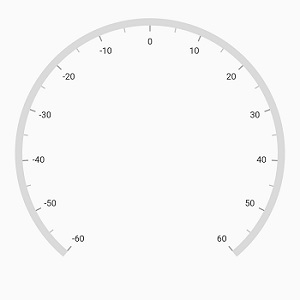

**Angle Customization**

The start and end angles of radial axis can be customized using the [`startAngle`](https://pub.dev/documentation/syncfusion_flutter_gauges/latest/gauges/RadialAxis/startAngle.html) and [`endAngle`](https://pub.dev/documentation/syncfusion_flutter_gauges/latest/gauges/RadialAxis/endAngle.html) properties.



@override
Widget build(BuildContext context) {
  return Scaffold(
    body: Center(
     child: SfRadialGauge(
       axes:<RadialAxis>[RadialAxis(startAngle: 180, endAngle: 90,
       )
      ]
     ),
    ),
  );
}



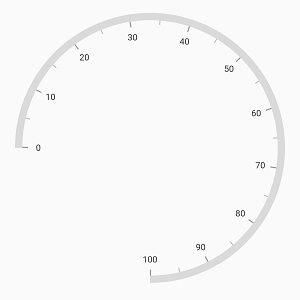

**Radius customization**

The radius of the radial axis can be customized using the [`radiusFactor`](https://pub.dev/documentation/syncfusion_flutter_gauges/latest/gauges/RadialAxis/radiusFactor.html) property. The default value of the [`radiusFactor`](https://pub.dev/documentation/syncfusion_flutter_gauges/latest/gauges/RadialAxis/radiusFactor.html) is 0.95. The value of [`radiusFactor`](https://pub.dev/documentation/syncfusion_flutter_gauges/latest/gauges/RadialAxis/radiusFactor.html) ranges from 0 to 1. For example, When the [`radiusFactor`](https://pub.dev/documentation/syncfusion_flutter_gauges/latest/gauges/RadialAxis/radiusFactor.html) value is 1, the full radius will be considered for rendering the axis, and when the [`radiusFactor`](https://pub.dev/documentation/syncfusion_flutter_gauges/latest/gauges/RadialAxis/radiusFactor.html) value is 0.5, then half of the radius value will be considered for rendering the circle.



@override
Widget build(BuildContext context) {
  return Scaffold(
    body: Center(
     child: SfRadialGauge(
       axes:<RadialAxis>[RadialAxis(),
         RadialAxis(radiusFactor: 0.5)]
     ),
    ),
  );
}



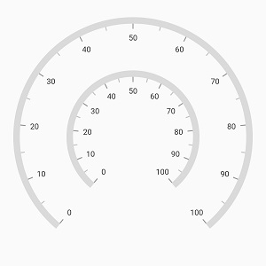

**Axis position customization**

The position of the [`radial axis`](https://pub.dev/documentation/syncfusion_flutter_gauges/latest/gauges/RadialAxis-class.html) can be customized using the [`centerX`](https://pub.dev/documentation/syncfusion_flutter_gauges/latest/gauges/RadialAxis/centerX.html) and [`centerY`](https://pub.dev/documentation/syncfusion_flutter_gauges/latest/gauges/RadialAxis/centerY.html) values. The default value of [`centerX`](https://pub.dev/documentation/syncfusion_flutter_gauges/latest/gauges/RadialAxis/centerX.html) and [`centerY`](https://pub.dev/documentation/syncfusion_flutter_gauges/latest/gauges/RadialAxis/centerY.html) properties is 0.5. Therefore, the axis will be positioned in the center of provided size of gauge.



@override
Widget build(BuildContext context) {
  return Scaffold(
    body: Center(
     child: SfRadialGauge(
       axes:<RadialAxis>[RadialAxis(startAngle: 270, endAngle: 270, interval: 10),
         RadialAxis( centerY: 0.55, centerX: 0.35,
             radiusFactor: 0.3, startAngle: 270, 
             endAngle: 270, interval: 20
          )
        ]
      ),
    ),
  );
}



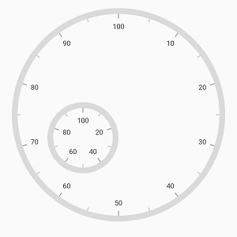

**Positioning axis based on its angle**

The [`canScaleToFit`](https://pub.dev/documentation/syncfusion_flutter_gauges/latest/gauges/RadialAxis/canScaleToFit.html) property of [`radial axis`](https://pub.dev/documentation/syncfusion_flutter_gauges/latest/gauges/RadialAxis-class.html) allows to position the axis and its features based on the provided [`start`](https://pub.dev/documentation/syncfusion_flutter_gauges/latest/gauges/RadialAxis/startAngle.html) and [`end angle`](https://pub.dev/documentation/syncfusion_flutter_gauges/latest/gauges/RadialAxis/endAngle.html). By default, the [`canScaleToFit`](https://pub.dev/documentation/syncfusion_flutter_gauges/latest/gauges/RadialAxis/canScaleToFit.html) is false, therefore the axis will be positioned based on the [`centerX`](https://pub.dev/documentation/syncfusion_flutter_gauges/latest/gauges/RadialAxis/centerX.html) and [`centerY`](https://pub.dev/documentation/syncfusion_flutter_gauges/latest/gauges/RadialAxis/centerY.html) value. 



  @override
    Widget build(BuildContext context) {
      return Scaffold(
        body: Center(
          child: SfRadialGauge(
            axes: <RadialAxis>[RadialAxis( startAngle: 180, endAngle: 0,
                interval: 10,
                canScaleToFit: true)]),
      ),
    );
  }



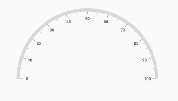

**Axis label rotation**

The axis label can be rotated based on its current angle using the [`canRotateLabels`](https://pub.dev/documentation/syncfusion_flutter_gauges/latest/gauges/RadialAxis/canRotateLabels.html) property of axis. The default value of [`canRotateLabels`](https://pub.dev/documentation/syncfusion_flutter_gauges/latest/gauges/RadialAxis/canRotateLabels.html) is false.



@override
Widget build(BuildContext context) {
  return Scaffold(
    body: Center(
     child: SfRadialGauge(
       axes:<RadialAxis>[RadialAxis(canRotateLabels: true)]
     ),
    ),
  );
}



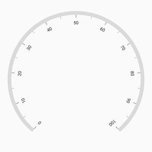

**Edge label customization**

The visibility of the first and last labels of an axis can be customized using the [`showFirstLabel`](https://pub.dev/documentation/syncfusion_flutter_gauges/latest/gauges/RadialAxis/showFirstLabel.html) and [`showLastLabel`](https://pub.dev/documentation/syncfusion_flutter_gauges/latest/gauges/RadialAxis/showLastLabel.html) properties. 

* [`showFirstLabel`](https://pub.dev/documentation/syncfusion_flutter_gauges/latest/gauges/RadialAxis/showFirstLabel.html) – Enables or disables the first label of the axis.
* [`showLastLabel`](https://pub.dev/documentation/syncfusion_flutter_gauges/latest/gauges/RadialAxis/showLastLabel.html) – Enables or disables the last label of the axis.

The default value of both the [`showFirstLabel`](https://pub.dev/documentation/syncfusion_flutter_gauges/latest/gauges/RadialAxis/showFirstLabel.html) and the [`showLastLabel`](https://pub.dev/documentation/syncfusion_flutter_gauges/latest/gauges/RadialAxis/showLastLabel.html) properties is true.



@override
Widget build(BuildContext context) {
  return Scaffold(
    body: Center(
     child: SfRadialGauge(
       axes:<RadialAxis>[RadialAxis( interval: 1, showFirstLabel: false,
           startAngle: 270, endAngle: 270, minimum: 0, maximum: 12),
        ]
      ),
    ),
  );
}



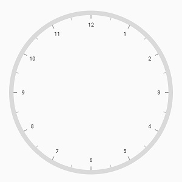

**Axis direction customization**

The direction of [`radial axis`](https://pub.dev/documentation/syncfusion_flutter_gauges/latest/gauges/RadialAxis-class.html) can be customized by its [`isInversed`](https://pub.dev/documentation/syncfusion_flutter_gauges/latest/gauges/RadialAxis/isInversed.html) property.

When the [`isInversed`](https://pub.dev/documentation/syncfusion_flutter_gauges/latest/gauges/RadialAxis/isInversed.html) property is true, the axis can be placed in counter-clockwise direction. When the  [`isInversed`](https://pub.dev/documentation/syncfusion_flutter_gauges/latest/gauges/RadialAxis/isInversed.html) property is set to false, the axis will be positioned in clockwise direction.



@override
Widget build(BuildContext context) {
  return Scaffold(
    body: Center(
     child: SfRadialGauge(
       axes:<RadialAxis>[RadialAxis( isInversed: true)]
      ),
    ),
  );
}



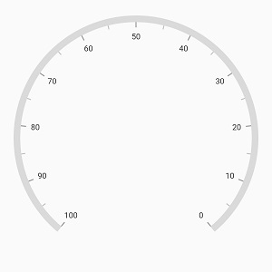

**Maximum number of labels per 100 logical pixels**

By default, a maximum of three labels are displayed for each 100 logical pixels in an axis. The maximum number of labels that should present within 100 logical pixels length can be customized using the [`maximumLabels`](https://pub.dev/documentation/syncfusion_flutter_gauges/latest/gauges/RadialAxis/maximumLabels.html) property of the axis. This property is applicable only for automatic range calculation and will not work if you set value for interval property of an axis.



@override
Widget build(BuildContext context) {
  return Scaffold(
    body: Center(
     child: SfRadialGauge(
       axes:<RadialAxis>[RadialAxis( maximumLabels: 5)]
      ),
    ),
  );
}



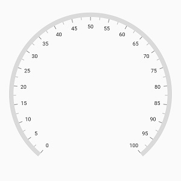

**Interval**

The interval between labels can be customized using the [`interval`](https://pub.dev/documentation/syncfusion_flutter_gauges/latest/gauges/RadialAxis/interval.html) property of axis.



@override
Widget build(BuildContext context) {
  return Scaffold(
    body: Center(
     child: SfRadialGauge(
       axes:<RadialAxis>[RadialAxis(interval: 20)]
      ),
    ),
  );
}



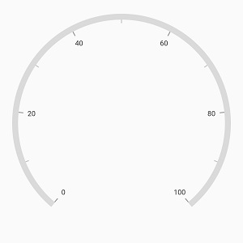

**Axis line customization**

The radial axis line can be customized using the [`axisLineStyle`](https://pub.dev/documentation/syncfusion_flutter_gauges/latest/gauges/RadialAxis/axisLineStyle.html) property. The following properties can be customized using [`axisLineStyle`](https://pub.dev/documentation/syncfusion_flutter_gauges/latest/gauges/RadialAxis/axisLineStyle.html).

* [`thickness`](https://pub.dev/documentation/syncfusion_flutter_gauges/latest/gauges/AxisLineStyle/thickness.html) – Customizes the thickness of axis line.
* [`thicknessUnit`](https://pub.dev/documentation/syncfusion_flutter_gauges/latest/gauges/AxisLineStyle/thicknessUnit.html) – Allows to specify the thickness of the axis either in logical pixel or factor. Its default value is logicalPixel.
* [`color`](https://pub.dev/documentation/syncfusion_flutter_gauges/latest/gauges/AxisLineStyle/color.html) – Customizes the color of the axis line.
* [`cornerStyle`](https://pub.dev/documentation/syncfusion_flutter_gauges/latest/gauges/AxisLineStyle/cornerStyle.html) – Allows to customize the corner of the axis line.
* [`dashArray`](https://pub.dev/documentation/syncfusion_flutter_gauges/latest/gauges/AxisLineStyle/dashArray.html) – Allows to customize the axis line as dashed circular arc.
* [`gradient`](https://pub.dev/documentation/syncfusion_flutter_gauges/latest/gauges/AxisLineStyle/gradient.html) - Allows to apply the gradient for axis line.



@override
Widget build(BuildContext context) {
  return Scaffold(
    body: Center(
     child: SfRadialGauge(
       axes:<RadialAxis>[RadialAxis(
         axisLineStyle: AxisLineStyle(thickness: 0.1,
           thicknessUnit: GaugeSizeUnit.factor, color: Colors.deepPurple,)),
        ]
      ),
    ),
  );
}



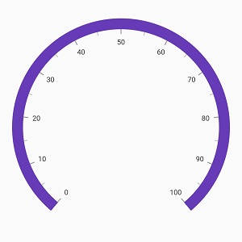

**Rounded Corners**

The [`cornerStyle`](https://pub.dev/documentation/syncfusion_flutter_gauges/latest/gauges/AxisLineStyle/cornerStyle.html) property of [`axisLineStyle`](https://pub.dev/documentation/syncfusion_flutter_gauges/latest/gauges/AxisLineStyle-class.html) specifies the corner type for axis line. The corners can be customized using the bothFlat, bothCurve, startCurve, and endCurve options. The default value of this property is bothFlat.



@override
Widget build(BuildContext context) {
  return Scaffold(
    body: Center(
     child: SfRadialGauge(
       axes:<RadialAxis>[RadialAxis(axisLineStyle: AxisLineStyle(thickness: 15,              
         cornerStyle:CornerStyle.bothCurve)),
        ]
      ),
    ),
  );
}


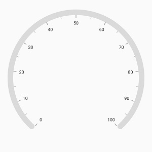

**Dashed axis line**

The [`dashArray`](https://pub.dev/documentation/syncfusion_flutter_gauges/latest/gauges/AxisLineStyle/dashArray.html) property of [`axisLineStyle`](https://pub.dev/documentation/syncfusion_flutter_gauges/latest/gauges/AxisLineStyle-class.html)  allows to render the dashed axis line.



@override
Widget build(BuildContext context) {
  return Scaffold(
    body: Center(
     child: SfRadialGauge(
       axes:<RadialAxis>[RadialAxis(
         axisLineStyle: AxisLineStyle( dashArray: <double>[5,5])),
        ]
      ),
    ),
  );
}



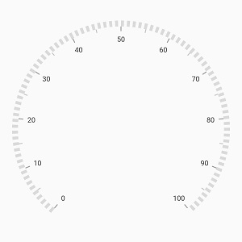

**Gradient support**

The [`gradient`](https://pub.dev/documentation/syncfusion_flutter_gauges/latest/gauges/AxisLineStyle/gradient.html) property of [`axisLineStyle`](https://pub.dev/documentation/syncfusion_flutter_gauges/latest/gauges/AxisLineStyle-class.html) allows to specify the smooth color transition to the axis line by specifying the different colors based on provided factor value.



@override
Widget build(BuildContext context) {
  return Scaffold(
    body: Center(
     child: SfRadialGauge(
            axes:<RadialAxis>[RadialAxis(
                axisLineStyle: AxisLineStyle(thickness: 0.1,
                thicknessUnit: GaugeSizeUnit.factor,
                  gradient: const SweepGradient(
                      colors: <Color>[Color(0xFFFF7676), Color(0xFFF54EA2)],
                      stops: <double>[0.25, 0.75]
                  ),
                )
              ),
            ]
        ),
    ),
  );
}



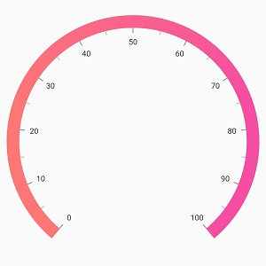

**Axis line visibility**

The visibility of the axis line can be customized using the [`showAxisLine`](https://pub.dev/documentation/syncfusion_flutter_gauges/latest/gauges/RadialAxis/showAxisLine.html) property of axis. By default, this property is set to true.



@override
Widget build(BuildContext context) {
  return Scaffold(
    body: Center(
     child: SfRadialGauge(
       axes:<RadialAxis>[RadialAxis(showAxisLine: false)]
      ),
    ),
  );
}



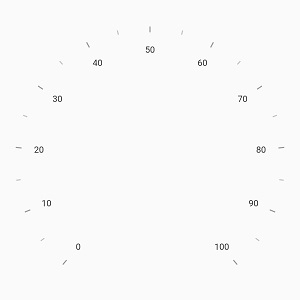

**Background color support**

[`Radial gauge`](https://pub.dev/documentation/syncfusion_flutter_gauges/latest/gauges/SfRadialGauge-class.html) allows customizing its background color using [`backgroundColor`](https://pub.dev/documentation/syncfusion_flutter_gauges/latest/gauges/SfRadialGauge/backgroundColor.html) property.



@override
  Widget build(BuildContext context) {
    return Scaffold(
      body: Center(
          child: SfRadialGauge(
        backgroundColor: Colors.lightBlue,
        axes: <RadialAxis>[RadialAxis()],
      )),
    );
  }



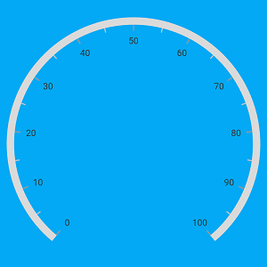

**Background image support**

[`Radial axis`](https://pub.dev/documentation/syncfusion_flutter_gauges/latest/gauges/RadialAxis-class.html) allows to add an image frame as its background using [`backgroundImage`](https://pub.dev/documentation/syncfusion_flutter_gauges/latest/gauges/RadialAxis/backgroundImage.html) property.



@override
 Widget build(BuildContext context) {
    return Scaffold(
      body: Center(
        child: Padding(
          padding: EdgeInsets.fromLTRB(10, 0, 10, 0),
          child: SfRadialGauge(
            axes: <RadialAxis>[
              RadialAxis(showAxisLine: false,
                  radiusFactor: 1, 
                  showLastLabel: false,
                  canRotateLabels: true,
                  tickOffset: 0.32,
                  offsetUnit: GaugeSizeUnit.factor,
                  onLabelCreated: axisLabelCreated,
                  startAngle: 270,
                  endAngle: 270,
                  labelOffset: 0.05,
                  maximum: 360,
                  minimum: 0,
                  interval: 30,
                  minorTicksPerInterval: 4,
                  axisLabelStyle: GaugeTextStyle(color: const Color(0xFF949494)),
                  minorTickStyle: MinorTickStyle(color: const Color(0xFF616161),
                      thickness: 1.6,
                      length: 0.058,
                      lengthUnit: GaugeSizeUnit.factor),
                  majorTickStyle: MajorTickStyle(color: const Color(0xFF949494),
                      thickness: 2.3,
                      length: 0.087,
                      lengthUnit: GaugeSizeUnit.factor),
                  backgroundImage: const AssetImage(
                      'images/dark_theme_gauge.png'),
                  pointers: <GaugePointer>[
                    MarkerPointer(value: 90,
                        color: const Color(0xFFDF5F2D),
                        enableAnimation: true,
                        animationDuration: 1200,
                        markerOffset: 0.71,
                        offsetUnit: GaugeSizeUnit.factor,
                        markerType: MarkerType.triangle,
                        markerHeight: 10,
                        markerWidth: 15)
                  ],
                  annotations: <GaugeAnnotation>[
                    GaugeAnnotation(angle: 270,
                      positionFactor:  0.025,
                      widget: Text('90',
                        style: TextStyle(
                          color: const Color(0xFFDF5F2D),
                            fontWeight: FontWeight.bold,
                            fontSize: 22
                            )
                          )
                        )
                  ]
              )
            ],
          ),
        )
      ),
    );
  }

  void axisLabelCreated(AxisLabelCreatedArgs args) {
    if (args.text == '90') {
      args.text = 'E';
      args.labelStyle = GaugeTextStyle(
          color: const Color(0xFFDF5F2D));
    }else{
      if (args.text == '0') {
        args.text = 'N';
      }else if (args.text == '180') {
        args.text = 'S';
      } else if (args.text == '270') {
        args.text = 'W';
      }

      args.labelStyle = GaugeTextStyle(
          color: const Color(0xFFFFFFFF),
      );
    }
  }



## Label style customization

The axis labels can be customized using the [`axisLabelStyle`](https://pub.dev/documentation/syncfusion_flutter_gauges/latest/gauges/RadialAxis/axisLabelStyle.html) property of axis. The following properties can be customized using the [`axisLabelStyle`](https://pub.dev/documentation/syncfusion_flutter_gauges/latest/gauges/RadialAxis/axisLabelStyle.html).

* [`color`](https://pub.dev/documentation/syncfusion_flutter_gauges/latest/gauges/GaugeTextStyle/color.html) – Allows to customize the color of the labels.
* [`fontFamily`](https://pub.dev/documentation/syncfusion_flutter_gauges/latest/gauges/GaugeTextStyle/fontFamily.html) – Allows to specify the font family for labels.
* [`fontStyle`](https://pub.dev/documentation/syncfusion_flutter_gauges/latest/gauges/GaugeTextStyle/fontStyle.html) – Allows to specify the font style for labels.
* [`fontWeight`](https://pub.dev/documentation/syncfusion_flutter_gauges/latest/gauges/GaugeTextStyle/fontWeight.html) – Allows to specify the font weight for labels.
* [`fontSize`](https://pub.dev/documentation/syncfusion_flutter_gauges/latest/gauges/GaugeTextStyle/fontSize.html) – Allows to specify the font size for labels.



@override
Widget build(BuildContext context) {
  return Scaffold(
    body: Center(
     child: SfRadialGauge(
       axes:<RadialAxis>[RadialAxis(axisLabelStyle: GaugeTextStyle(
            color: Colors.red, fontSize: 15, 
             fontStyle:FontStyle.italic,
             fontWeight: FontWeight.bold, fontFamily: 'Times') ),
        ]
      ),
    ),
  );
}



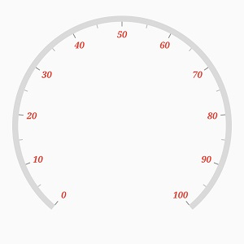

**Formatting axis label**

The following property of the axis allows to customize the axis label text.

* [`labelFormat`](https://pub.dev/documentation/syncfusion_flutter_gauges/latest/gauges/RadialAxis/labelFormat.html) - Allows to add prefix or suffix with the axis labels.



@override
Widget build(BuildContext context) {
  return Scaffold(
    body: Center(
     child: SfRadialGauge(
       axes:<RadialAxis>[RadialAxis(labelFormat: '{value}m' ),]
      ),
    ),
  );
}



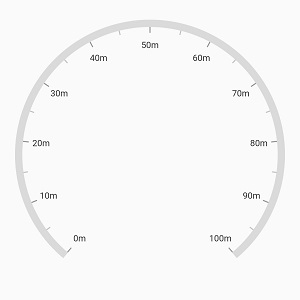

* [`numberFormat`](https://pub.dev/documentation/syncfusion_flutter_gauges/latest/gauges/RadialAxis/numberFormat.html)- Allows to customize the axis label with the [`globalized label format`](https://api.flutter.dev/flutter/intl/NumberFormat-class.html).



@override
Widget build(BuildContext context) {
  return Scaffold(
    body: Center(
     child: SfRadialGauge(
       axes:<RadialAxis>[RadialAxis(
        numberFormat: NumberFormat.compactSimpleCurrency()),
        ]
     ),
    ),

  );
}



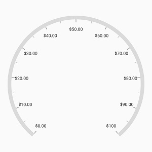

**Label visibility**

The [`showLabels`](https://pub.dev/documentation/syncfusion_flutter_gauges/latest/gauges/RadialAxis/showLabels.html) property of axis allows to enable or disable the visibility of labels. The default value of the property is true.



@override
Widget build(BuildContext context) {
  return Scaffold(
    body: Center(
     child: SfRadialGauge(
       axes:<RadialAxis>[RadialAxis(showLabels: false ),]
      ),
    ),
  );
}



## Tick customization

The major and minor tick lines of an axis can be customized using the [`majorTickStyle`](https://pub.dev/documentation/syncfusion_flutter_gauges/latest/gauges/RadialAxis/majorTickStyle.html) and [`minorTickStyle`](https://pub.dev/documentation/syncfusion_flutter_gauges/latest/gauges/RadialAxis/minorTickStyle.html) properties respectively. The following properties can be customized for both the major and the minor ticks:

* [`color`](https://pub.dev/documentation/syncfusion_flutter_gauges/latest/gauges/MajorTickStyle/color.html) – Allows to customize the tick color.

* [`thickness`](https://pub.dev/documentation/syncfusion_flutter_gauges/latest/gauges/MajorTickStyle/thickness.html) – Allows to customize the thickness of ticks.

* [`length`](https://pub.dev/documentation/syncfusion_flutter_gauges/latest/gauges/MajorTickStyle/length.html) – Specifics the length of ticks.

* [`lengthUnit`](https://pub.dev/documentation/syncfusion_flutter_gauges/latest/gauges/MajorTickStyle/lengthUnit.html) – Allows to specify the tick length either in logical pixels or factor.

* [`dashArray`](https://pub.dev/documentation/syncfusion_flutter_gauges/latest/gauges/MajorTickStyle/dashArray.html) – Specify the dash array to draw the dashed tick line.



@override
Widget build(BuildContext context) {
  return Scaffold(
    body: Center(
     child: SfRadialGauge(
       axes:<RadialAxis>[RadialAxis(majorTickStyle: MajorTickStyle(length: 0.1, 
       lengthUnit: GaugeSizeUnit.factor, thickness: 1.5, color: Colors.black),
         minorTickStyle: MinorTickStyle(length: 0.05, 
         lengthUnit: GaugeSizeUnit.factor, thickness: 1.5, color: Colors.black)
        )]
      ),
    ),
  );
}



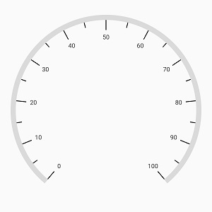

**Dashed tick lines**

The [`dashArray`](https://pub.dev/documentation/syncfusion_flutter_gauges/latest/gauges/MajorTickStyle/dashArray.html) property of both the [`majorTickStyle`](https://pub.dev/documentation/syncfusion_flutter_gauges/latest/gauges/RadialAxis/majorTickStyle.html) and [`minorTickStyle`](https://pub.dev/documentation/syncfusion_flutter_gauges/latest/gauges/RadialAxis/minorTickStyle.html) allows to draw the tick line as dashed line.



@override
Widget build(BuildContext context) {
  return Scaffold(
    body: Center(
     child: SfRadialGauge(
       axes:<RadialAxis>[RadialAxis(
         majorTickStyle: MajorTickStyle(length: 20, dashArray: <double>[5,2.5]),
         minorTickStyle: MinorTickStyle(length: 15, dashArray: <double>[3,2.5])),
        ]
      ),
    ),
  );
}



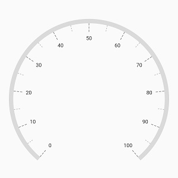

**Minor tick interval**

The major ticks are generated based on the [`interval`](https://pub.dev/documentation/syncfusion_flutter_gauges/latest/gauges/RadialAxis/interval.html) property. Like major ticks, the minor ticks are calculated using the [`minorTicksPerInterval`](https://pub.dev/documentation/syncfusion_flutter_gauges/latest/gauges/RadialAxis/minorTicksPerInterval.html) property of axis. By default, the value of this property is 1.



@override
Widget build(BuildContext context) {
  return Scaffold(
    body: Center(
     child: SfRadialGauge(
       axes:<RadialAxis>[RadialAxis(minorTicksPerInterval: 4
          ),
        ]
      ),
    ),
  );
}



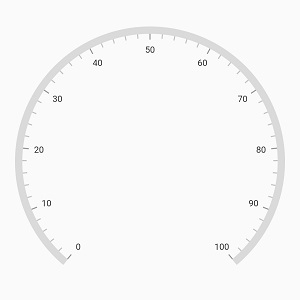

**Tick line visibility**

The [`showTicks`](https://pub.dev/documentation/syncfusion_flutter_gauges/latest/gauges/RadialAxis/showTicks.html) property of the axis is used to enable or disable the visibility of both the major and the minor ticks of axis. The default value of this property is true.



@override
Widget build(BuildContext context) {
  return Scaffold(
    body: Center(
     child: SfRadialGauge(
       axes:<RadialAxis>[RadialAxis(showTicks: false)]
      ),
    ),
  );
}



**Label and tick Placement**

The [`radial axis`](https://pub.dev/documentation/syncfusion_flutter_gauges/latest/gauges/RadialAxis-class.html) allows to position the labels and ticks either inside or outside the axis line using the [`labelsPosition`](https://pub.dev/documentation/syncfusion_flutter_gauges/latest/gauges/RadialAxis/labelsPosition.html) and [`ticksPosition`](https://pub.dev/documentation/syncfusion_flutter_gauges/latest/gauges/RadialAxis/ticksPosition.html) properties. By default, both labels and ticks are positioned inside the axis line.



@override
Widget build(BuildContext context) {
  return Scaffold(
    body: Center(
     child: SfRadialGauge(
       axes:<RadialAxis>[RadialAxis(
          labelsPosition: ElementsPosition.outside,
         ticksPosition: ElementsPosition.outside)]
      ),
    ),
  );
}



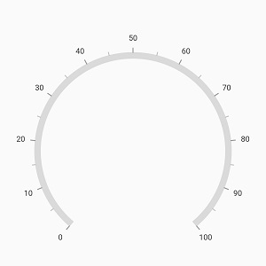

**Tick position customization**

The ticks can be moved near or far to the axis line using the [`tickOffset`](https://pub.dev/documentation/syncfusion_flutter_gauges/latest/gauges/RadialAxis/tickOffset.html) property. The [`offsetUnit`](https://pub.dev/documentation/syncfusion_flutter_gauges/latest/gauges/RadialAxis/offsetUnit.html) property of axis allows to specify the tick offset either in factor or logical pixels, and the default value of [`offsetUnit`](https://pub.dev/documentation/syncfusion_flutter_gauges/latest/gauges/RadialAxis/offsetUnit.html) is logicalPixel.

The default value of tick offset is 0. While setting offset for the ticks, the axis labels are also moved along with the ticks.



@override
Widget build(BuildContext context) {
  return Scaffold(
    body: Center(
     child: SfRadialGauge(
       axes:<RadialAxis>[RadialAxis(
          tickOffset: 20)]
      ),
    ),
  );
}



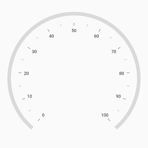

The following code example shows how to add tick offset with the [`offsetUnit`](https://pub.dev/documentation/syncfusion_flutter_gauges/latest/gauges/RadialAxis/offsetUnit.html) property of axis.



@override
Widget build(BuildContext context) {
  return Scaffold(
    body: Center(
     child: SfRadialGauge(
       axes:<RadialAxis>[RadialAxis(tickOffset: 0.2,
          labelOffset: 0.2, offsetUnit: GaugeSizeUnit.factor
          ),
        ]
      ),
    ),
  );
}



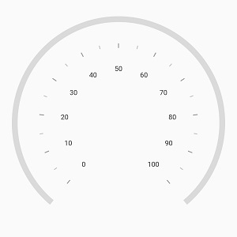

**Label position customization**

The [`labelOffset`](https://pub.dev/documentation/syncfusion_flutter_gauges/latest/gauges/RadialAxis/labelOffset.html) property allows to adjust the distance between the tick end and the labels. The [`offsetUnit`](https://pub.dev/documentation/syncfusion_flutter_gauges/latest/gauges/RadialAxis/offsetUnit.html) property of axis allows to specify the label offset either in factor or logical pixels. By default, the value of the label offset is 15.



@override
Widget build(BuildContext context) {
  return Scaffold(
    body: Center(
     child: SfRadialGauge(
       axes:<RadialAxis>[RadialAxis(
          labelOffset: 0.3, offsetUnit: GaugeSizeUnit.factor
          ),
        ]
      ),
    ),
  );
}



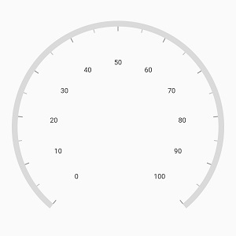

The [`offsetUnit`](https://pub.dev/documentation/syncfusion_flutter_gauges/latest/gauges/RadialAxis/offsetUnit.html)  property of axis is common for both the [`tickOffset`](https://pub.dev/documentation/syncfusion_flutter_gauges/latest/gauges/RadialAxis/tickOffset.html) and [`labelOffset`](https://pub.dev/documentation/syncfusion_flutter_gauges/latest/gauges/RadialAxis/labelOffset.html).

N> [`GaugeSizeUnit`](https://pub.dev/documentation/syncfusion_flutter_gauges/latest/gauges/GaugeSizeUnit.html) allows to specify the value either in logical pixels or in factor. GaugeSizeUnit.factor ranges from 0 to 1. For example, when setting factor as 0.5, the half of axis radius value will be considered.

## Multiple axis

The [`Radial Gauge`](https://pub.dev/documentation/syncfusion_flutter_gauges/latest/gauges/SfRadialGauge-class.html) allows you to add n number of radial axis in its axes collection. You can also customize individual axis added in the [`axes`](https://pub.dev/documentation/syncfusion_flutter_gauges/latest/gauges/SfRadialGauge/axes.html) collection.



@override
Widget build(BuildContext context) {
  return Scaffold(
    body: Center(
     child: SfRadialGauge(
       axes: <RadialAxis>[ RadialAxis(minimum:  0 , maximum: 100, interval: 10,
           ticksPosition: ElementsPosition.outside,
           labelsPosition: ElementsPosition.outside,

           minorTicksPerInterval: 5,
           radiusFactor: 0.9, labelOffset: 15,
           minorTickStyle: MinorTickStyle(thickness: 1.5,
            color: Color.fromARGB(255, 143, 20, 2),
            length: 0.07, lengthUnit: GaugeSizeUnit.factor),
           majorTickStyle: MinorTickStyle(thickness: 1.5,
             color: Color.fromARGB(255, 143, 20, 2),
             length: 0.15, lengthUnit: GaugeSizeUnit.factor,),
           axisLineStyle: AxisLineStyle( thickness: 3, 
            color: Color.fromARGB(255, 143, 20, 2), ),
           axisLabelStyle: GaugeTextStyle(fontSize: 12,
             color:Color.fromARGB(255, 143, 20, 2),),),

         RadialAxis(minimum:  0 , maximum: 60, interval: 10,
           radiusFactor:  0.6, labelOffset: 15, isInversed: true,
           minorTicksPerInterval: 5,
           minorTickStyle: MinorTickStyle(color: Colors.black, thickness: 1.5,
               lengthUnit: GaugeSizeUnit.factor, length: 0.07),
           majorTickStyle: MajorTickStyle(color: Colors.black, thickness: 1.5,
               lengthUnit: GaugeSizeUnit.factor, length: 0.15),
           axisLineStyle: AxisLineStyle(color: Colors.black, thickness: 3, ),
           axisLabelStyle: GaugeTextStyle(color:  Colors.black, fontSize: 12)),
        ],
      )
    ),
  );
}



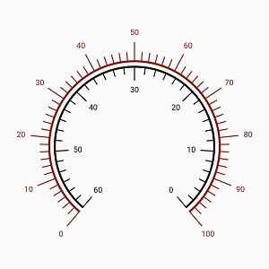

## Events

**onLabelCreated**

The [`onLabelCreated`](https://pub.dev/documentation/syncfusion_flutter_gauges/latest/gauges/RadialAxis/onLabelCreated.html) event is called when an axis label is created. The following properties can be customized for the corresponding axis label when this event args:

* [`text`](https://pub.dev/documentation/syncfusion_flutter_gauges/latest/gauges/AxisLabelCreatedArgs/text.html) – Allows to customize the text property of label.
* [`labelStyle`](https://pub.dev/documentation/syncfusion_flutter_gauges/latest/gauges/AxisLabelCreatedArgs/labelStyle.html) – Customizes the label color, font style, font family, and font weight.
* [`canRotate`](https://pub.dev/documentation/syncfusion_flutter_gauges/latest/gauges/AxisLabelCreatedArgs/canRotate.html) – Specifies whether to rotate the label based on its current angle.

N> If both [`axisLabelStyle`](https://pub.dev/documentation/syncfusion_flutter_gauges/latest/gauges/RadialAxis/axisLabelStyle.html) property of radial axis and [`labelStyle`](https://pub.dev/documentation/syncfusion_flutter_gauges/latest/gauges/AxisLabelCreatedArgs/labelStyle.html) property of the [`onLabelCreated`](https://pub.dev/documentation/syncfusion_flutter_gauges/latest/gauges/RadialAxis/onLabelCreated.html) event args are set, the values of the [`labelStyle`](https://pub.dev/documentation/syncfusion_flutter_gauges/latest/gauges/AxisLabelCreatedArgs/labelStyle.html) property of the event args will take precedence.



@override
Widget build(BuildContext context) {
  return Scaffold(
    body: Center(
     child: SfRadialGauge(
       axes:<RadialAxis>[RadialAxis(
          onLabelCreated:axisLabelCreated,),
        ]
      ),
    ),
  );
}

void axisLabelCreated(AxisLabelCreatedArgs args){
  if(args.text == '100'){
    args.labelStyle = GaugeTextStyle(color: Colors.red,fontStyle: FontStyle.italic,
        fontFamily: 'Times', fontWeight: FontWeight.bold, fontSize: 15);
    args.canRotate = true;
    args.text = '100 %';
  }
}



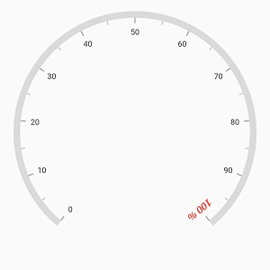

**onAxisTapped**

The [`onAxisTapped`](https://pub.dev/documentation/syncfusion_flutter_gauges/latest/gauges/RadialAxis/onAxisTapped.html) event is called when an axis is tapped. The corresponding axis value at the tapped position will be got from the event.



@override
Widget build(BuildContext context) {
  return Scaffold(
    body: Center(
     child: SfRadialGauge(
       axes:<RadialAxis>[RadialAxis(
          onAxisTapped: axisTapped),
        ]
      ),
    ),
  );
}

void axisTapped(double _tappedValue){
  
}



## Custom scale

[`Radial gauge`](https://pub.dev/documentation/syncfusion_flutter_gauges/latest/gauges/SfRadialGauge-class.html) allows you to display a set of values along with a custom scale based on your business logic using the [`onCreateAxisRenderer`](https://pub.dev/documentation/syncfusion_flutter_gauges/latest/gauges/RadialAxis/onCreateAxisRenderer.html) event of the axis. The `onCreateAxisRenderer` event allows returning the custom renderer for the axis. In that, we can override methods of `RadialAxisRenderer` to create the custom axis.


 @override
  Widget build(BuildContext context) {
    return Scaffold(
      body: Center(
        child: SfRadialGauge(axes: <RadialAxis>[
          RadialAxis(
            minimum: 0,
            maximum: 150,
            onCreateAxisRenderer: () {
              final CustomAxisRenderer renderer = CustomAxisRenderer();
              return renderer;
            },
          )
        ]),
      ),
    );
  }

class _CustomAxisRenderer extends RadialAxisRenderer {
  _CustomAxisRenderer() : super();

  /// Generated the 9 non-linear interval labels from 0 to 150
  /// instead of actual generated labels.
  @override
  List<CircularAxisLabel> generateVisibleLabels() {
    final List<CircularAxisLabel> _visibleLabels = <CircularAxisLabel>[];
    for (num i = 0; i < 9; i++) {
      final double _value = _calculateLabelValue(i);
      final CircularAxisLabel label = CircularAxisLabel(
          this.axis.axisLabelStyle, _value.toInt().toString(), i, false);
      label.value = _value;
      _visibleLabels.add(label);
    }

    return _visibleLabels;
  }

  /// Returns the factor(0 to 1) from value to place the labels in an axis.
  @override
  double valueToFactor(double value) {
    if (value >= 0 && value <= 2) {
      return (value * 0.125) / 2;
    } else if (value > 2 && value <= 5) {
      return (((value - 2) * 0.125) / (5 - 2)) + (1 * 0.125);
    } else if (value > 5 && value <= 10) {
      return (((value - 5) * 0.125) / (10 - 5)) + (2 * 0.125);
    } else if (value > 10 && value <= 20) {
      return (((value - 10) * 0.125) / (20 - 10)) + (3 * 0.125);
    } else if (value > 20 && value <= 30) {
      return (((value - 20) * 0.125) / (30 - 20)) + (4 * 0.125);
    } else if (value > 30 && value <= 50) {
      return (((value - 30) * 0.125) / (50 - 30)) + (5 * 0.125);
    } else if (value > 50 && value <= 100) {
      return (((value - 50) * 0.125) / (100 - 50)) + (6 * 0.125);
    } else if (value > 100 && value <= 150) {
      return (((value - 100) * 0.125) / (150 - 100)) + (7 * 0.125);
    } else {
      return 1;
    }
  }

  /// To return the label value based on interval
  double _calculateLabelValue(num value) {
    if (value == 0) {
      return 0;
    } else if (value == 1) {
      return 2;
    } else if (value == 2) {
      return 5;
    } else if (value == 3) {
      return 10;
    } else if (value == 4) {
      return 20;
    } else if (value == 5) {
      return 30;
    } else if (value == 6) {
      return 50;
    } else if (value == 7) {
      return 100;
    } else {
      return 150;
    }
  }
}



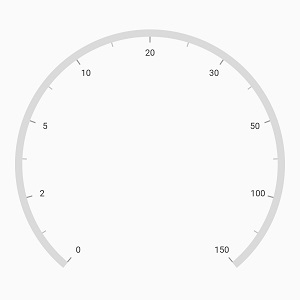

N> You can refer to our [Flutter Radial Gauge](https://www.syncfusion.com/flutter-widgets/flutter-radial-gauge) feature tour page for its groundbreaking feature representations. You can also explore our [Flutter Radial Gauge example](https://flutter.syncfusion.com/#/radial-gauge/axis/default-view) that shows how to configure a Radial Gauge in Flutter.