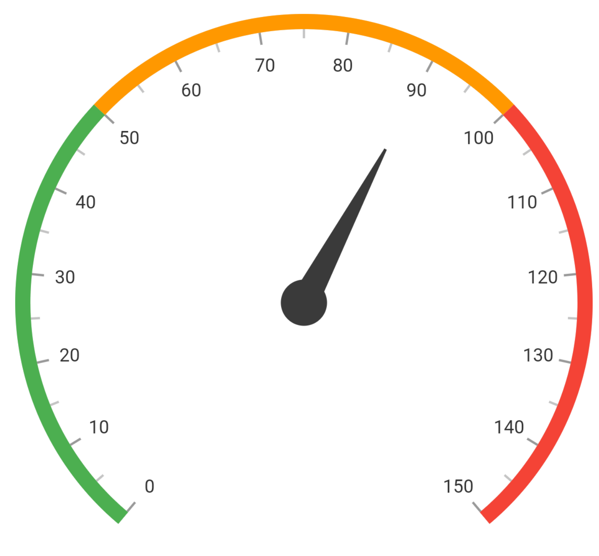
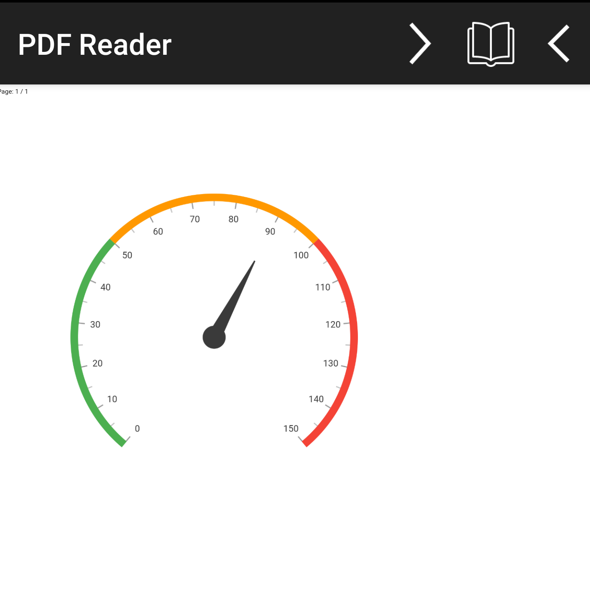

# Export in Flutter Radial Gauge (SfRadialGauge)

[`SfRadialGauge`](https://pub.dev/documentation/syncfusion_flutter_gauges/latest/gauges/SfRadialGauge-class.html) provides support to export the Radial Gauge as a PNG image or as a PDF document.

## Export image

To export the Radial Gauge as a PNG image, we can get the image by calling the [`toImage`](https://api.flutter.dev/flutter/rendering/RenderRepaintBoundary/toImage.html) method on a repaint boundary.

### Add required packages

Add the following packages to your `pubspec.yaml` file:

```yaml
dependencies:
  flutter:
    sdk: flutter
  syncfusion_flutter_gauges: ^xx.x.x
```

### Export image example




import 'package:flutter/material.dart';
import 'package:syncfusion_flutter_gauges/gauges.dart';
import 'dart:ui' as ui;

void main() => runApp(const ExportGaugeDemo());

class ExportGaugeDemo extends StatelessWidget {
  const ExportGaugeDemo({Key? key}) : super(key: key);

  @override
  Widget build(BuildContext context) {
    return const MaterialApp(
      home: ExportGaugeImagePage(),
    );
  }
}

class ExportGaugeImagePage extends StatefulWidget {
  const ExportGaugeImagePage({Key? key}) : super(key: key);

  @override
  State<ExportGaugeImagePage> createState() => _ExportGaugeImagePageState();
}

class _ExportGaugeImagePageState extends State<ExportGaugeImagePage> {
  final GlobalKey _globalKey = GlobalKey();

  @override
  Widget build(BuildContext context) {
    return Scaffold(
      appBar: AppBar(title: const Text('Export Gauge to Image')),
      body: Column(
        children: [
          Container(
            height: 400,
            width: 400,
            child: RepaintBoundary(
              key: _globalKey,
              child: SfRadialGauge(
                axes: <RadialAxis>[
                  RadialAxis(
                    minimum: 0,
                    maximum: 150,
                    ranges: <GaugeRange>[
                      GaugeRange(
                        startValue: 0,
                        endValue: 50,
                        color: Colors.green,
                        startWidth: 10,
                        endWidth: 10,
                      ),
                      GaugeRange(
                        startValue: 50,
                        endValue: 100,
                        color: Colors.orange,
                        startWidth: 10,
                        endWidth: 10,
                      ),
                      GaugeRange(
                        startValue: 100,
                        endValue: 150,
                        color: Colors.red,
                        startWidth: 10,
                        endWidth: 10,
                      ),
                    ],
                    pointers: <GaugePointer>[
                      NeedlePointer(value: 90),
                    ],
                  ),
                ],
              ),
            ),
          ),
          Padding(
            padding: const EdgeInsets.only(top: 5.0),
            child: ElevatedButton(
              onPressed: _renderGaugeImage,
              child: const Text('Gauge to Image'),
            ),
          ),
        ],
      ),
    );
  }

  Future<void> _renderGaugeImage() async {
    final RenderRepaintBoundary? boundary =
        _globalKey.currentContext?.findRenderObject() as RenderRepaintBoundary?;
    
    if (boundary != null) {
      final ui.Image data = await boundary.toImage(pixelRatio: 3.0);
      final ByteData? bytes =
          await data.toByteData(format: ui.ImageByteFormat.png);
      
      if (bytes != null) {
        if (mounted) {
          await Navigator.of(context).push(
            MaterialPageRoute(
              builder: (BuildContext context) {
                return Scaffold(
                  appBar: AppBar(title: const Text('Gauge Image')),
                  body: Center(
                    child: Container(
                      color: Colors.white,
                      child: Image.memory(bytes.buffer.asUint8List()),
                    ),
                  ),
                );
              },
            ),
          );
        }
      }
    }
  }






## Export PDF

Similar to the image export, you can also export the rendered gauge as a PDF document. This requires the syncfusion_flutter_pdf package to create the PDF.

### Add required packages

Add the following packages to your `pubspec.yaml` file:

```yaml
dependencies:
  flutter:
    sdk: flutter
  syncfusion_flutter_gauges: ^xx.x.x
  syncfusion_flutter_pdf: ^xx.x.x
  path_provider: ^x.x.x
  open_file: ^x.x.x
```

### Platform permissions

**Android**: Requires `WRITE_EXTERNAL_STORAGE` permission. Update your `AndroidManifest.xml` file in `android/app/src/main/` and add the following permission:

```xml
<uses-permission android:name="android.permission.WRITE_EXTERNAL_STORAGE" />
```

### Export PDF example




import 'package:flutter/material.dart';
import 'package:syncfusion_flutter_gauges/gauges.dart';
import 'package:syncfusion_flutter_pdf/pdf.dart';
import 'package:path_provider/path_provider.dart';
import 'package:open_file/open_file.dart';
import 'dart:io';
import 'dart:typed_data';
import 'dart:ui' as ui;

void main() => runApp(const ExportPDFGaugeDemo());

class ExportPDFGaugeDemo extends StatelessWidget {
  const ExportPDFGaugeDemo({Key? key}) : super(key: key);

  @override
  Widget build(BuildContext context) {
    return const MaterialApp(
      home: ExportGaugePDFPage(),
    );
  }
}

class ExportGaugePDFPage extends StatefulWidget {
  const ExportGaugePDFPage({Key? key}) : super(key: key);

  @override
  State<ExportGaugePDFPage> createState() => _ExportGaugePDFPageState();
}

class _ExportGaugePDFPageState extends State<ExportGaugePDFPage> {
  final GlobalKey _globalKey = GlobalKey();

  @override
  Widget build(BuildContext context) {
    return Scaffold(
      appBar: AppBar(title: const Text('Export Gauge to PDF')),
      body: Column(
        children: [
          Container(
            height: 400,
            width: 400,
            child: RepaintBoundary(
              key: _globalKey,
              child: SfRadialGauge(
                axes: <RadialAxis>[
                  RadialAxis(
                    minimum: 0,
                    maximum: 150,
                    ranges: <GaugeRange>[
                      GaugeRange(
                        startValue: 0,
                        endValue: 50,
                        color: Colors.green,
                        startWidth: 10,
                        endWidth: 10,
                      ),
                      GaugeRange(
                        startValue: 50,
                        endValue: 100,
                        color: Colors.orange,
                        startWidth: 10,
                        endWidth: 10,
                      ),
                      GaugeRange(
                        startValue: 100,
                        endValue: 150,
                        color: Colors.red,
                        startWidth: 10,
                        endWidth: 10,
                      ),
                    ],
                    pointers: <GaugePointer>[
                      NeedlePointer(value: 90),
                    ],
                  ),
                ],
              ),
            ),
          ),
          Padding(
            padding: const EdgeInsets.only(top: 5.0),
            child: ElevatedButton(
              onPressed: _renderGaugePDF,
              child: const Text('Gauge to PDF'),
            ),
          ),
        ],
      ),
    );
  }

  Future<void> _renderGaugePDF() async {
    final RenderRepaintBoundary? boundary =
        _globalKey.currentContext?.findRenderObject() as RenderRepaintBoundary?;
    
    if (boundary != null) {
      final ui.Image data = await boundary.toImage(pixelRatio: 3.0);
      final ByteData? bytes =
          await data.toByteData(format: ui.ImageByteFormat.png);
      
      if (bytes != null) {
        final Uint8List imageBytes =
            bytes.buffer.asUint8List(bytes.offsetInBytes, bytes.lengthInBytes);

        final PdfDocument document = PdfDocument();
        final PdfPage page = document.pages.add();
        final PdfBitmap bitmap = PdfBitmap(imageBytes);
        
        page.graphics.drawImage(
          bitmap,
          const Rect.fromLTWH(25, 50, 300, 300),
        );

        final List<int> byteData = document.save();
        document.dispose();

        final Directory? directory = await getExternalStorageDirectory();
        if (directory != null) {
          final String path = directory.path;
          final File file = File('$path/Output.pdf');
          
          await file.writeAsBytes(byteData, flush: true);
          
          if (mounted) {
            await OpenFile.open('$path/Output.pdf');
          }
        }
      }
    }
  }
}




