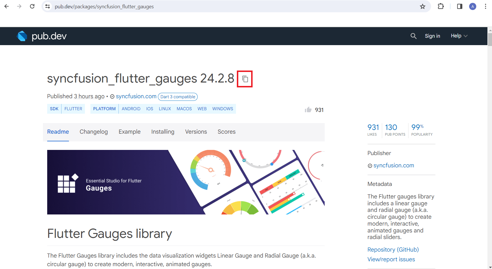
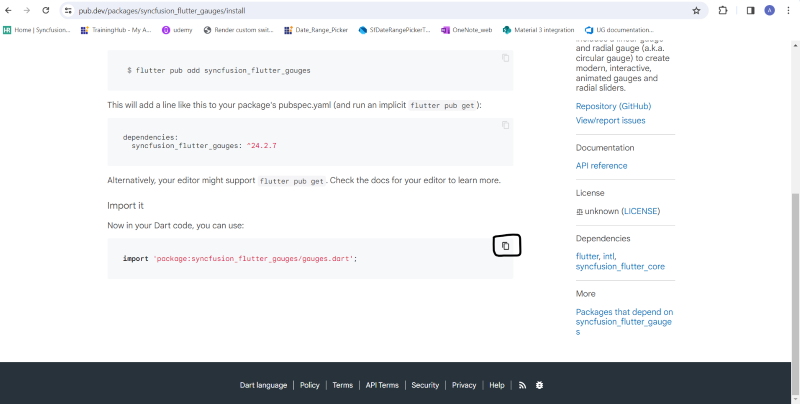
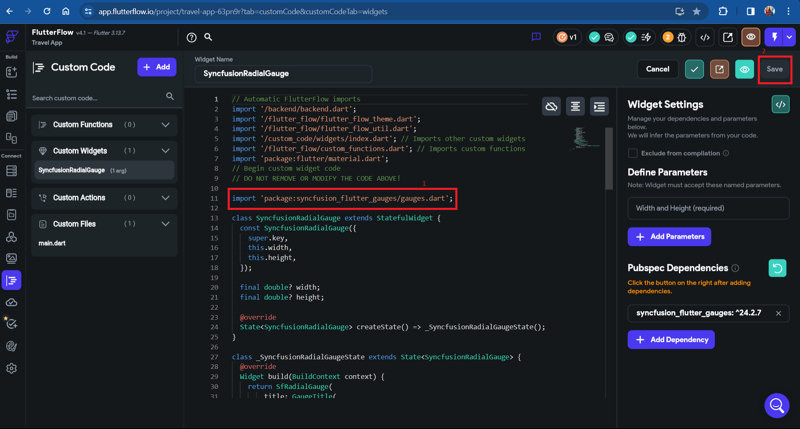
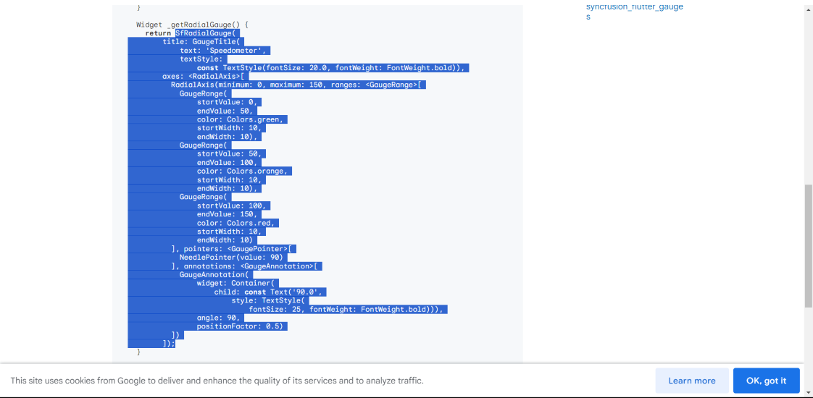

# How to add Flutter widgets in Flutter Flow framework?

## Overview of Flutter Flow

Flutter Flow is a visual programming tool designed to simplify the development process of Flutter applications, particularly for those who may not have extensive experience with traditional coding. It allows users to create Flutter apps through a drag-and-drop interface, reducing the need for manual coding and speeding up the development cycle.

Steps on how to create a Flutter widget in [Flutter Flow](https://app.flutterflow.io/) for a custom widget:

## Integrating a Custom Widget

To integrate the RadialGauge example into the Flutter Flow control, we aim to streamline the process for creating custom widgets, such as the RadialGauge, within the Flutter framework.

### Steps/Guidelines for Creating the Custom Widget:

1. [Creating Your Own Widget](#step-1-creating-your-own-widget)
2. [Requirements for Including a Dependency](#step-2-requirements-for-including-a-dependency)
3. [Importing Packages from the Dependency](#step-3-importing-packages-from-the-dependency)
4. [Adding the Widget Code Snippet in Code Editor](#step-4-adding-the-widget-code-snippet-in-code-editor)
5. [Compiling Code](#step-5-compiling-code)
6. [Utilizing the Custom Widget within a Page](#step-6-utilizing-the-custom-widget-within-a-page)

## Step 1: Creating Your Own Widget

1. Select the custom widget option in the navigation bar.
2. After clicking on the custom widget, you can see a "+ Add" button on the left side after custom code. Click on it to add a new custom widget; initially, the name shows as 'NewCustomWidget' for the custom widget.
3. Rename the custom widget as required custom name.
4. Go to 'view boilerplate code' on the right side [</>] like this symbol, click on it, and a popup will be displayed scroll down you can see the button with [</>] 'copy to editor' click on it.
5. After this save the process.

Small demo for custom widget creation:

-> need to add demo

## Step 2: Requirements for Including a Dependency

To add dependencies to the custom widget, follow the following steps:

1. Go to [pub.dev](https://pub.dev/), search for the required dependency in search bar.

2. To use the dependency code in your code editor, copy its name with the version, do it as shown in the below snapshot.

3. Add the dependency on the right side with the 'add dependency' button, after adding dependency save the process.

Small demo for adding dependencies:

-> need to add demo

## Step 3: Importing Packages from the Dependency

To import the packages from the dependency, follow the following steps:

1. Get the package header from the [installing](https://pub.dev/packages/syncfusion_flutter_gauges/install) tab on [pub.dev](https://pub.dev/) and scroll down to get package to copy.

Copy the package as shown in snapshot

2. Add the header in the code editor as shown in the below snapshot,

3. Save the process.

## Step 4: Adding the Widget Code Snippet in Code Editor

To add the code snippet in the code editor follow the following steps:

1. Go to [example](https://pub.dev/packages/syncfusion_flutter_gauges/example) tab in [pub.dev](https://pub.dev/) and scroll down to see widget code.

2. Don't copy the entire code snippet, select only widget snippet and copy it as shown in the below picture,

 
    
    Note: Don't copy the entire code, copy the only widget code as shown in above snapshot.



3. Add the copied code snippet and save the process as shown in the demo.

Small demo for adding dependencies:

-> need to add demo

## Step 5: Compiling Code

To compile the code:

1. Once you add your code, now you can compile and check for errors. To compile the code, click on the compile button on the right side as shown in the demo and save the process.

Small demo for adding dependencies:

-> need to add demo

## Step 6: Utilizing the Custom Widget within a Page

To use this custom widget on the page follow the following steps:

1. In the navigation bar click on the widget palette.
2. Now, you can see a diamond symbol click on that icon.
3. When you click on it below to that you can see the custom code widget with your widget file.
4. To get onto the page just drag and drop it on the page.
5. Adjust the width and height of the widget by utilizing the custom widget properties available on the right side.

Small demo for adding dependencies:

-> need to add demo
