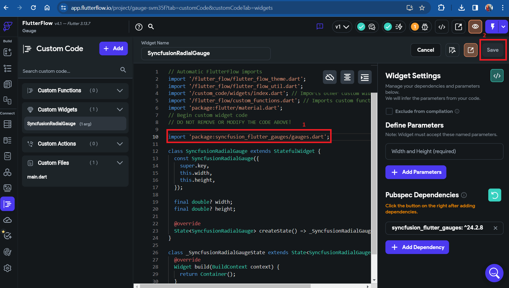
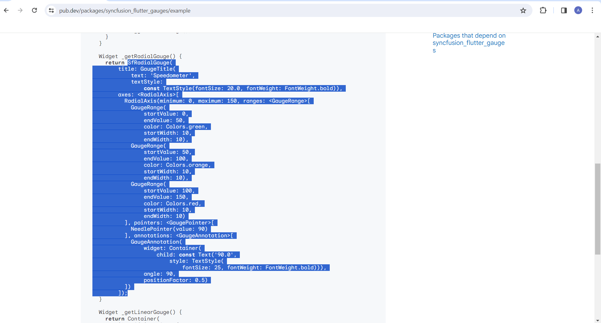

# How to add Syncfusion Radial Gauge Widgets in FlutterFlow framework?

## Overview of FlutterFlow

[FlutterFlow](https://app.flutterflow.io/) is a visual programming tool designed to simplify the development process of Flutter applications, particularly for those who may not have extensive experience with traditional coding. It allows users to create Flutter apps through a drag-and-drop interface, reducing the need for manual coding and speeding up the development cycle.

### Steps for creating the custom widget:

Before proceeding with the steps, please visit [FlutterFlow](https://app.flutterflow.io/) and sign up or sign in. Once logged in, on the start page of FlutterFlow, locate the **+ create new** button and click on it. A popup for creating a new project will appear. Firstly, provide a name for your project and then select **create blank** below the project name. After that, you can choose to **skip** or **enable web** in the project page setup, and click on **next**. This will navigate you to the project's homepage. Now, follow the steps below to create a custom widget.

## Step 1: Creating the custom widget

1. Navigate to [FlutterFlow](https://app.flutterflow.io/) and select the **custom code** option from the left side of the navigation menu.
2. Click on the **+ Add** button. You will be presented with three options: Function, Widget, and Action. Choose **Widget**.
3. Initially, the widget name shows as **NewCustomWidget**. Rename the widget name.
4. Go to widget settings on the right side, and click on the **View Boilerplate Code** button, represented by this icon **[</>]**.
5. A popup will appear; scroll down to find the button labeled **[</>] copy to editor**, and click on it.
6. Save the widget.

-> need to add video

## Step 2: Requirements for including a dependency

To add dependencies to the custom widget, follow these steps:

1. Visit [pub.dev](https://pub.dev/) and search for the [Syncfusion Radial Gauge](https://pub.dev/packages/syncfusion_flutter_gauges) dependency using the search bar.

2. Once you've found the dependency, copy its name along with the version, as demonstrated in the snapshot below.

3. Click on the **+ add dependency** button located on the right side to add the dependency. Once added, save the process.

## Step 3: Importing packages from the dependency

To import the packages from the dependency, follow these steps:

1. From the [installing](https://pub.dev/packages/syncfusion_flutter_gauges/install) tab on [pub.dev](https://pub.dev/). Scroll down to find the package to copy, as illustrated in the snapshot.

2. Insert the header into the code editor as represented in the snapshot below, and then save the process.

## Step 4: Adding the widget code snippet in code editor

To add the code snippet in the code editor, follow these steps:

1. Navigate to the [example](https://pub.dev/packages/syncfusion_flutter_gauges/example) tab on [pub.dev](https://pub.dev/), and scroll down to find the widget code.

2. Instead of copying the entire code, select only the widget snippet, and copy it as illustrated in the picture below.

    
N> Don't copy the entire code, copy only the widget code.

3. Add the copied code snippet to the code editor and save the process, follow the steps shown in the video.

-> need to add video.

## Step 5: Compiling code

To compile the code:

1. To compile the code, click on the compile button located on the right side, as demonstrated in the video, and then save the process.

-> need to add video.

## Step 6: Utilizing the custom widget on a page

To use this custom widget on the page, follow these steps:

1. On the left navigation menu, click on the widget palette.
2. You will see a diamond symbol; click on that icon.
3. Once clicked, you will find the custom code widget with your widget file name listed below it.
4. To add it to the page, simply drag and drop it on the page.
5. Adjust the width and height of the widget using the custom widget properties available on the right side navigation menu in [FlutterFlow](https://app.flutterflow.io/).

