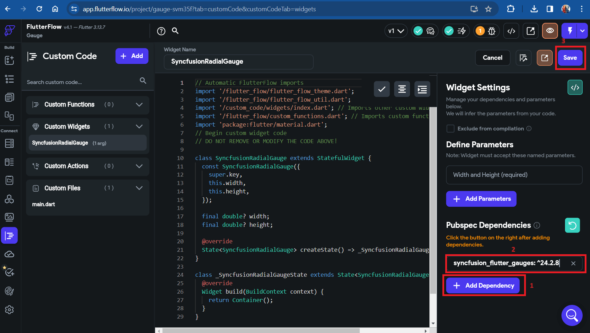
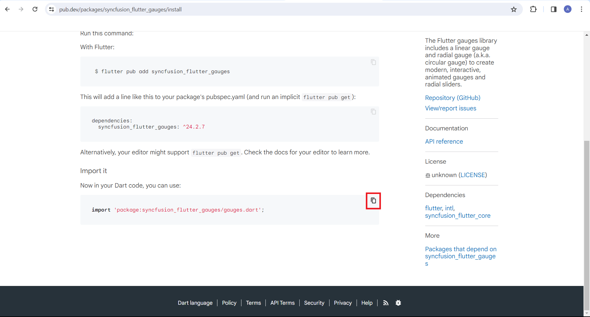
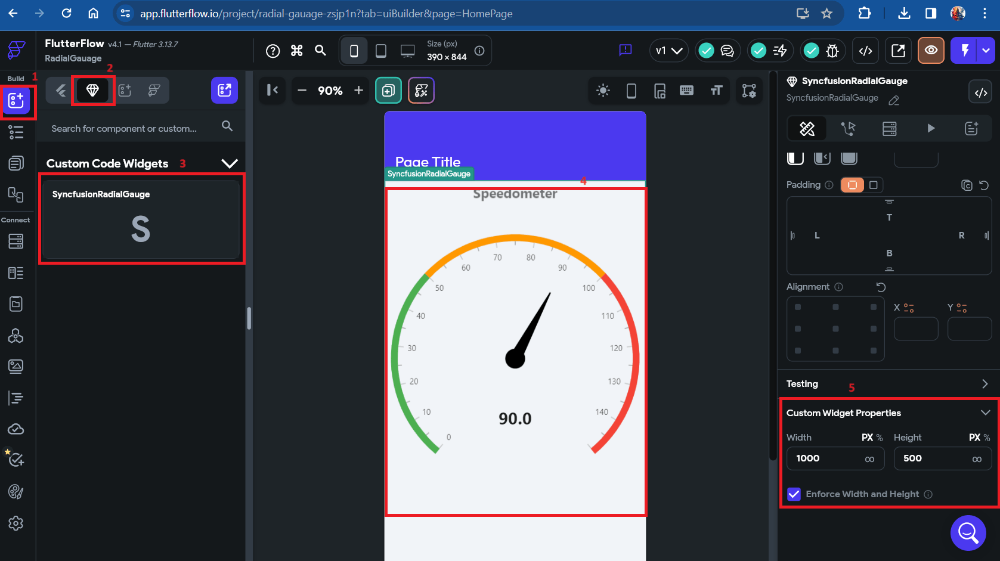

# How to add Syncfusion Radial Gauge Widgets in FlutterFlow framework?

## Overview of FlutterFlow

[FlutterFlow](https://app.flutterflow.io/) is a visual programming tool designed to simplify the development process of Flutter applications, particularly for those who may not have extensive experience with traditional coding. It allows users to create Flutter apps through a drag-and-drop interface, reducing the need for manual coding and speeding up the development cycle.

### Steps for creating the custom widget:

## Step 1: Creating the custom widget

1. Go to [FlutterFlow](https://app.flutterflow.io/), click custom widget at the left side of navigator bar.After clicking on the custom widget, you can see a "+ Add" button.
2. Click on "Add" button to add a new custom widget. Initially, the name shows as 'NewCustomWidget' for the custom widget. Rename the custom widget.
4. Go to widget settings on the right side [</>] like this icon is visible, click on it a popup will be displayed scroll down you can see the button with [</>] 'copy to editor' click on it.
5. After this save the process.

-> need to add video

## Step 2: Requirements for including a dependency

To add dependencies to the custom widget, follow the following steps:

1. Go to [pub.dev](https://pub.dev/), search for the required dependency in search bar.

2. To use the dependency code in your code editor, copy its name with the version, do it as shown in the below snapshot.

3. Add the dependency on the right side with the 'add dependency' button click on it and paste the dependency, after adding dependency save the process.

## Step 3: Importing packages from the dependency

To import the packages from the dependency, follow the following steps:

1. Get the package header from the [installing](https://pub.dev/packages/syncfusion_flutter_gauges/install) tab on [pub.dev](https://pub.dev/) and scroll down to get package to copy.

Copy the package as shown in snapshot.

2. Add the header in the code editor as shown in the below snapshot and save the process.

## Step 4: Adding the widget code snippet in code editor

To add the code snippet in the code editor follow the following steps:

1. Go to [example](https://pub.dev/packages/syncfusion_flutter_gauges/example) tab in [pub.dev](https://pub.dev/) and scroll down to see widget code.

2. Don't copy the entire code snippet, select only widget snippet and copy it as shown in the below picture,

    
N> Don't copy the entire code, copy the only widget code as shown in above snapshot.

3. Add the copied code snippet and save the process as shown in the video.

-> need to add video.

## Step 5: Compiling code

To compile the code:

1. Once you add your code, now you can compile and check for errors. To compile the code, click on the compile button on the right side as shown in the video and save the process.

-> need to add video.

## Step 6: Utilizing the custom widget on a page

To use this custom widget on the page follow the following steps:

1. On the left navigation bar click on the widget palette.
2. Now, you can see a diamond symbol click on that icon.
3. When you click on it below to that you can see the custom code widget with your widget file name.
4. To get onto the page just drag and drop it on the page.
5. Adjust the width and height of the widget by utilizing the custom widget properties available on the right side navigation bar in [FlutterFlow](https://app.flutterflow.io/).

