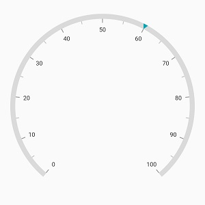
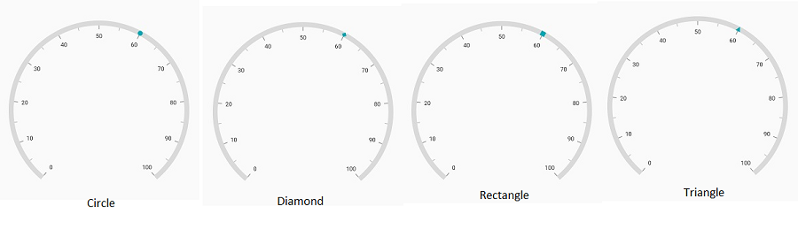
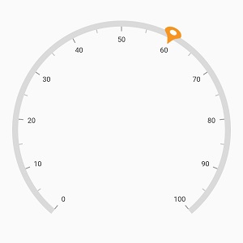
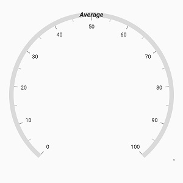
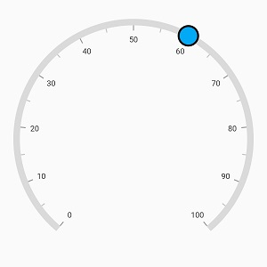
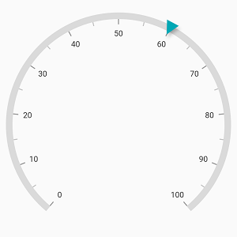
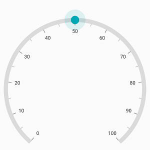
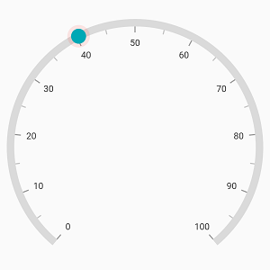
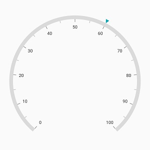

# Marker pointer in Flutter Radial Gauge (SfRadialGauge)

Different types of markers are used to mark the pointer values in a scale. You can change the marker type using the [`markerType`](https://pub.dev/documentation/syncfusion_flutter_gauges/latest/gauges/MarkerPointer/markerType.html) property. 



  @override
  Widget build(BuildContext context) {
    return Scaffold(
      body: Center(
        child: SfRadialGauge(
          axes: <RadialAxis>[
            RadialAxis(
              pointers: <GaugePointer>[
                MarkerPointer(value: 60)
              ]
            )
          ],
        )
      ),
    );
  }



Gauge supports the following types of marker:

* Circle
* Diamond
* Image
* Inverted triangle
* Rectangle
* Text
* Triangle

## Image pointer

An Image can be used to denote the current pointer values instead of a shape. This can be achieved by setting the  [`markerType`](https://pub.dev/documentation/syncfusion_flutter_gauges/latest/gauges/MarkerPointer/markerType.html) as image and specifying the [`imageUrl`](https://pub.dev/documentation/syncfusion_flutter_gauges/latest/gauges/MarkerPointer/imageUrl.html) property of the marker pointer.



  @override
  Widget build(BuildContext context) {
    return Scaffold(
      body: Center(
        child: SfRadialGauge(
          axes: <RadialAxis>[
            RadialAxis(
              pointers: <GaugePointer>[
                MarkerPointer(
                  value: 60,
                  markerType: MarkerType.image,
                  markerHeight: 30,
                  markerWidth: 30,
                  imageUrl: 'images/pin.png'
                )
              ]
            )
          ],
        )
      ),
    );
  }



## Text pointer

Text can be used to denote the current pointer value instead of any marker shape. This can be achieved by setting the [`markerType`](https://pub.dev/documentation/syncfusion_flutter_gauges/latest/gauges/MarkerPointer/markerType.html)  as text. The provided text can be customized using the [`textStyle`](https://pub.dev/documentation/syncfusion_flutter_gauges/latest/gauges/MarkerPointer/textStyle.html) property of the marker pointer.



  @override
  Widget build(BuildContext context) {
    return Scaffold(
      body: Center(
        child: SfRadialGauge(
          axes: <RadialAxis>[
            RadialAxis(
              pointers: <GaugePointer>[
                MarkerPointer(
                  value: 50,
                  markerType: MarkerType.text, 
                  text: 'Average',
                  textStyle: GaugeTextStyle(
                    fontSize: 15,
                    fontWeight: FontWeight.bold,
                    fontStyle: FontStyle.italic
                  )
                )
              ]
            )
          ],
        )
      ),
    );
  }



## Marker Customization

The marker pointer can be customized using the following properties:

* [`color`](https://pub.dev/documentation/syncfusion_flutter_gauges/latest/gauges/MarkerPointer/color.html) – Allows you to customize the marker color.
* [`markerHeight`](https://pub.dev/documentation/syncfusion_flutter_gauges/latest/gauges/MarkerPointer/markerHeight.html) – Allows you to specify the marker height.
* [`markerWidth`](https://pub.dev/documentation/syncfusion_flutter_gauges/latest/gauges/MarkerPointer/markerWidth.html) – Allows you to specify the marker width.
* [`borderColor`](https://pub.dev/documentation/syncfusion_flutter_gauges/latest/gauges/MarkerPointer/borderColor.html) – Allows you to specify the border color for the marker.
* [`borderWidth`](https://pub.dev/documentation/syncfusion_flutter_gauges/latest/gauges/MarkerPointer/borderWidth.html) –  Allows you to specify the border width of the marker.



  @override
  Widget build(BuildContext context) {
    return Scaffold(
      body: Center(
        child: SfRadialGauge(
          axes: <RadialAxis>[
            RadialAxis(
              pointers: <GaugePointer>[
                MarkerPointer(
                  value: 60,
                  markerHeight: 30, 
                  markerWidth: 30,
                  markerType: MarkerType.circle, 
                  color: Colors.lightBlue,
                  borderWidth: 3, 
                  borderColor: Colors.black
                )
              ]
            )
          ],
        )
      ),
    );
  }



**Marker elevation**

The marker pointer can be elevated by rendering its shadow behind it. The z- coordinate position at which the shadow can be positioned relative to the marker can be controlled by the [`elevation`](https://pub.dev/documentation/syncfusion_flutter_gauges/latest/gauges/MarkerPointer/elevation.html) property.



  @override
  Widget build(BuildContext context) {
    return Scaffold(
      body: Center(
        child: SfRadialGauge(
          axes: <RadialAxis>[
            RadialAxis(
              pointers: <GaugePointer>[
                MarkerPointer(
                  value: 60, 
                  markerHeight: 20, 
                  markerWidth: 20, 
                  elevation: 4
                )
              ]
            )
          ],
        )
      ),
    );
  }



The shadow color of the pointer is black by default and the default value of [`elevation`](https://pub.dev/documentation/syncfusion_flutter_gauges/latest/gauges/MarkerPointer/elevation.html) is 0.

N> The [`elevation`](https://pub.dev/documentation/syncfusion_flutter_gauges/latest/gauges/MarkerPointer/elevation.html) property applies to all the marker types except [`MarkerType.image`](https://pub.dev/documentation/syncfusion_flutter_gauges/latest/gauges/MarkerType.html) and [`MarkerType.text`](https://pub.dev/documentation/syncfusion_flutter_gauges/latest/gauges/MarkerType.html).

**Marker overlay**

The marker overlay is rendered around the marker when the marker is dragged. When [`enableDragging`](https://pub.dev/documentation/syncfusion_flutter_gauges/latest/gauges/GaugePointer/enableDragging.html) property of the marker is set to true and while dragging the marker, the overlay will appear  around the marker pointer.



  @override
  Widget build(BuildContext context) {
    return Scaffold(
      body: Center(
        child: SfRadialGauge(
          axes: <RadialAxis>[
            RadialAxis(
              pointers: <GaugePointer>[
                MarkerPointer(
                  value: 60,
                  markerHeight: 20,
                  markerWidth: 20,
                  enableDragging: true,
                  markerType: MarkerType.circle
                )
              ]
            )
          ],
        )
      ),
    );
  }



By default, the [`overlayRadius`](https://pub.dev/documentation/syncfusion_flutter_gauges/latest/gauges/MarkerPointer/overlayRadius.html) is calculated based on the provided [`markerHeight`](https://pub.dev/documentation/syncfusion_flutter_gauges/latest/gauges/MarkerPointer/markerHeight.html) and [`markerWidth`](https://pub.dev/documentation/syncfusion_flutter_gauges/latest/gauges/MarkerPointer/markerWidth.html) property and the [`overlayColor`](https://pub.dev/documentation/syncfusion_flutter_gauges/latest/gauges/MarkerPointer/overlayColor.html) is derived from the [`marker color`](https://pub.dev/documentation/syncfusion_flutter_gauges/latest/gauges/MarkerPointer/color.html). The following properties are used to customize the overlay color and its radius,

* [`overlayColor`](https://pub.dev/documentation/syncfusion_flutter_gauges/latest/gauges/MarkerPointer/overlayColor.html) – Allows customizing the overlay color.

* [`overlayRadius`](https://pub.dev/documentation/syncfusion_flutter_gauges/latest/gauges/MarkerPointer/overlayRadius.html) – Allows customizing the overlay radius.



  @override
  Widget build(BuildContext context) {
    return Scaffold(
      body: Center(
        child: SfRadialGauge(
          axes: <RadialAxis>[
            RadialAxis(
              pointers: <GaugePointer>[
                MarkerPointer(
                  value: 60,
                  markerHeight: 20,
                  markerWidth: 20,
                  enableDragging: true,
                  overlayRadius: 15,
                  overlayColor: Colors.red.withOpacity(0.12),
                  markerType: MarkerType.circle
                )
              ]
            )
          ],
        )
      ),
    );
  }



N> The marker overlay applies to all the marker types except [`MarkerType.image`](https://pub.dev/documentation/syncfusion_flutter_gauges/latest/gauges/MarkerType.html) and [`MarkerType.text`](https://pub.dev/documentation/syncfusion_flutter_gauges/latest/gauges/MarkerType.html).

## Position customization

The marker pointer can be moved near or far from its actual position using the [`markerOffset`](https://pub.dev/documentation/syncfusion_flutter_gauges/latest/gauges/MarkerPointer/markerOffset.html) and [`offsetUnit`](https://pub.dev/documentation/syncfusion_flutter_gauges/latest/gauges/MarkerPointer/offsetUnit.html) properties. 

When you set [`offsetUnit`](https://pub.dev/documentation/syncfusion_flutter_gauges/latest/gauges/MarkerPointer/offsetUnit.html) to logical pixel, the marker pointer will be moved based on the logical pixel value. If you set [`offsetUnit`](https://pub.dev/documentation/syncfusion_flutter_gauges/latest/gauges/MarkerPointer/offsetUnit.html) to factor, then provided factor will be multiplied with the axis radius value, and the pointer will be moved to the corresponding position. The default value of [`offsetUnit`](https://pub.dev/documentation/syncfusion_flutter_gauges/latest/gauges/MarkerPointer/offsetUnit.html) is GaugeSizeUnit.logicalPixel.



  @override
  Widget build(BuildContext context) {
    return Scaffold(
      body: Center(
        child: SfRadialGauge(
          axes: <RadialAxis>[
            RadialAxis(
              radiusFactor: 0.9, 
              centerY: 0.65,
              pointers: <GaugePointer>[
                MarkerPointer(
                  value: 60,
                  markerOffset: -5
                )
              ]
            )
          ],
        )
      ),
    );
  }



