# Marker pointer in Flutter Radial Gauge (SfRadialGauge)

A [`MarkerPointer`](https://pub.dev/documentation/syncfusion_flutter_gauges/latest/gauges/MarkerPointer-class.html) is used to indicate a specific value on the radial gauge axis. It supports seven built-in marker shapes and additional customization options such as image, text, color, size, border, elevation, overlay, and position offset. The marker type can be changed using the [`markerType`](https://pub.dev/documentation/syncfusion_flutter_gauges/latest/gauges/MarkerPointer/markerType.html) property. The default marker type is [`MarkerType.invertedTriangle`](https://pub.dev/documentation/syncfusion_flutter_gauges/latest/gauges/MarkerType.html).

The following example demonstrates adding a default marker pointer to the radial gauge.



import 'package:flutter/material.dart';
import 'package:syncfusion_flutter_gauges/gauges.dart';

void main() {
  runApp(const MyApp());
}

class MyApp extends StatelessWidget {
  const MyApp({Key? key}) : super(key: key);

  @override
  Widget build(BuildContext context) {
    return const MaterialApp(
      home: MarkerPointerExample(),
    );
  }
}

class MarkerPointerExample extends StatelessWidget {
  const MarkerPointerExample({Key? key}) : super(key: key);

  @override
  Widget build(BuildContext context) {
    return Scaffold(
      body: Center(
        child: SfRadialGauge(
          axes: <RadialAxis>[
            RadialAxis(
              pointers: <GaugePointer>[
                MarkerPointer(value: 60)
              ]
            )
          ],
        )
      ),
    );
  }
}



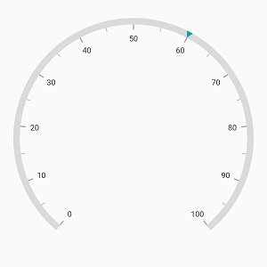

## Marker types

The radial gauge supports the following built-in marker types that can be set using the [`markerType`](https://pub.dev/documentation/syncfusion_flutter_gauges/latest/gauges/MarkerPointer/markerType.html) property of [`MarkerPointer`](https://pub.dev/documentation/syncfusion_flutter_gauges/latest/gauges/MarkerPointer-class.html):

* [`MarkerType.circle`](https://pub.dev/documentation/syncfusion_flutter_gauges/latest/gauges/MarkerType.html) - Renders the pointer as a circle.
* [`MarkerType.diamond`](https://pub.dev/documentation/syncfusion_flutter_gauges/latest/gauges/MarkerType.html) - Renders the pointer as a diamond.
* [`MarkerType.image`](https://pub.dev/documentation/syncfusion_flutter_gauges/latest/gauges/MarkerType.html) - Renders the pointer as an image specified by the [`imageUrl`](https://pub.dev/documentation/syncfusion_flutter_gauges/latest/gauges/MarkerPointer/imageUrl.html) property.
* [`MarkerType.invertedTriangle`](https://pub.dev/documentation/syncfusion_flutter_gauges/latest/gauges/MarkerType.html) - Renders the pointer as a downward-pointing triangle.
* [`MarkerType.rectangle`](https://pub.dev/documentation/syncfusion_flutter_gauges/latest/gauges/MarkerType.html) - Renders the pointer as a rectangle.
* [`MarkerType.text`](https://pub.dev/documentation/syncfusion_flutter_gauges/latest/gauges/MarkerType.html) - Renders the pointer as a text label specified by the [`text`](https://pub.dev/documentation/syncfusion_flutter_gauges/latest/gauges/MarkerPointer/text.html) property.
* [`MarkerType.triangle`](https://pub.dev/documentation/syncfusion_flutter_gauges/latest/gauges/MarkerType.html) - Renders the pointer as an upward-pointing triangle.

### Circle

The [`MarkerType.circle`](https://pub.dev/documentation/syncfusion_flutter_gauges/latest/gauges/MarkerType.html) renders the marker pointer as a filled circle. This is one of the default built-in shapes available out of the box.



import 'package:flutter/material.dart';
import 'package:syncfusion_flutter_gauges/gauges.dart';

void main() {
  runApp(const MyApp());
}

class MyApp extends StatelessWidget {
  const MyApp({Key? key}) : super(key: key);

  @override
  Widget build(BuildContext context) {
    return const MaterialApp(
      home: CircleMarkerExample(),
    );
  }
}

class CircleMarkerExample extends StatelessWidget {
  const CircleMarkerExample({Key? key}) : super(key: key);

  @override
  Widget build(BuildContext context) {
    return Scaffold(
      body: Center(
        child: SfRadialGauge(
          axes: <RadialAxis>[
            RadialAxis(
              pointers: <GaugePointer>[
                MarkerPointer(
                  value: 60,
                  markerType: MarkerType.circle,
                  markerHeight: 20,
                  markerWidth: 20,
                  color: Colors.lightBlue,
                )
              ]
            )
          ],
        )
      ),
    );
  }
}



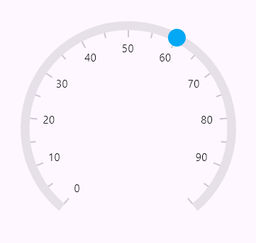

### Diamond

The [`MarkerType.diamond`](https://pub.dev/documentation/syncfusion_flutter_gauges/latest/gauges/MarkerType.html) renders the marker pointer as a diamond shape. It is useful for highlighting specific values on a gradient scale where a square or rotated rectangle better matches the visual style.



import 'package:flutter/material.dart';
import 'package:syncfusion_flutter_gauges/gauges.dart';

void main() {
  runApp(const MyApp());
}

class MyApp extends StatelessWidget {
  const MyApp({Key? key}) : super(key: key);

  @override
  Widget build(BuildContext context) {
    return const MaterialApp(
      home: DiamondMarkerExample(),
    );
  }
}

class DiamondMarkerExample extends StatelessWidget {
  const DiamondMarkerExample({Key? key}) : super(key: key);

  @override
  Widget build(BuildContext context) {
    return Scaffold(
      body: Center(
        child: SfRadialGauge(
          axes: <RadialAxis>[
            RadialAxis(
              pointers: <GaugePointer>[
                MarkerPointer(
                  value: 70,
                  markerType: MarkerType.diamond,
                  markerHeight: 20,
                  markerWidth: 20,
                  color: Colors.lightBlue,
                )
              ]
            )
          ],
        )
      ),
    );
  }
}



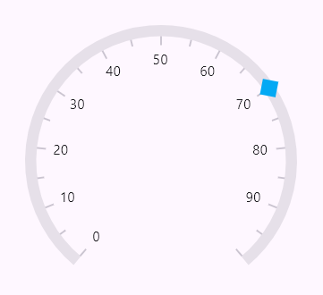

### Inverted triangle

The [`MarkerType.invertedTriangle`](https://pub.dev/documentation/syncfusion_flutter_gauges/latest/gauges/MarkerType.html) renders the marker pointer as a downward-pointing triangle. This is the default marker shape when no [`markerType`](https://pub.dev/documentation/syncfusion_flutter_gauges/latest/gauges/MarkerPointer/markerType.html) is specified.



import 'package:flutter/material.dart';
import 'package:syncfusion_flutter_gauges/gauges.dart';

void main() {
  runApp(const MyApp());
}

class MyApp extends StatelessWidget {
  const MyApp({Key? key}) : super(key: key);

  @override
  Widget build(BuildContext context) {
    return const MaterialApp(
      home: InvertedTriangleMarkerExample(),
    );
  }
}

class InvertedTriangleMarkerExample extends StatelessWidget {
  const InvertedTriangleMarkerExample({Key? key}) : super(key: key);

  @override
  Widget build(BuildContext context) {
    return Scaffold(
      body: Center(
        child: SfRadialGauge(
          axes: <RadialAxis>[
            RadialAxis(
              pointers: <GaugePointer>[
                MarkerPointer(
                  value: 50,
                  markerType: MarkerType.invertedTriangle,
                  markerHeight: 20,
                  markerWidth: 20,
                  color: Colors.lightBlue,
                )
              ]
            )
          ],
        )
      ),
    );
  }
}



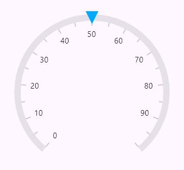

### Rectangle

The [`MarkerType.rectangle`](https://pub.dev/documentation/syncfusion_flutter_gauges/latest/gauges/MarkerType.html) renders the marker pointer as a rectangle. It is useful for filling longer ranges on the axis where a circular or triangular marker would not provide sufficient visual weight.



import 'package:flutter/material.dart';
import 'package:syncfusion_flutter_gauges/gauges.dart';

void main() {
  runApp(const MyApp());
}

class MyApp extends StatelessWidget {
  const MyApp({Key? key}) : super(key: key);

  @override
  Widget build(BuildContext context) {
    return const MaterialApp(
      home: RectangleMarkerExample(),
    );
  }
}

class RectangleMarkerExample extends StatelessWidget {
  const RectangleMarkerExample({Key? key}) : super(key: key);

  @override
  Widget build(BuildContext context) {
    return Scaffold(
      body: Center(
        child: SfRadialGauge(
          axes: <RadialAxis>[
            RadialAxis(
              pointers: <GaugePointer>[
                MarkerPointer(
                  value: 40,
                  markerType: MarkerType.rectangle,
                  markerHeight: 20,
                  markerWidth: 20,
                  color: Colors.lightBlue,
                )
              ]
            )
          ],
        )
      ),
    );
  }
}



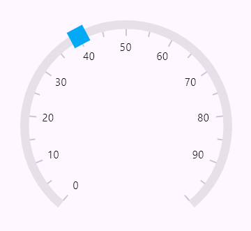

### Triangle

The [`MarkerType.triangle`](https://pub.dev/documentation/syncfusion_flutter_gauges/latest/gauges/MarkerType.html) renders the marker pointer as an upward-pointing triangle. It is commonly used as a directional indicator on the gauge.



import 'package:flutter/material.dart';
import 'package:syncfusion_flutter_gauges/gauges.dart';

void main() {
  runApp(const MyApp());
}

class MyApp extends StatelessWidget {
  const MyApp({Key? key}) : super(key: key);

  @override
  Widget build(BuildContext context) {
    return const MaterialApp(
      home: TriangleMarkerExample(),
    );
  }
}

class TriangleMarkerExample extends StatelessWidget {
  const TriangleMarkerExample({Key? key}) : super(key: key);

  @override
  Widget build(BuildContext context) {
    return Scaffold(
      body: Center(
        child: SfRadialGauge(
          axes: <RadialAxis>[
            RadialAxis(
              pointers: <GaugePointer>[
                MarkerPointer(
                  value: 80,
                  markerType: MarkerType.triangle,
                  markerHeight: 20,
                  markerWidth: 20,
                  color: Colors.lightBlue,
                )
              ]
            )
          ],
        )
      ),
    );
  }
}



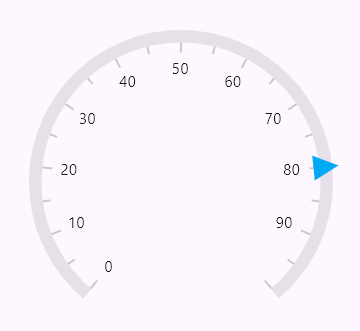

## Image pointer

An image can be used to denote the current pointer values instead of a shape. This can be achieved by setting the  [`markerType`](https://pub.dev/documentation/syncfusion_flutter_gauges/latest/gauges/MarkerPointer/markerType.html) as image and specifying the [`imageUrl`](https://pub.dev/documentation/syncfusion_flutter_gauges/latest/gauges/MarkerPointer/imageUrl.html) property of the marker pointer.

N> Add the image to your `pubspec.yaml` file under the `flutter > assets` section so that it is available to the application.



import 'package:flutter/material.dart';
import 'package:syncfusion_flutter_gauges/gauges.dart';

void main() {
  runApp(const MyApp());
}

class MyApp extends StatelessWidget {
  const MyApp({Key? key}) : super(key: key);

  @override
  Widget build(BuildContext context) {
    return const MaterialApp(
      home: ImageMarkerExample(),
    );
  }
}

class ImageMarkerExample extends StatelessWidget {
  const ImageMarkerExample({Key? key}) : super(key: key);

  @override
  Widget build(BuildContext context) {
    return Scaffold(
      body: Center(
        child: SfRadialGauge(
          axes: <RadialAxis>[
            RadialAxis(
              pointers: <GaugePointer>[
                MarkerPointer(
                  value: 60,
                  markerType: MarkerType.image,
                  markerHeight: 30,
                  markerWidth: 30,
                  imageUrl: 'images/pin.png'
                )
              ]
            )
          ],
        )
      ),
    );
  }
}



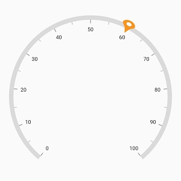

## Text pointer

Text can be used to denote the current pointer value instead of any marker shape. This can be achieved by setting the [`markerType`](https://pub.dev/documentation/syncfusion_flutter_gauges/latest/gauges/MarkerPointer/markerType.html)  as text. The provided text can be customized using the [`textStyle`](https://pub.dev/documentation/syncfusion_flutter_gauges/latest/gauges/MarkerPointer/textStyle.html) property of the marker pointer, which accepts a [`GaugeTextStyle`](https://pub.dev/documentation/syncfusion_flutter_gauges/latest/gauges/GaugeTextStyle-class.html) for gauge-specific text formatting.



import 'package:flutter/material.dart';
import 'package:syncfusion_flutter_gauges/gauges.dart';

void main() {
  runApp(const MyApp());
}

class MyApp extends StatelessWidget {
  const MyApp({Key? key}) : super(key: key);

  @override
  Widget build(BuildContext context) {
    return const MaterialApp(
      home: TextMarkerExample(),
    );
  }
}

class TextMarkerExample extends StatelessWidget {
  const TextMarkerExample({Key? key}) : super(key: key);

  @override
  Widget build(BuildContext context) {
    return Scaffold(
      body: Center(
        child: SfRadialGauge(
          axes: <RadialAxis>[
            RadialAxis(
              pointers: <GaugePointer>[
                MarkerPointer(
                  value: 50,
                  markerType: MarkerType.text,
                  text: 'Average',
                  textStyle: GaugeTextStyle(
                    fontSize: 15,
                    fontWeight: FontWeight.bold,
                    fontStyle: FontStyle.italic
                  )
                )
              ]
            )
          ],
        )
      ),
    );
  }
}



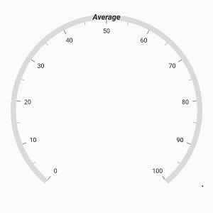

## Marker customization

The marker pointer can be customized using the following properties:

* [`color`](https://pub.dev/documentation/syncfusion_flutter_gauges/latest/gauges/MarkerPointer/color.html) – Allows you to customize the marker color.
* [`markerHeight`](https://pub.dev/documentation/syncfusion_flutter_gauges/latest/gauges/MarkerPointer/markerHeight.html) – Allows you to specify the marker height.
* [`markerWidth`](https://pub.dev/documentation/syncfusion_flutter_gauges/latest/gauges/MarkerPointer/markerWidth.html) – Allows you to specify the marker width.
* [`borderColor`](https://pub.dev/documentation/syncfusion_flutter_gauges/latest/gauges/MarkerPointer/borderColor.html) – Allows you to specify the border color for the marker.
* [`borderWidth`](https://pub.dev/documentation/syncfusion_flutter_gauges/latest/gauges/MarkerPointer/borderWidth.html) –  Allows you to specify the border width of the marker.



import 'package:flutter/material.dart';
import 'package:syncfusion_flutter_gauges/gauges.dart';

void main() {
  runApp(const MyApp());
}

class MyApp extends StatelessWidget {
  const MyApp({Key? key}) : super(key: key);

  @override
  Widget build(BuildContext context) {
    return const MaterialApp(
      home: MarkerCustomizationExample(),
    );
  }
}

class MarkerCustomizationExample extends StatelessWidget {
  const MarkerCustomizationExample({Key? key}) : super(key: key);

  @override
  Widget build(BuildContext context) {
    return Scaffold(
      body: Center(
        child: SfRadialGauge(
          axes: <RadialAxis>[
            RadialAxis(
              pointers: <GaugePointer>[
                MarkerPointer(
                  value: 60,
                  markerHeight: 30,
                  markerWidth: 30,
                  markerType: MarkerType.circle,
                  color: Colors.lightBlue,
                  borderWidth: 3,
                  borderColor: Colors.black
                )
              ]
            )
          ],
        )
      ),
    );
  }
}



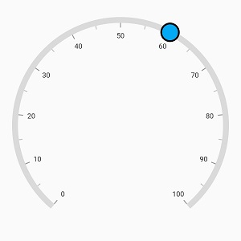

**Marker elevation**

The marker pointer can be elevated by rendering its shadow behind it. The z- coordinate position at which the shadow can be positioned relative to the marker can be controlled by the [`elevation`](https://pub.dev/documentation/syncfusion_flutter_gauges/latest/gauges/MarkerPointer/elevation.html) property.



import 'package:flutter/material.dart';
import 'package:syncfusion_flutter_gauges/gauges.dart';

void main() {
  runApp(const MyApp());
}

class MyApp extends StatelessWidget {
  const MyApp({Key? key}) : super(key: key);

  @override
  Widget build(BuildContext context) {
    return const MaterialApp(
      home: MarkerElevationExample(),
    );
  }
}

class MarkerElevationExample extends StatelessWidget {
  const MarkerElevationExample({Key? key}) : super(key: key);

  @override
  Widget build(BuildContext context) {
    return Scaffold(
      body: Center(
        child: SfRadialGauge(
          axes: <RadialAxis>[
            RadialAxis(
              pointers: <GaugePointer>[
                MarkerPointer(
                  value: 60,
                  markerHeight: 20,
                  markerWidth: 20,
                  elevation: 4
                )
              ]
            )
          ],
        )
      ),
    );
  }
}



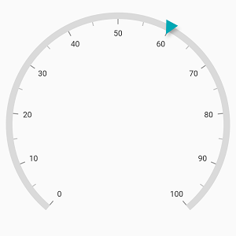

The shadow color of the pointer is black by default and the default value of [`elevation`](https://pub.dev/documentation/syncfusion_flutter_gauges/latest/gauges/MarkerPointer/elevation.html) is 0.

N> The [`elevation`](https://pub.dev/documentation/syncfusion_flutter_gauges/latest/gauges/MarkerPointer/elevation.html) property applies to all the marker types except [`MarkerType.image`](https://pub.dev/documentation/syncfusion_flutter_gauges/latest/gauges/MarkerType.html) and [`MarkerType.text`](https://pub.dev/documentation/syncfusion_flutter_gauges/latest/gauges/MarkerType.html).

**Marker overlay**

The marker overlay is rendered around the marker when the marker is dragged. When [`enableDragging`](https://pub.dev/documentation/syncfusion_flutter_gauges/latest/gauges/GaugePointer/enableDragging.html) property of the marker is set to true and while dragging the marker, the overlay will appear  around the marker pointer.



import 'package:flutter/material.dart';
import 'package:syncfusion_flutter_gauges/gauges.dart';

void main() {
  runApp(const MyApp());
}

class MyApp extends StatelessWidget {
  const MyApp({Key? key}) : super(key: key);

  @override
  Widget build(BuildContext context) {
    return const MaterialApp(
      home: MarkerOverlayExample(),
    );
  }
}

class MarkerOverlayExample extends StatelessWidget {
  const MarkerOverlayExample({Key? key}) : super(key: key);

  @override
  Widget build(BuildContext context) {
    return Scaffold(
      body: Center(
        child: SfRadialGauge(
          axes: <RadialAxis>[
            RadialAxis(
              pointers: <GaugePointer>[
                MarkerPointer(
                  value: 60,
                  markerHeight: 20,
                  markerWidth: 20,
                  enableDragging: true,
                  markerType: MarkerType.circle
                )
              ]
            )
          ],
        )
      ),
    );
  }
}



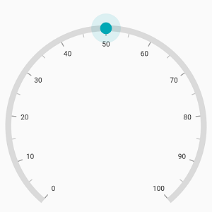

By default, the [`overlayRadius`](https://pub.dev/documentation/syncfusion_flutter_gauges/latest/gauges/MarkerPointer/overlayRadius.html) is calculated based on the provided [`markerHeight`](https://pub.dev/documentation/syncfusion_flutter_gauges/latest/gauges/MarkerPointer/markerHeight.html) and [`markerWidth`](https://pub.dev/documentation/syncfusion_flutter_gauges/latest/gauges/MarkerPointer/markerWidth.html) property and the [`overlayColor`](https://pub.dev/documentation/syncfusion_flutter_gauges/latest/gauges/MarkerPointer/overlayColor.html) is derived from the [`marker color`](https://pub.dev/documentation/syncfusion_flutter_gauges/latest/gauges/MarkerPointer/color.html). The following properties are used to customize the overlay color and its radius,

* [`overlayColor`](https://pub.dev/documentation/syncfusion_flutter_gauges/latest/gauges/MarkerPointer/overlayColor.html) – Allows customizing the overlay color.

* [`overlayRadius`](https://pub.dev/documentation/syncfusion_flutter_gauges/latest/gauges/MarkerPointer/overlayRadius.html) – Allows customizing the overlay radius.



import 'package:flutter/material.dart';
import 'package:syncfusion_flutter_gauges/gauges.dart';

void main() {
  runApp(const MyApp());
}

class MyApp extends StatelessWidget {
  const MyApp({Key? key}) : super(key: key);

  @override
  Widget build(BuildContext context) {
    return const MaterialApp(
      home: MarkerOverlayCustomizationExample(),
    );
  }
}

class MarkerOverlayCustomizationExample extends StatelessWidget {
  const MarkerOverlayCustomizationExample({Key? key}) : super(key: key);

  @override
  Widget build(BuildContext context) {
    return Scaffold(
      body: Center(
        child: SfRadialGauge(
          axes: <RadialAxis>[
            RadialAxis(
              pointers: <GaugePointer>[
                MarkerPointer(
                  value: 60,
                  markerHeight: 20,
                  markerWidth: 20,
                  enableDragging: true,
                  overlayRadius: 15,
                  overlayColor: Colors.red.withValues(alpha: 0.12),
                  markerType: MarkerType.circle
                )
              ]
            )
          ],
        )
      ),
    );
  }
}



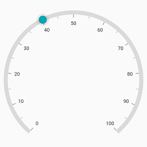

N> The marker overlay applies to all the marker types except [`MarkerType.image`](https://pub.dev/documentation/syncfusion_flutter_gauges/latest/gauges/MarkerType.html) and [`MarkerType.text`](https://pub.dev/documentation/syncfusion_flutter_gauges/latest/gauges/MarkerType.html).

## Pointer interaction

The marker pointer supports interactive value changes by enabling the [`enableDragging`](https://pub.dev/documentation/syncfusion_flutter_gauges/latest/gauges/GaugePointer/enableDragging.html) property. When this property is set to `true`, the user can drag the marker pointer along the axis to update its value. The following callbacks are invoked during the drag interaction:

* [`onValueChanged`](https://pub.dev/documentation/syncfusion_flutter_gauges/latest/gauges/MarkerPointer/onValueChanged.html) – Called continuously while the user is dragging the marker pointer and selecting a new value.
* [`onValueChangeStart`](https://pub.dev/documentation/syncfusion_flutter_gauges/latest/gauges/MarkerPointer/onValueChangeStart.html) – Called when the user starts dragging the marker pointer.
* [`onValueChangeEnd`](https://pub.dev/documentation/syncfusion_flutter_gauges/latest/gauges/MarkerPointer/onValueChangeEnd.html) – Called when the user finishes dragging the marker pointer.
* [`onValueChanging`](https://pub.dev/documentation/syncfusion_flutter_gauges/latest/gauges/MarkerPointer/onValueChanging.html) – Called before the value is updated during the drag, providing a [`ValueChangingArgs`](https://pub.dev/documentation/syncfusion_flutter_gauges/latest/gauges/ValueChangingArgs-class.html) instance for advanced scenarios such as restricting the value range.



import 'package:flutter/material.dart';
import 'package:syncfusion_flutter_gauges/gauges.dart';

void main() {
  runApp(const MyApp());
}

class MyApp extends StatelessWidget {
  const MyApp({Key? key}) : super(key: key);

  @override
  Widget build(BuildContext context) {
    return const MaterialApp(
      home: MarkerInteractionExample(),
    );
  }
}

class MarkerInteractionExample extends StatefulWidget {
  const MarkerInteractionExample({Key? key}) : super(key: key);

  @override
  State<MarkerInteractionExample> createState() => _MarkerInteractionExampleState();
}

class _MarkerInteractionExampleState extends State<MarkerInteractionExample> {
  double _markerValue = 60;

  @override
  Widget build(BuildContext context) {
    return Scaffold(
      body: Center(
        child: SfRadialGauge(
          axes: <RadialAxis>[
            RadialAxis(
              pointers: <GaugePointer>[
                MarkerPointer(
                  value: _markerValue,
                  enableDragging: true,
                  markerHeight: 20,
                  markerWidth: 20,
                  markerType: MarkerType.circle,
                  onValueChanged: (double newValue) {
                    setState(() {
                      _markerValue = newValue;
                    });
                  },
                )
              ]
            )
          ],
        )
      ),
    );
  }
}



## Custom renderer

For advanced scenarios that require fully custom drawing, the marker pointer exposes the [`onCreatePointerRenderer`](https://pub.dev/documentation/syncfusion_flutter_gauges/latest/gauges/MarkerPointer/onCreatePointerRenderer.html) callback. This callback receives a [`MarkerPointerRendererFactory`](https://pub.dev/documentation/syncfusion_flutter_gauges/latest/gauges/MarkerPointerRendererFactory.html) and lets you return a custom [`MarkerPointerRenderer`](https://pub.dev/documentation/syncfusion_flutter_gauges/latest/gauges/MarkerPointerRenderer-class.html) for complete control over how the marker is drawn.

N> The [`onCreatePointerRenderer`](https://pub.dev/documentation/syncfusion_flutter_gauges/latest/gauges/MarkerPointer/onCreatePointerRenderer.html) callback applies only when you need a custom rendering pipeline. It is not applicable for the built-in marker types described above.

## Position customization

The marker pointer can be moved near or far from its actual position using the [`markerOffset`](https://pub.dev/documentation/syncfusion_flutter_gauges/latest/gauges/MarkerPointer/markerOffset.html) and [`offsetUnit`](https://pub.dev/documentation/syncfusion_flutter_gauges/latest/gauges/MarkerPointer/offsetUnit.html) properties.

When you set [`offsetUnit`](https://pub.dev/documentation/syncfusion_flutter_gauges/latest/gauges/MarkerPointer/offsetUnit.html) to logical pixel, the marker pointer will be moved based on the logical pixel value. If you set [`offsetUnit`](https://pub.dev/documentation/syncfusion_flutter_gauges/latest/gauges/MarkerPointer/offsetUnit.html) to factor, then provided factor will be multiplied with the axis radius value, and the pointer will be moved to the corresponding position. The default value of [`offsetUnit`](https://pub.dev/documentation/syncfusion_flutter_gauges/latest/gauges/MarkerPointer/offsetUnit.html) is GaugeSizeUnit.logicalPixel.



import 'package:flutter/material.dart';
import 'package:syncfusion_flutter_gauges/gauges.dart';

void main() {
  runApp(const MyApp());
}

class MyApp extends StatelessWidget {
  const MyApp({Key? key}) : super(key: key);

  @override
  Widget build(BuildContext context) {
    return const MaterialApp(
      home: MarkerOffsetExample(),
    );
  }
}

class MarkerOffsetExample extends StatelessWidget {
  const MarkerOffsetExample({Key? key}) : super(key: key);

  @override
  Widget build(BuildContext context) {
    return Scaffold(
      body: Center(
        child: SfRadialGauge(
          axes: <RadialAxis>[
            RadialAxis(
              radiusFactor: 0.9,
              centerY: 0.65,
              pointers: <GaugePointer>[
                MarkerPointer(
                  value: 60,
                  markerOffset: -5
                )
              ]
            )
          ],
        )
      ),
    );
  }
}



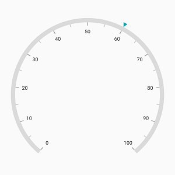

