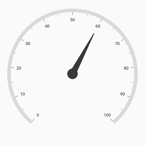
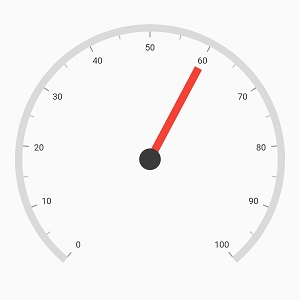
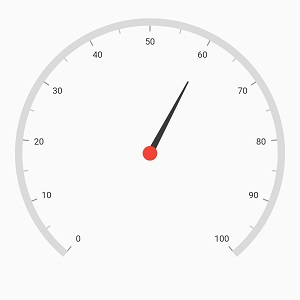
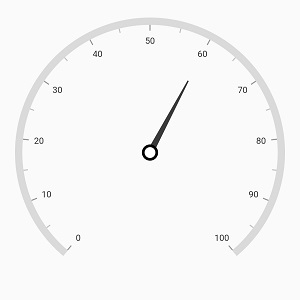
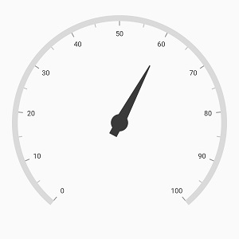
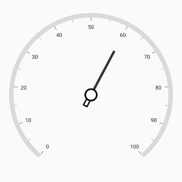
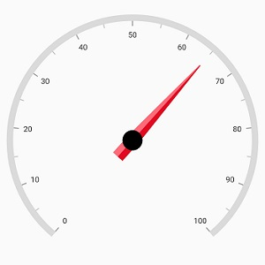

# Needle Pointer in Flutter Radial Gauge (SfRadialGauge)

[`Needle Pointer`](https://pub.dev/documentation/syncfusion_flutter_gauges/latest/gauges/NeedlePointer-class.html) contains three parts namely needle, [`knob`](https://pub.dev/documentation/syncfusion_flutter_gauges/latest/gauges/NeedlePointer/knobStyle.html), and [`tail`](https://pub.dev/documentation/syncfusion_flutter_gauges/latest/gauges/NeedlePointer/tailStyle.html) and that can be placed on a gauge to mark the values.


@override
Widget build(BuildContext context) {
  return Scaffold(
    body: Center(
              child: SfRadialGauge(
                axes: <RadialAxis>[RadialAxis(
                  pointers: <GaugePointer>[NeedlePointer(value: 60)
                ]
              )
            ],
          )
        ),
      );
    }



## Needle customization

The needle can be customized using the following properties:

* [`needleLength`](https://pub.dev/documentation/syncfusion_flutter_gauges/latest/gauges/NeedlePointer/needleLength.html) – Customizes the length of the needle. The length of the pointer can be set either in logical pixel or factor.

* [`lengthUnit`](https://pub.dev/documentation/syncfusion_flutter_gauges/latest/gauges/NeedlePointer/lengthUnit.html) –Specifies whether to set the length in logical pixel or factor. 

* [`needleStartWidth`](https://pub.dev/documentation/syncfusion_flutter_gauges/latest/gauges/NeedlePointer/needleStartWidth.html) – Specifies the start width of the needle.

* [`needleEndWidth`](https://pub.dev/documentation/syncfusion_flutter_gauges/latest/gauges/NeedlePointer/needleEndWidth.html) – Specifies the end width of the needle.

* [`needleColor`](https://pub.dev/documentation/syncfusion_flutter_gauges/latest/gauges/NeedlePointer/needleColor.html) – Specifies the needle color.

* [`gradient`](https://pub.dev/documentation/syncfusion_flutter_gauges/latest/gauges/NeedlePointer/gradient.html) - Specifies the gradient for the needle. 

**Needle length customization**

The needle length can be controlled using the [`needleLength`](https://pub.dev/documentation/syncfusion_flutter_gauges/latest/gauges/NeedlePointer/needleLength.html) and [`lengthUnit`](https://pub.dev/documentation/syncfusion_flutter_gauges/latest/gauges/NeedlePointer/lengthUnit.html) properties. The length can be set either in logical pixels or factor using [`lengthUnit`](https://pub.dev/documentation/syncfusion_flutter_gauges/latest/gauges/NeedlePointer/lengthUnit.html). 

If the [`lengthUnit`](https://pub.dev/documentation/syncfusion_flutter_gauges/latest/gauges/NeedlePointer/lengthUnit.html) is set to logical pixel, the logical pixel value will be set to the [`needleLength`](https://pub.dev/documentation/syncfusion_flutter_gauges/latest/gauges/NeedlePointer/needleLength.html)
If the [`lengthUnit`](https://pub.dev/documentation/syncfusion_flutter_gauges/latest/gauges/NeedlePointer/lengthUnit.html) is set to factor, then the factor value will be set to the [`needleLength`](https://pub.dev/documentation/syncfusion_flutter_gauges/latest/gauges/NeedlePointer/needleLength.html). The factor value ranges from 0 to 1. For example, if the needle length is set to 0.5, the half of the radius value of axis to needle length. The default value of  [`lengthUnit`](https://pub.dev/documentation/syncfusion_flutter_gauges/latest/gauges/NeedlePointer/lengthUnit.html) is GaugeSizeUnit.factor


@override
Widget build(BuildContext context) {
  return Scaffold(
    body: Center(
              child: SfRadialGauge(
                axes: <RadialAxis>[RadialAxis(
                  pointers: <GaugePointer>[NeedlePointer(value: 60,
                    lengthUnit: GaugeSizeUnit.logicalPixel,
                    needleLength: 130)]
                  )
                ],
              )
            ),
          );
        }



**Needle width customization**

The width of the needle pointer can be customized using the [`needleStartWidth`](https://pub.dev/documentation/syncfusion_flutter_gauges/latest/gauges/NeedlePointer/needleStartWidth.html) and [`needleEndWidth`](https://pub.dev/documentation/syncfusion_flutter_gauges/latest/gauges/NeedlePointer/needleEndWidth.html) properties.


@override
Widget build(BuildContext context) {
  return Scaffold(
    body: Center(
              child: SfRadialGauge(
                axes: <RadialAxis>[RadialAxis(
                  pointers: <GaugePointer>[NeedlePointer(value: 60,
                      lengthUnit: GaugeSizeUnit.factor,
                  needleLength: 0.75, needleColor: Colors.red, 
                  needleStartWidth: 6, needleEndWidth: 6)]
                )],
              )
            ),
          );
        }



**Gradient support for needle**

 The [`gradient`](https://pub.dev/documentation/syncfusion_flutter_gauges/latest/gauges/NeedlePointer/gradient.html) property of [`needle pointer`](https://pub.dev/documentation/syncfusion_flutter_gauges/latest/gauges/NeedlePointer-class.html) allows to specify the smooth color transition to pointer by specifying the different colors based on provided factor value.

 
@override
Widget build(BuildContext context) {
 return Scaffold(
      body: Center(
        child: SfRadialGauge(
            axes: <RadialAxis>[RadialAxis(,
                pointers: <GaugePointer>[
                  NeedlePointer(
                      value: 65,
                      lengthUnit: GaugeSizeUnit.factor,
                      needleLength: 0.8,
                      needleEndWidth:  11,
                      gradient: const LinearGradient(
                          colors: <Color>[
                        Color(0xFFFF6B78), Color(0xFFFF6B78),
                        Color(0xFFE20A22), Color(0xFFE20A22)],
                          stops: <double>[0, 0.5, 0.5, 1]),
                      needleColor: const Color(0xFFF67280),
                      knobStyle: KnobStyle(
                          knobRadius: 0.08,
                          sizeUnit: GaugeSizeUnit.factor,
                          color: Colors.black)),
                ]
            ),
            ]
        ),
      ),
    );
  }



## Knob customization

The knob can be customized using the following properties:

* [`knobRadius`](https://pub.dev/documentation/syncfusion_flutter_gauges/latest/gauges/KnobStyle/knobRadius.html) – Specifies the knob radius either in logical pixels or factor.

* [`color`](https://pub.dev/documentation/syncfusion_flutter_gauges/latest/gauges/KnobStyle/color.html) – Specifies the knob color.

* [`borderWidth`](https://pub.dev/documentation/syncfusion_flutter_gauges/latest/gauges/KnobStyle/borderWidth.html) – Specifies the border width of knob either in logical pixels or factor.

* [`borderColor`](https://pub.dev/documentation/syncfusion_flutter_gauges/latest/gauges/KnobStyle/borderColor.html) – Specifies the border color of knob.

* [`sizeUnit`](https://pub.dev/documentation/syncfusion_flutter_gauges/latest/gauges/KnobStyle/sizeUnit.html) – Allows to specify whether the value of knob radius and border width is in logical pixels or in factor.

**Knob radius customization**

The radius of the knob can be customized using the [`knobRadius`](https://pub.dev/documentation/syncfusion_flutter_gauges/latest/gauges/KnobStyle/knobRadius.html) and [`sizeUnit`](https://pub.dev/documentation/syncfusion_flutter_gauges/latest/gauges/KnobStyle/sizeUnit.html). 
 The logical pixel value can be set to knob radius when the [`sizeUnit`](https://pub.dev/documentation/syncfusion_flutter_gauges/latest/gauges/KnobStyle/sizeUnit.html) is set to logical pixel



@override
Widget build(BuildContext context) {
  return Scaffold(
    body: Center(
              child: SfRadialGauge(
                axes: <RadialAxis>[RadialAxis(
                  pointers: <GaugePointer>[NeedlePointer(value: 60,
                   needleStartWidth: 1, needleEndWidth: 5,
                    knobStyle: KnobStyle(knobRadius: 10,
                        sizeUnit: GaugeSizeUnit.logicalPixel, color: Colors.red))
                  ]
                )],
              )
            ),
          );
        }



If the [`sizeUnit`](https://pub.dev/documentation/syncfusion_flutter_gauges/latest/gauges/KnobStyle/sizeUnit.html) is set to factor, the factor value will be set to knob radius. The factor value ranges from 0 to 1. For example, if the needle length is set to 0.1, 10% of the radius value of [`axis`](https://pub.dev/documentation/syncfusion_flutter_gauges/latest/gauges/RadialAxis-class.html) will be set to knob radius. By default, the value of [`sizeUnit`](https://pub.dev/documentation/syncfusion_flutter_gauges/latest/gauges/KnobStyle/sizeUnit.html) is GaugeSizeUnit.factor

**Knob border customization**

Like radius, the [`borderWidth`](https://pub.dev/documentation/syncfusion_flutter_gauges/latest/gauges/KnobStyle/borderWidth.html) can be specified either in logical pixel or factor. The [`sizeUnit`](https://pub.dev/documentation/syncfusion_flutter_gauges/latest/gauges/KnobStyle/sizeUnit.html) property of [`knob style`](https://pub.dev/documentation/syncfusion_flutter_gauges/latest/gauges/KnobStyle-class.html) is common for both [`knobRadius`](https://pub.dev/documentation/syncfusion_flutter_gauges/latest/gauges/KnobStyle/knobRadius.html) and [`borderWidth`](https://pub.dev/documentation/syncfusion_flutter_gauges/latest/gauges/KnobStyle/borderWidth.html) properties.



@override
Widget build(BuildContext context) {
  return Scaffold(
    body: Center(
              child: SfRadialGauge(
                axes: <RadialAxis>[RadialAxis(
                  pointers: <GaugePointer>[NeedlePointer(value: 60, 
                  needleStartWidth: 1, needleEndWidth: 5,
                    knobStyle: KnobStyle(knobRadius: 0.05, borderColor: Colors.black,
                     borderWidth: 0.02, 
                     color: Colors.white
                    )
                  )]
                )],
              )
            ),
          );
        }



## Tail Customization

The [`tail`](https://pub.dev/documentation/syncfusion_flutter_gauges/latest/gauges/NeedlePointer/tailStyle.html) of the needle can be customized using the following properties,

* [`length`](https://pub.dev/documentation/syncfusion_flutter_gauges/latest/gauges/TailStyle/length.html) – Specifies the length of tail either in logical pixels or factor.

* [`lengthUnit`](https://pub.dev/documentation/syncfusion_flutter_gauges/latest/gauges/TailStyle/lengthUnit.html) – Specifies whether the tail length value is defined in logical pixels or factor.

* [`width`](https://pub.dev/documentation/syncfusion_flutter_gauges/latest/gauges/TailStyle/width.html) – Specifies the width for the tail.

* [`borderColor`](https://pub.dev/documentation/syncfusion_flutter_gauges/latest/gauges/TailStyle/borderColor.html) –  Allows to specify the border color of tail.

* [`borderWidth`](https://pub.dev/documentation/syncfusion_flutter_gauges/latest/gauges/TailStyle/borderWidth.html) – Allows to specify the border width of tail.

* [`gradient`](https://pub.dev/documentation/syncfusion_flutter_gauges/latest/gauges/NeedlePointer/gradient.html) - Specifies the gradient for the tail.

By default, the value of [`lengthUnit`](https://pub.dev/documentation/syncfusion_flutter_gauges/latest/gauges/TailStyle/lengthUnit.html) is GaugeSizeUnit.factor.The factor value ranges from 0 to 1. When the length is set to 0.2, 20 % of axis radius value will be considered as tail length.The following code example shows how to specify the length in factor. 



@override
Widget build(BuildContext context) {
  return Scaffold(
    body: Center(
              child: SfRadialGauge(
                axes: <RadialAxis>[RadialAxis(
                  pointers: <GaugePointer>[NeedlePointer(value: 60,
                      tailStyle: TailStyle(width: 8, length: 0.15)
                     )]
                )],
              )
            ),
          );
        }



The following code example shows how to specify the length in logical pixels.



@override
Widget build(BuildContext context) {
  return Scaffold(
    body: Center(
              child: SfRadialGauge(
                axes: <RadialAxis>[RadialAxis(
                  pointers: <GaugePointer>[NeedlePointer(value: 60,needleStartWidth: 3, needleEndWidth: 3,
                      knobStyle: KnobStyle(color: Colors.white, knobRadius: 0.07,
                          borderColor: Colors.black, borderWidth: 0.02),
                      tailStyle: TailStyle(width: 5, length: 30, lengthUnit: GaugeSizeUnit.logicalPixel,
                      color: Colors.white, borderWidth: 3, borderColor: Colors.black)
                    )
                  ]
                )],
              )
            ),
          );
        }



The following code shows how to apply the gradient for the tail.



@override
 Widget build(BuildContext context) {
    return Scaffold(
      body: Center(
        child: SfRadialGauge(
            axes: <RadialAxis>[RadialAxis(
                pointers: <GaugePointer>[
                  NeedlePointer(
                      value: 65,
                      lengthUnit: GaugeSizeUnit.factor,
                      needleLength: 0.8,
                      needleEndWidth:  11,
                      tailStyle: TailStyle(length: 0.2, width: 11,
                        gradient:LinearGradient(
                            colors: <Color>[
                              Color(0xFFFF6B78), Color(0xFFFF6B78),
                              Color(0xFFE20A22), Color(0xFFE20A22)],
                            stops: <double>[0, 0.5, 0.5, 1]),
                      ),
                      gradient: LinearGradient(
                          colors: <Color>[
                        Color(0xFFFF6B78), Color(0xFFFF6B78),
                        Color(0xFFE20A22), Color(0xFFE20A22)],
                          stops: <double>[0, 0.5, 0.5, 1]),
                      needleColor: Color(0xFFF67280),
                      knobStyle: KnobStyle(
                          knobRadius: 0.08,
                          sizeUnit: GaugeSizeUnit.factor,
                          color: Colors.black)),
                ]
            ),
          ]
        ),
      ),
    );
  }



