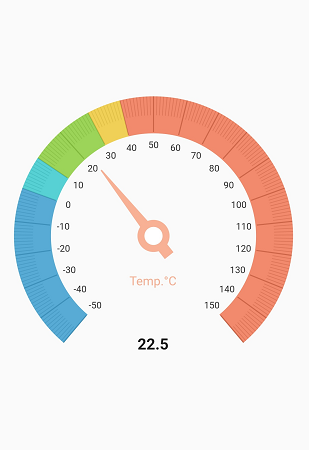

# Flutter Radial Gauge (SfRadialGauge) Overview

Syncfusion Flutter Radial Gauge is a data visualization widget, which is written in dart, to create modern, interactive, and animated gauge that is used to craft high-quality mobile app user interfaces using Flutter.

## Key Features

* **Axes** - The radial gauge axis is a circular arc in which a set of values are displayed along a linear or custom scale based on the design requirements. Axis elements such as labels, ticks, and axis line can be easily customized with built-in properties
* **Ranges** - Gauge range is a visual element that helps to quickly visualize a value where it falls on the axis. The text can be easily annotated in range to improve the readability.
* **Pointers** - Pointer is used to indicate values on an axis. Radial gauge has four types of pointers: needle pointer, marker pointer, range pointer, and widget pointer. All the pointers can be customized as needed.
* **Pointer Animation** - Animates the pointer in a visually appealing way when the pointer moves from one value to another. Gauge supports various pointer animations.
* **Pointer interaction** - Radial gauge provides an option to drag a pointer from one value to another. It is used to change the value at run time.
* **Annotations** - Adds multiple widgets such as text and image as an annotation at a specific point of interest in the radial gauge.

You can get the sample in the following link: [`Flutter Gauges`](https://github.com/syncfusion/flutter-examples).