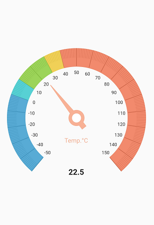

# Flutter Radial Gauge (SfRadialGauge) Overview

Syncfusion&reg; Flutter Radial Gauge is a powerful data visualization widget in Dart. It enables you to create modern, interactive, and animated gauges that enhance the user interface of high-quality mobile applications built with Flutter.

## Key Features

* **Title** - Add a descriptive title to the radial gauge to provide context about the data being visualized. The title can be aligned to the near, center, or far position and its text style can be customized. See the [title](radial-gauge-title.md) documentation to learn more.
* **Axes** - The radial gauge axis is a circular arc that displays a set of values along a linear or custom scale based on your design requirements. Axis elements such as labels, ticks, and axis lines can be easily customized with built-in properties to match your application's theme. See the [axes](axes.md) documentation to learn more.
* **Ranges** - Gauge ranges are visual elements that help users quickly visualize where a value falls on the axis. Text can be easily annotated within ranges to improve readability and provide additional context to your data visualization. See the [ranges](ranges.md) documentation to learn more.
* **Pointers** - Pointer is used to indicate values on an axis. The radial gauge has four types of pointers: needle pointer, marker pointer, range pointer, and widget pointer. All the pointers can be customized as needed. See the [pointers](pointers.md) documentation to learn more.
* **Animation** - The Radial Gauge provides visually appealing animations when pointers move from one value to another. Various animation types and customization options are available to create engaging user experiences. See the [animation](animation.md) documentation to learn more.
* **Annotations** - Add multiple widgets such as text, images, or custom Flutter widgets as annotations at specific points of interest in the radial gauge to provide additional context or information. See the [annotations](annotation.md) documentation to learn more.
* **Accessibility** - The radial gauge is built with accessibility support, allowing it to be navigated and read by screen readers such as TalkBack and VoiceOver. The widget exposes semantic information to assistive technologies so users with visual impairments can understand the gauge data. See the [accessibility](accessibility.md) documentation to learn more.

You can get the sample in the following link: [`Flutter Gauges`](https://github.com/syncfusion/flutter-examples/tree/master/lib/samples/gauge).