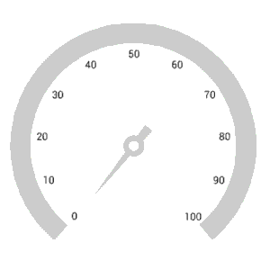

# Pointers

 Pointer is used to indicate values on an axis. The radial gauge control has three types of pointers: 

[`Marker pointer`](https://help.syncfusion.com/flutter/radial-gauge/marker-pointer)
[`Needle pointer`](https://help.syncfusion.com/flutter/radial-gauge/needle-pointer)
[`Range pointer`](https://help.syncfusion.com/flutter/radial-gauge/range-pointer)

All the pointers can be customized as needed. You can add multiple pointers to the gauge to point multiple values on the same scale. The value of the pointer is set using the [`value`](https://pub.dev/documentation/syncfusion_flutter_gauges/latest/gauges/GaugePointer/value.html) property.

## Multiple pointers

In addition to the default pointer, you can add n number of pointers to an axis by adding in the [`pointers`](https://pub.dev/documentation/syncfusion_flutter_gauges/latest/gauges/GaugeAxis/pointers.html) property.



@override
Widget build(BuildContext context) {
  return Scaffold(
    body: Center(
              child: SfRadialGauge(
                axes: <RadialAxis>[RadialAxis(
                  pointers: <GaugePointer>[RangePointer(value: 30, ), 
                   MarkerPointer(value: 70),
                  NeedlePointer(value: 60)]
                )],
              )
            ),
          );
        }



## Pointer Animation
The [`enableAnimation`](https://pub.dev/documentation/syncfusion_flutter_gauges/latest/gauges/GaugePointer/enableAnimation.html) property of pointer allows to enable or disable animation for pointer. The gauge pointers has following animation type:

* `bounceOut`
* `ease`
* `easeInCir`
* `easeOutBack`
* `elasticOut`
* `linear`
* `slowMiddle`

The animation type can be changed using the [`animationType`](https://pub.dev/documentation/syncfusion_flutter_gauges/latest/gauges/GaugePointer/animationType.html)property of pointer. By default, the animation type is linear.



@override
Widget build(BuildContext context) {
  return Scaffold(
    body: Center(
              child: SfRadialGauge(
                axes: <RadialAxis>[RadialAxis( 
                 axisLineStyle: AxisLineStyle(thickness: 30), showTicks: false,
                 pointers: <GaugePointer>[NeedlePointer(value: 60, enableAnimation: true,
                 needleStartWidth: 0,
                   needleEndWidth: 5, needleColor: Color(0xFFDADADA),
                   knobStyle: KnobStyle(color: Colors.white, borderColor: Color(0xFFDADADA),
                       knobRadius: 0.06,
                       borderWidth: 0.04),
                   tailStyle: TailStyle(color:Color(0xFFDADADA), width: 5,
                   length: 0.15)
                    ),
                   RangePointer(value: 60, width: 30, enableAnimation: true, color: Colors.orange)
                 ]
                )],
              )
            ),
          );
        }



## Pointer Dragging

Pointers can be dragged over the scale value. It can be achieved by clicking and dragging the pointer. To enable or disable the pointer drag, use the [`enableDragging`](https://pub.dev/documentation/syncfusion_flutter_gauges/latest/gauges/GaugePointer/enableDragging.html) property.



@override
Widget build(BuildContext context) {
  return Scaffold(
    body: Center(
              child: SfRadialGauge(
                axes: <RadialAxis>[RadialAxis( 
                 axisLineStyle: AxisLineStyle(thickness: 30, color: Colors.lightBlueAccent), 
                 showTicks: false,
                 pointers: <GaugePointer>[
                   MarkerPointer(value: 30, enableDragging: true, 
                   markerWidth: 30, markerHeight: 30, markerOffset: -15,
                   color: Colors.indigo)
                 ]
                )],
              )
            ),
          );
        }



## Event

[`onValueChanged`](https://pub.dev/documentation/syncfusion_flutter_gauges/latest/gauges/GaugePointer/onValueChanged.html) - Occurs whenever the pointer value is changed while dragging.



@override
Widget build(BuildContext context) {
  return Scaffold(
    body: Center(
              child: SfRadialGauge(
                axes: <RadialAxis>[RadialAxis(
                  pointers: <GaugePointer>[ RangePointer(value: 30, 
                  enableDragging: true,
                  onValueChanged: onvalueChanged)]
                )],
              )
            ),
          );
        }

void onvalueChanged(double value){

}



