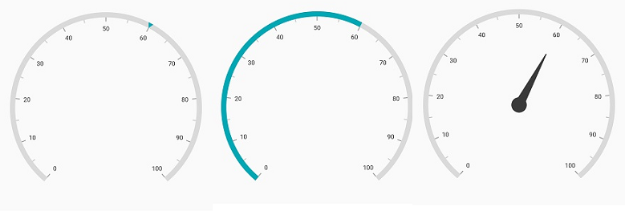
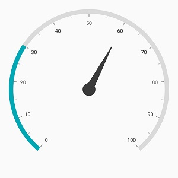
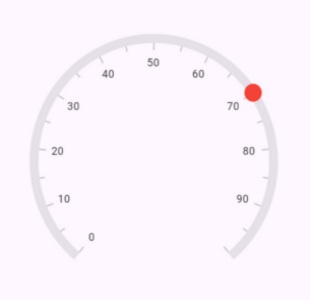

# Pointers in Flutter Radial Gauge (SfRadialGauge)

 Pointer is used to indicate values on an axis. The Syncfusion Flutter Radial Gauge control offers four types of pointers:

[`Marker pointer`](https://help.syncfusion.com/flutter/radial-gauge/marker-pointer)
[`Needle pointer`](https://help.syncfusion.com/flutter/radial-gauge/needle-pointer)
[`Range pointer`](https://help.syncfusion.com/flutter/radial-gauge/range-pointer)
[`Widget pointer`](https://help.syncfusion.com/flutter/radial-gauge/widget-pointer)

All pointers can be customized to meet your specific requirement. You can add multiple pointers to the gauge to indicate multiple values on the same scale. The value of the pointer is set using the [`value`](https://pub.dev/documentation/syncfusion_flutter_gauges/latest/gauges/GaugePointer/value.html) property.

## Multiple pointers

In addition to the default pointer, you can add any number of pointers to an axis by adding then to the [`pointers`](https://pub.dev/documentation/syncfusion_flutter_gauges/latest/gauges/RadialAxis/pointers.html) collection.



  @override
  Widget build(BuildContext context) {
    return Scaffold(
      body: Center(
        child: SfRadialGauge(
          axes: <RadialAxis>[
            RadialAxis(
              pointers: <GaugePointer>[
                RangePointer(value: 30),
                MarkerPointer(value: 70),
                NeedlePointer(value: 60)
              ]
            )
          ],
        )
      ),
    );
  }



## Pointer Dragging

Pointers can be dragged over the scale to change their values interactively. This can be achieved by clicking and dragging the pointer. To enable or disable pointer dragging, use the [`enableDragging`](https://pub.dev/documentation/syncfusion_flutter_gauges/latest/gauges/GaugePointer/enableDragging.html) property.



  @override
  Widget build(BuildContext context) {
    return Scaffold(
      body: Center(
        child: SfRadialGauge(
          axes: <RadialAxis>[
            RadialAxis(
              axisLineStyle: AxisLineStyle(
                thickness: 30, 
                color: Colors.lightBlueAccent
              ),
              showTicks: false,
              pointers: <GaugePointer>[
                MarkerPointer(
                  value: 30, 
                  enableDragging: true,
                  markerWidth: 30, 
                  markerHeight: 30, 
                  markerOffset: -15,
                  color: Colors.indigo
                )
              ]
            )
          ],
        )
      ),
    );
  }



## Event

[`onValueChangeStart`](https://pub.dev/documentation/syncfusion_flutter_gauges/latest/gauges/GaugePointer/onValueChangeStart.html) - Occurs when the pointer dragging begins.

[`onValueChanging`](https://pub.dev/documentation/syncfusion_flutter_gauges/latest/gauges/GaugePointer/onValueChanging.html) - Occurs before the current drag value is updated as the pointer value. The [`cancel`](https://pub.dev/documentation/syncfusion_flutter_gauges/latest/gauges/ValueChangingArgs/cancel.html) argument of [`ValueChangingArgs`](https://pub.dev/documentation/syncfusion_flutter_gauges/latest/gauges/ValueChangingArgs-class.html) allows you to prevent the current drag value from being applied to the pointer.

[`onValueChanged`](https://pub.dev/documentation/syncfusion_flutter_gauges/latest/gauges/GaugePointer/onValueChanged.html) - Occurs whenever the pointer value changes during dragging.

[`onValueChangeEnd`](https://pub.dev/documentation/syncfusion_flutter_gauges/latest/gauges/GaugePointer/onValueChangeEnd.html) - Occurs when the pointer dragging is completed.



  @override
  Widget build(BuildContext context) {
    return Scaffold(
      body: Center(
        child: SfRadialGauge(
          axes: <RadialAxis>[
            RadialAxis(
              pointers: <GaugePointer>[
                RangePointer(
                  value: 30,
                  enableDragging: true,
                  onValueChanging: onValueChanging,
                  onValueChanged: onValueChanged
                )
              ]
            )
          ],
        )
      ),
    );
  }

  void onValueChanging(ValueChangingArgs args) {
    // Restrict the pointer from moving beyond value 60
    if (args.value > 60) {
      args.cancel = true;
    }
  }

  void onValueChanged(double value) {
    // Handle the value change
    print('Pointer value changed to: $value');
  }



The [`onCreatePointerRenderer`](https://pub.dev/documentation/syncfusion_flutter_gauges/latest/gauges/MarkerPointer/onCreatePointerRenderer.html) callback allows you to create a custom pointer in the radial gauge. This callback can be used only with the [`NeedlePointer`](https://pub.dev/documentation/syncfusion_flutter_gauges/latest/gauges/NeedlePointer-class.html) or [`MarkerPointer`](https://pub.dev/documentation/syncfusion_flutter_gauges/latest/gauges/MarkerPointer-class.html) types.



  @override
  Widget build(BuildContext context) {
    return Scaffold(
      body: Center(
        child: SfRadialGauge(
          axes: <RadialAxis>[
            RadialAxis(
              pointers: <GaugePointer>[
                MarkerPointer(
                  value: 70,
                  onCreatePointerRenderer: () {
                    return _CustomPointerRenderer();
                  },
                ),
              ],
            ),
          ],
        ),
      ),
    );
  }

  class _CustomPointerRenderer extends MarkerPointerRenderer {
    @override
    void drawPointer(
      Canvas canvas,
      PointerPaintingDetails pointerPaintingDetails,
      SfGaugeThemeData gaugeThemeData,
    ) {
      canvas.drawCircle(
        pointerPaintingDetails.startOffset,
        10,
        Paint()..color = Colors.red,
      );
    }
  }



