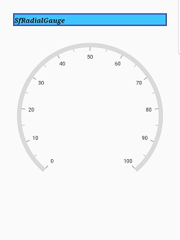

# Title in Flutter Radial Gauge (SfRadialGauge)

You can define and customize the gauge title using the [`title`](https://pub.dev/documentation/syncfusion_flutter_gauges/latest/gauges/SfRadialGauge/title.html) property of [`SfRadialGauge`](https://pub.dev/documentation/syncfusion_flutter_gauges/latest/gauges/SfRadialGauge-class.html). The [`text`](https://pub.dev/documentation/syncfusion_flutter_gauges/latest/gauges/GaugeTitle/text.html) property of [`GaugeTitle`](https://pub.dev/documentation/syncfusion_flutter_gauges/latest/gauges/GaugeTitle-class.html) is used to set text to the title.

The following properties are used to customize the appearance of title,

* [`backgroundColor`](https://pub.dev/documentation/syncfusion_flutter_gauges/latest/gauges/GaugeTitle/backgroundColor.html) - Changes the background color.

* [`borderWidth`](https://pub.dev/documentation/syncfusion_flutter_gauges/latest/gauges/GaugeTitle/borderWidth.html) – Changes the border width.

* [`borderColor`](https://pub.dev/documentation/syncfusion_flutter_gauges/latest/gauges/GaugeTitle/borderColor.html) – Changes the border color.

* [`textStyle`](https://pub.dev/documentation/syncfusion_flutter_gauges/latest/gauges/GaugeTitle/textStyle.html) - Changes the text color, size, font family, fontStyle, and font weight.

## Text Alignment

You can align the title text content horizontally to the near, center, or far to the gauge using the [`alignment`](https://pub.dev/documentation/syncfusion_flutter_gauges/latest/gauges/GaugeTitle/alignment.html) property of[`title`](https://pub.dev/documentation/syncfusion_flutter_gauges/latest/gauges/GaugeTitle-class.html).

 

@override
Widget build(BuildContext context) {
  return Scaffold(
    body: Center(
     child: SfRadialGauge(
        title: GaugeTitle(text: 'SfRadialGauge', 
        backgroundColor: Colors.lightBlueAccent,
        textStyle: TextStyle(fontSize: 15, fontWeight: FontWeight.bold, 
         fontStyle: FontStyle.italic,
         color: Colors.black, fontFamily: 'Times'),
        borderColor: Colors.indigo, borderWidth: 3, 
           alignment: GaugeAlignment.near),
        axes: <RadialAxis>[RadialAxis()],)
    ),
  );
}



