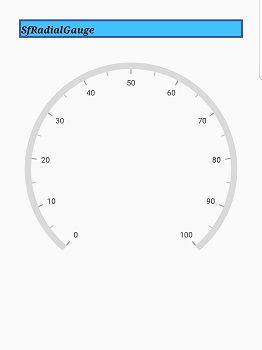

# Title in Flutter Radial Gauge (SfRadialGauge)

You can define and customize the gauge title using the [`title`](https://pub.dev/documentation/syncfusion_flutter_gauges/latest/gauges/SfRadialGauge/title.html) property of [`SfRadialGauge`](https://pub.dev/documentation/syncfusion_flutter_gauges/latest/gauges/SfRadialGauge-class.html). The [`text`](https://pub.dev/documentation/syncfusion_flutter_gauges/latest/gauges/GaugeTitle/text.html) property of [`GaugeTitle`](https://pub.dev/documentation/syncfusion_flutter_gauges/latest/gauges/GaugeTitle-class.html) is used to set text content of the title.

The following properties are used to customize the appearance of title,

* [`backgroundColor`](https://pub.dev/documentation/syncfusion_flutter_gauges/latest/gauges/GaugeTitle/backgroundColor.html) - Changes the background color of the title.

* [`borderWidth`](https://pub.dev/documentation/syncfusion_flutter_gauges/latest/gauges/GaugeTitle/borderWidth.html) – Changes the border width of the title.

* [`borderColor`](https://pub.dev/documentation/syncfusion_flutter_gauges/latest/gauges/GaugeTitle/borderColor.html) – Changes the border color of the title.

* [`textStyle`](https://pub.dev/documentation/syncfusion_flutter_gauges/latest/gauges/GaugeTitle/textStyle.html) - Changes the text color, size, font family, fontStyle, and font weight.

## Text alignment

You can align the title text content horizontally to the near (left), center, or far (right) position relative to the gauge using the [`alignment`](https://pub.dev/documentation/syncfusion_flutter_gauges/latest/gauges/GaugeTitle/alignment.html) property of [`title`](https://pub.dev/documentation/syncfusion_flutter_gauges/latest/gauges/GaugeTitle-class.html). The default alignment is `GaugeAlignment.center`.




import 'package:flutter/material.dart';
import 'package:syncfusion_flutter_gauges/gauges.dart';

void main() {
  runApp(const MyApp());
}

class MyApp extends StatelessWidget {
  const MyApp({Key? key}) : super(key: key);

  @override
  Widget build(BuildContext context) {
    return MaterialApp(
      title: 'Radial Gauge',
      theme: ThemeData(
        primarySwatch: Colors.blue,
      ),
      home: const MyHomePage(),
    );
  }
}

class MyHomePage extends StatelessWidget {
  const MyHomePage({Key? key}) : super(key: key);

  @override
  Widget build(BuildContext context) {
    return Scaffold(
      body: Center(
        child: SfRadialGauge(
          title: GaugeTitle(
            text: 'SfRadialGauge',
            backgroundColor: Colors.lightBlueAccent,
            textStyle: const TextStyle(
              fontSize: 15, 
              fontWeight: FontWeight.bold,
              fontStyle: FontStyle.italic,
              color: Colors.black, 
              fontFamily: 'Times'
            ),
            borderColor: Colors.indigo, 
            borderWidth: 3,
            alignment: GaugeAlignment.near
          ),
          axes: <RadialAxis>[
            RadialAxis()
          ],
        ),
      ),
    );
  }
}




