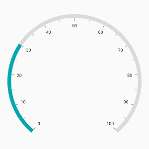
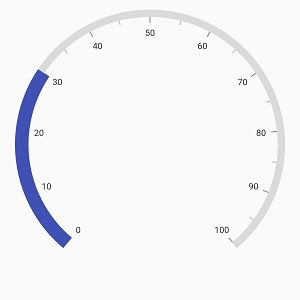
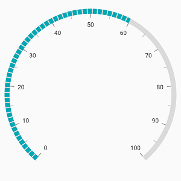
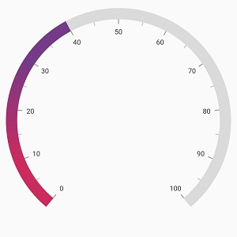
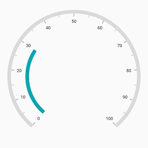

# Range Pointer in Flutter Radial Gauge (SfRadialGauge)

A range pointer is an accenting line or shaded background range that can be placed on a gauge to mark the current value.



@override
Widget build(BuildContext context) {
  return Scaffold(
    body: Center(
              child: SfRadialGauge(
                axes: <RadialAxis>[RadialAxis(
                  pointers: <GaugePointer>[RangePointer(value: 30)]
                )],
              )
            ),
          );
        }



The following properties are used to customize the range pointer:

* [`color`](https://pub.dev/documentation/syncfusion_flutter_gauges/latest/gauges/RangePointer/color.html) – Customizes the color of range pointer.

* [`width`](https://pub.dev/documentation/syncfusion_flutter_gauges/latest/gauges/RangePointer/width.html)  - Specifies the width of pointer either in logical pixels or factor.

* [`sizeUnit`](https://pub.dev/documentation/syncfusion_flutter_gauges/latest/gauges/RangePointer/sizeUnit.html) – Specifies whether the [`width`](https://pub.dev/documentation/syncfusion_flutter_gauges/latest/gauges/RangePointer/width.html) and the [`pointerOffset`](https://pub.dev/documentation/syncfusion_flutter_gauges/latest/gauges/RangePointer/pointerOffset.html) are defined in logical pixels or factor.

The [`width`](https://pub.dev/documentation/syncfusion_flutter_gauges/latest/gauges/RangePointer/width.html) of the pointer can be specified either in logical pixel or factor. If the [`sizeUnit`](https://pub.dev/documentation/syncfusion_flutter_gauges/latest/gauges/RangePointer/sizeUnit.html) is specified as logicalPixel, then the range will be rendered based on the provided pixel value. If the [`sizeUnit`](https://pub.dev/documentation/syncfusion_flutter_gauges/latest/gauges/RangePointer/sizeUnit.html)is set as factor, the provided factor value will be multiplied with axis radius. For example, if the width is set as 0.1, then 10% of axis radius is considered as range pointer width.



@override
Widget build(BuildContext context) {
  return Scaffold(
    body: Center(
              child: SfRadialGauge(
                axes: <RadialAxis>[RadialAxis(
                  pointers: <GaugePointer>[RangePointer(value: 30, width: 0.1,
                      color: Colors.indigo, sizeUnit: GaugeSizeUnit.factor
                    )
                  ]
                )],
              )
            ),
          );
        }



 The default value of [`SizeUnit`](https://pub.dev/documentation/syncfusion_flutter_gauges/latest/gauges/RangePointer/sizeUnit.html) is [`GaugeSizeUnit.logicalPixel`](https://pub.dev/documentation/syncfusion_flutter_gauges/latest/gauges/GaugeSizeUnit-class.html).

 **Dashed range pointer**

 The [`dashArray`](https://pub.dev/documentation/syncfusion_flutter_gauges/latest/gauges/RangePointer/dashArray.html) property of [`range pointer`](https://pub.dev/documentation/syncfusion_flutter_gauges/latest/gauges/RangePointer-class.html) allows rendering the dashed range pointer line.



@override
Widget build(BuildContext context) {
   return Scaffold(
      body: Center(
        child: SfRadialGauge(
            axes: <RadialAxis>[
              RadialAxis(pointers: <GaugePointer>[
               RangePointer(value: 60, dashArray: <double>[8, 2])
          ])
         ]
        ),
      ),
    );
  }



 
 **Gradient support**

 The [`gradient`](https://pub.dev/documentation/syncfusion_flutter_gauges/latest/gauges/RangePointer/gradient.html) property of [`range pointer`](https://pub.dev/documentation/syncfusion_flutter_gauges/latest/gauges/RangePointer-class.html) allows to specify the smooth color transition to pointer by specifying the different colors based on provided factor value.

 

@override
Widget build(BuildContext context) {
   return Scaffold(
      body: Center(
        child: SfRadialGauge(
            axes:<RadialAxis>[RadialAxis( 
                axisLineStyle: AxisLineStyle(thickness: 0.1,
                  thicknessUnit: GaugeSizeUnit.factor,),
              pointers: <GaugePointer>[RangePointer(
                value: 40, width: 0.1, sizeUnit: GaugeSizeUnit.factor,
                gradient: const SweepGradient(
                    colors: <Color>[Color(0xFFCC2B5E), Color(0xFF753A88)],
                    stops: <double>[0.25, 0.75]
                ),
              )]
            ),
          ]
        ),
      ),
    );
  }



**Corner customization**

 The [`cornerStyle`](https://pub.dev/documentation/syncfusion_flutter_gauges/latest/gauges/RangePointer/cornerStyle.html) property of [`range pointer`](https://pub.dev/documentation/syncfusion_flutter_gauges/latest/gauges/RangePointer-class.html) specifies the corner type for pointer. The corners can be customized using the bothFlat, bothCurve, startCurve, and endCurve options. The default value of this property is bothFlat.

 

@override
Widget build(BuildContext context) {
  return Scaffold(
    body: Center(
              child: SfRadialGauge(
                axes: <RadialAxis>[RadialAxis(pointers:<GaugePointer>[RangePointer(value: 30, 
                cornerStyle: CornerStyle.bothCurve)]
                )],
              )
            ),
          );
        }



## Position customization

The range pointer can be moved far or near to the axis line using the [`pointerOffset`](https://pub.dev/documentation/syncfusion_flutter_gauges/latest/gauges/RangePointer/pointerOffset.html) property. The [`pointerOffset`](https://pub.dev/documentation/syncfusion_flutter_gauges/latest/gauges/RangePointer/pointerOffset.html) can be set either in logical pixel or factor value using its [`sizeUnit`](https://pub.dev/documentation/syncfusion_flutter_gauges/latest/gauges/RangePointer/sizeUnit.html). The [`sizeUnit`](https://pub.dev/documentation/syncfusion_flutter_gauges/latest/gauges/RangePointer/sizeUnit.html) property is common for both[`width`](https://pub.dev/documentation/syncfusion_flutter_gauges/latest/gauges/RangePointer/width.html) and [`pointerOffset`](https://pub.dev/documentation/syncfusion_flutter_gauges/latest/gauges/RangePointer/pointerOffset.html)



@override
Widget build(BuildContext context) {
  return Scaffold(
    body: Center(
              child: SfRadialGauge(
                axes: <RadialAxis>[RadialAxis( 
                  pointers: <GaugePointer>[RangePointer(value: 30, pointerOffset: 50)]
                )],
              )
            ),
          );
        }



When you set the [`sizeUnit`](https://pub.dev/documentation/syncfusion_flutter_gauges/latest/gauges/RangePointer/sizeUnit.html) as logical pixel, the pointer will be moved to the provided logical pixel value.

If the [`sizeUnit`](https://pub.dev/documentation/syncfusion_flutter_gauges/latest/gauges/RangePointer/sizeUnit.html)  is specified as factor, the factor value will be multiplied with the axis radius. For example, if you set [`pointerOffset`](https://pub.dev/documentation/syncfusion_flutter_gauges/latest/gauges/RangePointer/pointerOffset.html) as 0.1, then the pointer offset is considered as 10% of axis radius.

