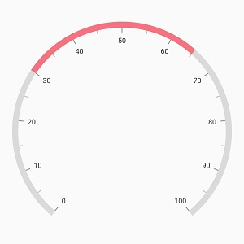
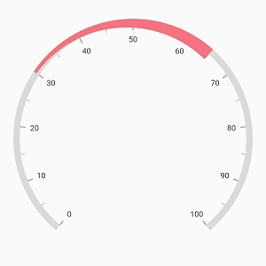
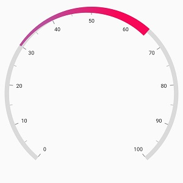
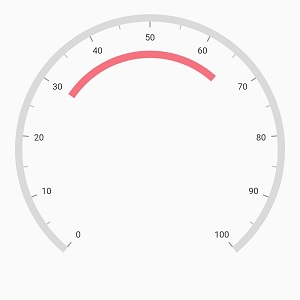
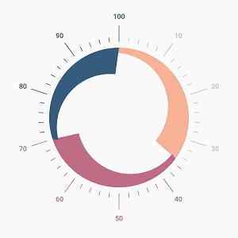
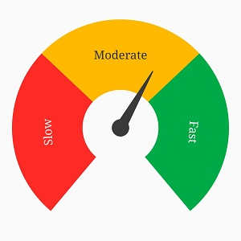

# Ranges in Flutter Radial Gauge (SfRadialGauge)

Gauge range is a visual element that helps to quickly visualize where a value falls on the axis. The text can be easily annotated in range to improve the readability.

**Setting start and end value**

The start and end values of ranges are set using the [`startValue`](https://pub.dev/documentation/syncfusion_flutter_gauges/latest/gauges/GaugeRange/startValue.html) and [`endValue`](https://pub.dev/documentation/syncfusion_flutter_gauges/latest/gauges/GaugeRange/endValue.html) properties.



@override
Widget build(BuildContext context) {
  return Scaffold(
    body: Center(

              child: SfRadialGauge(
                axes: <RadialAxis>[RadialAxis( 
                  ranges: <GaugeRange>[GaugeRange(startValue: 30, endValue: 65)]
                )
                ],
              )
            ),
          );
        }



## Range Customization

The following properties are used for the range customization:

* [`color`](https://pub.dev/documentation/syncfusion_flutter_gauges/latest/gauges/GaugeRange/color.html) – Specifies the color for the range.

* [`startWidth`](https://pub.dev/documentation/syncfusion_flutter_gauges/latest/gauges/GaugeRange/startWidth.html) – Specifies the start width of the range either in logical pixels or factor.

* [`endWidth`](https://pub.dev/documentation/syncfusion_flutter_gauges/latest/gauges/GaugeRange/endWidth.html) – Specifies the end width of the range either in logical pixels or factor.

* [`sizeUnit`](https://pub.dev/documentation/syncfusion_flutter_gauges/latest/gauges/GaugeRange/sizeUnit.html) – Specifies whether the start width and end width of the range are set in logical pixels or factor.

* [`gradient`](https://pub.dev/documentation/syncfusion_flutter_gauges/latest/gauges/GaugeRange/gradient.html) - Specifies the gradient for the range.



@override
Widget build(BuildContext context) {
  return Scaffold(
    body: Center(
              child: SfRadialGauge(
                axes: <RadialAxis>[RadialAxis( 
                  ranges: <GaugeRange>[GaugeRange(startValue: 30, endValue: 65,
                    startWidth: 5, endWidth: 20
                  )]
                )
                ],
              )
            ),
          );
        }



When the [`sizeUnit`](https://pub.dev/documentation/syncfusion_flutter_gauges/latest/gauges/GaugeRange/sizeUnit.html) is set as logical pixels, the range will be rendered based on the provided logical pixel values in [`startWidth`](https://pub.dev/documentation/syncfusion_flutter_gauges/latest/gauges/GaugeRange/startWidth.html) and [`endWidth`](https://pub.dev/documentation/syncfusion_flutter_gauges/latest/gauges/GaugeRange/endWidth.html)

If the [`sizeUnit`](https://pub.dev/documentation/syncfusion_flutter_gauges/latest/gauges/GaugeRange/sizeUnit.html) is set as factor, the provided factor value in the start width and end width will be multiplied with the axis radius, respectively. The factor value ranges from 0 to 1.

**Gradient support**

 The [`gradient`](https://pub.dev/documentation/syncfusion_flutter_gauges/latest/gauges/GaugeRange/gradient.html) property of [`range`](https://pub.dev/documentation/syncfusion_flutter_gauges/latest/gauges/GaugeRange-class.html) allows to specify the smooth color transition to pointer by specifying the different colors based on provided factor value.



@override
Widget build(BuildContext context) {
  return Scaffold(
      body: Center(
          child: SfRadialGauge(
            axes: <RadialAxis>[RadialAxis(
                ranges: <GaugeRange>[
                  GaugeRange(startValue: 30,
                      endValue: 65,
                      gradient: const SweepGradient(
                          colors: <Color>[Color(0xFFBC4E9C), Color(0xFFF80759)],
                          stops: <double>[0.25, 0.75]),
                      startWidth: 5,
                      endWidth: 20
                  )
                ]
            )
            ],
          )
      ),
    );
  }



**Position customization**

 The range can be moved far or near to the axis line with using the [`rangeOffset`](https://pub.dev/documentation/syncfusion_flutter_gauges/latest/gauges/GaugeRange/rangeOffset.html) property. The property can be specified either in the logical pixels or the factor value.

If the [`sizeUnit`](https://pub.dev/documentation/syncfusion_flutter_gauges/latest/gauges/GaugeRange/sizeUnit.html) is set as logical pixels, then the range will be moved based on the provided logical pixel value.

If the [`sizeUnit`](https://pub.dev/documentation/syncfusion_flutter_gauges/latest/gauges/GaugeRange/sizeUnit.html) is set as factor, the factor value will be multiplied with the axis radius.Then the pointer will be moved to the corresponding value
The [`sizeUnit`](https://pub.dev/documentation/syncfusion_flutter_gauges/latest/gauges/GaugeRange/sizeUnit.html) property is common for the [`rangeOffset`](https://pub.dev/documentation/syncfusion_flutter_gauges/latest/gauges/GaugeRange/rangeOffset.html), [`startWidth`](https://pub.dev/documentation/syncfusion_flutter_gauges/latest/gauges/GaugeRange/startWidth.html) and the [`endWidth`](https://pub.dev/documentation/syncfusion_flutter_gauges/latest/gauges/GaugeRange/endWidth.html) properties. The default value of [`sizeUnit`](https://pub.dev/documentation/syncfusion_flutter_gauges/latest/gauges/GaugeRange/sizeUnit.html) is logicalPixel.



@override
Widget build(BuildContext context) {
  return Scaffold(
    body: Center(

              child: SfRadialGauge(
                axes: <RadialAxis>[RadialAxis(
                  ranges: <GaugeRange>[GaugeRange(startValue: 30, endValue: 65,
                  rangeOffset: 50,
                  )]
                )
                ],
              )
            ),
          );
        }
 


## Setting range color to axis elements

You can set range color to axis labels and ticks using the [`useRangeColorForAxis`](https://pub.dev/documentation/syncfusion_flutter_gauges/latest/gauges/RadialAxis/useRangeColorForAxis.html) property of axis.



@override
Widget build(BuildContext context) {
  return Scaffold(
    body: Center(
              child: SfRadialGauge(
                axes: <RadialAxis>[
                  RadialAxis(showAxisLine: false, 
                      ticksPosition: ElementsPosition.outside,
                      labelsPosition: ElementsPosition.outside,
                      startAngle: 270, endAngle: 270, useRangeColorForAxis: true,
                       interval: 10,
                      axisLabelStyle:GaugeTextStyle(
                          fontWeight: FontWeight.w500,
                          fontSize: 12),
                      majorTickStyle: MajorTickStyle(length: 0.15,
                          lengthUnit: GaugeSizeUnit.factor,
                          thickness: 1),
                      minorTicksPerInterval: 4, labelOffset: 15,
                      minorTickStyle: MinorTickStyle(length: 0.04,
                          lengthUnit: GaugeSizeUnit.factor,
                          thickness: 1),
                      ranges: <GaugeRange>[GaugeRange(startValue: 0, endValue: 35,
                          color: Color(0xFFF8B195),
                          sizeUnit: GaugeSizeUnit.factor,
                          rangeOffset: 0.06,
                          startWidth: 0.05, endWidth: 0.25),
                        GaugeRange(startValue: 35, endValue: 70,
                            rangeOffset: 0.06,
                            sizeUnit: GaugeSizeUnit.factor,
                            color: Color(0xFFC06C84),
                            startWidth: 0.05, endWidth: 0.25),
                        GaugeRange(startValue: 70, endValue: 100,
                            rangeOffset: 0.06,
                            sizeUnit: GaugeSizeUnit.factor,
                            color: Color(0xFF355C7D),
                            startWidth: 0.05, endWidth: 0.25),]
                )],
              )
            ),
          );
        }



## Range label

A text can be displayed on range using the [`label`](https://pub.dev/documentation/syncfusion_flutter_gauges/latest/gauges/GaugeRange/label.html) property. The provided text can be customized using the [`labelStyle`](https://pub.dev/documentation/syncfusion_flutter_gauges/latest/gauges/GaugeRange/labelStyle.html) property.


@override
Widget build(BuildContext context) {
  return Scaffold(
    body: Center(
              child: SfRadialGauge(
                axes:<RadialAxis>[
                  RadialAxis(showLabels: false, showAxisLine: false, showTicks: false,
                      minimum: 0, maximum: 99, 
                      ranges: <GaugeRange>[GaugeRange(startValue: 0, endValue: 33,
                          color: Color(0xFFFE2A25), label: 'Slow',
                          sizeUnit: GaugeSizeUnit.factor,
                          labelStyle: GaugeTextStyle(fontFamily: 'Times', fontSize:  20),
                          startWidth: 0.65, endWidth: 0.65
                      ),GaugeRange(startValue: 33, endValue: 66,
                        color:Color(0xFFFFBA00), label: 'Moderate',
                        labelStyle: GaugeTextStyle(fontFamily: 'Times', fontSize:   20),
                        startWidth: 0.65, endWidth: 0.65, sizeUnit: GaugeSizeUnit.factor,
                      ),
                        GaugeRange(startValue: 66, endValue: 99,
                          color:Color(0xFF00AB47), label: 'Fast',
                          labelStyle: GaugeTextStyle(fontFamily: 'Times', fontSize:   20),
                          sizeUnit: GaugeSizeUnit.factor,
                          startWidth: 0.65, endWidth: 0.65,
                        ),

                      ],
                      pointers: <GaugePointer>[NeedlePointer(value: 60
                    )]
                  )
                ],
              )
            ),
          );
        }



