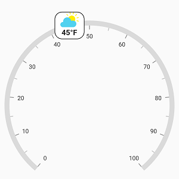
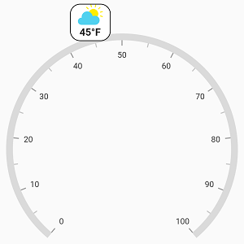

# Widget Pointer in Flutter Radial Gauge (SfRadialGauge)

[`WidgetPointer`](https://pub.dev/documentation/syncfusion_flutter_gauges/latest/gauges/WidgetPointer-class.html) allows pointing the desired value with any widget in a scale. You can set the desired widget to its [`child`](https://pub.dev/documentation/syncfusion_flutter_gauges/latest/gauges/WidgetPointer/child.html) property to annotate the pointer value.



@override
Widget build(BuildContext context) {
  return Scaffold(
    body: Center(
      child: SfRadialGauge(
        axes: <RadialAxis>[
          RadialAxis(pointers: <GaugePointer>[
            WidgetPointer(
              value: 45,
              child: Container(
                height: 55,
                width: 60,
                decoration: BoxDecoration(
                  color: Colors.white,
                  borderRadius: BorderRadius.circular(15),
                  border: Border.all(
                    color: Colors.black,
                    style: BorderStyle.solid,
                    width: 1.0)),
                    child: Column(
                      children: <Widget>[
                        Container(
                            width: 40.00,
                            height: 30.00,
                            decoration: new BoxDecoration(
                              image: new DecorationImage(
                              image: ExactAssetImage('images/sun.png'),
                                fit: BoxFit.fitHeight,
                              ),
                            )),
                        Padding(
                          padding: EdgeInsets.fromLTRB(0, 2, 0, 0),
                          child: Container(
                            child: Text('45°F',
                                style: TextStyle(
                                    fontWeight: FontWeight.bold, fontSize: 15)),
                          ),
                        )
                      ],
                    )))
          ])
        ],
      )),
    );
  }



## Position customization

The widget pointer can be moved near or far from its actual position using the [`offset`](https://pub.dev/documentation/syncfusion_flutter_gauges/latest/gauges/WidgetPointer/offset.html) and [`offsetUnit`](https://pub.dev/documentation/syncfusion_flutter_gauges/latest/gauges/WidgetPointer/offsetUnit.html) properties.

When you set [`offsetUnit`](https://pub.dev/documentation/syncfusion_flutter_gauges/latest/gauges/WidgetPointer/offsetUnit.html) to logical pixel, then the widget pointer will be moved based on the logical pixel value. If you set [`offsetUnit`](https://pub.dev/documentation/syncfusion_flutter_gauges/latest/gauges/WidgetPointer/offsetUnit.html) to factor, then provided factor will be multiplied with the axis radius value, and then the pointer will be moved to corresponding value. The default value of [`offsetUnit`](https://pub.dev/documentation/syncfusion_flutter_gauges/latest/gauges/WidgetPointer/offsetUnit.html) is [`GaugeSizeUnit.logicalPixel`](https://pub.dev/documentation/syncfusion_flutter_gauges/latest/gauges/GaugeSizeUnit-class.html).


@override
Widget build(BuildContext context) {
  return Scaffold(
    body: Center(
      child: SfRadialGauge(
        axes: <RadialAxis>[
          RadialAxis(pointers: <GaugePointer>[
            WidgetPointer(
                value: 45,
                offset: -27,
                child: Container(
                    height: 55,
                    width: 60,
                    decoration: BoxDecoration(
                        color: Colors.white,
                        borderRadius: BorderRadius.circular(15),
                        border: Border.all(
                          color: Colors.black,
                          style: BorderStyle.solid,
                          width: 1.0,
                        )),
                    child: Column(
                      children: <Widget>[
                        Container(
                            width: 40.00,
                            height: 30.00,
                            decoration: new BoxDecoration(
                              image: new DecorationImage(
                                image: ExactAssetImage('images/sun.png'),
                                fit: BoxFit.fitHeight,
                              ),
                            )),
                        Padding(
                          padding: EdgeInsets.fromLTRB(0, 2, 0, 0),
                          child: Container(
                            child: Text('45°F',
                                style: TextStyle(
                                    fontWeight: FontWeight.bold, fontSize: 15)),
                          ),
                        )
                      ],
                    )))
          ])
        ],
      )),
    );
  }



