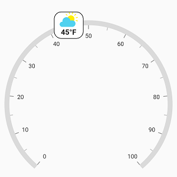
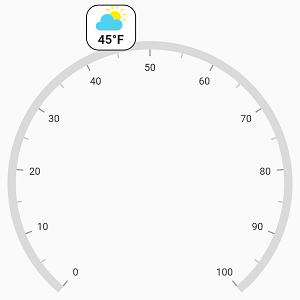

# Widget Pointer in Flutter Radial Gauge (SfRadialGauge)

[`WidgetPointer`](https://pub.dev/documentation/syncfusion_flutter_gauges/latest/gauges/WidgetPointer-class.html) allows you to point to a desired value with any Flutter widget in a gauge scale. You can set the desired widget to its [`child`](https://pub.dev/documentation/syncfusion_flutter_gauges/latest/gauges/WidgetPointer/child.html) property to annotate the pointer value.




import 'package:flutter/material.dart';
import 'package:syncfusion_flutter_gauges/gauges.dart';

void main() {
  runApp(const MyApp());
}

class MyApp extends StatelessWidget {
  const MyApp({Key? key}) : super(key: key);

  @override
  Widget build(BuildContext context) {
    return MaterialApp(
      home: Scaffold(
        appBar: AppBar(title: const Text('Widget Pointer')),
        body: const MyHomePage(),
      ),
    );
  }
}

class MyHomePage extends StatelessWidget {
  const MyHomePage({Key? key}) : super(key: key);

  @override
  Widget build(BuildContext context) {
    return Scaffold(
      body: Center(
        child: SfRadialGauge(
          axes: <RadialAxis>[
            RadialAxis(
              pointers: <GaugePointer>[
                WidgetPointer(
                  value: 45,
                  child: Container(
                    height: 55,
                    width: 60,
                    decoration: BoxDecoration(
                      color: Colors.white,
                      borderRadius: BorderRadius.circular(15),
                      border: Border.all(
                        color: Colors.black,
                        style: BorderStyle.solid,
                        width: 1.0
                      )
                    ),
                    child: Column(
                      children: <Widget>[
                        Container(
                          width: 40.00,
                          height: 30.00,
                          decoration: BoxDecoration(
                            image: DecorationImage(
                              image: AssetImage('images/sun.png'),
                              fit: BoxFit.fitHeight,
                            ),
                          )
                        ),
                        Padding(
                          padding: EdgeInsets.fromLTRB(0, 2, 0, 0),
                          child: Container(
                            child: Text(
                              '45°F',
                              style: TextStyle(
                                fontWeight: FontWeight.bold, 
                                fontSize: 15
                              )
                            ),
                          )
                        )
                      ],
                    )
                  )
                )
              ]
            )
          ],
        )
      ),
    );
  }
}




## Position customization

The widget pointer can be moved near or far from its actual position using the [`offset`](https://pub.dev/documentation/syncfusion_flutter_gauges/latest/gauges/WidgetPointer/offset.html) and [`offsetUnit`](https://pub.dev/documentation/syncfusion_flutter_gauges/latest/gauges/WidgetPointer/offsetUnit.html) properties.

When you set [`offsetUnit`](https://pub.dev/documentation/syncfusion_flutter_gauges/latest/gauges/WidgetPointer/offsetUnit.html) to logical pixel, the widget pointer will be moved based on the logical pixel value. If you set [`offsetUnit`](https://pub.dev/documentation/syncfusion_flutter_gauges/latest/gauges/WidgetPointer/offsetUnit.html) to factor, the provided factor will be multiplied by the axis radius value, and the pointer will be moved to the corresponding value. The default value of [`offsetUnit`](https://pub.dev/documentation/syncfusion_flutter_gauges/latest/gauges/WidgetPointer/offsetUnit.html) is [`GaugeSizeUnit.logicalPixel`](https://pub.dev/documentation/syncfusion_flutter_gauges/latest/gauges/GaugeSizeUnit.html).

**Note:** Add the image to your pubspec.yaml assets section.




import 'package:flutter/material.dart';
import 'package:syncfusion_flutter_gauges/gauges.dart';

void main() {
  runApp(const MyApp());
}

class MyApp extends StatelessWidget {
  const MyApp({Key? key}) : super(key: key);

  @override
  Widget build(BuildContext context) {
    return MaterialApp(
      home: Scaffold(
        appBar: AppBar(title: const Text('Widget Pointer with Offset')),
        body: const MyHomePage(),
      ),
    );
  }
}

class MyHomePage extends StatelessWidget {
  const MyHomePage({Key? key}) : super(key: key);

  @override
  Widget build(BuildContext context) {
    return Scaffold(
      body: Center(
        child: SfRadialGauge(
          axes: <RadialAxis>[
            RadialAxis(
              pointers: <GaugePointer>[
                WidgetPointer(
                  value: 45,
                  offset: -27,
                  child: Container(
                    height: 55,
                    width: 60,
                    decoration: BoxDecoration(
                      color: Colors.white,
                      borderRadius: BorderRadius.circular(15),
                      border: Border.all(
                        color: Colors.black,
                        style: BorderStyle.solid,
                        width: 1.0,
                      )
                    ),
                    child: Column(
                      children: <Widget>[
                        Container(
                          width: 40.00,
                          height: 30.00,
                          decoration: BoxDecoration(
                            image: DecorationImage(
                              image: AssetImage('images/sun.png'),
                              fit: BoxFit.fitHeight,
                            ),
                          )
                        ),
                        Padding(
                          padding: EdgeInsets.fromLTRB(0, 2, 0, 0),
                          child: Container(
                            child: Text(
                              '45°F',
                              style: TextStyle(
                                fontWeight: FontWeight.bold, 
                                fontSize: 15
                              )
                            ),
                          )
                        )
                      ],
                    )
                  )
                )
              ]
            )
          ],
        )
      ),
    );
  }
}




