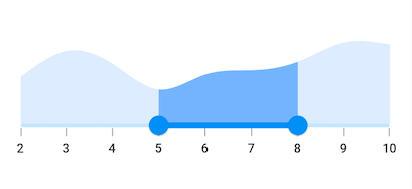
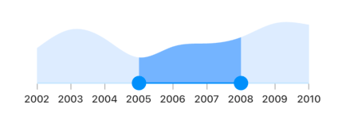

# Basic features of range selector
This section explains about how to add the numeric and date range selector.

## Minimum

The minimum value that the user can select. The default value of [`min`](https://pub.dev/documentation/syncfusion_flutter_sliders/latest/sliders/SfRangeSelector/min.html) property is 0.0 and it must be less than the [`max`](https://pub.dev/documentation/syncfusion_flutter_sliders/latest/sliders/SfRangeSelector/max.html) value.

## Maximum

The maximum value that the user can select. The default value of [`max`](https://pub.dev/documentation/syncfusion_flutter_sliders/latest/sliders/SfRangeSelector/max.html) property is 1.0 and it must be greater than the [`min`](https://pub.dev/documentation/syncfusion_flutter_sliders/latest/sliders/SfRangeSelector/min.html) value.

## Initial values

The values that initially selected in the range selector. The range selector's thumb is drawn corresponding to this value.

N> For date values, the range selector does not have auto interval support. So, it is mandatory to set `interval`, `dateIntervalType`, and `dateFormat` for date values.

**Numeric range selector**

You can show numeric values in the range selector by setting `double` values to the [`min`](https://pub.dev/documentation/syncfusion_flutter_sliders/latest/sliders/SfRangeSelector/min.html), [`max`](https://pub.dev/documentation/syncfusion_flutter_sliders/latest/sliders/SfRangeSelector/max.html) and [`initialValues`](https://pub.dev/documentation/syncfusion_flutter_sliders/latest/sliders/SfRangeSelector/initialValues.html) properties.




final double _min = 2.0;
final double _max = 10.0;
SfRangeValues _values = SfRangeValues(5.0, 8.0);

final List<Data> chartData = <Data>[
    Data(x:2.0, y: 2.2),
    Data(x:3.0, y: 3.4),
    Data(x:4.0, y: 2.8),
    Data(x:5.0, y: 1.6),
    Data(x:6.0, y: 2.3),
    Data(x:7.0, y: 2.5),
    Data(x:8.0, y: 2.9),
    Data(x:9.0, y: 3.8),
    Data(x:10.0, y: 3.7),
];

@override
Widget build(BuildContext context) {
  return MaterialApp(
      home: Scaffold(
          body: Center(
              child: SfRangeSelector(
                    min: _min,
                    max: _max,
                    interval: 1,
                    showLabels: true,
                    showTicks: true,
                    initialValues: _values,
                    child: Container(
                    height: 130,
                    child: SfCartesianChart(
                        margin: const EdgeInsets.all(0),
                        primaryXAxis: NumericAxis(minimum: _min,
                            maximum: _max,
                            isVisible: false,),
                        primaryYAxis: NumericAxis(isVisible: false),
                        plotAreaBorderWidth: 0,
                        series: <SplineAreaSeries<Data, double>>[
                            SplineAreaSeries<Data, double>(
                                color: Color.fromARGB(255, 126, 184, 253),
                                dataSource: chartData,
                                    xValueMapper: (Data sales, _) => sales.x,
                                    yValueMapper: (Data sales, _) => sales.y)
                            ],
                        ),
                   ),
              ),
          )
      )
  );
}







class Data {
  Data({this.x, this.y});
  final double x;
  final double y;
}




**Date range selector**

You can show date values in the range selector by setting `DateTime` values to the [`min`](https://pub.dev/documentation/syncfusion_flutter_sliders/latest/sliders/SfRangeSelector/min.html), [`max`](https://pub.dev/documentation/syncfusion_flutter_sliders/latest/sliders/SfRangeSelector/max.html) and [`initialValues`](https://pub.dev/documentation/syncfusion_flutter_sliders/latest/sliders/SfRangeSelector/initialValues.html) properties.

N> You must import [`intl`](https://pub.dev/packages/intl) package for formatting date range selector using the [`DateFormat`](https://pub.dev/documentation/intl/latest/intl/DateFormat-class.html) class.

You must add the [`intl`](https://pub.dev/packages/intl) package for using date format in the range slider.




final DateTime _min = DateTime(2002, 01, 01);
final DateTime _max = DateTime(2010, 01, 01);
SfRangeValues _values = SfRangeValues(DateTime(2005, 01, 01), DateTime(2008, 01, 01));

final List<Data> chartData = <Data>[
    Data(x: DateTime(2002, 01, 01), y: 2.2),
    Data(x: DateTime(2003, 01, 01), y: 3.4),
    Data(x: DateTime(2004, 01, 01), y: 2.8),
    Data(x: DateTime(2005, 01, 01), y: 1.6),
    Data(x: DateTime(2006, 01, 01), y: 2.3),
    Data(x: DateTime(2007, 01, 01), y: 2.5),
    Data(x: DateTime(2008, 01, 01), y: 2.9),
    Data(x: DateTime(2009, 01, 01), y: 3.8),
    Data(x: DateTime(2010, 01, 01), y: 3.7),
];

@override
Widget build(BuildContext context) {
  return MaterialApp(
      home: Scaffold(
          body: Center(
              child: SfRangeSelector(
                    min: _min,
                    max: _max,
                    showLabels: true,
                    showTicks: true,
                    interval: 1,
                    dateFormat: DateFormat.y(),
                    dateIntervalType: DateIntervalType.years,
                    initialValues: _values,
                    child: Container(
                    height: 130,
                    child: SfCartesianChart(
                        margin: const EdgeInsets.all(0),
                        primaryXAxis: DateTimeAxis(
                            minimum: _min,
                            maximum: _max,
                            isVisible: false,),
                        primaryYAxis: NumericAxis(isVisible: false),
                        plotAreaBorderWidth: 0,
                        series: <SplineAreaSeries<Data, DateTime>>[
                            SplineAreaSeries<Data, DateTime>(
                                color: Color.fromARGB(255, 126, 184, 253),
                                dataSource: chartData,
                                xValueMapper: (Data sales, _) => sales.x,
                                yValueMapper: (Data sales, _) => sales.y)
                            ],
                        ),
                   ),
              ),
          )
      )
  );
}







class Data {
  Data({this.x, this.y});
  final DateTime x;
  final double y;
}




## OnChanged callback

The [`onChanged`](https://pub.dev/documentation/syncfusion_flutter_sliders/latest/sliders/SfRangeSelector/onChanged.html) callback is called when the user is selecting the new values.




final SfRangeValues _initialValues = SfRangeValues(0.3, 0.7);

final List<Data> _chartData = <Data>[
  Data(x: DateTime(2003, 01, 01), y: 3.4),
  Data(x: DateTime(2004, 01, 01), y: 2.8),
  Data(x: DateTime(2005, 01, 01), y: 1.6),
  Data(x: DateTime(2006, 01, 01), y: 2.3),
  Data(x: DateTime(2007, 01, 01), y: 2.5),
  Data(x: DateTime(2008, 01, 01), y: 2.9),
  Data(x: DateTime(2009, 01, 01), y: 3.8),
  Data(x: DateTime(2010, 01, 01), y: 2.0),
];

@override
Widget build(BuildContext context) {
  return Container(
      child: Center(
        child: SfRangeSelector(
          initialValues: _initialValues,
          onChanged: (SfRangeValues values) {
          },
          child: Container(
            child: SfCartesianChart(
              margin: const EdgeInsets.all(0),
              primaryXAxis: DateTimeAxis(
                isVisible: false,),
              primaryYAxis: NumericAxis(isVisible: false, maximum: 4),
              series: <SplineAreaSeries<Data, DateTime>>[
                SplineAreaSeries<Data, DateTime>(
                    dataSource: _chartData,
                    xValueMapper: (Data sales, _) => sales.x,
                    yValueMapper: (Data sales, _) => sales.y)
              ],
            ),
            height: 250,
          ),
        ),
      ),
  );
}







class Data {
  Data({this.x, this.y});
  final DateTime x;
  final double y;
}



