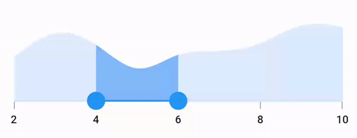
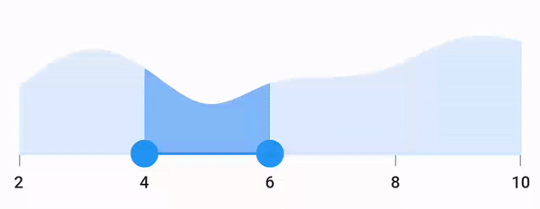
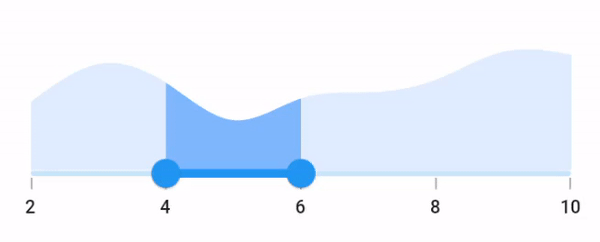

# Drag modes of range selector

## On thumb

When [`dragMode`](https://pub.dev/documentation/syncfusion_flutter_sliders/latest/sliders/SfRangeSelector/dragMode.html) is set to `SliderDragMode.onThumb`, only individual thumb can be moved by dragging it. The nearest thumb will move to the touch position if interaction is done anywhere other than the thumb.




final double _min = 2.0;
final double _max = 10.0;
SfRangeValues _values = SfRangeValues(4.0, 6.0);

final List<Data> chartData = <Data>[
    Data(x:2.0, y: 2.2),
    Data(x:3.0, y: 3.4),
    Data(x:4.0, y: 2.8),
    Data(x:5.0, y: 1.6),
    Data(x:6.0, y: 2.3),
    Data(x:7.0, y: 2.5),
    Data(x:8.0, y: 2.9),
    Data(x:9.0, y: 3.8),
    Data(x:10.0, y: 3.7),
];

@override
Widget build(BuildContext context) {
  return MaterialApp(
      home: Scaffold(
          body: Center(
              child: SfRangeSelector(
                    min: _min,
                    max: _max,
                    interval: 2,
                    showTicks: true,
                    showLabels: true,
                    initialValues: _values,
                    dragMode: SliderDragMode.onThumb,
                    child: Container(
                    height: 130,
                    child: SfCartesianChart(
                        margin: const EdgeInsets.all(0),
                        primaryXAxis: NumericAxis(minimum: _min,
                            maximum: _max,
                            isVisible: false),
                        primaryYAxis: NumericAxis(isVisible: false),
                        plotAreaBorderWidth: 0,
                        series: <SplineAreaSeries<Data, double>>[
                            SplineAreaSeries<Data, double>(
                                color: Color.fromARGB(255, 126, 184, 253),
                                dataSource: chartData,
                                    xValueMapper: (Data sales, _) => sales.x,
                                    yValueMapper: (Data sales, _) => sales.y)
                            ],
                        ),
                   ),
              ),
          )
      )
  );
}







class Data {
  Data({this.x, this.y});
  final double x;
  final double y;
}




## Between thumbs

When [`dragMode`](https://pub.dev/documentation/syncfusion_flutter_sliders/latest/sliders/SfRangeSelector/dragMode.html) is set to `SliderDragMode.betweenThumbs`, both the thumbs can be moved at the same time by dragging in the area between start and end thumbs. The range between the start and end thumb will always be the same. Hence, it is not possible to move the individual thumb.




final double _min = 2.0;
final double _max = 10.0;
SfRangeValues _values = SfRangeValues(4.0, 6.0);

final List<Data> chartData = <Data>[
    Data(x:2.0, y: 2.2),
    Data(x:3.0, y: 3.4),
    Data(x:4.0, y: 2.8),
    Data(x:5.0, y: 1.6),
    Data(x:6.0, y: 2.3),
    Data(x:7.0, y: 2.5),
    Data(x:8.0, y: 2.9),
    Data(x:9.0, y: 3.8),
    Data(x:10.0, y: 3.7),
];

@override
Widget build(BuildContext context) {
  return MaterialApp(
      home: Scaffold(
          body: Center(
              child: SfRangeSelector(
                    min: _min,
                    max: _max,
                    interval: 2,
                    showTicks: true,
                    showLabels: true,
                    initialValues: _values,
                    dragMode: SliderDragMode.betweenThumbs,
                    child: Container(
                    height: 130,
                    child: SfCartesianChart(
                        margin: const EdgeInsets.all(0),
                        primaryXAxis: NumericAxis(minimum: _min,
                            maximum: _max,
                            isVisible: false),
                        primaryYAxis: NumericAxis(isVisible: false),
                        plotAreaBorderWidth: 0,
                        series: <SplineAreaSeries<Data, double>>[
                            SplineAreaSeries<Data, double>(
                                color: Color.fromARGB(255, 126, 184, 253),
                                dataSource: chartData,
                                    xValueMapper: (Data sales, _) => sales.x,
                                    yValueMapper: (Data sales, _) => sales.y)
                            ],
                        ),
                   ),
              ),
          )
      )
  );
}







class Data {
  Data({this.x, this.y});
  final double x;
  final double y;
}




## Both thumbs

When [`dragMode`](https://pub.dev/documentation/syncfusion_flutter_sliders/latest/sliders/SfRangeSelector/dragMode.html) is set to `SliderDragMode.both`, individual thumb can be moved by dragging it, and also both the thumbs can be moved at the same time by dragging in the area between start and end thumbs.




final double _min = 2.0;
final double _max = 10.0;
SfRangeValues _values = SfRangeValues(4.0, 6.0);

final List<Data> chartData = <Data>[
    Data(x:2.0, y: 2.2),
    Data(x:3.0, y: 3.4),
    Data(x:4.0, y: 2.8),
    Data(x:5.0, y: 1.6),
    Data(x:6.0, y: 2.3),
    Data(x:7.0, y: 2.5),
    Data(x:8.0, y: 2.9),
    Data(x:9.0, y: 3.8),
    Data(x:10.0, y: 3.7),
];

@override
Widget build(BuildContext context) {
  return MaterialApp(
      home: Scaffold(
          body: Center(
              child: SfRangeSelector(
                    min: _min,
                    max: _max,
                    interval: 2,
                    showTicks: true,
                    showLabels: true,
                    initialValues: _values,
                    dragMode: SliderDragMode.both,
                    child: Container(
                    height: 130,
                    child: SfCartesianChart(
                        margin: const EdgeInsets.all(0),
                        primaryXAxis: NumericAxis(minimum: _min,
                            maximum: _max,
                            isVisible: false),
                        primaryYAxis: NumericAxis(isVisible: false),
                        plotAreaBorderWidth: 0,
                        series: <SplineAreaSeries<Data, double>>[
                            SplineAreaSeries<Data, double>(
                                color: Color.fromARGB(255, 126, 184, 253),
                                dataSource: chartData,
                                    xValueMapper: (Data sales, _) => sales.x,
                                    yValueMapper: (Data sales, _) => sales.y)
                            ],
                        ),
                   ),
              ),
          )
      )
  );
}







class Data {
  Data({this.x, this.y});
  final double x;
  final double y;
}




