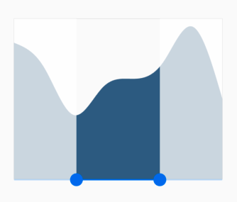
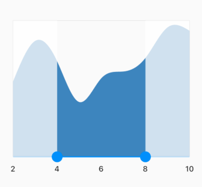
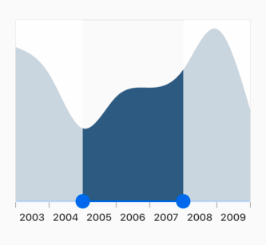
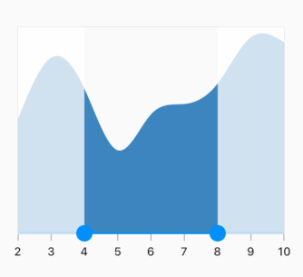
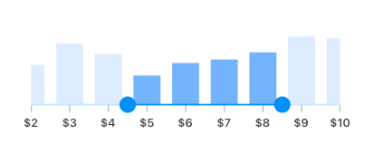

# Getting started with Flutter Range Selector (SfRangeSelector)
This section explains the steps required to add the range selector widget and its elements such as numeric and date values, ticks, labels and tooltips. This section covers only basic features needed to know to get started with Syncfusion range selector.

To get start quickly with our Flutter Range Selector widget, you can check on this video.

<iframe id='FlutterRangeSelectorVideoTutorial' src='https://www.youtube.com/embed/WX1IvK5R0q0'></iframe>

## Add Flutter range selector to an application
Create a simple project using the instructions given in the [Getting Started with your first Flutter app](https://flutter.dev/docs/get-started/test-drive?tab=vscode#create-app) documentation.

**Add dependency**

Add the Syncfusion Flutter range selector dependency to your pubspec.yaml file.



dependencies:

syncfusion_flutter_sliders: ^xx.x.xx



N> Here **xx.x.xx** denotes the current version of [`Syncfusion Flutter Sliders`](https://pub.dev/packages/syncfusion_flutter_sliders/versions) package.

**Get packages** 

Run the following command to get the required packages.



$ flutter pub get



**Import package**

Import the following package in your Dart code.




import 'package:syncfusion_flutter_sliders/sliders.dart';




## Initialize range selector

After importing the package, initialize the range selector widget as a child of any widget. Here, the range selector widget is added as a child of the Container widget. The default value of the [`min`](https://pub.dev/documentation/syncfusion_flutter_sliders/latest/sliders/SfRangeSelector/min.html) and [`max`](https://pub.dev/documentation/syncfusion_flutter_sliders/latest/sliders/SfRangeSelector/max.html) properties of the SfRangeSelector is 0.0 and 1.0 respectively. So, the [`initialValues`](https://pub.dev/documentation/syncfusion_flutter_sliders/latest/sliders/SfRangeSelector/initialValues.html) property must be given within the range. You can add any kind of widget as a child of range selector. Here, [Chart](https://www.syncfusion.com/flutter-widgets/flutter-charts) widget is added as a child.

I> You need to set the [`controller`](https://pub.dev/documentation/syncfusion_flutter_sliders/latest/sliders/SfRangeSelector/controller.html) property to update range selector thumb values dynamically. Refer this [`link`](https://help.syncfusion.com/flutter/range-selector/range-controller) for setting controller property. The [initialValues](https://pub.dev/documentation/syncfusion_flutter_sliders/latest/sliders/SfRangeSelector/initialValues.html) property can be used to set values at load time.




final SfRangeValues _initialValues = SfRangeValues(0.3, 0.7);

final List<Data> _chartData = <Data>[
  Data(x: DateTime(2003, 01, 01), y: 3.4),
  Data(x: DateTime(2004, 01, 01), y: 2.8),
  Data(x: DateTime(2005, 01, 01), y: 1.6),
  Data(x: DateTime(2006, 01, 01), y: 2.3),
  Data(x: DateTime(2007, 01, 01), y: 2.5),
  Data(x: DateTime(2008, 01, 01), y: 2.9),
  Data(x: DateTime(2009, 01, 01), y: 3.8),
  Data(x: DateTime(2010, 01, 01), y: 2.0),
];

@override
Widget build(BuildContext context) {
  return Container(
      child: Center(
        child: SfRangeSelector(
          initialValues: _initialValues,
          child: Container(
            child: SfCartesianChart(
              margin: const EdgeInsets.all(0),
              primaryXAxis: DateTimeAxis(
                isVisible: false,),
              primaryYAxis: NumericAxis(isVisible: false, maximum: 4),
              series: <SplineAreaSeries<Data, DateTime>>[
                SplineAreaSeries<Data, DateTime>(
                    dataSource: _chartData,
                    xValueMapper: (Data sales, int index) => sales.x,
                    yValueMapper: (Data sales, int index) => sales.y)
              ],
            ),
            height: 250,
          ),
        ),
      ),
  );
}

class Data {
  Data({required this.x, required this.y});
  final DateTime x;
  final double y;
}




## Handle range change

The [`onChanged`](https://pub.dev/documentation/syncfusion_flutter_sliders/latest/sliders/SfRangeSelector/onChanged.html) callback is called when the user is selecting the new values.

I> You need to set the [`controller`](https://pub.dev/documentation/syncfusion_flutter_sliders/latest/sliders/SfRangeSelector/controller.html) property to update range selector thumb values dynamically. Refer this [`link`](https://help.syncfusion.com/flutter/range-selector/range-controller) for setting controller property. The [initialValues](https://pub.dev/documentation/syncfusion_flutter_sliders/latest/sliders/SfRangeSelector/initialValues.html) property can be used to set values at load time.




final SfRangeValues _initialValues = SfRangeValues(0.3, 0.7);

final List<Data> _chartData = <Data>[
  Data(x: DateTime(2003, 01, 01), y: 3.4),
  Data(x: DateTime(2004, 01, 01), y: 2.8),
  Data(x: DateTime(2005, 01, 01), y: 1.6),
  Data(x: DateTime(2006, 01, 01), y: 2.3),
  Data(x: DateTime(2007, 01, 01), y: 2.5),
  Data(x: DateTime(2008, 01, 01), y: 2.9),
  Data(x: DateTime(2009, 01, 01), y: 3.8),
  Data(x: DateTime(2010, 01, 01), y: 2.0),
];

@override
Widget build(BuildContext context) {
  return Container(
      child: Center(
        child: SfRangeSelector(
          initialValues: _initialValues,
          onChanged: (SfRangeValues values) {
          },
          child: Container(
            child: SfCartesianChart(
              margin: const EdgeInsets.all(0),
              primaryXAxis: DateTimeAxis(
                isVisible: false,),
              primaryYAxis: NumericAxis(isVisible: false, maximum: 4),
              series: <SplineAreaSeries<Data, DateTime>>[
                SplineAreaSeries<Data, DateTime>(
                    dataSource: _chartData,
                    xValueMapper: (Data sales, int index) => sales.x,
                    yValueMapper: (Data sales, int index) => sales.y)
              ],
            ),
            height: 250,
          ),
        ),
      ),
  );
}

class Data {
  Data({required this.x, required this.y});
  final DateTime x;
  final double y;
}




## Set numeric range

You can show numeric values in the range selector by setting `double` values to the [`min`](https://pub.dev/documentation/syncfusion_flutter_sliders/latest/sliders/SfRangeSelector/min.html), [`max`](https://pub.dev/documentation/syncfusion_flutter_sliders/latest/sliders/SfRangeSelector/max.html) and [`initialValues`](https://pub.dev/documentation/syncfusion_flutter_sliders/latest/sliders/SfRangeSelector/initialValues.html) properties.

I> You need to set the [`controller`](https://pub.dev/documentation/syncfusion_flutter_sliders/latest/sliders/SfRangeSelector/controller.html) property to update range selector thumb values dynamically. Refer this [`link`](https://help.syncfusion.com/flutter/range-selector/range-controller) for setting controller property. The [initialValues](https://pub.dev/documentation/syncfusion_flutter_sliders/latest/sliders/SfRangeSelector/initialValues.html) property can be used to set values at load time.




final double _min = 2.0;
final double _max = 10.0;
SfRangeValues _initialValues = SfRangeValues(4.0, 8.0);

final List<Data> _chartData = <Data>[
    Data(x:2.0, y: 2.2),
    Data(x:3.0, y: 3.4),
    Data(x:4.0, y: 2.8),
    Data(x:5.0, y: 1.6),
    Data(x:6.0, y: 2.3),
    Data(x:7.0, y: 2.5),
    Data(x:8.0, y: 2.9),
    Data(x:9.0, y: 3.8),
    Data(x:10.0, y: 3.7),
];

@override
Widget build(BuildContext context) {
  return Container(
      child: Center(
        child: SfRangeSelector(
          min: _min,
          max: _max,
          initialValues: _initialValues,
          interval: 2,
          showLabels: true,
          child: Container(
             child: SfCartesianChart(
                  margin: const EdgeInsets.all(0),
                  primaryXAxis: NumericAxis(
                       isVisible: false,),
                  primaryYAxis: NumericAxis(isVisible: false, maximum: 4),
                  series: <SplineAreaSeries<Data, double>>[
                        SplineAreaSeries<Data, double>(
                             dataSource: _chartData,
                             xValueMapper: (Data sales, int index) => sales.x,
                             yValueMapper: (Data sales, int index) => sales.y)
                        ],
                  ),
             height: 250,
          ),
        ),
      ),
  );
}

class Data {
  Data({required this.x, required this.y});
  final double x;
  final double y;
}




## Set date range

You can show date values in the range selector by setting `DateTime` values to the [`min`](https://pub.dev/documentation/syncfusion_flutter_sliders/latest/sliders/SfRangeSelector/min.html), [`max`](https://pub.dev/documentation/syncfusion_flutter_sliders/latest/sliders/SfRangeSelector/max.html) and [`initialValues`](https://pub.dev/documentation/syncfusion_flutter_sliders/latest/sliders/SfRangeSelector/initialValues.html) properties.

N> You must import [`intl`](https://pub.dev/packages/intl) package for formatting date range selector using the [`DateFormat`](https://pub.dev/documentation/intl/latest/intl/DateFormat-class.html) class.

I> You need to set the [`controller`](https://pub.dev/documentation/syncfusion_flutter_sliders/latest/sliders/SfRangeSelector/controller.html) property to update range selector thumb values dynamically. Refer this [`link`](https://help.syncfusion.com/flutter/range-selector/range-controller) for setting controller property. The [initialValues](https://pub.dev/documentation/syncfusion_flutter_sliders/latest/sliders/SfRangeSelector/initialValues.html) property can be used to set values at load time.




final DateTime _min = DateTime(2002, 01, 01);
final DateTime _max = DateTime(2010, 01, 01);
SfRangeValues _values = SfRangeValues(DateTime(2004, 01, 01), DateTime(2008, 01, 01));

final List<Data> _chartData = <Data>[
    Data(x: DateTime(2002, 01, 01), y: 2.2),
    Data(x: DateTime(2003, 01, 01), y: 3.4),
    Data(x: DateTime(2004, 01, 01), y: 2.8),
    Data(x: DateTime(2005, 01, 01), y: 1.6),
    Data(x: DateTime(2006, 01, 01), y: 2.3),
    Data(x: DateTime(2007, 01, 01), y: 2.5),
    Data(x: DateTime(2008, 01, 01), y: 2.9),
    Data(x: DateTime(2009, 01, 01), y: 3.8),
    Data(x: DateTime(2010, 01, 01), y: 3.7),
];

@override
Widget build(BuildContext context) {
  return Container(
      child: Center(
        child: SfRangeSelector(
         min: _min,
         max: _max,
         showLabels: true,
         interval: 2,
         dateFormat: DateFormat.y(),
         dateIntervalType: DateIntervalType.years,
         initialValues: _values,
         child: Container(
             height: 130,
             child: SfCartesianChart(
                  margin: const EdgeInsets.all(0),
                  primaryXAxis: DateTimeAxis(
                      minimum: _min,
                      maximum: _max,
                      isVisible: false),
                  primaryYAxis: NumericAxis(isVisible: false),
                  plotAreaBorderWidth: 0,
                  series: <SplineAreaSeries<Data, DateTime>>[
                        SplineAreaSeries<Data, DateTime>(
                             color: Color.fromARGB(255, 126, 184, 253),
                             dataSource: _chartData,
                                   xValueMapper: (Data sales, int index) => sales.x,
                                   yValueMapper: (Data sales, int index) => sales.y)
                             ],
                        ),
                  ),
             ),
         ),
    );
}

class Data {
  Data({required this.x, required this.y});
  final DateTime x;
  final double y;
}




## Enable ticks

You can enable ticks in the range selector using the [`showTicks`](https://pub.dev/documentation/syncfusion_flutter_sliders/latest/sliders/SfRangeSelector/showTicks.html) property.

I> You need to set the [`controller`](https://pub.dev/documentation/syncfusion_flutter_sliders/latest/sliders/SfRangeSelector/controller.html) property to update range selector thumb values dynamically. Refer this [`link`](https://help.syncfusion.com/flutter/range-selector/range-controller) for setting controller property. The [initialValues](https://pub.dev/documentation/syncfusion_flutter_sliders/latest/sliders/SfRangeSelector/initialValues.html) property can be used to set values at load time.




final double _min = 2.0;
final double _max = 10.0;
SfRangeValues _initialValues = SfRangeValues(4.0, 8.0);

final List<Data> _chartData = <Data>[
    Data(x:2.0, y: 2.2),
    Data(x:3.0, y: 3.4),
    Data(x:4.0, y: 2.8),
    Data(x:5.0, y: 1.6),
    Data(x:6.0, y: 2.3),
    Data(x:7.0, y: 2.5),
    Data(x:8.0, y: 2.9),
    Data(x:9.0, y: 3.8),
    Data(x:10.0, y: 3.7),
];

@override
Widget build(BuildContext context) {
  return Container(
      child: Center(
        child: SfRangeSelector(
          min: _min,
          max: _max,
          initialValues: _initialValues,
          interval: 1,
          showLabels: true,
          showTicks: true,
          child: Container(
             child: SfCartesianChart(
                  margin: const EdgeInsets.all(0),
                  primaryXAxis: NumericAxis(
                       isVisible: false,),
                  primaryYAxis: NumericAxis(isVisible: false, maximum: 4),
                  series: <SplineAreaSeries<Data, double>>[
                        SplineAreaSeries<Data, double>(
                             dataSource: _chartData,
                             xValueMapper: (Data sales, int index) => sales.x,
                             yValueMapper: (Data sales, int index) => sales.y)
                        ],
                  ),
             height: 250,
          ),
        ),
      ),
  );
}

class Data {
  Data({required this.x, required this.y});
  final double x;
  final double y;
}




## Add prefix/suffix to labels

You can add prefix or suffix to the labels using the [`numberFormat`](https://pub.dev/documentation/syncfusion_flutter_sliders/latest/sliders/SfRangeSelector/numberFormat.html) or [`dateFormat`](https://pub.dev/documentation/syncfusion_flutter_sliders/latest/sliders/SfRangeSelector/dateFormat.html) properties.

N> The format type (numeric or date) of the range selector is determined based on the values specified in [`min`](https://pub.dev/documentation/syncfusion_flutter_sliders/latest/sliders/SfRangeSelector/min.html), [`max`](https://pub.dev/documentation/syncfusion_flutter_sliders/latest/sliders/SfRangeSelector/max.html) and [`initialValues`](https://pub.dev/documentation/syncfusion_flutter_sliders/latest/sliders/SfRangeSelector/initialValues.html) properties.

I> You must import [`intl`](https://pub.dev/packages/intl) package for formatting date range selector using the [`DateFormat`](https://pub.dev/documentation/intl/latest/intl/DateFormat-class.html) class and for formatting numeric range selector using the [`NumberFormat`](https://pub.dev/documentation/intl/latest/intl/NumberFormat-class.html) class.




final double _min = 2.0;
final double _max = 10.0;
SfRangeValues _initialValues = SfRangeValues(4.5, 8.5);

final List<Data> _chartData = <Data>[
    Data(x:2.0, y: 2.2),
    Data(x:3.0, y: 3.4),
    Data(x:4.0, y: 2.8),
    Data(x:5.0, y: 1.6),
    Data(x:6.0, y: 2.3),
    Data(x:7.0, y: 2.5),
    Data(x:8.0, y: 2.9),
    Data(x:9.0, y: 3.8),
    Data(x:10.0, y: 3.7),
];

@override
Widget build(BuildContext context) {
  return Container(
      child: Center(
        child: SfRangeSelector(
          min: _min,
          max: _max,
          initialValues: _initialValues,
          interval: 1,
          showLabels: true,
          showTicks: true,
          numberFormat: NumberFormat("\$"),
          child: Container(
             height: 130,
             child: SfCartesianChart(
                  margin: const EdgeInsets.all(0),
                  primaryXAxis: NumericAxis(
                    isVisible: false,
                    minimum: _min,
                    maximum: _max,
                  ),
                  primaryYAxis: NumericAxis(isVisible: false, maximum: 4),
                  plotAreaBorderWidth: 0,
                  plotAreaBackgroundColor: Colors.transparent,
                  series: <ColumnSeries<Data, double>>[
                        ColumnSeries<Data, double>(
                             dataSource: _chartData,
                             color: Color.fromARGB(255, 126, 184, 253),
                             xValueMapper: (Data sales, int index) => sales.x,
                             yValueMapper: (Data sales, int index) => sales.y)
                        ],
                  ),
            ),
        ),
      ),
  );
}

class Data {
  Data({required this.x, required this.y});
  final double x;
  final double y;
}




