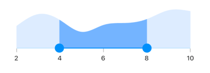
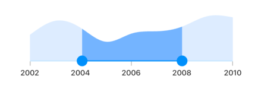
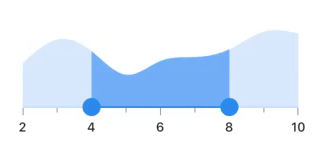
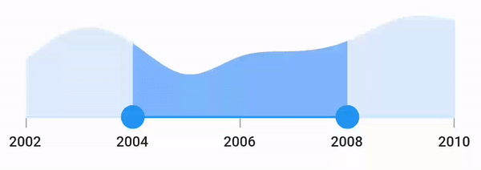
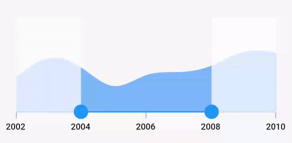

# Interval in Flutter Range Selector (SfRangeSelector)
This section explains about how to add the interval for numeric and date range selector.

## Numeric interval

Range selector elements like labels, ticks and dividers are rendered based on the [`interval`](https://pub.dev/documentation/syncfusion_flutter_sliders/latest/sliders/SfRangeSelector/interval.html), [`min`](https://pub.dev/documentation/syncfusion_flutter_sliders/latest/sliders/SfRangeSelector/min.html) and [`max`](https://pub.dev/documentation/syncfusion_flutter_sliders/latest/sliders/SfRangeSelector/max.html) properties. The default value of the [`interval`](https://pub.dev/documentation/syncfusion_flutter_sliders/latest/sliders/SfRangeSelector/interval.html) property is `null` and it must be greater than 0.

For example, if [`min`](https://pub.dev/documentation/syncfusion_flutter_sliders/latest/sliders/SfRangeSelector/min.html) is 2.0 and [`max`](https://pub.dev/documentation/syncfusion_flutter_sliders/latest/sliders/SfRangeSelector/max.html) is 10.0 and [`interval`](https://pub.dev/documentation/syncfusion_flutter_sliders/latest/sliders/SfRangeSelector/interval.html) is 2.0, the range selector will render the labels, major ticks, and dividers at 2.0, 4.0 and so on.




final double _min = 2.0;
final double _max = 10.0;
SfRangeValues _values = SfRangeValues(4.0, 8.0);

final List<Data> chartData = <Data>[
    Data(x:2.0, y: 2.2),
    Data(x:3.0, y: 3.4),
    Data(x:4.0, y: 2.8),
    Data(x:5.0, y: 1.6),
    Data(x:6.0, y: 2.3),
    Data(x:7.0, y: 2.5),
    Data(x:8.0, y: 2.9),
    Data(x:9.0, y: 3.8),
    Data(x:10.0, y: 3.7),
];

@override
Widget build(BuildContext context) {
  return MaterialApp(
      home: Scaffold(
          body: Center(
              child: SfRangeSelector(
                    min: _min,
                    max: _max,
                    interval: 2,
                    showLabels: true,
                    showTicks: true,
                    initialValues: _values,
                    child: Container(
                    height: 130,
                    child: SfCartesianChart(
                        margin: const EdgeInsets.all(0),
                        primaryXAxis: NumericAxis(minimum: _min,
                            maximum: _max,
                            isVisible: false,),
                        primaryYAxis: NumericAxis(isVisible: false),
                        plotAreaBorderWidth: 0,
                        series: <ColumnSeries<Data, double>>[
                            ColumnSeries<Data, double>(
                                color: Color.fromARGB(255, 126, 184, 253),
                                dataSource: chartData,
                                    xValueMapper: (Data sales, int index) => sales.x,
                                    yValueMapper: (Data sales, int index) => sales.y)
                            ],
                        ),
                   ),
              ),
          )
      )
  );
}

class Data {
  Data({required this.x, required this.y});
  final double x;
  final double y;
}




N>
* Refer the [`showDividers`](https://pub.dev/documentation/syncfusion_flutter_sliders/latest/sliders/SfRangeSelector/showDividers.html) to know about the rendering of dividers at given interval.
* Refer the [`showTicks`](https://pub.dev/documentation/syncfusion_flutter_sliders/latest/sliders/SfRangeSelector/showTicks.html) to know about the rendering of major ticks at given interval.
* Refer the [`showLabels`](https://pub.dev/documentation/syncfusion_flutter_sliders/latest/sliders/SfRangeSelector/showLabels.html) to know about the rendering of labels at given interval.

## Date interval

The type of date interval. It can be years to seconds. It is mandatory for date [`SfRangeSelector`](https://pub.dev/documentation/syncfusion_flutter_sliders/latest/sliders/SfRangeSelector-class.html). The default value of [`dateIntervalType`](https://pub.dev/documentation/syncfusion_flutter_sliders/latest/sliders/SfRangeSelector/dateIntervalType.html) property is `null`.

For date values, the range selector does not have auto interval support. So, it is mandatory to set [`interval`](https://pub.dev/documentation/syncfusion_flutter_sliders/latest/sliders/SfRangeSelector/interval.html), [`dateIntervalType`](https://pub.dev/documentation/syncfusion_flutter_sliders/latest/sliders/SfRangeSelector/dateIntervalType.html), and [`dateFormat`](https://pub.dev/documentation/syncfusion_flutter_sliders/latest/sliders/SfRangeSelector/dateFormat.html) for date values.

For example, if [`min`](https://pub.dev/documentation/syncfusion_flutter_sliders/latest/sliders/SfRangeSelector/min.html) is `DateTime(2002, 01, 01)` and [`max`](https://pub.dev/documentation/syncfusion_flutter_sliders/latest/sliders/SfRangeSelector/max.html) is `DateTime(2010, 01, 01)` and [`interval`](https://pub.dev/documentation/syncfusion_flutter_sliders/latest/sliders/SfRangeSelector/interval.html) is `2`, [`dateIntervalType`](https://pub.dev/documentation/syncfusion_flutter_sliders/latest/sliders/SfRangeSelector/dateIntervalType.html) is `DateIntervalType.years`, [`dateFormat`](https://pub.dev/documentation/syncfusion_flutter_sliders/latest/sliders/SfRangeSelector/dateFormat.html) is `DateFormat.y()` then the range selector will render the labels, major ticks, and dividers at 2002, 2004, 2006 and so on.




final DateTime _min = DateTime(2002, 01, 01);
final DateTime _max = DateTime(2010, 01, 01);
SfRangeValues _values = SfRangeValues(DateTime(2004, 01, 01), DateTime(2008, 01, 01));

final List<Data> chartData = <Data>[
    Data(x: DateTime(2002, 01, 01), y: 2.2),
    Data(x: DateTime(2003, 01, 01), y: 3.4),
    Data(x: DateTime(2004, 01, 01), y: 2.8),
    Data(x: DateTime(2005, 01, 01), y: 1.6),
    Data(x: DateTime(2006, 01, 01), y: 2.3),
    Data(x: DateTime(2007, 01, 01), y: 2.5),
    Data(x: DateTime(2008, 01, 01), y: 2.9),
    Data(x: DateTime(2009, 01, 01), y: 3.8),
    Data(x: DateTime(2010, 01, 01), y: 3.7),
];

@override
Widget build(BuildContext context) {
  return MaterialApp(
      home: Scaffold(
          body: Center(
              child: SfRangeSelector(
                    min: _min,
                    max: _max,
                    showLabels: true,
                    showTicks: true,
                    interval: 2,
                    dateFormat: DateFormat.y(),
                    dateIntervalType: DateIntervalType.years,
                    initialValues: _values,
                    child: Container(
                    height: 130,
                    child: SfCartesianChart(
                        margin: const EdgeInsets.all(0),
                        primaryXAxis: DateTimeAxis(
                            minimum: _min,
                            maximum: _max,
                            isVisible: false,),
                        primaryYAxis: NumericAxis(isVisible: false),
                        plotAreaBorderWidth: 0,
                        series: <ColumnSeries<Data, DateTime>>[
                            ColumnSeries<Data, DateTime>(
                                color: Color.fromARGB(255, 126, 184, 253),
                                dataSource: chartData,
                                xValueMapper: (Data sales, int index) => sales.x,
                                yValueMapper: (Data sales, int index) => sales.y)
                            ],
                        ),
                   ),
              ),
          )
      )
  );
}

class Data {
  Data({required this.x, required this.y});
  final DateTime x;
  final double y;
}




## Discrete selection for numeric values

You can move the thumb in discrete manner for numeric values using the [`stepSize`](https://pub.dev/documentation/syncfusion_flutter_sliders/latest/sliders/SfRangeSelector/stepSize.html) property in the range selector.




final double _min = 2.0;
final double _max = 10.0;
SfRangeValues _values = SfRangeValues(4.0, 8.0);

final List<Data> chartData = <Data>[
    Data(x:2.0, y: 2.2),
    Data(x:3.0, y: 3.4),
    Data(x:4.0, y: 2.8),
    Data(x:5.0, y: 1.6),
    Data(x:6.0, y: 2.3),
    Data(x:7.0, y: 2.5),
    Data(x:8.0, y: 2.9),
    Data(x:9.0, y: 3.8),
    Data(x:10.0, y: 3.7),
];

@override
Widget build(BuildContext context) {
  return MaterialApp(
      home: Scaffold(
          body: Center(
              child: SfRangeSelector(
                    min: _min,
                    max: _max,
                    interval: 2,
                    stepSize: 1,
                    showLabels: true,
                    showTicks: true,
                    minorTicksPerInterval: 1,
                    initialValues: _values,
                    child: Container(
                    height: 130,
                    child: SfCartesianChart(
                        margin: const EdgeInsets.all(0),
                        primaryXAxis: NumericAxis(minimum: _min,
                            maximum: _max,
                            isVisible: false,),
                        primaryYAxis: NumericAxis(isVisible: false),
                        plotAreaBorderWidth: 0,
                        series: <SplineAreaSeries<Data, double>>[
                            SplineAreaSeries<Data, double>(
                                color: Color.fromARGB(255, 126, 184, 253),
                                dataSource: chartData,
                                    xValueMapper: (Data sales, int index) => sales.x,
                                    yValueMapper: (Data sales, int index) => sales.y)
                            ],
                        ),
                   ),
              ),
          )
      )
  );
}

class Data {
  Data({required this.x, required this.y});
  final double x;
  final double y;
}




## Discrete selection for date values

You can move the thumb in discrete manner for date values based on the value provided in the [`stepDuration`](https://pub.dev/documentation/syncfusion_flutter_sliders/latest/sliders/SfRangeSelector/stepDuration.html) property in the range selector.

For example, if [min](https://pub.dev/documentation/syncfusion_flutter_sliders/latest/sliders/SfRangeSelector/min.html) is DateTime(2015, 01, 01) and [max](https://pub.dev/documentation/syncfusion_flutter_sliders/latest/sliders/SfRangeSelector/max.html) is DateTime(2020, 01, 01) and [stepDuration](https://pub.dev/documentation/syncfusion_flutter_sliders/latest/sliders/SfRangeSelector/stepDuration.html) is SliderDuration(years: 1, months: 6),the range selector will move the thumbs at DateTime(2015, 01, 01), DateTime(2016, 07, 01), DateTime(2018, 01, 01),and DateTime(2019, 07, 01).




final DateTime _min = DateTime(2002, 01, 01);
final DateTime _max = DateTime(2010, 01, 01);
SfRangeValues _values = SfRangeValues(DateTime(2004, 01, 01), DateTime(2008, 01, 01));

final List<Data> chartData = <Data>[
  Data(x: DateTime(2002, 01, 01), y: 2.2),
  Data(x: DateTime(2003, 01, 01), y: 3.4),
  Data(x: DateTime(2004, 01, 01), y: 2.8),
  Data(x: DateTime(2005, 01, 01), y: 1.6),
  Data(x: DateTime(2006, 01, 01), y: 2.3),
  Data(x: DateTime(2007, 01, 01), y: 2.5),
  Data(x: DateTime(2008, 01, 01), y: 2.9),
  Data(x: DateTime(2009, 01, 01), y: 3.8),
  Data(x: DateTime(2010, 01, 01), y: 3.7),
];

@override
Widget build(BuildContext context) {
  return MaterialApp(
      home: Scaffold(
          body: Center(
            child: SfRangeSelector(
              min: _min,
              max: _max,
              showLabels: true,
              showTicks: true,
              interval: 2,
              stepDuration: SliderStepDuration(years: 2),
              dateFormat: DateFormat.y(),
              dateIntervalType: DateIntervalType.years,
              initialValues: _values,
              child: Container(
                height: 130,
                child: SfCartesianChart(
                  margin: const EdgeInsets.all(0),
                  primaryXAxis: DateTimeAxis(
                    minimum: _min,
                    maximum: _max,
                    isVisible: false,),
                  primaryYAxis: NumericAxis(isVisible: false),
                  plotAreaBorderWidth: 0,
                  series: <SplineAreaSeries<Data, DateTime>>[
                    SplineAreaSeries<Data, DateTime>(
                       color: Color.fromARGB(255, 126, 184, 253),
                       dataSource: chartData,
                       xValueMapper: (Data sales, int index) => sales.x,
                       yValueMapper: (Data sales, int index) => sales.y)
                  ],
                ),
              ),
            ),
          )
      )
  );
}

class Data {
  Data({required this.x, required this.y});
  final DateTime x;
  final double y;
}




## Enable interval selection

You can select a particular interval by tapping when setting the [`enableIntervalSelection`](https://pub.dev/documentation/syncfusion_flutter_sliders/latest/sliders/SfRangeSelector/enableIntervalSelection.html) property as `true`. Both the thumbs will be moved to the current interval with animation.




final DateTime _min = DateTime(2002, 01, 01);
final DateTime _max = DateTime(2010, 01, 01);
SfRangeValues _values = SfRangeValues(DateTime(2004, 01, 01), DateTime(2008, 01, 01));

final List<Data> chartData = <Data>[
  Data(x: DateTime(2002, 01, 01), y: 2.2),
  Data(x: DateTime(2003, 01, 01), y: 3.4),
  Data(x: DateTime(2004, 01, 01), y: 2.8),
  Data(x: DateTime(2005, 01, 01), y: 1.6),
  Data(x: DateTime(2006, 01, 01), y: 2.3),
  Data(x: DateTime(2007, 01, 01), y: 2.5),
  Data(x: DateTime(2008, 01, 01), y: 2.9),
  Data(x: DateTime(2009, 01, 01), y: 3.8),
  Data(x: DateTime(2010, 01, 01), y: 3.7),
];

@override
Widget build(BuildContext context) {
  return MaterialApp(
      home: Scaffold(
          body: Center(
            child: SfRangeSelector(
              min: _min,
              max: _max,
              showLabels: true,
              showTicks: true,
              interval: 2,
              enableIntervalSelection: true,
              dateFormat: DateFormat.y(),
              dateIntervalType: DateIntervalType.years,
              initialValues: _values,
              child: Container(
                height: 130,
                child: SfCartesianChart(
                  margin: const EdgeInsets.all(0),
                  primaryXAxis: DateTimeAxis(
                    minimum: _min,
                    maximum: _max,
                    isVisible: false,),
                  primaryYAxis: NumericAxis(isVisible: false),
                  plotAreaBorderWidth: 0,
                  series: <SplineAreaSeries<Data, DateTime>>[
                    SplineAreaSeries<Data, DateTime>(
                        color: Color.fromARGB(255, 126, 184, 253),
                        dataSource: chartData,
                        xValueMapper: (Data sales, int index) => sales.x,
                        yValueMapper: (Data sales, int index) => sales.y)
                  ],
                ),
              ),
            ),
          )
      )
  );
}

class Data {
  Data({required this.x, required this.y});
  final DateTime x;
  final double y;
}




