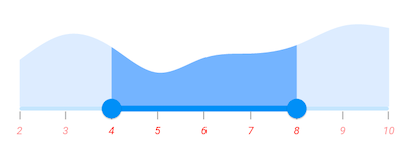

# Labels in Flutter Range Selector (SfRangeSelector)
This section explains about how to add the labels and dividers in the range selector.

## Show labels

The [`showLabels`](https://pub.dev/documentation/syncfusion_flutter_sliders/latest/sliders/SfRangeSelector/showLabels.html) property is used to render the labels on given interval. The default value of [`showLabels`](https://pub.dev/documentation/syncfusion_flutter_sliders/latest/sliders/SfRangeSelector/showLabels.html) property is `false`.




final double _min = 2.0;
final double _max = 10.0;
SfRangeValues _values = SfRangeValues(5.0, 8.0);

final List<Data> chartData = <Data>[
    Data(x:2.0, y: 2.2),
    Data(x:3.0, y: 3.4),
    Data(x:4.0, y: 2.8),
    Data(x:5.0, y: 1.6),
    Data(x:6.0, y: 2.3),
    Data(x:7.0, y: 2.5),
    Data(x:8.0, y: 2.9),
    Data(x:9.0, y: 3.8),
    Data(x:10.0, y: 3.7),
];

@override
Widget build(BuildContext context) {
  return MaterialApp(
      home: Scaffold(
          body: Center(
              child: SfRangeSelector(
                    min: _min,
                    max: _max,
                    interval: 1,
                    showLabels: true,
                    showTicks: true,
                    initialValues: _values,
                    child: Container(
                    height: 130,
                    child: SfCartesianChart(
                        margin: const EdgeInsets.all(0),
                        primaryXAxis: NumericAxis(minimum: _min,
                            maximum: _max,
                            isVisible: false,),
                        primaryYAxis: NumericAxis(isVisible: false),
                        plotAreaBorderWidth: 0,
                        series: <SplineAreaSeries<Data, double>>[
                            SplineAreaSeries<Data, double>(
                                color: Color.fromARGB(255, 126, 184, 253),
                                dataSource: chartData,
                                    xValueMapper: (Data sales, int index) => sales.x,
                                    yValueMapper: (Data sales, int index) => sales.y)
                            ],
                        ),
                   ),
              ),
          )
      )
  );
}

class Data {
  Data({required this.x, required this.y});
  final double x;
  final double y;
}




N>
* Refer the [`numberFormat`](https://pub.dev/documentation/syncfusion_flutter_sliders/latest/sliders/SfRangeSelector/numberFormat.html) and [`dateFormat`](https://pub.dev/documentation/syncfusion_flutter_sliders/latest/sliders/SfRangeSelector/dateFormat.html) for formatting the numeric and date labels respectively.
* Refer the [`SfRangeSelectorThemeData`](https://pub.dev/documentation/syncfusion_flutter_core/latest/theme/SfRangeSelectorThemeData-class.html) for customizing the appearance of the labels.

## Number format

The [`numberFormat`](https://pub.dev/documentation/syncfusion_flutter_sliders/latest/sliders/SfRangeSelector/numberFormat.html) property is used to format the numeric labels. The default value of [`numberFormat`](https://pub.dev/documentation/syncfusion_flutter_sliders/latest/sliders/SfRangeSelector/numberFormat.html) property is `null`.

N> You must import [`intl`](https://pub.dev/packages/intl) package for formatting numeric range selector using the [`NumberFormat`](https://pub.dev/documentation/intl/latest/intl/NumberFormat-class.html) class.




final double _min = 2.0;
final double _max = 10.0;
SfRangeValues _values = SfRangeValues(4.5, 8.5);

final List<Data> chartData = <Data>[
    Data(x:2.0, y: 2.2),
    Data(x:3.0, y: 3.4),
    Data(x:4.0, y: 2.8),
    Data(x:5.0, y: 1.6),
    Data(x:6.0, y: 2.3),
    Data(x:7.0, y: 2.5),
    Data(x:8.0, y: 2.9),
    Data(x:9.0, y: 3.8),
    Data(x:10.0, y: 3.7),
];

@override
Widget build(BuildContext context) {
  return MaterialApp(
      home: Scaffold(
          body: Center(
              child: SfRangeSelector(
                    min: _min,
                    max: _max,
                    interval: 1,
                    showLabels: true,
                    showTicks: true,
                    numberFormat: NumberFormat("\$"),
                    initialValues: _values,
                    child: Container(
                    height: 130,
                    child: SfCartesianChart(
                        margin: const EdgeInsets.all(0),
                        primaryXAxis: NumericAxis(minimum: _min,
                            maximum: _max,
                            isVisible: false,),
                        primaryYAxis: NumericAxis(isVisible: false),
                        plotAreaBorderWidth: 0,
                        series: <ColumnSeries<Data, double>>[
                            ColumnSeries<Data, double>(
                                color: Color.fromARGB(255, 126, 184, 253),
                                dataSource: chartData,
                                    xValueMapper: (Data sales, int index) => sales.x,
                                    yValueMapper: (Data sales, int index) => sales.y)
                            ],
                        ),
                   ),
              ),
          )
      )
  );
}

class Data {
  Data({required this.x, required this.y});
  final double x;
  final double y;
}




## Date format

The [`dateFormat`](https://pub.dev/documentation/syncfusion_flutter_sliders/latest/sliders/SfRangeSelector/dateFormat.html) property is used to format the date labels. It is mandatory for date [`SfRangeSelector`](https://pub.dev/documentation/syncfusion_flutter_sliders/latest/sliders/SfRangeSelector-class.html). For date values, the range selector does not have auto interval support. So, it is mandatory to set [`interval`](https://pub.dev/documentation/syncfusion_flutter_sliders/latest/sliders/SfRangeSelector/interval.html), [`dateIntervalType`](https://pub.dev/documentation/syncfusion_flutter_sliders/latest/sliders/SfRangeSelector/dateIntervalType.html), and [`dateFormat`](https://pub.dev/documentation/syncfusion_flutter_sliders/latest/sliders/SfRangeSelector/dateFormat.html) for date values. The default value of [`dateFormat`](https://pub.dev/documentation/syncfusion_flutter_sliders/latest/sliders/SfRangeSelector/dateFormat.html) property is `null`.

N> You must import [`intl`](https://pub.dev/packages/intl) package for formatting date range selector using the [`DateFormat`](https://pub.dev/documentation/intl/latest/intl/DateFormat-class.html) class.

### Year format




final DateTime _min = DateTime(2000, 01, 01);
final DateTime _max = DateTime(2008, 01, 01);
SfRangeValues _values = SfRangeValues(DateTime(2002, 01, 01), DateTime(2006, 01, 01));

final List<Data> _chartData = <Data>[
    Data(x: DateTime(2000, 01, 01), y: 2.2),
    Data(x: DateTime(2001, 01, 01), y: 3.4),
    Data(x: DateTime(2002, 01, 01), y: 2.8),
    Data(x: DateTime(2003, 01, 01), y: 1.6),
    Data(x: DateTime(2004, 01, 01), y: 2.3),
    Data(x: DateTime(2005, 01, 01), y: 2.5),
    Data(x: DateTime(2006, 01, 01), y: 2.9),
    Data(x: DateTime(2007, 01, 01), y: 3.8),
    Data(x: DateTime(2008, 01, 01), y: 3.7),
];

@override
Widget build(BuildContext context) {
  return MaterialApp(
      home: Scaffold(
          body: Center(
              child: SfRangeSelector(
                    min: _min,
                    max: _max,
                    showLabels: true,
                    showTicks: true,
                    interval: 2,
                    dateFormat: DateFormat.y(),
                    dateIntervalType: DateIntervalType.years,
                    initialValues: _values,
                    child: Container(
                         height: 130,
                         child: SfCartesianChart(
                              margin: const EdgeInsets.all(0),
                              primaryXAxis: DateTimeAxis(
                                   minimum: _min,
                                   maximum: _max,
                                   isVisible: false),
                              primaryYAxis: NumericAxis(isVisible: false),
                              plotAreaBorderWidth: 0,
                              series: <SplineAreaSeries<Data, DateTime>>[
                                   SplineAreaSeries<Data, DateTime>(
                                          color: Color.fromARGB(255, 126, 184, 253),
                                          dataSource: _chartData,
                                             xValueMapper: (Data sales, int index) => sales.x,
                                             yValueMapper: (Data sales, int index) => sales.y)
                              ],
                         ),
                    ),
              ),
          )
      )
  );
}

class Data {
  Data({required this.x, required this.y});
  final DateTime x;
  final double y;
}




### Month format




final DateTime _min = DateTime(2000, 01, 01);
final DateTime _max = DateTime(2000, 09, 01);
SfRangeValues _values = SfRangeValues(DateTime(2000, 05, 01), DateTime(2000, 07, 01));

final List<Data> chartData = <Data>[
    Data(x: DateTime(2000, 01, 01), y: 2.2),
    Data(x: DateTime(2000, 01, 01), y: 3.4),
    Data(x: DateTime(2000, 01, 01), y: 2.8),
    Data(x: DateTime(2000, 01, 01), y: 1.6),
    Data(x: DateTime(2000, 01, 01), y: 2.3),
    Data(x: DateTime(2000, 01, 01), y: 2.5),
    Data(x: DateTime(2000, 01, 01), y: 2.9),
    Data(x: DateTime(2000, 01, 01), y: 3.8),
    Data(x: DateTime(2000, 01, 01), y: 3.7),
];

@override
Widget build(BuildContext context) {
  return MaterialApp(
      home: Scaffold(
          body: Center(
              child: SfRangeSelector(
                   min: _min,
                   max: _max,
                   showLabels: true,
                   showTicks: true,
                   interval: 2,
                   dateFormat: DateFormat.yM(),
                   dateIntervalType: DateIntervalType.months,
                   initialValues: _values,
                   child: Container(
                       height: 130,
                       child: SfCartesianChart(
                             margin: const EdgeInsets.all(0),
                             primaryXAxis: DateTimeAxis(
                                  minimum: _min,
                                  maximum: _max,
                                  isVisible: false),
                             primaryYAxis: NumericAxis(isVisible: false),
                             plotAreaBorderWidth: 0,
                             series: <SplineAreaSeries<Data, DateTime>>[
                                  SplineAreaSeries<Data, DateTime>(
                                        color: Color.fromARGB(255, 126, 184, 253),
                                        dataSource: chartData,
                                             xValueMapper: (Data sales, int index) => sales.x,
                                             yValueMapper: (Data sales, int index) => sales.y)
                                  ],
                             ),
                       ),
                ),
          )
      )
  );
}

class Data {
  Data({required this.x, required this.y});
  final DateTime x;
  final double y;
}




### Hour format




final DateTime _min = DateTime(2002, 01, 01, 09, 00, 00);
final DateTime _max = DateTime(2002, 01, 01, 17, 00, 00);
SfRangeValues _values = SfRangeValues(DateTime(2002, 01, 01, 11, 00, 00), DateTime(2002, 01, 01, 15, 00, 00));

final List<Data> _chartData = <Data>[
    Data(x: DateTime(2002, 01, 01, 09, 00, 00), y: 2.2),
    Data(x: DateTime(2002, 01, 01, 10, 00, 00), y: 3.4),
    Data(x: DateTime(2002, 01, 01, 11, 00, 00), y: 2.8),
    Data(x: DateTime(2002, 01, 01, 12, 00, 00), y: 1.6),
    Data(x: DateTime(2002, 01, 01, 13, 00, 00), y: 2.3),
    Data(x: DateTime(2002, 01, 01, 14, 00, 00), y: 2.5),
    Data(x: DateTime(2002, 01, 01, 15, 00, 00), y: 2.9),
    Data(x: DateTime(2002, 01, 01, 16, 00, 00), y: 3.8),
    Data(x: DateTime(2002, 01, 01, 17, 00, 00), y: 3.7),
];

@override
Widget build(BuildContext context) {
  return MaterialApp(
      home: Scaffold(
          body: Center(
              child: SfRangeSelector(
                   min: _min,
                   max: _max,
                   showLabels: true,
                   showTicks: true,
                   interval: 2,
                   dateFormat: DateFormat('h:mm a'),
                   dateIntervalType: DateIntervalType.hours,
                   initialValues: _values,
                   child: Container(
                        height: 130,
                        child: SfCartesianChart(
                            margin: const EdgeInsets.all(0),
                            primaryXAxis: DateTimeAxis(
                                 minimum: _min,
                                 maximum: _max,
                                 isVisible: false),
                            primaryYAxis: NumericAxis(isVisible: false),
                            plotAreaBorderWidth: 0,
                            series: <SplineAreaSeries<Data, DateTime>>[
                                  SplineAreaSeries<Data, DateTime>(
                                      color: Color.fromARGB(255, 126, 184, 253),
                                      dataSource: _chartData,
                                          xValueMapper: (Data sales, int index) => sales.x,
                                          yValueMapper: (Data sales, int index) => sales.y)
                                      ],
                         ),
                    ),
               ),
          )
      )
  );
}

class Data {
  Data({required this.x, required this.y});
  final DateTime x;
  final double y;
}




N> Refer the [`DateFormat`](https://api.flutter.dev/flutter/intl/DateFormat-class.html) class for other date format.

## Edge Label Placement

Labels with long text at the edges of an axis may appear partially outside the chart. The [`edgeLabelPlacement`]() property can be used to avoid the partial appearance of labels at the corners. Default value of this property is [`EdgeLabelPlacement.auto`](). Another available options of edgeLabelPlacement is inside. [`EdgeLabelPlacement.inside`]() option will move the edge labels inside the axis bounds.




    final DateTime _min = DateTime(2000);
    final DateTime _max = DateTime(2008);
    final slider.SfRangeValues _values =
        slider.SfRangeValues(DateTime(2002), DateTime(2006));

    final List<Data> _chartData = <Data>[
        Data(x: DateTime(2000), y: 2.2),
        Data(x: DateTime(2001), y: 3.4),
        Data(x: DateTime(2002), y: 2.8),
        Data(x: DateTime(2003), y: 1.6),
        Data(x: DateTime(2004), y: 2.3),
        Data(x: DateTime(2005), y: 2.5),
        Data(x: DateTime(2006), y: 2.9),
        Data(x: DateTime(2007), y: 3.8),
        Data(x: DateTime(2008), y: 3.7),
    ];

    @override
    Widget build(BuildContext context) {
        return MaterialApp(
        home: Scaffold(
            body: Center(
            child: slider.SfRangeSelector(
                min: _min,
                max: _max,
                showLabels: true,
                showTicks: true,
                interval: 2,
                edgeLabelPlacement: slider.EdgeLabelPlacement.inside,
                dateFormat: DateFormat.y(),
                dateIntervalType: slider.DateIntervalType.years,
                initialValues: _values,
                child: SizedBox(
                height: 130,
                child: SfCartesianChart(
                    margin: const EdgeInsets.all(0),
                    primaryXAxis: DateTimeAxis(
                        minimum: _min, maximum: _max, isVisible: false),
                    primaryYAxis: NumericAxis(isVisible: false),
                    plotAreaBorderWidth: 0,
                    series: <SplineSeries<Data, DateTime>>[
                    SplineSeries<Data, DateTime>(
                        color: const Color.fromARGB(255, 126, 184, 253),
                        dataSource: _chartData,
                        xValueMapper: (Data sales, int index) => sales.x,
                        yValueMapper: (Data sales, int index) => sales.y)
                    ],
                ),
                ),
            ),
            ),
        ),
        );
    }
    }

    class Data {
    Data({required this.x, required this.y});
    final DateTime x;
    final double y;
    }




## Label placement

The [`labelPlacement`](https://pub.dev/documentation/syncfusion_flutter_sliders/latest/sliders/SfRangeSelector/labelPlacement.html) property is used to place the labels either between the major ticks or on the major ticks. The default value of [`labelPlacement`](https://pub.dev/documentation/syncfusion_flutter_sliders/latest/sliders/SfRangeSelector/labelPlacement.html) property is `LabelPlacement.onTicks`.




final DateTime _min = DateTime(2002, 01, 01);
final DateTime _max = DateTime(2010, 01, 01);
SfRangeValues _values = SfRangeValues(DateTime(2005, 01, 01), DateTime(2008, 01, 01));

final List<Data> chartData = <Data>[
    Data(x: DateTime(2002, 01, 01), y: 2.2),
    Data(x: DateTime(2003, 01, 01), y: 3.4),
    Data(x: DateTime(2004, 01, 01), y: 2.8),
    Data(x: DateTime(2005, 01, 01), y: 1.6),
    Data(x: DateTime(2006, 01, 01), y: 2.3),
    Data(x: DateTime(2007, 01, 01), y: 2.5),
    Data(x: DateTime(2008, 01, 01), y: 2.9),
    Data(x: DateTime(2009, 01, 01), y: 3.8),
    Data(x: DateTime(2010, 01, 01), y: 3.7),
];

@override
Widget build(BuildContext context) {
  return MaterialApp(
      home: Scaffold(
          body: Center(
              child: SfRangeSelector(
                    min: _min,
                    max: _max,
                    showLabels: true,
                    showTicks: true,
                    interval: 1,
                    dateFormat: DateFormat.y(),
                    labelPlacement: LabelPlacement.betweenTicks,
                    dateIntervalType: DateIntervalType.years,
                    initialValues: _values,
                    child: Container(
                    height: 130,
                    child: SfCartesianChart(
                        margin: const EdgeInsets.all(0),
                        primaryXAxis: DateTimeAxis(
                            minimum: _min,
                            maximum: _max,
                            isVisible: false,),
                        primaryYAxis: NumericAxis(isVisible: false),
                        plotAreaBorderWidth: 0,
                        series: <SplineAreaSeries<Data, DateTime>>[
                            SplineAreaSeries<Data, DateTime>(
                                color: Color.fromARGB(255, 126, 184, 253),
                                dataSource: chartData,
                                xValueMapper: (Data sales, int index) => sales.x,
                                yValueMapper: (Data sales, int index) => sales.y)
                            ],
                        ),
                   ),
              ),
          )
      )
  );
}

class Data {
  Data({required this.x, required this.y});
  final DateTime x;
  final double y;
}




## Customize label text

You can format or change the whole numeric or date label text using the [`labelFormatterCallback`](https://pub.dev/documentation/syncfusion_flutter_sliders/latest/sliders/SfRangeSelector/labelFormatterCallback.html). Its arguments are,

* **actualValue** – either `DateTime` or `double` based on given [`initialValues`](https://pub.dev/documentation/syncfusion_flutter_sliders/latest/sliders/SfRangeSelector/initialValues.html).
* **formattedText** – If the actual value is `double`, it is formatted by [`numberFormat`](https://pub.dev/documentation/syncfusion_flutter_sliders/latest/sliders/SfRangeSelector/numberFormat.html) and if the actual value is `DateTime`, it is formatted by [`dateFormat`](https://pub.dev/documentation/syncfusion_flutter_sliders/latest/sliders/SfRangeSelector/dateFormat.html).




final double _min = 2.0;
final double _max = 10.0;
SfRangeValues _values = SfRangeValues(100.0, 10000.0);

final List<Data> chartData = <Data>[
    Data(x:2.0, y: 2.2),
    Data(x:3.0, y: 3.4),
    Data(x:4.0, y: 2.8),
    Data(x:5.0, y: 1.6),
    Data(x:6.0, y: 2.3),
    Data(x:7.0, y: 2.5),
    Data(x:8.0, y: 2.9),
    Data(x:9.0, y: 3.8),
    Data(x:10.0, y: 3.7),
];

@override
Widget build(BuildContext context) {
  return MaterialApp(
      home: Scaffold(
          body: Center(
              child: SfRangeSelector(
                    min: 100.0,
                    max: 10000.0,
                    initialValues: _values,
                    showLabels: true,
                    interval: 9900,
                    labelFormatterCallback: (dynamic actualValue, String formattedText) {
                        return actualValue == 10000 ? '\$ $formattedText+' : '\$ $formattedText';
                     },
                    child: Container(
                    height: 130,
                    child: SfCartesianChart(
                        margin: const EdgeInsets.all(0),
                        primaryXAxis: NumericAxis(minimum: _min,
                            maximum: _max,
                            isVisible: false,),
                        primaryYAxis: NumericAxis(isVisible: false),
                        plotAreaBorderWidth: 0,
                        series: <ColumnSeries<Data, double>>[
                            ColumnSeries<Data, double>(
                                color: Color.fromARGB(255, 126, 184, 253),
                                dataSource: chartData,
                                    xValueMapper: (Data sales, int index) => sales.x,
                                    yValueMapper: (Data sales, int index) => sales.y)
                            ],
                        ),
                   ),
              ),
          )
      )
  );
}

class Data {
  Data({required this.x, required this.y});
  final double x;
  final double y;
}




## Label style

You can change the active and inactive label appearance of the range selector using the [`activeLabelStyle`](https://pub.dev/documentation/syncfusion_flutter_core/latest/theme/SfSliderThemeData/activeLabelStyle.html) and [`inactiveLabelStyle`](https://pub.dev/documentation/syncfusion_flutter_core/latest/theme/SfSliderThemeData/inactiveLabelStyle.html) properties respectively.

The active side of the [`SfRangeSelector`](https://pub.dev/documentation/syncfusion_flutter_sliders/latest/sliders/SfRangeSelector-class.html) is between start and end thumbs.

The inactive side of the [`SfRangeSelector`](https://pub.dev/documentation/syncfusion_flutter_sliders/latest/sliders/SfRangeSelector-class.html) is between the [`min`](https://pub.dev/documentation/syncfusion_flutter_sliders/latest/sliders/SfRangeSelector/min.html) value and the left thumb, and the right thumb and the [`max`](https://pub.dev/documentation/syncfusion_flutter_sliders/latest/sliders/SfRangeSelector/max.html) value.

For RTL, the inactive side is between the [`max`](https://pub.dev/documentation/syncfusion_flutter_sliders/latest/sliders/SfRangeSelector/max.html) value and the left thumb, and the right thumb and the [`min`](https://pub.dev/documentation/syncfusion_flutter_sliders/latest/sliders/SfRangeSelector/min.html) value.

N> You must import the `theme.dart` library from the [`Core`](https://pub.dev/packages/syncfusion_flutter_core) package to use [`SfRangeSelectorTheme`](https://pub.dev/documentation/syncfusion_flutter_core/latest/theme/SfRangeSelectorTheme-class.html).




final double _min = 2.0;
final double _max = 10.0;
SfRangeValues _values = SfRangeValues(4.0, 8.0);

final List<Data> chartData = <Data>[
    Data(x:2.0, y: 2.2),
    Data(x:3.0, y: 3.4),
    Data(x:4.0, y: 2.8),
    Data(x:5.0, y: 1.6),
    Data(x:6.0, y: 2.3),
    Data(x:7.0, y: 2.5),
    Data(x:8.0, y: 2.9),
    Data(x:9.0, y: 3.8),
    Data(x:10.0, y: 3.7),
];

@override
Widget build(BuildContext context) {
  return MaterialApp(
      home: Scaffold(
          body: Center(
              child: SfRangeSelectorTheme(
                    data: SfRangeSelectorThemeData(
                        activeLabelStyle: TextStyle(color: Colors.red, fontSize: 12, fontStyle: FontStyle.italic),
                        inactiveLabelStyle: TextStyle(color: Colors.red[200], fontSize: 12, fontStyle: FontStyle.italic),
                    ),
                    child:  SfRangeSelector(
                        min: _min,
                        max: _max,
                        interval: 1,
                        showLabels: true,
                        showTicks: true,
                        initialValues: _values,
                        child: Container(
                        height: 130,
                        child: SfCartesianChart(
                            margin: const EdgeInsets.all(0),
                            primaryXAxis: NumericAxis(minimum: _min,
                                maximum: _max,
                                isVisible: false),
                            primaryYAxis: NumericAxis(isVisible: false),
                            plotAreaBorderWidth: 0,
                            series: <SplineAreaSeries<Data, double>>[
                                SplineAreaSeries<Data, double>(
                                    color: Color.fromARGB(255, 126, 184, 253),
                                        dataSource: chartData,
                                            xValueMapper: (Data sales, int index) => sales.x,
                                            yValueMapper: (Data sales, int index) => sales.y)
                                ],
                            ),
                        ),
                   ),
              ),
          )
      )
  );
}

class Data {
  Data({required this.x, required this.y});
  final double x;
  final double y;
}




## Label offset

You can adjust the space between ticks and labels of the range selector using the [`labelOffset`](https://pub.dev/documentation/syncfusion_flutter_core/latest/theme/SfSliderThemeData/labelOffset.html) property.

The default value of [`labelOffset`](https://pub.dev/documentation/syncfusion_flutter_core/latest/theme/SfSliderThemeData/labelOffset.html) property is `Offset(0.0, 13.0)` if  the [`showTicks`](https://pub.dev/documentation/syncfusion_flutter_sliders/latest/sliders/SfRangeSelector/showTicks.html) property is `false`.
The default value of [`labelOffset`](https://pub.dev/documentation/syncfusion_flutter_core/latest/theme/SfSliderThemeData/labelOffset.html) property is `Offset(0.0, 5.0)` if the [`showTicks`](https://pub.dev/documentation/syncfusion_flutter_sliders/latest/sliders/SfRangeSelector/showTicks.html) property is `true`.

N> You must import the `theme.dart` library from the [`Core`](https://pub.dev/packages/syncfusion_flutter_core) package to use [`SfRangeSelectorTheme`](https://pub.dev/documentation/syncfusion_flutter_core/latest/theme/SfRangeSelectorTheme-class.html).




final double _min = 2.0;
final double _max = 10.0;
SfRangeValues _values = SfRangeValues(4.0, 8.0);

final List<Data> chartData = <Data>[
    Data(x:2.0, y: 2.2),
    Data(x:3.0, y: 3.4),
    Data(x:4.0, y: 2.8),
    Data(x:5.0, y: 1.6),
    Data(x:6.0, y: 2.3),
    Data(x:7.0, y: 2.5),
    Data(x:8.0, y: 2.9),
    Data(x:9.0, y: 3.8),
    Data(x:10.0, y: 3.7),
];

@override
Widget build(BuildContext context) {
  return MaterialApp(
      home: Scaffold(
          body: Center(
              child: SfRangeSelectorTheme(
                    data: SfRangeSelectorThemeData(
                      labelOffset: Offset(0, 15),
                    ),
                    child:  SfRangeSelector(
                        min: _min,
                        max: _max,
                        interval: 1,
                        showLabels: true,
                        showDividers: true,
                        initialValues: _values,
                        child: Container(
                        height: 130,
                        child: SfCartesianChart(
                            margin: const EdgeInsets.all(0),
                            primaryXAxis: NumericAxis(minimum: _min,
                                maximum: _max,
                                isVisible: false),
                            primaryYAxis: NumericAxis(isVisible: false),
                            plotAreaBorderWidth: 0,
                            series: <SplineAreaSeries<Data, double>>[
                                SplineAreaSeries<Data, double>(
                                    color: Color.fromARGB(255, 126, 184, 253),
                                        dataSource: chartData,
                                            xValueMapper: (Data sales, int index) => sales.x,
                                            yValueMapper: (Data sales, int index) => sales.y)
                                ],
                            ),
                        ),
                   ),
              ),
          )
      )
  );
}

class Data {
  Data({required this.x, required this.y});
  final double x;
  final double y;
}




## Show dividers

The `showDividers` property is used to render the dividers on the track. The default value of `showDividers` property is `false`. It is a shape which is used to represent the major interval points of the track.

For example, if [`min`](https://pub.dev/documentation/syncfusion_flutter_sliders/latest/sliders/SfRangeSelector/min.html) is 0.0 and [`max`](https://pub.dev/documentation/syncfusion_flutter_sliders/latest/sliders/SfRangeSelector/max.html) is 10.0 and [`interval`](https://pub.dev/documentation/syncfusion_flutter_sliders/latest/sliders/SfRangeSelector/interval.html) is 2.0, the range selector will render the dividers at 0.0, 2.0, 4.0 and so on.




final double _min = 2.0;
final double _max = 10.0;
SfRangeValues _values = SfRangeValues(4.0, 8.0);

final List<Data> chartData = <Data>[
    Data(x:2.0, y: 2.2),
    Data(x:3.0, y: 3.4),
    Data(x:4.0, y: 2.8),
    Data(x:5.0, y: 1.6),
    Data(x:6.0, y: 2.3),
    Data(x:7.0, y: 2.5),
    Data(x:8.0, y: 2.9),
    Data(x:9.0, y: 3.8),
    Data(x:10.0, y: 3.7),
];

@override
Widget build(BuildContext context) {
  return MaterialApp(
      home: Scaffold(
          body: Center(
              child: SfRangeSelector(
                    min: _min,
                    max: _max,
                    interval: 1,
                    showDividers: true,
                    showLabels: true,
                    initialValues: _values,
                    child: Container(
                    height: 130,
                    child: SfCartesianChart(
                        margin: const EdgeInsets.all(0),
                        primaryXAxis: NumericAxis(minimum: _min,
                            maximum: _max,
                            isVisible: false,),
                        primaryYAxis: NumericAxis(isVisible: false),
                        plotAreaBorderWidth: 0,
                        series: <SplineAreaSeries<Data, double>>[
                            SplineAreaSeries<Data, double>(
                                color: Color.fromARGB(255, 126, 184, 253),
                                dataSource: chartData,
                                    xValueMapper: (Data sales, int index) => sales.x,
                                    yValueMapper: (Data sales, int index) => sales.y)
                            ],
                        ),
                   ),
              ),
          )
      )
  );
}

class Data {
  Data({required this.x, required this.y});
  final double x;
  final double y;
}




## Divider radius

You can change the active and inactive divider radius of the range selector using the `activeDividerRadius` and the `inactiveDividerRadius` properties respectively.

N> You must import the `theme.dart` library from the [`Core`](https://pub.dev/packages/syncfusion_flutter_core) package to use [`SfRangeSelectorTheme`](https://pub.dev/documentation/syncfusion_flutter_core/latest/theme/SfRangeSelectorTheme-class.html).




final double _min = 2.0;
final double _max = 10.0;
SfRangeValues _values = SfRangeValues(4.0, 8.0);

final List<Data> chartData = <Data>[
    Data(x:2.0, y: 2.2),
    Data(x:3.0, y: 3.4),
    Data(x:4.0, y: 2.8),
    Data(x:5.0, y: 1.6),
    Data(x:6.0, y: 2.3),
    Data(x:7.0, y: 2.5),
    Data(x:8.0, y: 2.9),
    Data(x:9.0, y: 3.8),
    Data(x:10.0, y: 3.7),
];

@override
Widget build(BuildContext context) {
  return MaterialApp(
      home: Scaffold(
          body: Center(
              child: SfRangeSelectorTheme(
                    data: SfRangeSelectorThemeData(
                        activeTrackHeight: 10,
                        inactiveTrackHeight: 10,
                        activeDividerRadius: 5,
                        inactiveDividerRadius: 5
                    ),
                    child: SfRangeSelector(
                        min: _min,
                        max: _max,
                        interval: 1,
                        showDividers: true,
                        initialValues: _values,
                        child: Container(
                        height: 130,
                        child: SfCartesianChart(
                            margin: const EdgeInsets.all(0),
                            primaryXAxis: NumericAxis(minimum: _min,
                                maximum: _max,
                                isVisible: false),
                            primaryYAxis: NumericAxis(isVisible: false),
                            plotAreaBorderWidth: 0,
                            series: <SplineAreaSeries<Data, double>>[
                                SplineAreaSeries<Data, double>(
                                    color: Color.fromARGB(255, 126, 184, 253),
                                        dataSource: chartData,
                                            xValueMapper: (Data sales, int index) => sales.x,
                                            yValueMapper: (Data sales, int index) => sales.y)
                                ],
                            ),
                        ),
                   ),
              ),
          )
      )
  );
}

class Data {
  Data({required this.x, required this.y});
  final double x;
  final double y;
}




## Divider stroke width and stroke color

You can change the active and inactive divider stroke width of the range selector using the `activeDividerStrokeWidth` and the `inactiveDividerStrokeWidth` properties respectively.

Also, you can change the active and inactive divider stroke color of the range selector using the `activeDividerStrokeColor` and the `inactiveDividerStrokeColor` properties respectively.

N> You must import the `theme.dart` library from the [`Core`](https://pub.dev/packages/syncfusion_flutter_core) package to use [`SfRangeSelectorTheme`](https://pub.dev/documentation/syncfusion_flutter_core/latest/theme/SfRangeSelectorTheme-class.html).




final double _min = 2.0;
final double _max = 10.0;
SfRangeValues _values = SfRangeValues(4.0, 8.0);

final List<Data> chartData = <Data>[
    Data(x:2.0, y: 2.2),
    Data(x:3.0, y: 3.4),
    Data(x:4.0, y: 2.8),
    Data(x:5.0, y: 1.6),
    Data(x:6.0, y: 2.3),
    Data(x:7.0, y: 2.5),
    Data(x:8.0, y: 2.9),
    Data(x:9.0, y: 3.8),
    Data(x:10.0, y: 3.7),
];

@override
Widget build(BuildContext context) {
  return MaterialApp(
      home: Scaffold(
          body: Center(
              child: SfRangeSelectorTheme(
                    data: SfRangeSelectorThemeData(
                       activeTrackHeight: 10,
                       inactiveTrackHeight: 10,
                       activeDividerStrokeColor: Colors.red,
                       activeDividerStrokeWidth: 2,
                       inactiveDividerStrokeWidth: 2,
                       inactiveDividerStrokeColor: Colors.red,
                    ),
                    child: SfRangeSelector(
                        min: _min,
                        max: _max,
                        interval: 1,
                        showDividers: true,
                        initialValues: _values,
                        child: Container(
                        height: 130,
                        child: SfCartesianChart(
                            margin: const EdgeInsets.all(0),
                            primaryXAxis: NumericAxis(minimum: _min,
                                maximum: _max,
                                isVisible: false),
                            primaryYAxis: NumericAxis(isVisible: false),
                            plotAreaBorderWidth: 0,
                            series: <SplineAreaSeries<Data, double>>[
                                SplineAreaSeries<Data, double>(
                                    color: Color.fromARGB(255, 126, 184, 253),
                                        dataSource: chartData,
                                            xValueMapper: (Data sales, int index) => sales.x,
                                            yValueMapper: (Data sales, int index) => sales.y)
                                ],
                            ),
                        ),
                   ),
              ),
          )
      )
  );
}

class Data {
  Data({required this.x, required this.y});
  final double x;
  final double y;
}




## Divider color

You can change the active and inactive divider color of the range selector using the `activeDividerColor` and `inactiveDividerColor` properties respectively.

N> You must import the `theme.dart` library from the [`Core`](https://pub.dev/packages/syncfusion_flutter_core) package to use [`SfRangeSelectorTheme`](https://pub.dev/documentation/syncfusion_flutter_core/latest/theme/SfRangeSelectorTheme-class.html).




final double _min = 2.0;
final double _max = 10.0;
SfRangeValues _values = SfRangeValues(4.0, 8.0);

final List<Data> chartData = <Data>[
    Data(x:2.0, y: 2.2),
    Data(x:3.0, y: 3.4),
    Data(x:4.0, y: 2.8),
    Data(x:5.0, y: 1.6),
    Data(x:6.0, y: 2.3),
    Data(x:7.0, y: 2.5),
    Data(x:8.0, y: 2.9),
    Data(x:9.0, y: 3.8),
    Data(x:10.0, y: 3.7),
];

@override
Widget build(BuildContext context) {
  return MaterialApp(
      home: Scaffold(
          body: Center(
              child: SfRangeSelectorTheme(
                    data: SfRangeSelectorThemeData(
                        activeTrackHeight: 5,
                        inactiveTrackHeight: 5,
                        activeDividerColor: Colors.red,
                        inactiveDividerColor: Colors.red[200],
                    ),
                    child:  SfRangeSelector(
                        min: _min,
                        max: _max,
                        interval: 1,
                        showDividers: true,
                        initialValues: _values,
                        child: Container(
                        height: 130,
                        child: SfCartesianChart(
                            margin: const EdgeInsets.all(0),
                            primaryXAxis: NumericAxis(minimum: _min,
                                maximum: _max,
                                isVisible: false),
                            primaryYAxis: NumericAxis(isVisible: false),
                            plotAreaBorderWidth: 0,
                            series: <SplineAreaSeries<Data, double>>[
                                SplineAreaSeries<Data, double>(
                                    color: Color.fromARGB(255, 126, 184, 253),
                                        dataSource: chartData,
                                            xValueMapper: (Data sales, int index) => sales.x,
                                            yValueMapper: (Data sales, int index) => sales.y)
                                ],
                            ),
                        ),
                   ),
              ),
          )
      )
  );
}

class Data {
  Data({required this.x, required this.y});
  final double x;
  final double y;
}




