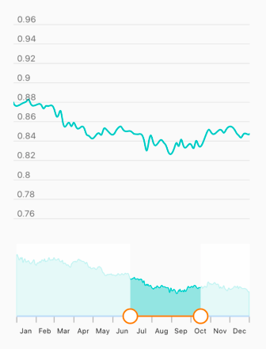

# Flutter range selector (SfRangeSelector) Overview

Syncfusion&reg; Flutter Range Selector is a highly interactive UI widget for selecting a smaller range from a larger data set. It provides a rich set of features such as numeric and date values, labels, ticks, dividers, and tooltips. It also supports adding any type of widget as content.

## Features

* **Child support** - Add a child of any type inside the range selector. It is also possible to add [Charts](https://www.syncfusion.com/flutter-widgets/flutter-charts) widget. With the built-in integrations, the range selector is smart enough to handle features like segment selection and zooming in the chart based on the selected range in the range selector. Similar to the range slider, it also supports both numeric and date values.
* **Numeric and date support** - Provides functionality for selecting numeric and date ranges. For the date range, support is provided up to the seconds interval.
* **Labels** - Render labels for the date and numeric ranges with the option to customize their format based on your requirements.
* **Ticks and dividers** - Provides the option to show ticks and dividers based on the interval. Also enables minor ticks to indicate the values between each interval. These options present the selected range in a more intuitive way for end users.
* **Highly customizable** - In addition to the rich set of built-in features, fully customize the control in a much simpler way using the wide range of provided options.
* **Tooltips** - Render tooltips to show the selected range clearly. It is also possible to customize the format of the text shown in the tooltip.
